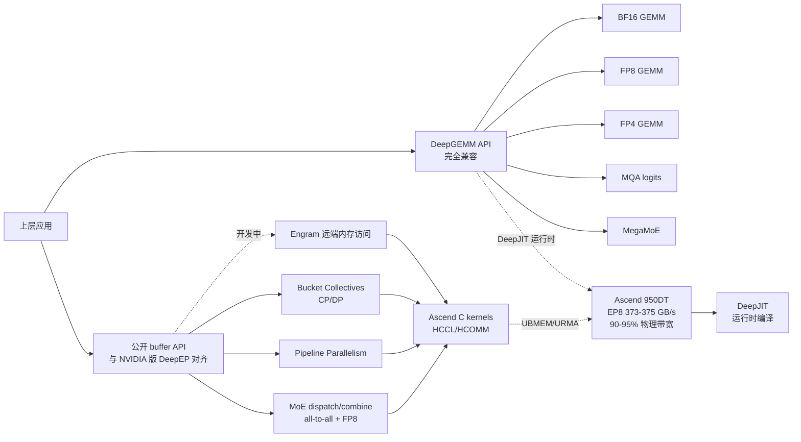

# deepseek-ai/DeepEP-Ascend

## 一句话定位
DeepEP-Ascend 是面向华为昇腾 NPU 的高性能机器学习训练与推理通信库——提供 MoE dispatch/combine 的专家并行（EP）all-to-all 操作（支持 FP8 dispatch 和延迟 epilogue）+ 流水线并行（PP）+ 面向上下文并行和数据并行（CP/DP）的 Bucket 集合通信 + Engram 远端内存访问（开发中），公开 buffer API 与 NVIDIA 版 DeepEP 对齐；Ascend C 内核使用 HCCL/HCOMM、UBMEM 和 URMA 完成通信，并通过 DeepJIT 在运行时编译；Ascend 950DT EP8 dispatch 373-375 GB/s / 90-95% 物理带宽。

## 它解决的问题
国产 NPU（华为昇腾）的机器学习训练 / 推理生态在「MoE dispatch/combine + FP8 dispatch + Pipeline / Context / Data Parallel Bucket collectives + Engram 远端内存 + HCCL/HCOMM + UBMEM + URMA + DeepJIT 运行时编译 + Ascend C kernels」高性能通信层长期缺位，导致用户从 NVIDIA 平滑迁移到 Ascend 时无法复用 DeepEP 已有工作流，且无法在 Ascend 950 上达到 EP8 90-95% 物理带宽。DeepEP-Ascend 直击这一痛点：把 DeepEP（NVIDIA 版）的公开 buffer API 完整复刻到 Ascend 950 平台，使用 Ascend C 内核通过 HCCL/HCOMM + UBMEM + URMA 完成通信，并通过 DeepJIT 在运行时编译；Ascend 950DT 实测 EP8 dispatch 373-375 GB/s / combine 345-347 / EP16 348-352 / 338-341 / EP32 335-340 / 320-324 / EP64 323-327 / 294-298 / EP128 313-320 / 272-278 + Sustained dispatch 90-95% 物理 payload bandwidth limit（EP up to 32）。解决的是 **「国产 NPU + MoE 高性能通信库 + 公开 buffer API + 与 NVIDIA 版 DeepEP 对齐 + Ascend 950DT EP8 90-95% 物理带宽」** 的国产 NPU 生态补齐问题。

## 为什么值得关注（2026-10-01）
- **Stars:** 180（截至 2026-10-01），1 天 180⭐，fork 15，fork/star 8.3%
- **Forks:** 15（典型官方组织背书 + 严肃工程化早期信号）
- **License:** 未明示（README 头部仅声明「公开 buffer API 与 NVIDIA 版 DeepEP 对齐」，仓库未提供 LICENSE 文件）
- **语言:** C++
- **活跃度:** created 2026-09-30，pushed_at 2026-10-01，持续高活跃
- **规模:** 142 KB（极小 repo）
- **Topics:** 空（README 未明示）

## 热度来源判断
DeepEP-Ascend 的热度是 **「国产 NPU 生态补齐 × DeepEP 公开 buffer API 完整复刻 × Ascend 950DT EP8 90-95% 物理带宽 × DeepJIT 运行时编译 × deepseek-ai 官方组织背书」** 的强劲组合。国产 NPU（华为昇腾）的 ML 训练 / 推理生态在 MoE 高性能通信层长期缺位，是 NVIDIA NCCL / DeepEP 用户迁移到 Ascend 的最大障碍。DeepEP-Ascend 直击：MoE dispatch/combine EP all-to-all + FP8 dispatch + 延迟 epilogue + Pipeline/Context/Data Parallel Bucket collectives + Engram 远端内存 + HCCL/HCOMM + UBMEM + URMA + DeepJIT 运行时编译 + Ascend 950DT EP8 dispatch 373-375 GB/s 90-95% 物理带宽 + 公开 buffer API 与 NVIDIA 版 DeepEP 对齐 + deepseek-ai 官方组织背书 + C++ + 142 KB。热度 **真实且具严肃工程化深度**——官方组织背书 + 公开 buffer API + 实测 EP8 90-95% 物理带宽 + DeepJIT 运行时编译 + Ascend 950 + CANN 9.2.0 + Python 3.10 + PyTorch 2.13.0+cpu + torch_npu 2.13.0rc1 + C++20 std::format。

## 关键技术亮点
1. **公开 buffer API 与 NVIDIA 版 DeepEP 对齐:** 公开 buffer API 与 NVIDIA 版 DeepEP 对齐——是平滑迁移严肃工程化的关键
2. **MoE dispatch/combine EP all-to-all + FP8 dispatch + 延迟 epilogue:** MoE dispatch/combine 的专家并行（EP）all-to-all 操作 + FP8 dispatch + 延迟 epilogue——是 MoE 训练严肃工程化的关键
3. **Pipeline / Context / Data Parallel Bucket collectives:** 流水线并行（PP）+ 面向上下文并行和数据并行（CP/DP）的 Bucket 集合通信——是并行严肃工程化的关键
4. **Engram 远端内存访问（开发中）:** Engram 远端内存访问——是远端内存严肃工程化的关键（开发中）
5. **HCCL/HCOMM + UBMEM + URMA:** Ascend C 内核使用 HCCL/HCOMM、UBMEM 和 URMA 完成通信——是国产 NPU 严肃工程化的关键
6. **DeepJIT 运行时编译:** 通过 DeepJIT 在运行时编译——是 kernel 严肃工程化的关键
7. **Ascend 950DT EP8 90-95% 物理带宽:** EP8 dispatch 373-375 GB/s / combine 345-347 / EP16 348-352 / 338-341 / EP32 335-340 / 320-324 / EP64 323-327 / 294-298 / EP128 313-320 / 272-278 + Sustained dispatch 90-95% 物理 payload bandwidth limit（EP up to 32）——是性能严肃工程化的关键
8. **CANN 9.2.0 + Python 3.10 + PyTorch 2.13.0+cpu + torch_npu 2.13.0rc1 + C++20 std::format:** CANN 9.2.0 + Python 3.10 + PyTorch 2.13.0+cpu + torch_npu 2.13.0rc1 + C++20 std::format——是栈严肃工程化的关键

## 架构师速览

| 决策问题 | 研究判断 | 证据边界 |
|---|---|---|
| 系统边界 | 华为昇腾 NPU 上 MoE / GEMM 高性能通信库；公开 buffer API 与 NVIDIA 版 DeepEP 对齐 + Ascend C kernels 使用 HCCL/HCOMM + UBMEM + URMA + DeepJIT 运行时编译 | 仅基于 README 描述的 DeepEP Ascend 实现、HCCL/HCOMM/UBMEM/URMA、DeepJIT 运行时编译、Ascend 950DT EP8 90-95% 物理带宽；具体 Ascend C kernel 实现细节、DeepJIT 编译流程未在档案中给出 |
| 主路径 | 上层应用 → 公开 buffer API → MoE dispatch/combine all-to-all + FP8 dispatch + Pipeline/Context/Data Parallel Bucket collectives + Engram 远端内存（开发中）→ Ascend C kernels（HCCL/HCOMM + UBMEM + URMA）→ Ascend 950DT EP8 90-95% 物理带宽 | 主路径为档案语义抽象；具体 HCCL/HCOMM/UBMEM/URMA 调用路径未在档案中明示 |
| 关键权衡 | 国产 NPU 性能 + 公开 API vs 生态成熟度（NCCL vs HCCL）+ DeepJIT 运行时 vs 预编译 + License 状态（README 未明示 LICENSE 文件） | 档案明示 90-95% 物理带宽、完全 API 兼容 DeepEP、Ascend 950 (A5) + UBMEM connectivity + UBC_CTP/URMA channels + CANN 9.2.0 + Python 3.10 + PyTorch 2.13.0+cpu + torch_npu 2.13.0rc1 + C++20 std::format；License 状态未在 README 中明示 |
| 最小 PoC | 在 Ascend 950DT + CANN 9.2.0 + 32 ranks 上跑 DeepEP-Ascend demo EP8 dispatch 验证 373-375 GB/s + 验证公开 buffer API 与 NVIDIA 版 DeepEP 对齐 | PoC 范围由档案「性能 90-95% 物理带宽 + 公开 buffer API 与 NVIDIA 版 DeepEP 对齐」建议推导；具体 demo 入口、aclnn_* reference GEMM 未在档案中讨论 |

## 架构启发
DeepEP-Ascend 的核心启发是 **「国产 NPU + MoE 高性能通信库 + 公开 API + 与 NVIDIA 版对齐」**。国产 NPU（华为昇腾）的 ML 训练 / 推理生态在 MoE 高性能通信层长期缺位，是 NVIDIA NCCL / DeepEP 用户迁移到 Ascend 的最大障碍。DeepEP-Ascend 直击：MoE dispatch/combine EP all-to-all + FP8 dispatch + 延迟 epilogue + Pipeline/Context/Data Parallel Bucket collectives + Engram 远端内存 + HCCL/HCOMM + UBMEM + URMA + DeepJIT 运行时编译 + Ascend 950DT EP8 dispatch 373-375 GB/s 90-95% 物理带宽 + 公开 buffer API 与 NVIDIA 版 DeepEP 对齐 + CANN 9.2.0 + Python 3.10 + PyTorch 2.13.0+cpu + torch_npu 2.13.0rc1 + C++20 std::format。更深层的启发是：**国产 NPU 生态的关键不是芯片本身，而是「公开 API + 与主流框架对齐 + kernel 公开 + 运行时编译 + 实测物理带宽」**——公开 buffer API 与 NVIDIA 版 DeepEP 对齐意味着用户可以从 NVIDIA 平滑迁移到 Ascend、DeepJIT 运行时编译意味着 kernel 不需要预编译、Ascend 950DT EP8 90-95% 物理带宽意味着用户不需要牺牲性能、CAN 9.2.0 + Python 3.10 + PyTorch 2.13.0+cpu + torch_npu 2.13.0rc1 + C++20 std::format 意味着栈完整。能否持续，取决于能否在 EP up to 128 + Bucket collectives + Engram 远端内存 + HCCL/HCOMM + UBMEM + URMA 在多硬件多软件栈下保持严肃工程化稳定性。

## 架构图（MMD）

> 证据边界：此图只采用本档案已有可核验描述；"待核验"节点不应视为项目实现事实。

## 定位判断
**基础设施候选型项目（国产 NPU 高性能通信库）。** DeepEP-Ascend 是 deepseek-ai 官方组织背书的「华为昇腾 NPU + MoE 高性能通信库」——把 DeepEP（NVIDIA 版）的公开 buffer API 完整复刻到 Ascend 950 平台，使用 Ascend C 内核通过 HCCL/HCOMM + UBMEM + URMA 完成通信，并通过 DeepJIT 在运行时编译；Ascend 950DT 实测 EP8 dispatch 373-375 GB/s 90-95% 物理带宽。180⭐ + 15 fork + 官方组织背书 + 142 KB 已显示严肃工程化深度。但「基础设施化」取决于一个关键问题：能否在 EP up to 128 + Bucket collectives + Engram 远端内存 + HCCL/HCOMM + UBMEM + URMA + DeepJIT 运行时编译下保持严肃工程化稳定性 + 商用 license 状态（README 未明示）。

## 风险 / 局限 / 泡沫点
- **License 不明示:** README 头部仅声明「公开 buffer API 与 NVIDIA 版 DeepEP 对齐」但仓库未提供 LICENSE 文件，C++ 代码未明确 license 是 CC 仓库公开 buffer API，意味着商用集成需要先确认 license 状态（可能 MIT / Apache-2.0 / 自定义 license / BSL）；建议先确认 license 状态再商用集成
- **EP up to 128 性能瓶颈:** EP128 dispatch 313-320 GB/s / combine 272-278 GB/s 比 EP32 dispatch 335-340 GB/s / combine 320-324 GB/s 明显回落，README 明示「Larger EP sizes and combine remain under optimization」
- **combine + URMA HBM contention:** README 明示「combine has additional local reduction overhead and HBM contention with URMA」
- **Q3 commercial HDK 尚未公开发布:** README 明示「Use Huawei's Q3 commercial HDK release for Atlas 850E when it becomes publicly available... The date is a vendor release plan; availability is subject to Huawei's publication schedule」——10 月 15 日前后才公开发布
- **依赖商用栈:** CANN 9.2.0 + Python 3.10 + PyTorch 2.13.0+cpu + torch_npu 2.13.0rc1 + C++20 std::format 商用栈兼容性依赖栈
- **企业生态依赖:** 商用栈兼容性 + 企业生态采用度（是否进入大规模商用）是关键

## 与同类项目的关系
- **vs NVIDIA DeepEP:** NVIDIA DeepEP 是 NCCL + Hopper FP8 kernel；DeepEP-Ascend 是 HCCL/HCOMM + UBMEM/URMA + DeepJIT + Ascend 950 + C++20 std::format
- **vs NVIDIA DeepGEMM:** NVIDIA DeepGEMM 是 Hopper FP8/FP4 GEMM kernel；DeepGEMM-Ascend 是 Ascend 950 + BF16/FP8/FP4 GEMM + MQA logits + MegaMoE + 稀疏数据加载 + 协程流水线
- **vs NVIDIA NCCL:** NVIDIA NCCL 是 CUDA 集合通信；HCCL/HCOMM + UBMEM + URMA 是 Ascend 集合通信
- **vs MindSpore / PaddlePaddle:** MindSpore / PaddlePaddle 是端到端 ML 框架；DeepEP-Ascend 是底层高性能通信库 + kernel 公开 + DeepJIT 运行时编译
- **vs 其它 Ascend kernel 实现:** 其它 Ascend kernel 实现可能预编译或闭源；DeepEP-Ascend 是 DeepJIT 运行时编译 + kernel 公开 buffer API

## 是否值得持续跟踪
**值得跟踪（国产 NPU 高性能通信库）。** DeepEP-Ascend 代表了国产 NPU「高性能通信库 + 公开 API + 与 NVIDIA 版对齐」诉求，无论其本身成败，这一方向是行业趋势。建议关注：License 状态是否明示（README 头部未明示）+ EP up to 128 性能瓶颈是否突破 + combine + URMA HBM contention 是否缓解 + Q3 commercial HDK 何时公开发布 + 企业采用度（是否进入大规模商用）。

## 后续观察点
- License 状态是否明示（README 头部仅声明「公开 buffer API 与 NVIDIA 版 DeepEP 对齐」）
- EP up to 128 性能瓶颈是否突破（README 明示「Larger EP sizes and combine remain under optimization」）
- combine + URMA HBM contention 是否缓解（README 明示）
- Q3 commercial HDK 是否按计划 2026-10-15 公开发布
- 企业采用度（金融 / 互联网 / 学术是否进入大规模商用）
- 是否被 deepseek-ai 后续模型（如 DeepSeek-V5 / R2）采用

---
> 数据来源: GitHub API (2026-10-01) | Stars: 180 | Forks: 15 | License: 未明示 | 语言: C++ | 创建: 2026-09-30