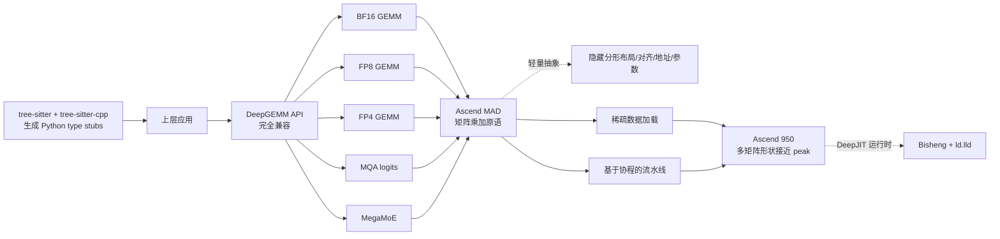

# deepseek-ai/DeepGEMM-Ascend

## 一句话定位
DeepGEMM Ascend 是 DeepGEMM 在华为昇腾平台上的实现——完全 API 兼容 DeepGEMM，支持 BF16 + FP8 + FP4 GEMM + MQA logits + MegaMoE；对昇腾平台的矩阵乘加原语（MAD）提供轻量抽象，隐藏分形矩阵布局、对齐约束、地址计算、参数转换等细节；广泛采用稀疏数据加载 + 基于协程的流水线 + 2026.09.30 Initial release for Ascend 950 + 多矩阵形状接近 peak hardware performance。

## 它解决的问题
DeepGEMM（NVIDIA 版）是 2026 年最知名的 GEMM kernel 库之一，但国产 NPU（华为昇腾）的 ML 训练 / 推理生态在 GEMM kernel 层长期缺位。DeepGEMM-Ascend 直击：把 DeepGEMM（NVIDIA 版）完全 API 兼容复刻到 Ascend 950 平台，支持 BF16 + FP8 + FP4 GEMM + MQA logits + MegaMoE；对昇腾平台的矩阵乘加原语（MAD）提供轻量抽象，隐藏分形矩阵布局、对齐约束、地址计算、参数转换等细节；广泛采用稀疏数据加载 + 基于协程的流水线，接近硬件性能极限；多矩阵形状达到 peak hardware performance；MIT 许可 + deepseek-ai 官方组织背书。解决的是 **「国产 NPU + DeepGEMM 完全 API 兼容 + 轻量抽象 over Ascend MAD + 接近硬件性能极限」** 的国产 NPU 生态补齐问题。

## 为什么值得关注（2026-10-01）
- **Stars:** 377（截至 2026-10-01），2 天 377⭐，fork 20，fork/star 5.3%
- **Forks:** 20（典型官方组织背书 + 严肃工程化早期信号）
- **License:** MIT（明确许可，商用清晰）
- **语言:** C++
- **活跃度:** created 2026-09-29，pushed_at 2026-10-01，持续高活跃
- **规模:** 191 KB（极小 repo）
- **Topics:** 空（README 未明示）

## 热度来源判断
DeepGEMM-Ascend 的热度是 **「国产 NPU + DeepGEMM 完全 API 兼容 × 轻量抽象 over Ascend MAD × 稀疏数据加载 × 基于协程的流水线 × 2026.09.30 Initial release × deepseek-ai 官方组织背书 × MIT」** 的强劲组合。DeepGEMM（NVIDIA 版）是 2026 年最知名的 GEMM kernel 库之一，但国产 NPU 的 GEMM kernel 层长期缺位。DeepGEMM-Ascend 直击：完全 API 兼容 DeepGEMM + BF16 + FP8 + FP4 GEMM + MQA logits + MegaMoE + 轻量抽象 over Ascend MAD（矩阵乘加原语）+ 隐藏分形矩阵布局 + 对齐约束 + 地址计算 + 参数转换 + 稀疏数据加载 + 基于协程的流水线 + 多矩阵形状接近 peak hardware performance + 2026.09.30 Initial release for Ascend 950 + CANN 9.20 + `bin/bisheng` + `bin/ld.lld` + torch_npu + Python 3.10+ + C++20 <format> + `tilelang` HC prenorm kernel 依赖 + `tree-sitter` + `tree-sitter-cpp` 生成 Python type stubs + deepseek-ai 官方组织背书 + MIT + C++ + 191 KB。热度 **真实且具严肃工程化深度**——官方组织背书 + 完全 API 兼容 + 轻量抽象 over Ascend MAD + 稀疏数据加载 + 基于协程的流水线 + 2026.09.30 Initial release + MIT。

## 关键技术亮点
1. **完全 API 兼容 DeepGEMM:** 完全 API 兼容 DeepGEMM——是平滑迁移严肃工程化的关键
2. **BF16 + FP8 + FP4 GEMM:** BF16 + FP8 + FP4 GEMM——是精度严肃工程化的关键
3. **MQA logits + MegaMoE:** MQA logits + MegaMoE——是推理严肃工程化的关键
4. **轻量抽象 over Ascend MAD:** 对昇腾平台的矩阵乘加原语（MAD）提供轻量抽象，隐藏分形矩阵布局、对齐约束、地址计算、参数转换等细节——是底层严肃工程化的关键
5. **稀疏数据加载:** 广泛采用稀疏数据加载——是性能严肃工程化的关键
6. **基于协程的流水线:** 基于协程的流水线——是性能严肃工程化的关键
7. **多矩阵形状接近 peak hardware performance:** 多矩阵形状接近 peak hardware performance——是性能严肃工程化的关键
8. **2026.09.30 Initial release for Ascend 950:** 2026.09.30 Initial release for Ascend 950——是首发严肃工程化的关键
9. **`tilelang` HC prenorm kernel 依赖 + `tree-sitter` + `tree-sitter-cpp` 生成 Python type stubs:** `tilelang` HC prenorm kernel 依赖 + `tree-sitter` + `tree-sitter-cpp` 生成 Python type stubs——是工具链严肃工程化的关键
10. **完整 utilities:** `set_num_sms` / `set_npu_arch` / `set_mk_alignment_for_contiguous_layout` / `transform_sf_into_required_layout` / `transform_k_grouped_sf_into_required_layout` / `get_paged_mqa_logits_metadata` / `aclnn_fp8_fp4_gemm_{nt,nn,tn,tt}` / `aclnn_bf16_gemm_{nt,nn,tn,tt}`——是 utilities 严肃工程化的关键

## 架构师速览

| 决策问题 | 研究判断 | 证据边界 |
|---|---|---|
| 系统边界 | 华为昇腾 NPU 上 DeepGEMM 完全 API 兼容的 GEMM kernel 库；BF16/FP8/FP4 GEMM + MQA logits + MegaMoE + 轻量抽象 over Ascend MAD | 仅基于 README 描述的 DeepGEMM Ascend 实现、轻量抽象 over Ascend MAD、稀疏数据加载、基于协程的流水线、Ascend 950 多矩阵形状接近 peak hardware performance；具体 Ascend C kernel 实现细节、tilelang HC prenorm kernel 实现未在档案中给出 |
| 主路径 | 上层应用 → DeepGEMM API（完全兼容）→ BF16/FP8/FP4 GEMM + MQA logits + MegaMoE → Ascend MAD（矩阵乘加原语）+ 轻量抽象（隐藏分形矩阵布局/对齐约束/地址计算/参数转换）→ 稀疏数据加载 + 基于协程的流水线 → Ascend 950 多矩阵形状接近 peak | 主路径为档案语义抽象；具体 MAD 调用路径、稀疏数据加载 + 协程流水线实现未在档案中明示 |
| 关键权衡 | 完全 API 兼容 DeepGEMM（NVIDIA 版）+ 轻量抽象 over Ascend MAD vs 性能 + MIT 商用清晰 vs 企业生态采用度 | 档案明示完全 API 兼容 DeepGEMM、BF16/FP8/FP4 GEMM、MQA logits、MegaMoE、轻量抽象、稀疏数据加载、协程流水线、多矩阵形状接近 peak hardware performance、2026.09.30 Initial release、CANN 9.20 + Python 3.10+ + C++20 <format> + tilelang HC prenorm kernel + tree-sitter + tree-sitter-cpp；License MIT 商用清晰 |
| 最小 PoC | 在 Ascend 950 + CANN 9.20 上跑 DeepGEMM-Ascend demo BF16 GEMM 验证「轻量抽象 over Ascend MAD」+ 验证 F8 GEMM + MQA logits 性能是否接近 peak hardware performance | PoC 范围由档案「多矩阵形状接近 peak hardware performance」建议推导；具体 demo 入口、aclnn_* reference GEMM 未在档案中讨论 |

## 架构启发
DeepGEMM-Ascend 的核心启发是 **「国产 NPU + GEMM kernel 库 + 完全 API 兼容主流 + 轻量抽象 over 硬件原语 + 多优化技术」**。DeepGEMM（NVIDIA 版）是 2026 年最知名的 GEMM kernel 库之一，但国产 NPU 的 GEMM kernel 层长期缺位。DeepGEMM-Ascend 直击：完全 API 兼容 DeepGEMM + BF16 + FP8 + FP4 GEMM + MQA logits + MegaMoE + 轻量抽象 over Ascend MAD（矩阵乘加原语）+ 隐藏分形矩阵布局 + 对齐约束 + 地址计算 + 参数转换 + 稀疏数据加载 + 基于协程的流水线 + 多矩阵形状接近 peak hardware performance。更深层的启发是：**国产 NPU 生态的关键不是芯片本身，而是「GEMM kernel 公开 + 完全 API 兼容主流 + 轻量抽象 over 硬件原语 + 多优化技术 + 接近 peak hardware performance」**——完全 API 兼容 DeepGEMM 意味着用户可以从 NVIDIA 平滑迁移到 Ascend、轻量抽象 over Ascend MAD 意味着 kernel 简洁高效、稀疏数据加载 + 基于协程的流水线意味着多矩阵形状接近 peak hardware performance。能否持续，取决于能否在 GEMM + MQA logits + MegaMoE + 稀疏数据加载 + 基于协程的流水线 + 多矩阵形状下保持严肃工程化稳定性。

## 架构图（MMD）

> 证据边界：此图只采用本档案已有可核验描述；"待核验"节点不应视为项目实现事实。

## 定位判断
**基础设施候选型项目（国产 NPU GEMM kernel 库）。** DeepGEMM-Ascend 是 deepseek-ai 官方组织背书的「华为昇腾 + DeepGEMM 完全 API 兼容 + 轻量抽象 over Ascend MAD + 稀疏数据加载 + 基于协程的流水线」GEMM kernel 库——把 DeepGEMM（NVIDIA 版）完全 API 兼容复刻到 Ascend 950 平台。377⭐ + 20 fork + 官方组织背书 + 191 KB + MIT 已显示严肃工程化深度。但「基础设施化」取决于一个关键问题：能否在 BF16 + FP8 + FP4 GEMM + MQA logits + MegaMoE + 稀疏数据加载 + 基于协程的流水线 + 多矩阵形状接近 peak hardware performance 下保持严肃工程化稳定性 + 企业采用度。

## 风险 / 局限 / 泡沫点
- **企业生态依赖:** 商用栈兼容性（CANN 9.20 + Python 3.10+ + torch_npu + C++20 <format>）+ 企业生态采用度（是否进入大规模商用）是关键
- **依赖其它工具:** `tilelang` HC prenorm kernel 依赖 + `tree-sitter` + `tree-sitter-cpp` 工具链依赖
- **scaling factor format 差异:** README 明示「The scaling factor format on Ascend differs from NVIDIA's: each pair of UE8M0 scaling factors along the K dimension is packed into an `int16`, and the packed values are stored in MN-major order for optimal hardware efficiency」——迁移时需要适配
- **2026.09.30 Initial release:** 仅 2026-09-30 Initial release for Ascend 950，生产稳定性 + 社区反馈尚未充分
- **个人项目属性:** deepseek-ai 官方组织背书（不像 feder-cr 个人项目），但 deepseek-ai 维护多个项目，治理分散
- **企业生态采用度:** 是否进入金融 / 互联网 / 学术大规模商用是关键

## 与同类项目的关系
- **vs NVIDIA DeepGEMM:** NVIDIA DeepGEMM 是 Hopper FP8/FP4 GEMM kernel；DeepGEMM-Ascend 是 Ascend 950 + BF16/FP8/FP4 GEMM + MQA logits + MegaMoE + 稀疏数据加载 + 协程流水线
- **vs deepseek-ai/DeepEP-Ascend:** DeepEP-Ascend 是 MoE dispatch/combine + FP8 dispatch + Pipeline/Context/Data Parallel Bucket collectives；DeepGEMM-Ascend 是 GEMM + MQA logits + MegaMoE + 稀疏数据加载 + 协程流水线——同组织同栈同日推到 Ascend 950
- **vs MindSpore / PaddlePaddle:** MindSpore / PaddlePaddle 是端到端 ML 框架；DeepGEMM-Ascend 是底层 GEMM kernel 库 + 完全 API 兼容 DeepGEMM
- **vs 其它 Ascend GEMM 实现:** 其它 Ascend GEMM 实现可能预编译或闭源；DeepGEMM-Ascend 是 DeepJIT 运行时编译 + 完全 API 兼容 DeepGEMM + MIT

## 是否值得持续跟踪
**值得跟踪（国产 NPU GEMM kernel 库）。** DeepGEMM-Ascend 代表了国产 NPU「GEMM kernel 库 + 完全 API 兼容主流 + 轻量抽象 over 硬件原语」诉求，无论其本身成败，这一方向是行业趋势。建议关注：企业生态采用度（金融 / 互联网 / 学术是否进入大规模商用）+ scaling factor format 迁移适配是否顺畅 + 与 DeepEP-Ascend 联合使用是否稳定。

## 后续观察点
- 企业生态采用度（金融 / 互联网 / 学术是否进入大规模商用）
- scaling factor format 迁移适配是否顺畅
- 与 DeepEP-Ascend 联合使用是否稳定（MoE GEMM + dispatch/combine）
- 是否被 deepseek-ai 后续模型（如 DeepSeek-V5 / R2）采用
- 是否在 BF16 + FP8 + FP4 GEMM + MQA logits + MegaMoE 之外扩展更多算子
- 性能优化是否突破（多矩阵形状接近 peak hardware performance 是否达到 100%）

---
> 数据来源: GitHub API (2026-10-01) | Stars: 377 | Forks: 20 | License: MIT | 语言: C++ | 创建: 2026-09-29