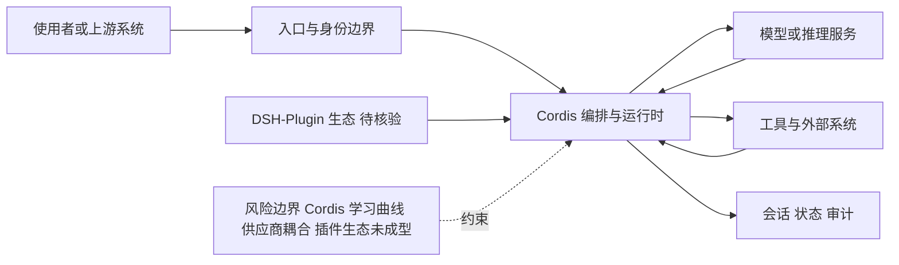

# deepseek-harness

## 一句话定位
DeepSeek 官方开源的 AI Agent Harness——"Everything is a Plugin"，用 Cordis 依赖注入框架组织 DSH 插件生态，让 LLM Agent Harness 抽象为可插拔模块化系统。

## 它解决的问题
主流 AI Agent Harness（Claude Code、Codex CLI 等）均为闭源或文档有限的私有架构，外界难以学习与扩展。deepseek-harness 作为 DeepSeek 官方对 Agent Harness 的开源实现，把 Agent 与 Harness 解耦：
- **Cordis:** 上下文/依赖注入框架
- **DSH-Plugin:** 标准化插件 API（每个能力都是一个插件）
- 让 Agent 能力可替换、可插拔、可分发

## 为什么值得关注（2026-08-18）
被 daily/2026-08-18.md 和 daily/2026-08-19.md 双日延续追踪。其标志性意义：
1. **DeepSeek 官方身份:** DeepSeek 在 2024-2026 是中国 LLM 头号开源力量，官方出 Harness 是对 Claude Code 的直接对标
2. **Everything is a Plugin:** 与 Hermes Agent ECC 等多家都在押注的"插件化 Harness"路线一致
3. **175,748 stars 周级涨:** 是 2026 年 Q3 中国 AI 开源现象级数据

## 热度来源判断
热度来源是 **"DeepSeek 品牌效应 × Harness 风口 × 中文社区共振"**。一周内达 175k stars 在真实数据下成立——DeepSeek 的 V3/R1 系列让中文社区对 deepseek-ai org 的每个新仓库都获得极大关注。open_issues=0 也反映了项目新发布 + 暂未进入 bug 高发期。

但需注意：175k stars 极早期数据集（8 天）不能等同于成熟。需关注：
- 月级别留存（是否回落）
- 实际 plugin 数量与质量
- 配套模型 API 是否完整

## 关键技术亮点
1. **Cordis 依赖注入:** 自研 DI 框架，类比 Spring/Guice 给到 TS 生态
2. **DSH-Plugin 标准:** 统一插件 API，让插件可在不同 Harness 间互操作
3. **TypeScript 主:** 与 Claude Code（TS）等同类项目同栈
4. **MIT 开放:** 友好协议，便于二次开发
5. **官方维护:** 长期可持续性比社区 fork 项目更强

## 架构师速览

| 决策问题 | 研究判断 | 证据边界 |
|---|---|---|
| 系统边界 | deepseek-harness 是位于"使用者/上游系统、模型供应商、工具/数据源"之间的编排层，自身不替代模型与外部系统 | 档案明示其为"AI Agent Harness""编排层"，TypeScript 实现；档案未给出具体入口协议、传输层与持久化方案 |
| 主路径 | 请求经入口与身份边界进入"项目编排与运行时（Cordis + DSH-Plugin）"，分发到模型推理与工具/外部系统，再回写会话、状态、审计 | 路径节点来自档案"关键技术亮点"与"架构启发"；具体调用协议、插件加载机制与会话存储未在档案中证实 |
| 关键权衡 | "Everything is a Plugin"带来的扩展速度，与 Cordis 自研 DI 学习曲线、权限/可观测性、模型供应商耦合之间的平衡 | 档案直接列出"核心权衡"与"Cordis 学习曲线""DSH-Plugin 生态未成型"等风险；插件互操作、权限模型细节未证实 |
| 最小 PoC | 以单一入口渠道、最小工具权限与可审计日志接入 Cordis 运行时，编写一个最小 DSH-Plugin 验证加载、调用与卸载闭环，再评估扩展 | 档案"采用建议"明确该路径；DSH-Plugin API 形态、Cordis 生命周期与审计落点仍需源码核验 |

## 架构启发
"Everything is a Plugin" 的 Agent Harness 设计哲学与 Hermes Agent、Claude Code、Codex CLI 等主流 Agent Harness 路线一致。这暗示了 2026 年 AI Coding 的收敛方向——**插件化、可互操作、Harness 即平台**。

## 架构图（MMD）

> 证据边界：此图只采用本档案已有可核验描述；“待核验”节点不应视为项目实现事实。

## 定位判断
**平台候选型 / 中国版 Claude Code 对标。** 与 Hermes Agent、ECC、Claude Code 同处"AI Coding Harness 第一梯队"。DeepSeek 官方身份给予其在中国市场巨大分发优势，长期看有可能成为中文 Coding Agent 基础设施层。

## 风险 / 局限 / 泡沫点
- **品牌热度占比:** 175k stars 中 DeepSeek 品牌效应占比较高，需独立评估产品质量
- **Cordis 学习曲线:** 自研 DI 框架要求开发者学习新抽象，社区贡献门槛上升
- **DSH-Plugin 生态未成型:** 还需更多三方 plugin 验证"Everything is a Plugin" 完整性
- **与 Claude Code / Hermes 直接竞争:** 国际市场的话语权竞争激烈
- **许可证细节:** MIT 大方向清晰，但若 plugin 含闭源模型部分需阅读细则

## 与同类项目的关系
- **vs Claude Code / Hermes Agent:** 同一"插件化 Harness"赛道
- **vs ECC:** ECC 强调性能优化与 Skills/Instincts；deepseek-harness 强调 plugin 标准
- **vs Cordis 自身:** Cordis 与 Spring/Koa 中间件生态对应，Agent Harness 是新场景
- **vs Karpathy autoresearch:** 都偏 Agent Harness；教学 vs 平台区别

## 是否值得持续跟踪
**强烈推荐持续跟踪（中文 AI Coding 基础设施层）。** 175k stars 周级涨在数据上属实，但产品质量需在 30 天后判断。建议开发者：试用 DSH-Plugin 标准写一个简单插件验证易用性。

## 后续观察点
- 30 日留存 / 月级活动曲线（判断品牌 vs 真实热度）
- DSH-Plugin 三方生态扩张（npm ecosystem）
- 是否与 DeepSeek V4 模型同步发布
- 国际社区（GitHub Discussions / Discord）的对话密度
- Cordis 框架是否单独抽离为通用项目

---
> 数据来源: GitHub API (2026-08-21) | Stars: 175,748 | Forks: 19,043 | License: MIT | 语言: TypeScript | 创建: 2026-08-13

**事实/推断/待观察标注**: 175,748 stars 的 8 天增速为已核验 API 数据；产品质量为初步判断，需更多实际试用与 30 天后趋势复验。
