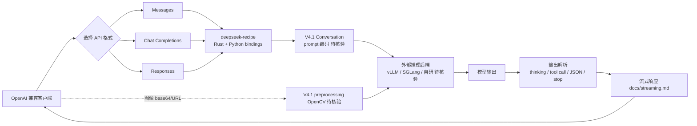

# deepseek-ai/deepseek-recipe

## 一句话定位
DeepSeek 官方 Rust 库 + Python bindings——把 OpenAI Messages / Chat Completions / Responses 三种 API 请求格式"统一"转成 DeepSeek V4.1 Conversation，含 prompt 编码、生成设置、输出解析、图像处理、tool definitions。

## 它解决的问题
第三方想接入 DeepSeek V4.1 模型时，面对的现实是：(1) 不同客户端用不同 API 格式（Messages / Chat Completions / Responses）；(2) DeepSeek V4.1 有自己的 prompt 编码与生成设置（thinking 模式、reasoning effort、temperature、top_p、output limit）；(3) 模型输出需要解析（thinking 字段、tool call、JSON、stop sequences）；(4) 图像支持有特定处理（V4.1 preprocessing with OpenCV）。每个团队都自己写一遍转换层，重复造轮子。**deepseek-recipe 把这些都打包成 Rust 库 + Python bindings，让任何推理后端都能复用相同的"上层接口"**。

## 为什么值得关注（2026-09-11）
- **Stars:** 209（截至 2026-09-11），1 天即达 209⭐，处于"首发即高增长"阶段
- **Forks:** 11 / 1 天 = 11 forks/日，**5.3% fork/star 偏低**，反映 star 以"关注 / 标记"为主，二次开发未铺开
- **License:** MIT
- **语言:** Rust（含 Python bindings）
- **活跃度:** created 2026-09-10，pushed_at 2026-09-10，1 天内完成发布
- **规模:** 2MB

## 热度来源判断
deepseek-recipe 的热度是 **"DeepSeek 官方 API 适配层 × V4.1 新版本关注度 × 多格式统一刚需"** 的组合。任何想要"复刻 DeepSeek V4.1 行为"的推理后端都需要这层 API 适配；与同窗发布的 DeepSelect（算子层）形成"上层接口 + 下层算子"的双配件。**11 个 fork 中可能有第三方推理框架的早期集成尝试**。热度**真实且具基础设施潜力**——但需观察是否有 vLLM / SGLang / TensorRT-LLM 之外的推理框架真正集成。

## 关键技术亮点
1. **三格式统一转换**——OpenAI Messages / Chat Completions / Responses → DeepSeek V4.1 Conversation
2. **流式响应支持**——`docs/streaming.md` 专门文档
3. **Thinking mode + reasoning effort + temperature + top_p + output limit**——V4.1 完整生成设置
4. **输出解析**——thinking / tool call / JSON object / stop sequences
5. **图像支持**——base64 + 外部 URL；V4.1 preprocessing with OpenCV
6. **Tool definitions**——function tools；Responses API 也支持 tool
7. **明确边界**——README 明示"推理后端 / 工具执行 / HTTP transport 必须外部提供"——这是 V4.1 走"统一接口 + 多后端适配"路线的官方配件
8. **双语 README**——英文 + 中文（README.zh.md）

## 架构师速览

| 决策问题 | 研究判断 | 证据边界 |
|---|---|---|
| 系统边界 | API 适配层（Rust + Python bindings）；把多格式请求转 V4.1 Conversation；不含推理后端、工具执行、HTTP transport | 仅基于 README 明示的 supported scope；具体 prompt 编码细节（special tokens、chat template）未在档案中给出 |
| 主路径 | 客户端 API 请求（Messages/Chat Completions/Responses）→ deepseek-recipe 转换 → V4.1 Conversation prompt → 外部推理后端 → 输出回传 → 输出解析（thinking/tool/JSON/stop） | 主路径为 README "Supported scope" 语义抽象；具体 prompt 编码与生成参数映射以仓库代码为准 |
| 关键权衡 | 多格式统一 vs 格式特定优化 vs Rust + Python bindings 维护成本 vs 与 DeepSelect 协同 | 档案明示三个范围与一个边界；具体 prompt 编码细节、双 bindings 的版本同步策略待核验 |
| 最小 PoC | 准备一个 OpenAI Chat Completions 客户端请求，用 deepseek-recipe 转 V4.1 Conversation，对比与 DeepSeek 官方 SDK 输出的一致性 | PoC 范围由 README "uniformly convert" 语义推导；具体一致性指标（thinking 字段、tool call schema）需自行比对 |
| 风险 | V4.x 模型版本绑定、第三方推理后端兼容、Python bindings 与 Rust 库的版本同步 | 档案明示三项风险 |

## 架构启发
deepseek-recipe 的核心启发是 **"DeepSeek 把模型权重 + 内核 + API 适配作为三层可分离资产同步开源"**。同窗的 DeepSelect（算子）+ deepseek-recipe（接口）+ 模型权重（已开源）构成 V4.1 第三方复刻的完整栈。**更深层的启发是："统一接口 + 多后端适配"是 LLM 服务化的成熟模式**——OpenAI 用 REST API、Anthropic 用 Messages、DeepSeek 用 Conversation，但底层模型权重可以相同。deepseek-recipe 把这种多格式适配层显式开源，降低第三方推理栈的接入成本。

## 架构图（MMD）

> 证据边界：此图只采用本档案已有可核验描述；"待核验"节点不应视为项目实现事实。

## 定位判断
**基础设施候选项目（DeepSeek 官方 API 适配层）。** deepseek-recipe 与 DeepSelect 一起，构成 DeepSeek V4.1 第三方复刻的"上层接口 + 下层算子"双配件。任何想要"V4.1 兼容"的推理后端都可以基于这两个仓库 + 模型权重拼出最小可行服务。它的价值与 V4.1 市场渗透率正相关。**值得持续跟踪**基础设施层定位。

## 风险 / 局限 / 泡沫点
- **V4.x 模型版本绑定**——如果 V5 改 Conversation 格式，本仓库需要重写
- **第三方推理后端兼容**——README 明示"推理后端必须外部提供"，意味着不同后端的实际行为可能差异
- **Python bindings 与 Rust 库的版本同步风险**——双语言项目常见问题
- **2MB 仓库 size 小**——主要为转换代码 + docs，缺少丰富的 examples
- **License 可能变更**——MIT 当前友好，但 DeepSeek 之前的部分仓库有"商业用途另议"争议
- **生态依赖**——价值与 vLLM / SGLang / 自研推理栈采用率正相关

## 与同类项目的关系
- **vs LiteLLM：** 第三方多 Provider 统一；deepseek-recipe 是 DeepSeek 官方专属
- **vs OpenAI Python SDK：** 仅 OpenAI 格式；deepseek-recipe 支持三种格式 + V4.1 特化
- **vs DeepSeek 官方 Python SDK（如 deepseek-python）：** 可能是同一团队的更高层封装；deepseek-recipe 是底层 Rust 库
- **vs DeepSelect（同窗发布）：** recipe 是 API 适配层（输入格式），DeepSelect 是算子层（计算）；两者构成 V4.1 第三方复刻的双配件
- **vs vLLM / SGLang：** 推理框架；deepseek-recipe 是"上层接口"层

## 是否值得持续跟踪
**值得跟踪（DeepSeek V4.1 API 适配层基础设施）。** deepseek-recipe 与 DeepSelect 一起构成 DeepSeek 官方"三层资产"开源战略的中间层，无论 V4.1 本身成败，这一战略都值得观察。建议关注：(1) 第三方推理栈是否真正集成（看 fork 列表）；(2) DeepSeek V5 是否改 Conversation 格式；(3) 是否扩展到 V5 之前的旧版本；(4) Python bindings 同步策略。对做 DeepSeek 推理兼容服务的团队，本仓库是必看；对 API 适配层研究者，本仓库是"官方 + 多格式"模式的优质样本。

## 后续观察点
- 第三方推理栈是否真正集成（vLLM / SGLang / 自研 fork）
- DeepSeek V5 是否继续使用 Conversation 格式
- 是否扩展到 V4 之前的旧版本（V3.x）
- Python bindings 与 Rust 库的版本同步策略
- 商业用途 License 是否变化
- 是否新增更多格式（如 Anthropic Messages）

---
*首次记录：2026-09-11*
> 数据来源: GitHub API (2026-09-11) | Stars: 209 | Forks: 11 | License: MIT | 语言: Rust | 创建: 2026-09-10
