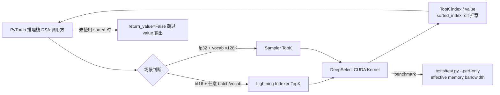

# deepseek-ai/DeepSelect

## 一句话定位
DeepSeek 官方开源的高性能 TopK kernel 实现，覆盖 DeepSeek Sparse Attention（DSA）中的 Lightning Indexer 场景与 Sampler 场景，实测对 `torch.topk` 加速 2-20×。

## 它解决的问题
DeepSeek V3.2 / V4 / V4.1 的稀疏注意力（DSA）在每一步都要做 TopK 选择（indexer 选关键 token、sampler 选下一个 token），而 PyTorch 自带的 `torch.topk` 是通用实现，未针对 DSA 的输入形态（bfloat16 + 大量小 batch / float32 + ~128K vocab）做特化。在生产推理中，DSA 的瓶颈就在这两个 TopK 上。DeepSelect 把这两个场景的 TopK 做成了可独立替换的 CUDA kernel，让第三方推理栈不必重写 DSA 也能获得 DSA 所需的 TopK 行为。

## 为什么值得关注（2026-09-11）
- **Stars:** 232（截至 2026-09-11），1 天即达 232⭐，处于"官方首发 + 即时爆点"阶段
- **Forks:** 9 / 1 天 = 9 forks/日，**3.9% fork/star 偏低**，说明当前以 star/学习为主，二次开发尚未铺开
- **License:** MIT——第三方推理栈可直接 link，无法律障碍
- **语言:** CUDA（含部分 C++ / Python）
- **活跃度:** created 2026-09-09，pushed_at 2026-09-10，2 天内完成发布 + 文档
- **规模:** 209KB——仓库小，主要为 kernel 代码 + benchmark + 文档

## 热度来源判断
DeepSelect 的热度是 **"DeepSeek 官方算子层资产 × DSA 拓扑关注度 × 即时可替换性"** 的强劲组合。V3.2/V4/V4.1 三代模型都使用 DSA，使得 DSA 的算子优化成为任何想做 DeepSeek 推理兼容服务的团队必修课。DeepSelect 直接给出"drop-in replacement"，省去了从论文复现 kernel 的成本。9 个 fork 偏少说明：star 多为"关注 / 标记"，fork 行为尚未爆发，但一旦第三方推理框架开始集成，fork 会快速上升。热度**真实且具基础设施潜力**——但需观察是否有第三方推理栈真正完成集成并发布性能基准。

## 关键技术亮点
1. **场景切分而非通用 TopK**——Lightning Indexer（bf16 + batch_size 1~+∞ + vocab 1~+∞ + topk ≤ 4096）与 Sampler（fp32 + vocab ~128K + topk ≤ 4096）两个独立优化路径；README 明示"fastest algorithm highly depends on dtype/batch/vocab/topk"
2. **建议关闭 sorted_index**——除非输出必须按 index 或 value 排序（启用任一都损失性能）；属于 DeepSeek 在生产中的实际取舍
3. **`return_value=False` 跳过 value 输出加速**——indexer 场景下只需 index 不需 value 时直接省一半带宽
4. **基准透明**——`tests/test.py --perf-only` + effective memory bandwidth 作为唯一指标（README 明示"TopK does no floating-point math, FLOP rate would not be meaningful"）
5. **配套深度分析文档**——`docs/DeepSelect-deep-dive.md`（英文）+ `docs/DeepSelect-deep-dive.zh.md`（中文）讲解算法与实现

## 架构师速览

| 决策问题 | 研究判断 | 证据边界 |
|---|---|---|
| 系统边界 | TopK kernel 的 CUDA 实现，覆盖 bf16 Lightning Indexer 与 fp32 Sampler 两个 DSA 子场景，配套 benchmark；不包含 model / runtime / scheduler | 仅基于 README 明示的 dtype/batch/vocab/topk 范围与 benchmark 指标；未在档案中给出 kernel 算法细节（radix / bitonic / heap 待核验） |
| 主路径 | DSA PyTorch 推理 → 调用 DeepSelect kernel 替换 `torch.topk` → 获得 2-20× 加速 | 主路径为 README "drop-in replacement" 语义；具体调用契约（host/device memory 约束、shape 要求、误差边界）以仓库 docs 为准 |
| 关键权衡 | 场景特化（仅 bf16/fp32、topk ≤ 4096）换极致性能 vs 通用性；sorted_index 关闭换吞吐 vs 排序输出 | 档案明示 dtype/topk 硬约束与 sorted_index 性能取舍；具体内存布局（row-major / column-major）待核验 |
| 最小 PoC | 在 bf16 + vocab 128K + topk 512 场景下替换现有推理栈的 indexer TopK，对比 `torch.topk` 的 wall-clock 与 memory bandwidth | PoC 范围、退出路径由 README 的 Lightning Indexer 场景推导；具体硬件（GPU 型号）、SLA 阈值需自行确定 |
| 风险 | topk ≤ 4096 硬上限、bf16/fp32 之外 dtype 未实现、benchmark 自维护 | 档案明示三项硬限制 |

## 架构启发
DeepSelect 的核心启发是 **"稀疏注意力的实际瓶颈在算子而非框架"**。DSA 的论文价值在拓扑，但部署价值在每个小算子是否能跑得快。DeepSeek 把这两个算子单独开源，反映"模型权重 / 内核 / API 适配"三层资产的解耦——任何想做 V4.1 推理兼容服务的团队可以按层拼装：拿 deepseek-recipe 转 API、拿 DeepSelect 替换 TopK、拿模型权重跑推理。**更深层的启发是：通用 kernel 的边际收益在稀疏注意力下趋近零，场景特化的 kernel 才能给出 2-20× 的飞跃。** 这是"通用加速器库"（如 FlashAttention）与"特化算子"（DeepSelect）的路线分野。

## 架构图（MMD）

> 证据边界：此图只采用本档案已有可核验描述；"待核验"节点不应视为项目实现事实。

## 定位判断
**基础设施候选项目（DeepSeek 官方算子层）。** DeepSelect 不是"又一个 TopK 库"，而是 DeepSeek 把自家推理栈的关键算子显式开源。任何想要"复刻 DeepSeek V4.1 推理行为"的团队——无论是 vLLM、SGLang、还是自研推理框架——都可以直接 link 这个 kernel 获得等价行为。它的价值与 DeepSeek V4.1 的市场渗透率正相关。**值得持续跟踪**基础设施层定位。

## 风险 / 局限 / 泡沫点
- **topk ≤ 4096 硬上限**——超过这个范围的场景不适用，需要其他 kernel
- **Lightning Indexer 场景只支持 bf16**——其他 dtype（fp16、int8）未实现
- **Benchmark 是仓库自维护**——缺乏第三方独立核验；"2-20×" 区间宽，端点值取决于 input 形状
- **DSA 拓扑依赖**——如果 DeepSeek 未来放弃 DSA 改回 dense attention，本仓库价值骤降
- **License 可能变更**——MIT 当前友好，但 DeepSeek 之前的部分仓库有"商业用途另议"争议
- **上游绑定**——kernel 的优化假设与 DeepSeek V3.2/V4/V4.1 的实际推理配置耦合；如果未来 V5 改 DSA 实现，DeepSelect 可能需要重写

## 与同类项目的关系
- **vs FlashAttention：** FlashAttention 是通用 attention kernel；DeepSelect 是 DSA 内部 TopK，粒度更细
- **vs `torch.topk`：** 通用 fallback；DeepSelect 是场景特化版本
- **vs vLLM / SGLang 内置 TopK：** 这些框架目前用通用 `torch.topk`，未做 DSA 场景特化；DeepSelect 是潜在替代品
- **vs deepseek-recipe（同窗发布）：** recipe 是 API 适配层（输入格式），DeepSelect 是算子层（计算）；两者构成 DeepSeek V4.1 第三方复刻的"上层接口 + 下层算子"双配件
- **vs NVIDIA CUB / cuTOPK：** 通用 TopK 库；DeepSelect 是 DSA 场景特化

## 是否值得持续跟踪
**值得跟踪（DeepSeek 算子层基础设施）。** DeepSelect 代表了"模型权重 + 算子 + API recipe 三层资产解耦开源"的方向，无论 V4.1 本身成败，这一开源策略都值得观察。建议关注：第三方推理栈是否真正集成（如 vLLM PR）、DeepSeek V5 是否改 DSA 实现、topk 上限是否扩展、是否新增 Sampler/Indexer 之外的算子。对做 DeepSeek 推理兼容服务的团队，本仓库是必看；对系统/算子优化研究者，本仓库是"场景特化 vs 通用"对比的优质样本。

## 后续观察点
- 是否有第三方推理栈（vLLM / SGLang / TensorRT-LLM 之外的实现）完成集成
- DeepSeek V5 是否继续使用 DSA 拓扑
- topk ≤ 4096 硬上限是否扩展
- 是否新增 Sampler / Indexer 之外的算子（如 prefix caching key 选择）
- License 是否在商业版本中变化
- 第三方独立 benchmark 是否复现"2-20×" 区间

---
*首次记录：2026-09-11*
> 数据来源: GitHub API (2026-09-11) | Stars: 232 | Forks: 9 | License: MIT | 语言: CUDA | 创建: 2026-09-09
