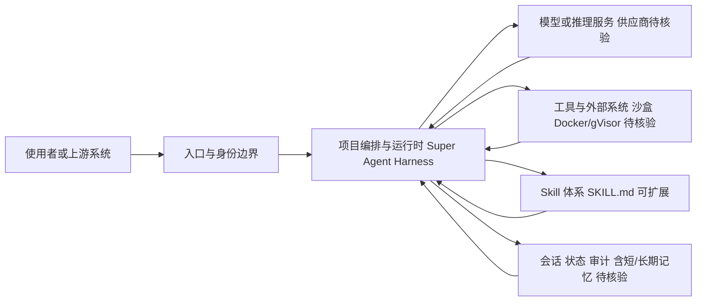

# bytedance/deer-flow

## 一句话定位
字节跳动开源的超级 Agent 框架（Super Agent Harness），编排子 Agent、记忆系统和沙盒环境来完成长周期复杂任务，通过可扩展的 Skill 体系驱动。

## 它解决的问题
单个 LLM Agent 在处理需要长时间、多步骤、多工具协作的复杂任务时（如"调研一个行业并输出报告"），面临上下文窗口有限、容易迷失目标、无法安全执行代码等问题。DeerFlow 通过"超级 Agent + 子 Agent 编排 + 沙盒执行 + 记忆系统"架构，让 AI 能完成小时级甚至天级的复杂研究和工作任务。

## 为什么值得关注
- **Stars:** 79,491 stars，2026 年增长最快的 Agent 框架之一
- **字节跳动出品:** 大厂工程实力背书，曾在 GitHub Trending #1
- **Super Agent 范式:** 不同于单 Agent（AutoGPT）或多 Agent 对话（CrewAI），DeerFlow 强调"超级 Agent 编排子 Agent"的层级架构
- **2.0 完全重写:** 2026 年 2 月发布 2.0 版本，是 ground-up 重写，架构设计更成熟
- **Skill 驱动:** 通过可扩展的 Skill 体系（SKILL.md）增强 Agent 能力

## 热度来源判断
DeerFlow 的热度来自三层：(1) 字节跳动品牌效应——字节在 AI 领域的声誉（豆包、Coze）带来初始关注；(2) Deep Research 赛道爆发——2026 年初，"AI 深度研究"成为热点，DeerFlow v1 是这一赛道的早期开源方案；(3) 2.0 重写的架构创新——从"Deep Research 工具"升级为"Super Agent Harness"，定位跃迁带来第二波热度。GitHub Trending #1 是真实社区关注度，非刷量。

## 关键技术亮点亮点
- **Super Agent 架构:** 主 Agent 负责任务分解和子 Agent 调度，子 Agent 负责具体执行，形成层级化编排
- **沙盒环境:** 内置代码执行沙盒（Docker / gVisor），Agent 可以安全地运行代码、操作文件
- **记忆系统:** 短期记忆（当前任务上下文）+ 长期记忆（跨任务知识），支持记忆检索和更新
- **Skill 体系:** SKILL.md 格式的可复用技能，类似 Claude Code 的 Skill 机制
- **Python 3.12+ / Node.js 22+:** 现代技术栈，前后端分离

## 架构师速览

| 决策问题 | 研究判断 | 证据边界 |
|---|---|---|
| 系统边界 | DeerFlow 是 Agent 编排层，介于入口渠道（使用者/上游系统）与模型供应商、工具/外部系统之间，并以会话/状态/审计作为控制边界 | 基于"super-agent, subagents, sandbox, orchestration"标签与 Super Agent Harness 定位做的抽象，未替代源码审计 |
| 主路径 | 使用者/上游系统 → 入口与身份边界 → 项目编排与运行时（超级 Agent + 子 Agent + Skill 体系） → 模型/推理服务 与 工具/外部系统（含 Docker/gVisor 沙盒） → 会话/状态/审计（含短/长期记忆）回写 | 主路径来源于"层级化编排 + 沙盒 + 记忆"描述；具体协议、传输与持久化实现待核验 |
| 关键权衡 | 扩展速度（Skill/子 Agent 数量）与沙盒权限隔离、可观测性、模型供应商耦合之间的平衡；Super Agent 模式的可靠性与 LLM 成本尚未在大规模长时任务中验证 | 权衡来源于"Skill 驱动 + 沙盒 + 成本高昂 + 可靠性待验证"表述；2.0 重写成熟度有限 |
| 最小 PoC | 单一入口渠道 + 最少工具权限 + 可审计日志下，先验证短/长期记忆与子 Agent 调度可达，再逐步扩接入面与沙盒类型 | PoC 步骤基于"先最小化验证 + 验收安全/成本/SLO/退出路径"建议；小时/天级长周期稳定性待核验 |

## 架构启发
DeerFlow 的核心架构启发是"Agent 层级化编排"——不是让一个 Agent 做所有事，而是让超级 Agent 充当"项目经理"，将子任务分派给专门的子 Agent。这种模式映射了人类组织的管理结构（经理 → 执行者），在复杂任务上比扁平的多 Agent 对话更可控。其沙盒设计也值得借鉴——Agent 执行代码必须在隔离环境中，防止宿主系统被破坏。

## 架构图（MMD）

> 证据边界：此图只采用本档案已有可核验描述；“待核验”节点不应视为项目实现事实。

## 定位判断
**平台型项目（快速成长期）。** DeerFlow 正从"Deep Research 工具"向"通用 Super Agent Platform"转型。2.0 版本的完全重写表明团队有长期野心——不只是做一个研究工具，而是要做 Agent 时代的基础设施。竞争对手包括 OpenAI Deep Research、Google Gemini Deep Research，以及开源的 LangGraph、CrewAI。

## 风险 / 局限 / 泡沫点
- **成本高昂:** 长周期复杂任务需要大量 LLM 调用，API 成本可能非常高
- **可靠性待验证:** Super Agent 编排子 Agent 的模式在真实复杂场景中的可靠性尚需验证
- **2.0 刚起步:** 完全重写意味着 1.x 的积累被放弃，2.0 的成熟度需要时间
- **字节开源承诺:** 字节跳动的开源项目有"突然停更"的风险（参考部分历史项目）
- **与 Coze 的关系:** 字节同时维护 Coze（闭源 Agent 平台）和 DeerFlow（开源），资源分配可能矛盾

## 与同类项目的关系
- **vs OpenAI Deep Research:** 闭源 SaaS vs 开源框架，DeerFlow 可私有化部署
- **vs LangGraph:** LangGraph 是代码优先的编排库，DeerFlow 是完整的 Agent 平台
- **vs AutoGPT:** AutoGPT 强调单 Agent 自主性，DeerFlow 强调多 Agent 层级编排
- **vs Coze:** Coze 是字节的闭源 Agent 平台，DeerFlow 是开源版，可能存在内部竞争
- **vs Claude Code / Codex:** 这些是编码专用 Agent，DeerFlow 面向更通用的研究和工作任务

## 是否值得持续跟踪
**是，高优先级。** DeerFlow 代表了 Agent 编排的前沿方向——Super Agent + 子 Agent + 沙盒 + 记忆的完整架构。其 2.0 重写后的架构设计值得深入研究。尤其关注：子 Agent 编排的可靠性、沙盒安全机制、Skill 生态的形成。

## 后续观察点
- 2.0 版本的真实使用案例和可靠性反馈
- Skill 生态是否形成（社区贡献的 SKILL.md 数量和质量）
- 与 Coze 的定位分化（开源 vs 闭源的互补还是竞争）
- 长周期任务（小时级 / 天级）的稳定性和成本
- 记忆系统的持久化和检索效果

---
> 数据来源: GitHub API (2026-08-07) | 首次发现: 2026-06-24
