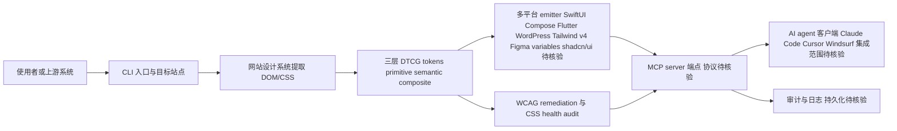

# Design Extract

## 一句话定位
一键提取网站完整设计系统，输出 DTCG tokens，并作为 MCP server 集成到 Claude Code/Cursor/Windsurf。

## 它解决的问题
设计师和开发者需要将现有网站的设计规范（颜色、字体、间距、组件）提取为结构化 token，然后同步到各平台（iOS/Android/Flutter/Web）。这个过程通常极其耗时且容易不一致。design-extract 用一条命令完成全链路。

目标用户：前端团队、设计系统团队、AI agent 开发者。

## 为什么值得关注（2026-04-20）
- 覆盖了完整的 design token 提取 → 多平台 emit 链路
- 内置 MCP server，可直接被 Claude Code/Cursor/Windsurf 调用
- 支持 WCAG remediation 和 CSS health audit
- Agent Skill 生态中第一个真正覆盖设计工程链的 Skill

## 热度来源判断
50% 真实痛点（设计系统提取确实是高频需求）+ 30% Agent Skill 热潮 + 20% 多平台 emitter 的完整度。

## 关键技术亮点亮点
1. **DTCG 标准 tokens**：输出符合 Design Tokens Community Group 标准的 tokens
2. **三层 token 体系**：primitive + semantic + composite，符合现代设计系统最佳实践
3. **MCP Server 集成**：作为 MCP server 运行，AI agent 可直接调用
4. **多平台 emitter**：iOS SwiftUI / Android Compose / Flutter / WordPress / Tailwind v4 / Figma variables / shadcn/ui
5. **WCAG remediation + CSS health audit**：不只提取，还能检测可访问性问题

## 架构师速览

| 决策问题 | 研究判断 | 证据边界 |
|---|---|---|
| 系统边界 | 单进程 JavaScript CLI/MCP 工具，入口为一条命令或 MCP 调用，输出面向多平台 emitter；不涉及模型供应商或第三方工具编排 | 档案仅声明语言为 JavaScript、标签含 MCP/skill，未给出进程拓扑、部署形态或鉴权细节 |
| 主路径 | 目标网站 → 提取(DOM/CSS) → 三层 token(DTCG primitive/semantic/composite) → 多平台 emitter(SwiftUI/Compose/Flutter/WP/Tailwind v4/Figma variables/shadcn/ui) → MCP server 暴露给 Claude Code/Cursor/Windsurf | 平台列表来自档案"关键技术亮点"，运行/调用协议与传输层待核验 |
| 关键权衡 | 提取覆盖广度(多平台 emitter) vs 单平台 emitter 的维护成本与 API 漂移风险；DTCG 标准化 vs 各平台 DSL 的转译损耗 | 档案明确提到"多平台 emitter 需要持续跟进各平台 API 变化"，未给出任何性能/准确度数据 |
| 最小 PoC | 取一个静态站点(避免 CSS-in-JS) → 运行一次提取 → 校验 DTCG tokens + 任一 emitter(如 Tailwind v4)输出 → 用 MCP 客户端(Claude Code 或 Cursor)发起一次只读调用并落审计日志 | 准确度、CSS-in-JS 支持度、MCP 工具调用协议细节在档案中均未实证 |

## 架构启发
- **Design token 作为 AI agent 的接口**：通过 MCP 暴露设计系统，让 agent 能理解和操作设计规范
- **单命令多平台输出**：一次提取、多端同步，符合企业设计系统的核心需求

## 架构图（MMD）

> 证据边界：此图只采用本档案已有可核验描述；“待核验”节点不应视为项目实现事实。

## 定位判断
在 Agent Skill 生态中定位为"设计工程链"的基础工具。与设计系统工具（Figma Tokens、Style Dictionary）互补。

## 风险 / 局限 / 泡沫点
1. **提取准确度**：复杂 CSS（CSS-in-JS、动态样式）的提取质量存疑
2. **维护成本**：多平台 emitter 需要持续跟进各平台 API 变化
3. **MCP 生态不确定性**：MCP 标准仍在快速演化

## 与同类项目的关系
- **Figma Tokens**：专注于 Figma 内的 token 管理
- **Style Dictionary**（Amazon）：token 编译器，但不做提取
- **bergside/design-md-chrome**：Chrome 扩展，类似目标但更轻量

## 是否值得持续跟踪
**是**。如果 MCP 成为 agent 工具调用标准，design-extract 可能成为设计系统与 agent 的桥梁。

## 后续观察点
1. 实际网站提取的准确度（尤其是 CSS-in-JS 项目）
2. MCP server 在 Claude Code/Cursor 中的实际集成体验
3. 社区是否贡献更多平台 emitter

---
*首次记录：2026-04-20*
