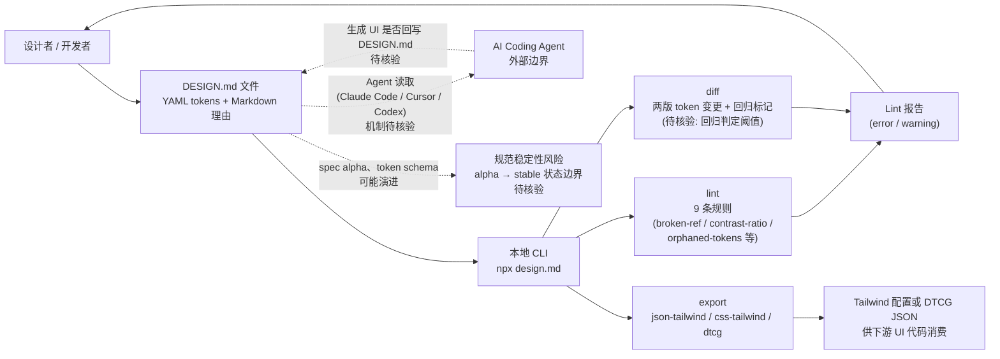

# design.md

## 一句话定位
Google Labs 提出的 DESIGN.md 文件格式规范——用 YAML frontmatter 定义机器可读的设计 tokens，用 Markdown body 描述人类可读的设计理由，让 AI coding agent 获得持久化、结构化的设计系统理解。

## 它解决的问题
AI coding agent 做 UI 开发时，设计系统信息散落在 Figma、CSS 变量、设计师脑中——Agent 只能看到"像素结果"而无法理解"设计意图"。这导致：
- Agent 生成的 UI 与设计系统不一致
- 每次 prompt 都要重复传达设计规范
- 设计变更无法自动传播到 Agent 输出
- 没有 lint 机制来验证 Agent 输出的 UI 是否符合设计系统

目标用户：使用 AI coding agent（Claude Code、Cursor、Codex 等）进行 UI 开发的团队和开发者。

## 为什么值得关注（2026-06-26）
- Google Labs 出品（非 Google 官方，但背景强），日增 1,407 stars
- 填补了 Agent 生态中"设计系统契约"的关键缺口
- 不是理论讨论——已经可运行：npx lint/diff/export 完整 CLI
- 9 条 lint 规则覆盖 WCAG 对比度、broken ref、孤立 token 等
- 3 种导出格式（Tailwind v3 JSON、Tailwind v4 CSS、W3C DTCG）
- 与 Claude Code/Cursor/Codex 生态完美契合

## 热度来源判断
**真实需求驱动。** Agent 做前端开发最大的痛点就是"不理解设计系统"。DESIGN.md 的 YAML+Markdown 双层结构提供了一种简洁的解决方案。Google Labs 背书增加了信任度。日增 1,407 且持续在 Trending 榜上，说明这不是一次性流量。

## 关键技术亮点亮点

### 1. 双层结构
```
---YAML frontmatter---
colors:
  primary: "#1A1C1E"
  tertiary: "#B8422E"
---Markdown body---
## Colors
- Primary (#1A1C1E): Deep ink for headlines and core text.
- Tertiary (#B8422E): "Boston Clay" — the sole driver for interaction.
```
Token 值 + 设计理由 = Agent 知道"用什么"且"为什么用"。

### 2. 9 条 Lint 规则
- broken-ref (error)：token 引用未定义
- contrast-ratio (warning)：WCAG AA 合规检查
- orphaned-tokens (warning)：定义但未使用的 token
- missing-primary/missing-typography (warning)：缺关键 token
- section-order (warning)：章节顺序规范
- unknown-key (warning)：疑似拼写错误

### 3. Diff 命令
比较两个 DESIGN.md 版本的 token 变化，检测回归：
```json
{"tokens": {"colors": {"added": ["accent"], "modified": ["tertiary"]}}, "regression": false}
```

### 4. 多格式导出
- `--format json-tailwind`：Tailwind v3 theme.extend
- `--format css-tailwind`：Tailwind v4 @theme CSS
- `--format dtcg`：W3C Design Tokens Format Module

### 5. Component 定义
```yaml
components:
  button-primary:
    backgroundColor: "{colors.tertiary}"
    textColor: "{colors.on-tertiary}"
    rounded: "{rounded.sm}"
    padding: 12px
```
组件由 token 引用组成，lint 会验证引用是否解析。

## 架构师速览

| 决策问题 | 研究判断 | 证据边界 |
|---|---|---|
| 系统边界 | DESIGN.md 是一个"规范 + 本地 CLI"产物：YAML tokens + Markdown 语义由 design.md 文件承载，CLI（npx lint/diff/export）在本地对文件做校验与格式转换，不直连模型或 IDE 运行时 | 档案仅描述文件格式与 CLI 子命令，未描述任何与 Claude Code/Cursor/Codex 的集成实现、传输协议或服务端组件；Agent 端的实际读取方式属"待核验" |
| 主路径 | 人类/Agent 编写 DESIGN.md → 本地 CLI 执行 lint（9 条规则）/diff（两版回归）/export（json-tailwind、css-tailwind、dtcg）→ 生成 tailwind 配置或 DTCG JSON，供下游 UI 代码消费 | 仅档案列出的三条 CLI 命令与三种导出格式可视为已证实；"被 Agent 自动读取并据此生成 UI"在档案中只是目标描述，未给出集成证据 |
| 关键权衡 | 表达力 vs 稳定性：alpha 阶段同时追求可立即被 Agent 采用（需简洁、贴近 Figma 心智）和可演进（spec、token schema 可能变化），且用 Markdown 承载"设计理由"在 lint 中无法机器校验，引入人类语义层的不可验证风险 | 风险条目 1、4 直接承认 alpha 与动态设计语义未覆盖；Markdown body 是否被任何 lint 规则校验，档案未说明 |
| 最小 PoC | 取一份小型 DESIGN.md（含 colors、typography、1 个 components 示例），跑 `lint` 验证 broken-ref/contrast-ratio/orphaned-tokens，再 `export --format css-tailwind` 与 `--format dtcg`，对比 Tailwind v4 `@theme` 与 W3C DTCG 输出差异，确认 CLI 在本地 Node 环境可复现 | 档案给出 CLI 命令与导出格式清单，但未提供 Node 版本要求、依赖体积、性能基准；能否在 CI 中稳定运行属"待核验" |

## 架构启发
DESIGN.md 的核心架构思想是**"契约文件"模式**——为 Agent 与外部系统（设计系统、安全策略、数据模型等）的交互定义结构化接口。

这与以下模式同构：
- `ROBOTS.TXT`：为爬虫定义访问规则
- `package.json`：为包管理器定义依赖关系
- `Dockerfile`：为容器运行时定义构建步骤
- `DESIGN.md`：为 Agent 定义设计系统规范

**关键设计哲学：** 将隐性知识（设计师脑中的设计理由）转化为显性结构化文件（YAML+Markdown），让 Agent 可以读取、理解、验证、执行。

**可扩展性：** 这一模式可以推广到更多领域：
- `ARCHITECTURE.md`：系统架构契约（分层、边界、依赖规则）
- `SECURITY.md`：安全策略契约（权限、审计、合规）
- `DATA.md`：数据模型契约（schema、关系、约束）

## 架构图（MMD）

> 证据边界：此图只采用本档案已有可核验描述；“待核验”节点不应视为项目实现事实。



## 定位判断
**Agent × Design System 标准化层的先行者。** 目前在 Agent 生态栈中处于"规范层"，类似于 TypeScript 之于 JavaScript——不改变底层能力，但提供了结构化的理解和验证框架。

## 风险 / 局限 / 泡沫点
1. **Alpha 版本风险**：文件明确标注 "version: alpha"，spec、token schema、CLI 可能变化
2. **Google Labs ≠ Google 官方**：Labs 项目可能被放弃或方向调整
3. **生态 adoption 不确定**：需要 Claude Code/Cursor/Codex 等主流 Agent 主动支持才真正有价值
4. **仅覆盖静态设计 tokens**：动态主题（dark mode）、响应式断点、动画时序等复杂设计语义暂不覆盖
5. **与 Figma 的关系未定义**：DESIGN.md 是 Figma 的补充还是替代？

## 与同类项目的关系
| 项目 | 定位 | 关系 |
|------|------|------|
| Figma Tokens / Tokens Studio | 设计 token 管理平台 | 互补：Figma 做可视化编辑，DESIGN.md 做 Agent 可读输出 |
| Style Dictionary | Amazon 的 token 转换工具 | 互补：Style Dictionary 做多平台输出，DESIGN.md 做 Agent 接口 |
| W3C Design Tokens Format | W3C 标准 | 兼容：DESIGN.md 可导出为 DTCG 格式 |
| shadcn/ui | React 组件库 | 互补：DESIGN.md 定义 tokens，shadcn/ui 实现组件 |

## 是否值得持续跟踪
**✅ 强烈建议持续跟踪。** 如果被主流 coding agent 默认支持，将成为 Agent 前端开发的事实标准。

## 后续观察点
1. Claude Code / Cursor / Codex 是否原生支持 DESIGN.md 读取
2. 社区是否出现 DESIGN.md 模板库（类似 shadcn/ui 的组件库模式）
3. 规范是否会从 alpha 升级到 stable
4. 是否扩展到 dark mode、响应式、动画等动态设计语义
5. Figma 插件是否出现（Figma ↔ DESIGN.md 双向同步）

---
*首次记录：2026-06-26*
