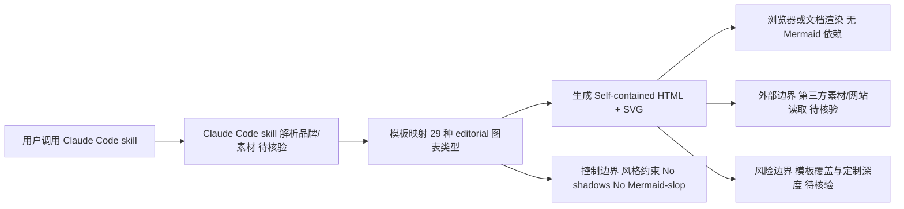

# cathrynlavery/diagram-design — 29 editorial diagram types for Claude Code. Self-contained HTML + SVG. No shadow

## 一句话定位

29 editorial diagram types for Claude Code. Self-contained HTML + SVG. No shadows, no Mermaid-slop.。主要使用 HTML 编写，当前 5,299 stars / 365 forks / 26 subscribers。

## 它解决的问题

**目标用户**：使用 html 生态的开发者、工程师。

**痛点**：该项目解决的核心问题是 29 editorial diagram types for Claude Code. Self-contained HTML + SVG. No shadows, no Mermaid-slop.。从 README 来看，项目提供了 # Diagram Design **Editorial diagrams your designer won't hate.**   *New in 2.0 — th。

**场景**：适用于需要 该类型工具 的开发场景。

## 为什么值得关注（2026-04-22）

1. **Stars 增长**：5,299 stars，365 forks——fork/star 比为 6.9% （正常范围）
2. **活跃度**：创建于 2026-04-16，最后更新 2026-08-11，2 open issues
3. **技术栈**：HTML，License: MIT
4. **生态定位**：无 topics 标注

## 热度来源判断

**真实需求信号**：forks 365（高部署意愿），subscribers 26（深度关注）。

## 关键技术亮点

1. **# Diagram Design**
2. ****Editorial diagrams your designer won't hate.****
3. ****
4. ****
5. ***New in 2.0 — the Loop: flywheels with a shared-memory hub. The dashed lines are the write-backs.***
6. **27 types. One Claude Code skill. Your brand in 60 seconds — the skill reads your website and maps co**

## 架构师速览

| 决策问题 | 研究判断 | 证据边界 |
|---|---|---|
| 系统边界 | 项目是面向 Claude Code 的 29 种"editorial"图表生成工件集，自包含 HTML+SVG 输出，不依赖阴影或 Mermaid 渲染链路；边界止于"Claude Code skill 输入 + 浏览器/文档渲染 SVG/HTML" | 档案仅确认 HTML、SVG 自包含、29 种类型与"one Claude Code skill"，未列出 skill 协议细节 |
| 主路径 | 用户调用 Claude Code skill → skill 读取用户素材（网站/品牌） → 映射为预设图表模板 → 输出自包含 HTML/SVG | "skill reads your website and maps co" 在档案中截断，映射规则与模板编排机制待核验 |
| 关键权衡 | 设计一致性（editorial 美学、固定无阴影风格）与模板覆盖广度（29 种类型）之间的取舍；以自包含交付换取运行时不依赖 Mermaid | 风格约束明确为 "No shadows, no Mermaid-slop"，但可定制深度、版本兼容性与 CSS 主题机制档案未给出 |
| 最小 PoC | 选取 1–2 种图表类型（如 architecture、loop），用最小品牌素材驱动 skill 生成 HTML/SVG，核验：是否真正自包含、能否在普通浏览器/文档中正确渲染、是否复用同一视觉系统 | 输出是否完全离线自包含、skill 调用接口与失败回退路径档案未证实 |

## 架构启发

从 cathrynlavery/diagram-design 的设计来看，核心思路是 **"29 editorial diagram types for Claude Code. Self-contained H"**。这反映了 HTML 生态中 开发者工具 的演进方向——降低集成复杂度、提供开箱即用的能力。开源 License (MIT) 降低了采用门槛。

## 架构图（MMD）

> 证据边界：此图只采用本档案已有可核验描述；“待核验”节点不应视为项目实现事实。

## 定位判断

**工具型**。在生态中定位为29 editorial diagram types for Claude Co方向的工具。Stars 5299 说明已有一定社区基础。

## 风险 / 局限 / 泡沫点

1. **规模风险**：5,299 stars，但 fork 365 说明有实际部署
2. **维护风险**：最后 push 时间 2026-08-11，活跃维护中
3. **Open Issues**：2 个 open issues，问题量可控
4. **License**：MIT（宽松许可，适合商用）

## 与同类项目的关系

- 与同 HTML 生态的同类工具形成竞争/互补关系。具体竞品对比需参考社区讨论。
- 从 topics () 来看，与关注 该领域 的其他项目有交叉。

## 是否值得持续跟踪

**是。** 5299 stars + 活跃更新说明项目有持续价值。建议关注后续版本迭代和社区增长。

## 后续观察点

1. Star 增速是否可持续（当前 5,299）
2. Fork 增长趋势（当前 365）
3. 功能迭代频率（最后更新 2026-08-11）
4. 社区活跃度（subscribers 26, open issues 2）

---
> 数据来源: GitHub API (2026-08-11) | Stars: 5,299 | Forks: 365 | License: MIT | 语言: HTML | 创建: 2026-04-16
