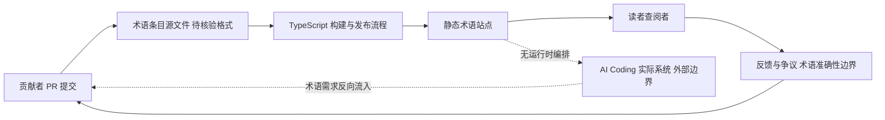

# Dictionary of AI Coding

## 一句话定位
AI 编程术语词典，用通俗英语解释 Agent/Coding 领域的术语和黑话。

## 它解决的问题
**目标用户：** 想理解 AI 编程领域术语的开发者和非技术人员。

**痛点：**
- AI Coding 领域术语爆炸：Agent、Skill、Harness、Memory、Context Window、RAG、MCP 等
- 新概念涌现速度远超文档整理速度
- 技术术语的理解门槛阻碍了非技术人员参与讨论

## 为什么值得关注（2026-05-05）
Matt Pocock（TypeScript 社区知名开发者）出品，4 天近 1K stars。AI Coding 术语的标准化是生态成熟的标志——当一个领域开始"编纂词典"，说明核心概念正在收敛。

## 热度来源判断
- **作者影响力** — Matt Pocock 在 TypeScript 社区有号召力
- **时机好** — AI Coding 术语确实混乱，社区需要一份参考
- **实用性高** — 每个开发者都需要快速理解新术语

## 关键技术亮点亮点
1. **社区驱动** — 开源接受 PR，术语库可持续更新
2. **通俗解释** — 面向非专家的通俗英语，降低理解门槛
3. **TypeScript 构建** — 自动化发布流程

## 架构师速览

| 决策问题 | 研究判断 | 证据边界 |
|---|---|---|
| 系统边界 | 这是一个面向读者侧的解释性内容仓库，不是 AI Coding 系统本体；"边界"在贡献者（PR 提交者）与读者（消费通俗术语解释的人）之间 | 档案将其归类为"学习型/字典/术语解释"，未描述任何运行时编排、模型调用或工具链 |
| 主路径 | 内容主路径为：术语条目（Markdown/TypeScript 源码）→ 构建/发布流程 → 静态站点供读者查阅；不含模型推理或工具调用路径 | 仅指出"TypeScript 构建"与"社区驱动 PR"，自动化发布与站点的具体形态未在档案中证实 |
| 关键权衡 | 通俗性与准确性之间的权衡：面向非专家的英语解释 vs. 与社区主流用法的一致性 | 档案自陈"非官方定义，可能与主流理解有偏差"；无机制保证术语审校 |
| 最小 PoC | 最小验证是"读一条新术语条目 → 确认通俗解释是否被社区接受（PR/讨论）"，而非系统集成 PoC | 档案未声明任何 API、SDK 或可编程接口，仅适合作为静态参考材料试用 |

## 架构启发
- 元认知工具的价值：当技术生态快速演化时，"解释性基础设施"（词典、教程、地图）有独立价值
- 开源词典模式：类似 MDN Web Docs，但聚焦于 AI Coding 领域

## 架构图（MMD）

> 证据边界：此图只采用本档案已有可核验描述；“待核验”节点不应视为项目实现事实。

## 定位判断
**学习型。** 是 AI Coding 生态的"元工具"——帮助理解其他工具的工具。

## 风险 / 局限 / 泡沫点
1. **维护挑战** — 术语更新快，项目容易过时
2. **权威性** — 非官方定义，可能与主流理解有偏差
3. **替代方案多** — LLM 本身就是最好的"术语解释器"

## 与同类项目的关系
- **MDN Web Docs** — Web 技术的官方文档，Dictionary 是其 AI Coding 领域的民间版本
- **Awesome Lists** — 资源列表，Dictionary 更聚焦于概念解释

## 是否值得持续跟踪
**无需持续跟踪。** 有用但非战略性项目。可作为参考工具偶尔查阅。

## 后续观察点
1. 术语覆盖率是否跟上 AI Coding 领域的演化速度
2. 是否被更大的文档项目（如 Agent 框架的官方文档）吸收

---
*首次记录：2026-05-05*
