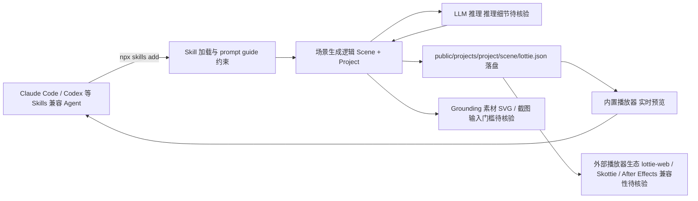

# diffusionstudio/lottie (Text-to-Lottie)

## 一句话定位

开源框架，通过 Claude Code、Codex 或任何支持 Skills 的 Coding Agent 生成生产级 Lottie 动画（Text-to-Lottie），安装方式：`npx skills add diffusionstudio/lottie`。

## 它解决的问题

Lottie 动画是移动端和 Web 的工业标准格式，但制作 Lottie 需要专业设计工具和技能。该项目让 AI Agent 直接生成可用的 Lottie JSON 文件，包含内置播放器和实时编辑预览。Y Combinator F24 批次公司出品。

## 为什么值得关注

1. **5,075 stars / 275 forks**，MIT 许可证，从 2K 快速增长到 5K+
2. **AI → 生产资产**：不是概念验证，直接生成标准 Lottie JSON，兼容所有 Lottie 播放器
3. **Agent 原生集成**：作为 Skill 安装，Claude Code / Codex 直接调用
4. **实时预览**：Agent 编辑 Lottie 时播放器实时更新，可检查、拖拽、精修
5. **Y Combinator F24**：有商业 backing
6. 提供详细的 prompt guide（grounding、motion design 术语、camera 操作、FPS/duration 控制）

## 热度来源判断

- **Lottie 刚需格式 + AI 生成设计资产爆发 + Agent 工具链集成**
- 设计工具链 AI 化的代表项目
- 从 2K 增至 5K+，增速持续
- 有实际 demo GIF 展示生成效果

## 关键技术亮点亮点

1. **Skill 化分发**：`npx skills add diffusionstudio/lottie`，符合 agentskills.io 标准
2. **Scene + Project 架构**：每个动画是 project 下的 scene，从 `public/projects/<project>/<scene>/lottie.json` 自动加载
3. **实时编辑预览**：Agent 编辑时播放器实时更新
4. **生成标准 Lottie JSON**：兼容 lottie-web、React Native Skia（Skottie）、After Effects
5. **Prompt guide 工程化**：5 条原则（grounding、motion 术语、camera 思维、controls 请求、FPS/duration）

## 架构师速览

| 决策问题 | 研究判断 | 证据边界 |
|---|---|---|
| 系统边界 | 以 npx skills 形式分发给 Claude Code / Codex 等 Skills 兼容 Agent，在 Agent 流程内调用，内置播放器提供实时预览，落盘到 `public/projects/<project>/<scene>/lottie.json` | 入口与目录结构来自档案"关键技术亮点"，运行宿主仅限定为"Claude Code、Codex 或任何支持 Skills 的 Coding Agent"，其余边界待核验 |
| 主路径 | Agent 通过 Skill 加载 → 读取 prompt guide 约束 → 生成标准 Lottie JSON → 写入 scene 路径 → 内置播放器实时刷新预览 → 兼容 lottie-web、Skottie、After Effects | 生成格式兼容列表来自档案，prompt guide 5 条原则作为生成约束引用，模型推理细节与 Skill 协议实现待核验 |
| 关键权衡 | 标准 Lottie 格式带来的跨播放器复用收益 vs. 对 LLM 理解 motion/SVG 的能力依赖以及 grounding 素材（SVG/截图）输入门槛 | 权衡判断基于档案"风险/局限"与"prompt guide 工程化"段，具体生成质量上限与可观测性细节待核验 |
| 最小 PoC | 通过 `npx skills add diffusionstudio/lottie` 安装到 Claude Code/Codex，提供 SVG/截图 grounding，按 prompt guide 5 条原则输出单 scene Lottie JSON，验证内置播放器预览与跨播放器（lottie-web、Skottie）回放一致 | 安装命令与目录约定来自档案，单一 scene 范围来自"Scene + Project 架构"描述，更复杂场景、API 形态与生产化部署细节待核验 |

## 架构启发

**AI 生成设计资产的关键不是「能生成」，而是「生成的东西能直接进产品」。** Lottie 格式的标准化使得 AI 输出可以直接进入产品流程。Scene + Project 的文件组织模式让 Agent 可以增量编辑而非每次全量重生成。

## 架构图（MMD）

> 证据边界：此图只采用本档案已有可核验描述；“待核验”节点不应视为项目实现事实。

## 定位判断

**工具型。** 有明确的单一用途（生成 Lottie），不会演化为平台。但代表了设计工具链 AI 化的趋势。

## 风险 / 局限 / 泡沫点

1. **动画质量上限待验证** — AI 生成的动画创意和复杂度可能受限
2. **单一用途** — 只做 Lottie，扩展性有限
3. **依赖模型能力** — 动画生成质量高度依赖 LLM 理解设计意图和 SVG 路径的能力
4. **需要 grounding 素材** — prompt guide 明确建议提供 SVG/截图，纯文本生成效果较差

## 与同类项目的关系

- **LottieFiles / lottie-web**：播放器生态，Text-to-Lottie 生成兼容这些播放器的文件
- **After Effects**：传统 Lottie 制作工具，Text-to-Lottie 可导入 AE 进一步精修
- **其他 AI 设计工具（Galileo AI 等）**：AI 生成 UI/设计资产，Text-to-Lottie 聚焦动画格式
- **diffusion.studio**：出品公司的商业产品

## 是否值得持续跟踪

**观察。** 工具型但增速快，代表设计资产 AI 化趋势。关注其是否能扩展到更多设计资产格式。

## 后续观察点

1. 生成动画的复杂度和质量提升（从简单图标动画到复杂场景）
2. 在实际产品中的使用情况
3. 是否扩展到其他设计资产格式（GIF、WebM、3D 动画）
4. Y Combinator 背景下的商业化路径
5. prompt guide 的演进和生成质量的关系
