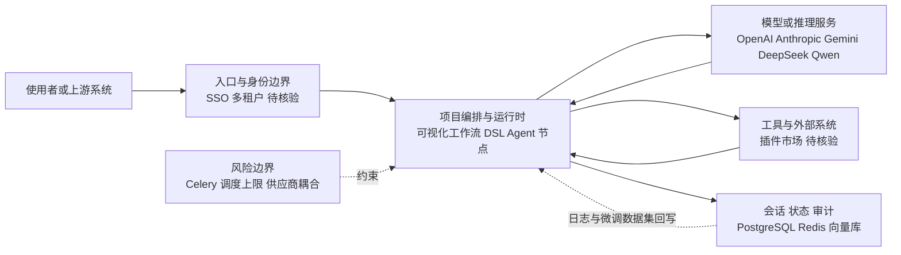

# langgenius/dify

## 一句话定位
开源 LLMOps + Agent 平台，以可视化工作流编排 Agentic workflows、RAG 管道和多模型协作，支持私有化部署和 SaaS 双模式。

## 它解决的问题
AI 应用从"调一个 API"到"可上线的生产系统"之间存在巨大工程鸿沟——Prompt 管理、RAG 管道、多模型路由、Agent 工具调用、审核流、日志追踪，每一环都需要反复打磨。Dify 提供一个协作式 workspace，让团队以低代码方式编排 Agent 工作流，同时保留深度定制能力（DSL、插件机制、自定义工具），把"从 Prompt 到产品"的时间从数周压缩到数小时。

## 为什么值得关注
- **Stars:** 151,679 stars（截至 2026-08-07），持续增长，已进入 GitHub Top 50 仓库
- **多模型支持:** 对接 OpenAI / Anthropic / Gemini / DeepSeek / Qwen 等主流模型，是当前模型适配最广的开源 Agent 平台之一
- **企业级采用:** 自带多租户、SSO、权限管理、日志审计，已有大量中国企业生产部署案例
- **社区活跃度:** 1,000+ contributors，Discord 社区数万人，周更迭代节奏
- **生态扩展:** 插件市场逐步成形，从"工具"向"平台 + 生态"演进

## 热度来源判断
Dify 的热度来自三层叠加：(1) 大模型应用落地浪潮的刚需——企业需要一个编排平台；(2) 本土优势——中文文档完善、国内社区活跃、适配国产模型快；(3) 与 LangChain / Flowise 等竞品相比，Dify 的可视化编排 + 后端工程化程度更接近生产级，而非纯原型工具。Star 数从 2024 年的 ~30K 增长到 2026 年的 150K+，说明这不是短期炒作，而是真实需求驱动。

## 关键技术亮点亮点
- **可视化 Workflow 编排:** 拖拽式 DAG 编辑器，支持条件分支、循环、并行节点，复杂逻辑以图而非代码表达
- **RAG 引擎内置:** 文档解析 → 分块 → 向量化 → 检索 → 重排序，全链路参数可调，支持混合检索（关键词 + 语义）
- **Agent 节点:** 支持 ReAct / Function Calling / 自定义 Agent 策略，可嵌套工具调用
- **LLM 微调数据集导出:** 可将平台日志直接导出为 Fine-tuning 数据集，形成"标注 → 训练 → 回归部署"闭环
- **后端架构:** Python (Flask) + Celery 异步任务 + PostgreSQL / Redis / 向量库分离，容器化部署

## 架构师速览

| 决策问题 | 研究判断 | 证据边界 |
|---|---|---|
| 系统边界 | 入口/身份层、编排运行时、外部模型与工具、会话/状态/审计四类职责的分层边界 | 基于档案中的"入口渠道、模型供应商、工具/数据源之间的编排层"抽象，具体组件命名（API Gateway、Web UI、向量库类型等）档案未披露，须源码核验 |
| 主路径 | 请求 → 编排运行时 → 模型/工具调用 → 状态回写，闭环由会话与审计承载 | 档案明示"Python (Flask) + Celery + PostgreSQL/Redis/向量库分离"为主路径后端实现，协议与接口细节未列 |
| 关键权衡 | 可视化低代码扩展速度 vs 多租户权限、可观测性、模型供应商耦合之间的张力 | 档案明确列出开源/商业版分层、Celery 调度上限、模型依赖等权衡点；具体性能阈值与计费边界档案未给 |
| 最小 PoC | 单一入口渠道 + 最小工具权限 + 可审计日志下跑通一条可视化工作流 | 档案给出"先单一渠道、最小权限、可审计"建议，但 DSL 字段、向量库选型、部署形态（私有化/SaaS）档案未细化为可执行步骤 |

## 架构启发
Dify 的核心架构启发在于"编排即数据"——工作流定义被序列化为 DSL（JSON），运行时由引擎解释执行，而非硬编码。这使得工作流可以版本管理、导入导出、跨环境迁移。其 Agent 节点设计将"策略"（ReAct vs Function Calling）与"工具集"解耦，用户可以灵活组合。RAG 管道的"配置化"思路也值得借鉴——把 chunk_size、overlap、top_k、rerank 等参数全部暴露为可调选项，而非黑盒。

## 架构图（MMD）

> 证据边界：此图只采用本档案已有可核验描述；“待核验”节点不应视为项目实现事实。

## 定位判断
**平台型项目。** Dify 已从单纯的 Prompt 管理工具演化为完整的 AI 应用开发平台，具备工作流引擎、RAG、Agent、监控、多租户等平台级能力。它是开源生态中少数同时面向开发者（API/DSL）和非开发者（可视化编排）的产品，目标是成为 AI 时代的"Heroku for AI Apps"。

## 风险 / 局限 / 泡沫点
- **性能瓶颈:** 复杂工作流在高并发下可能成为瓶颈，Celery 异步队列的调度能力有上限
- **插件生态尚浅:** 虽有插件机制，但插件数量和质量与成熟平台（如 Zapier）差距大
- **开源 vs 商业版:** 社区版与企业版功能分层可能导致核心功能"锁"在付费层
- **模型依赖:** 深度依赖外部模型 API，自身不提供推理能力，利润空间受上游挤压

## 与同类项目的关系
- **vs LangChain / LangGraph:** LangChain 是代码优先的框架，Dify 是可视化优先的平台；两者可互补，Dify 内部实际也用到 LangChain 组件
- **vs Coze / FastGPT:** Coze 是字节跳动的闭源产品，FastGPT 更偏知识库问答；Dify 在 Agent 编排上更灵活
- **vs Flowise / n8n:** Flowise 是 LangChain 的可视化壳，n8n 是通用自动化；Dify 更专注于 AI 场景
- **vs Dify 商业版:** 开源版已足够强大，企业版主要增加 SSO、审计、SLA

## 是否值得持续跟踪
**是。** Dify 是当前开源 Agent 平台中工程化程度最高、社区最活跃的项目之一，其工作流编排思路和多模型适配策略对整个 AI 应用开发领域有标杆意义。尤其关注其插件市场和 Agent 编排能力的演进。

## 后续观察点
- 插件市场生态是否形成正向飞轮（开发者上传 → 用户使用 → 反馈迭代）
- 工作流引擎是否支持更复杂的分布式 / 长任务编排（如数小时运行的研究任务）
- 企业版与社区版的功能边界是否会引发社区争议
- 是否出现"Dify 原生"的杀手级应用案例
- 模型路由层是否引入智能选模型能力（根据任务自动选择最优模型）

---
> 数据来源: GitHub API (2026-08-07) | 首次发现: 2026-07-28
