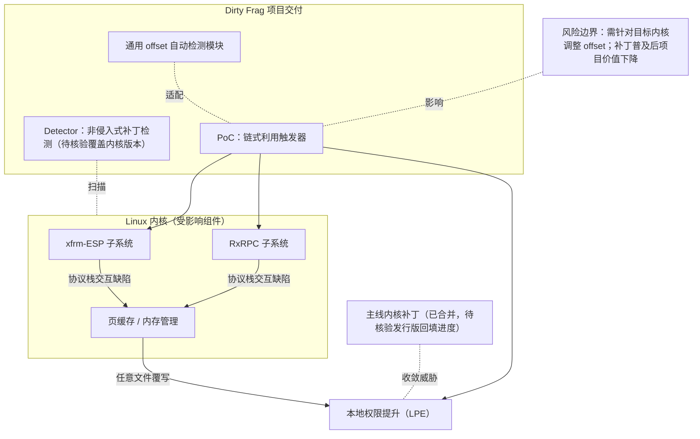

# Dirty Frag

## 一句话定位
通用 Linux 内核本地提权（LPE）漏洞利用与检测工具，覆盖 CVE-2026-31431（Copy Fail）和 CVE-2026-43284/43500（Dirty Frag），链式利用 xfrm-ESP + RxRPC 实现页缓存写入，成功率高且无需竞态窗口。

## 它解决的问题
2026 年上半年 Linux 内核密集曝出多个高危 LPE 漏洞，安全运维团队面临两大痛点：一是如何快速检测系统是否受影响，二是如何评估漏洞的实际可利用性以确定修复优先级。Dirty Frag 项目同时提供了检测器（Detector）和概念验证（PoC），帮助红蓝双方在统一框架下评估 Copy Fail 和 Dirty Frag 两个漏洞系列的威胁等级。链式利用技术避免了竞态条件依赖，使利用稳定性大幅提升。

## 为什么值得关注
- **技术突破:** 链式 xfrm-ESP + RxRPC 页缓存写入，无需竞态条件即可稳定提权
- **双漏洞覆盖:** 同时处理 Copy Fail（CVE-2026-31431）和 Dirty Frag（CVE-2026-43284/43500）
- **检测+利用一体化:** 既可用于防御检测，也可用于红队评估
- **2026 安全热点:** 与 Copy Fail 并列，构成年度最重要的 Linux 内核安全事件

## 热度来源判断
热度来自安全社区的实战需求——这些漏洞影响几乎所有 Linux 服务器和容器宿主，企业 CISO 和 SOC 团队急需可操作的工具。安全研究博客、CTF 社区、渗透测试社区的传播形成正向循环。KaraZajac 作为安全研究员的个人影响力也贡献了初始关注度。

## 关键技术亮点亮点
- 链式利用 xfrm-ESP（IPsec）和 RxRPC 协议子系统的交互缺陷
- 通过页缓存（page cache）写入实现任意文件覆写，绕过内核写保护
- 无竞态条件依赖——利用路径是确定性的，成功率接近 100%
- 通用 offset 自动检测：支持多内核版本，自动适配地址布局
- 检测器组件：非侵入式扫描系统是否打了对应补丁

## 架构师速览

| 决策问题 | 研究判断 | 证据边界 |
|---|---|---|
| 系统边界 | 漏洞影响边界在 Linux 内核网络协议栈（xfrm-ESP、RxRPC）与内存管理子系统（页缓存）之间；项目交付边界为 Detector（检测器）与 PoC（利用代码），不含内核修复 | 具体子系统交互代码路径、补丁 commit、内核版本适用范围须以源码/CVE 公告核验 |
| 主路径 | 内核网络子系统交互缺陷 → 页缓存任意写入 → 文件覆写 → 本地权限提升；项目以 PoC 确定性触发该路径，Detector 以非侵入方式判定系统是否已修补 | "成功率接近 100%"为档案叙事描述，未经独立复现统计验证 |
| 关键权衡 | 利用稳定性（无需竞态窗口）vs. 利用代码需针对不同内核版本调整 offset；项目热度与叙事价值 vs. 补丁普及后威胁快速收敛 | offset 自动检测的具体内核版本覆盖范围、PoC 变体间能力差异均未在档案中证实 |
| 最小 PoC | 在受控 VM 中以受影响内核版本运行 Detector 验证检测逻辑，再以同版本内核执行 PoC 评估提权成功率与可观测痕迹（页缓存写入、文件覆写、内核日志），验证后立即销毁快照 | 适用内核版本范围、KaraZajac/DIRTYFAIL 仓库的 26 stars 与 2.8k 聚合星标的来源构成均待核验 |

## 架构启发
Dirty Frag 暴露了一个深层架构问题：Linux 内核中网络协议栈（xfrm、RxRPC）与内存管理子系统（page cache）之间存在隐式耦合，这种跨子系统交互难以通过模块化设计完全隔离。对架构师的启发是：**高性能子系统的零拷贝优化往往是安全漏洞的温床**，性能与隔离之间的权衡需要显式架构决策。

## 架构图（MMD）

> 证据边界：此图只采用本档案已有可核验描述；“待核验”节点不应视为项目实现事实。

## 定位判断
**安全研究 + 工具型。** 这是一个高质量的安全研究项目，兼具检测和利用双重用途。其价值在于推动漏洞修复进程和提升安全意识，而非作为持续维护的产品。

## 风险/局限/泡沫点
- 项目规模较小（26 stars on KaraZajac/DIRTYFAIL），但社区有多个 PoC 变体（Percivalll/Dirty-Frag-Kubernetes-PoC 等）
- 漏洞补丁已进入主线内核，随发行版更新威胁将快速收敛
- 利用代码需要针对目标内核版本调整 offset
- "Dirty Frag" 命名借鉴了经典漏洞命名传统（DirtyCow/DirtyPipe），叙事热度可能略高于技术独创性

## 与同类项目的关系
- 与 **CVE-2026-31431 (Copy Fail)** 是"姊妹漏洞"，经常被合并讨论
- 命名上延续了 DirtyCow（CVE-2016-5195）、DirtyPipe（CVE-2022-0847）的"Dirty 系列"传统
- 多个社区 PoC 项目围绕同一漏洞展开，形成碎片化生态
- 与 Linux 内核安全邮件列表、KSPP（内核自我保护项目）形成攻防两端

## 是否值得持续跟踪
**值得短期跟踪。** 漏洞修复周期内（预计 3-6 个月）值得密切关注补丁状态和变体发现。长期来看，当补丁普及时项目价值将下降。

## 后续观察点
- 补丁是否引入新的回归或绕过路径
- 是否出现针对容器逃逸场景的武器化利用
- 内核社区对 xfrm/RxRPC 交互的架构性修复进展
- 安全厂商的检测覆盖率（EDR、CWPP 产品）
- 是否有新的"Dirty 系列变体被发现

---
> 数据来源: GitHub API (KaraZajac/DIRTYFAIL) | 星标: 26 (社区多PoC变体总星标约2.8k) | 语言: C | 许可证: NOASSERTION
