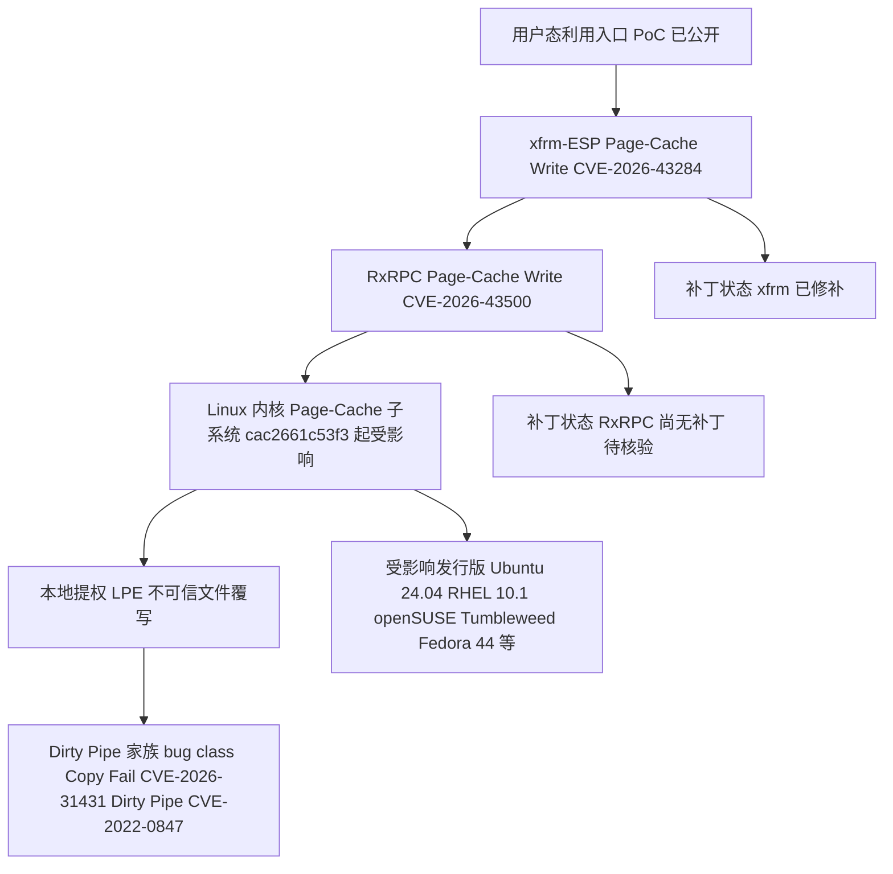

# Dirty Frag

## 一句话定位
通用 Linux 本地提权漏洞利用（CVE-2026-43284/43500），链式利用 xfrm-ESP + RxRPC Page-Cache Write，确定性触发无需竞态。

## 它解决的问题
这不是一个"解决问题"的项目，而是一个**暴露问题**的项目。它证明 Linux 内核的 Page-Cache 管理路径存在系统性安全缺陷，影响长达 9 年。

## 为什么值得关注（2026-05-09）
1. 与本周的 Copy Fail（CVE-2026-31431）同属 Dirty Pipe 家族，一周内两个 9 年老洞被披露
2. PoC 已公开，攻击门槛极低，运维团队必须立即响应
3. xfrm 部分已修补，但 RxRPC（CVE-2026-43500）尚无补丁
4. 影响几乎所有主流发行版

## 热度来源判断
热度来自安全社区的紧急响应需求，而非泡沫炒作。这类漏洞 PoC 一旦公开，传播速度天然极快。2 天 2.8K stars 对于安全研究类项目是异常高速。

## 关键技术亮点亮点
1. **确定性逻辑漏洞**：不依赖竞态条件（与许多内核漏洞不同），成功率高
2. **链式利用**：组合 xfrm-ESP Page-Cache Write + RxRPC Page-Cache Write，扩大攻击面
3. **影响范围极广**：从 2017 年（cac2661c53f3）至今的主流内核全部受影响
4. **已验证多发行版**：Ubuntu 24.04、RHEL 10.1、openSUSE Tumbleweed、Fedora 44 等

## 架构师速览

| 决策问题 | 研究判断 | 证据边界 |
|---|---|---|
| 系统边界 | 项目本质是 Linux 内核漏洞利用 PoC，作用面是 Linux 内核 Page-Cache 子系统（xfrm-ESP + RxRPC），而非数据/检索系统；外部边界为内核页缓存与受影响发行版 | 档案明确为"安全研究""C""exploit/CVE"项目，未给出非漏洞利用组件 |
| 主路径 | 用户态利用代码 → xfrm-ESP Page-Cache Write → RxRPC Page-Cache Write → 本地提权 / 不可信文件覆写；触发链路无竞态 | 仅基于档案"链式利用 xfrm-ESP + RxRPC Page-Cache Write，确定性触发无需竞态"描述 |
| 关键权衡 | 攻击确定性 vs. 防御窗口：确定性漏洞压缩了防御响应时间；同时 xfrm 已修补、RxRPC 无补丁，补丁覆盖不均衡 | 仅有"xfrm 已修补、RxRPC 尚无补丁"事实，具体补丁版本与回溯范围未在档案中 |
| 最小 PoC | 在未打 RxRPC CVE-2026-43500 补丁的内核上（如档案列出的 Ubuntu 24.04 / RHEL 10.1 / openSUSE Tumbleweed / Fedora 44 之一）复现链式提权；验收应包含受影响内核版本核验与回滚路径 | 档案仅确认多发行版"已验证"与 PoC 已公开，未给出具体复现步骤与版本号范围 |

## 架构启发
- Linux 内核 Page-Cache 管理的权限模型存在结构性缺陷
- Dirty Pipe → Copy Fail → Dirty Frag 表明这是一个 bug class，不是孤立事件
- 内核审计对基础文件系统代码路径的投入严重不足
- 确定性漏洞比竞态漏洞更危险——攻击可靠性高，防御窗口小

## 架构图（MMD）

> 证据边界：此图只采用本档案已有可核验描述；“待核验”节点不应视为项目实现事实。

## 定位判断
安全研究型项目。不属于基础设施，但对所有 Linux 运维架构有重大影响。短期高热度，中长期作为安全审计参考。

## 风险 / 局限 / 泡沫点
1. **RxRPC 部分尚无补丁**，企业环境仍处于暴露状态
2. PoC 公开意味着攻击门槛极低，可能被恶意利用
3. 此类漏洞可能还有同族未发现的其他实例

## 与同类项目的关系
- **Copy Fail (CVE-2026-31431)**：同周披露，同为 9 年老洞，Dirty Pipe 家族
- **Dirty Pipe (CVE-2022-0847)**：2022 年的原始漏洞，开启了 Page-Cache Write 这个 bug class

## 是否值得持续跟踪
短期持续关注补丁状态。作为 bug class 的研究参考，中长期也值得关注是否出现更多同族漏洞。

## 后续观察点
1. CVE-2026-43500（RxRPC 部分）的补丁进度
2. 是否有更多同族 Page-Cache Write 漏洞被披露
3. 主流发行版的补丁推送时间线
4. 是否催生新的内核安全审计工具

---
*首次记录：2026-05-09*
