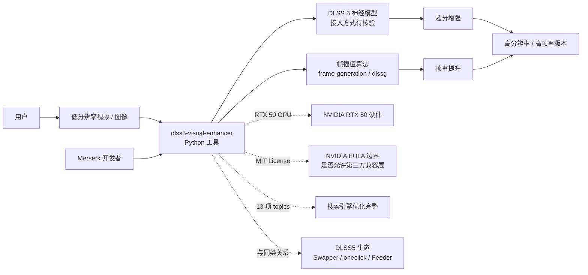

# Merserk/dlss5-visual-enhancer

## 一句话定位
DLSS 5 神经渲染 + 帧插值的视频 / 图像增强工具——支持图片 / 视频超分 + 帧生成，Python 实现，13 项完整 topics。

## 它解决的问题
2025-2026 年 NVIDIA DLSS 5（Deep Learning Super Sampling 5）推出神经渲染技术，在 RTX 50 系列显卡上提供 4× 帧率提升。但 DLSS 5 主要面向游戏实时渲染，对离线视频 / 图像增强的支持有限。`Merserk/dlss5-visual-enhancer` 把 DLSS 5 的神经渲染能力扩展到**离线视频 / 图像增强**场景——用户可以上传低分辨率视频 / 图像，工具使用 DLSS 5 神经模型 + 帧插值算法输出高分辨率 / 高帧率版本。这是 DLSS 5 兼容层生态的扩展：从"游戏实时渲染"扩展到"离线媒体增强"。

## 为什么值得关注（2026-09-05）
- **Stars:** 484（截至 2026-09-05），6 天即达 0.5k⭐，处于"早期增长 + 持续上行"阶段
- **Forks:** 38 / 6 天 = 6.3 forks/日，7.9% fork/star 比正常——说明有真实部署尝试
- **License:** MIT
- **语言:** Python
- **活跃度:** created 2026-08-30，pushed_at 2026-09-04，6 天内持续更新
- **规模:** 1.8MB
- **Topics:** 完整度 13 项（ai-upscaling / dlss / dlss-5 / dlssg / frame-generation / frame-interpolation / image-enhancement / image-upscaling / neural-rendering / nvidia / nvidia-rtx / video-enhancement / video-upscaling）——SEO 极完整

## 热度来源判断
`Merserk/dlss5-visual-enhancer` 的热度是 **"DLSS 5 神经渲染风口 × 离线媒体增强真实需求 × 13 项完整 topics SEO"** 的组合。DLSS 5 是 NVIDIA 2025-2026 神经渲染技术的旗舰，GitHub 上围绕 DLSS 5 的第三方工具生态已扩展到游戏兼容（DLSS5-Swapper / DLSS5oneclick）+ 视频增强（dlss5-visual-enhancer）+ AMD GPU 兼容（DLSS-NR-on-AMD）+ 注入器（DLSS5-Feeder）。484⭐ / 6 天 + 7.9% fork/star + Python 实现说明是真实可部署的工具而非 hype。热度**真实且具有 DLSS 5 生态扩展价值**——但需警惕：(1) NVIDIA DLSS 5 官方 EULA 是否允许第三方兼容层（特别是 dlss5-visual-enhancer 涉及"leaked DLSS 5 build"）；(2) AMD GPU / 非 RTX 50 GPU 上的兼容性边界；(3) 神经渲染的算力需求与本地部署门槛。

## 关键技术亮点
1. **DLSS 5 神经渲染支持**：使用 NVIDIA DLSS 5 神经模型——支持 RTX 50 系列显卡
2. **离线视频 / 图像增强**：从"游戏实时渲染"扩展到"离线媒体增强"——DLSS 5 生态的应用场景扩展
3. **帧插值能力**：topics 包含 `frame-generation` `frame-interpolation`——支持视频帧率提升
4. **MIT License 商业可用**：相比 NOASSERTION / Fair Source，MIT 是企业最友好的开源协议
5. **13 项完整 topics**：ai-upscaling / dlss / dlss-5 / dlssg / frame-generation / frame-interpolation / image-enhancement / image-upscaling / neural-rendering / nvidia / nvidia-rtx / video-enhancement / video-upscaling——SEO 极完整
6. **Python 实现**：相比 C++ / Rust 实现，Python 更易修改 / 集成 / 学习

## 架构师速览

| 决策问题 | 研究判断 | 证据边界 |
|---|---|---|
| 系统边界 | DLSS 5 神经渲染层 + 帧插值层 + 视频 / 图像增强层（Python） | 三要素由 description 与 topics 明示；具体模型加载、API 调用、性能边界需 README 核验 |
| 主路径 | 用户上传低分辨率视频 / 图像 → dlss5-visual-enhancer 调用 DLSS 5 神经模型 → 帧插值提升帧率 → 输出高分辨率 / 高帧率版本 | 主路径为 description 抽象；具体 DLSS 5 接入方式（leaked build / 官方 SDK）、GPU 要求、输出格式需 README 验证 |
| 关键权衡 | "DLSS 5 神经渲染" 官方 EULA 边界 vs 第三方实现；"RTX 50 GPU" 硬件依赖 vs "AMD / 老 GPU" 兼容性；"神经模型" 算力需求 vs 本地部署门槛 | 1.8MB 来自 API；MIT License；具体 GPU 要求、性能基准需 README 验证 |
| 最小 PoC | 在 RTX 50 系列 GPU 上 → 安装 dlss5-visual-enhancer 依赖 → 准备低分辨率视频 → 运行 → 评估输出分辨率与帧率提升 | 安装命令需 README 独立核验；具体 GPU 要求、依赖环境、性能基准需 README 验证 |

## 架构启发
`Merserk/dlss5-visual-enhancer` 的核心启发是 **"DLSS 5 兼容层生态从游戏实时渲染扩展到离线媒体增强"**。NVIDIA DLSS 5 官方定位是"游戏实时渲染"，但 GitHub 社区已把兼容层生态扩展到 (a) 游戏兼容（DLSS5-Swapper / DLSS5oneclick），(b) 离线视频增强（dlss5-visual-enhancer），(c) AMD GPU 跨平台（DLSS-NR-on-AMD），(d) 非官方注入（DLSS5-Feeder）——这构成了 DLSS 5 的"开源生态版图"。更深层的启发是：**"硬件厂商的专有技术被社区兼容层重新定义使用场景"**——DLSS 5 原本面向游戏，dlss5-visual-enhancer 把它用于离线视频，未来可能出现用于直播、流媒体、医学影像等新场景。下一波可能是"DLSS 5 SaaS 服务"或"DLSS 5 Mod 平台"。

## 架构图（MMD）

> 证据边界：此图只采用本档案已有可核验描述；"待核验"节点不应视为项目实现事实。

## 定位判断
**工具型项目（DLSS 5 离线媒体增强工具）。** `Merserk/dlss5-visual-enhancer` 是 DLSS 5 兼容层生态中"离线媒体增强"方向的代表样本。484⭐ / 6 天 + 7.9% fork/star + Python 实现 + 13 项完整 topics + 持续更新（pushed_at 2026-09-04），说明这不是 PoC / 模板，而是有实际部署价值的工具。但"DLSS 5 第三方工具"的胜负取决于：(1) NVIDIA 官方政策（DLSS 5 EULA / DMCA）；(2) 算力需求与硬件门槛；(3) 输出质量与商业工具（Topaz Video AI 等）的对比。

## 风险 / 局限 / 泡沫点
- **NVIDIA DLSS 5 EULA 边界**：NVIDIA 是否允许第三方工具使用 DLSS 5 神经模型未观察——DMCA / EULA 合规性需自评
- **硬件依赖（RTX 50 GPU）**：仅适用于 RTX 50 系列显卡，老 GPU / AMD / 移动端兼容性未观察
- **"leaked DLSS 5 build" 风险**：与 DLSS5oneclick 类似，dlss5-visual-enhancer 是否依赖泄露的 DLSS 5 二进制需核验
- **算力需求**：神经渲染对 GPU 显存 / 算力要求高，本地部署门槛较高
- **与商业工具的竞争**：与 Topaz Video AI / DaVinci Resolve Neural Engine 等商业视频增强工具的功能差异需对比
- **输出质量未独立核验**：声称的"DLSS 5 神经渲染 + 帧插值"质量是否优于开源方案（Real-ESRGAN / RIFE 等）需独立测试
- **依赖 Python 生态**：与商业 GPU 工具（C++ / CUDA 优化）的性能差异未对比

## 与同类项目的关系
- **vs DLSS5-Swapper / DLSS5oneclick**：这些是游戏兼容层；dlss5-visual-enhancer 是离线视频增强——互补关系
- **vs Topaz Video AI / DaVinci Resolve Neural Engine**：这些是商业视频增强工具；dlss5-visual-enhancer 是开源免费
- **vs Real-ESRGAN / RIFE / FILM 等开源超分 / 帧插值**：这些是开源方案；dlss5-visual-enhancer 使用 DLSS 5 专有神经模型——质量与许可证边界需对比
- **vs DLSS-NR-on-AMD**：AMD GPU 跨平台 DLSS 5 工具；dlss5-visual-enhancer 主要面向 RTX 50 NVIDIA GPU

## 是否值得持续跟踪
**值得跟踪（DLSS 5 兼容层生态扩展代表）。** `Merserk/dlss5-visual-enhancer` 代表了 DLSS 5 兼容层生态从"游戏实时渲染"扩展到"离线媒体增强"的方向，无论其本身成败，这一方向是行业趋势。建议关注：(1) NVIDIA 官方政策（DLSS 5 EULA / DMCA）；(2) 硬件兼容性扩展（老 GPU / AMD）；(3) 输出质量与商业工具对比；(4) DLSS 5 生态整体走向（SaaS / Mod 平台）。对视频创作者 / 媒体处理从业者，这是值得试验的开源视频增强工具；对 GPU 生态观察者，它是"DLSS 5 开源版图"的关键样本。

## 后续观察点
- NVIDIA 官方政策（DLSS 5 EULA / DMCA）
- 硬件兼容性扩展（老 GPU / AMD / 移动端）
- 输出质量与商业工具（Topaz Video AI 等）对比
- 是否依赖"leaked DLSS 5 build" 或其他合规路径
- 38 forks / 7.9% fork/star 的持续性
- DLSS 5 生态整体走向（SaaS / Mod 平台 / 跨厂商）
- 是否扩展到直播 / 流媒体 / 医学影像等新场景

---
*首次记录：2026-09-05；数据来源: GitHub API (2026-09-05) | Stars: 484 | Forks: 38 | License: MIT | 语言: Python | 创建: 2026-08-30*