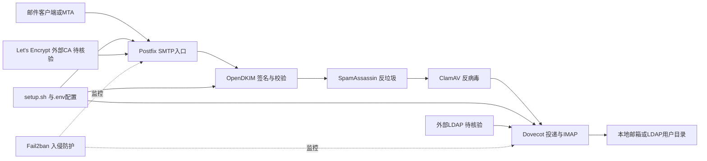

# docker-mailserver/docker-mailserver

## 一句话定位
生产级全栈邮件服务器——SMTP/IMAP/LDAP/反垃圾/反病毒一体化，运行在 Docker 容器内，配置简单、功能完整、开箱即用。

## 它解决的问题
自建邮件服务器一直是出了名的困难：需要配置 Postfix/Dovecot/SpamAssassin/ClamAV/OpenDKIM 等多个组件，还要处理 DNS（MX/SPF/DKIM/DMARC）、IP 信誉、反垃圾等复杂问题。docker-mailserver 将所有组件打包到一个 Docker 镜像中，通过环境变量和配置文件统一管理，让自建邮件服务器的门槛大幅降低。

## 为什么值得关注
- **Stars:** 18,677 stars，自建邮件服务器领域绝对头部
- **Forks:** 2,038
- **Shell 实现**，轻量级，资源占用低
- **生产级**：被大量企业实际用于生产环境
- **全栈覆盖**：SMTP+IMAP+反垃圾+反病毒+Web 管理界面
- **Kubernetes 友好**：支持 k8s 部署
- 持续活跃维护（2026-08-03）

## 热度来源判断
- **自托管/数据主权趋势（高）**：隐私意识推动自建基础设施
- **邮件基础设施刚需（高）**：每个组织都需要邮件服务
- **Docker 简化复杂系统（高）**：将最难的系统容器化
- **长期积累（高）**：运营多年，口碑稳定

## 关键技术亮点亮点
1. **一体化容器**：Postfix+Dovecot+SpamAssassin+ClamAV+OpenDKIM+Fail2ban 在一个镜像
2. **环境变量配置**：通过 .env 和 docker-compose 统一配置
3. **setup.sh 管理**：命令行工具管理用户、别名、SSL 证书
4. **K8s 支持**：提供 Helm chart，支持容器编排部署
5. **安全加固**：Fail2ban 防暴力破解，自动 SSL（Let's Encrypt）
6. **LDAP 支持**：企业级身份认证集成

## 架构师速览

| 决策问题 | 研究判断 | 证据边界 |
|---|---|---|
| 系统边界 | 单一 Docker 镜像承载 Postfix/Dovecot/SpamAssassin/ClamAV/OpenDKIM/Fail2ban，配合 setup.sh 与 .env；对外暴露 SMTP/IMAP/管理面，对内依赖 LDAP、Let's Encrypt 等可选外部身份与证书源 | 组件清单来自档案"关键技术亮点"；具体端口、镜像分层与 LDAP/ACME 流程未在档案中给出 |
| 主路径 | 邮件流入：SMTP 接收 → OpenDKIM 签名校验/签发 → SpamAssassin + ClamAV 过滤 → Dovecot 投递；管理面：setup.sh/.env → 容器内配置重生成 → Postfix/Dovecot 重载 | 主链路来自档案组件枚举；DKIM 私钥管理、Quarantine 与 LDAP 绑定细节属待核验 |
| 关键权衡 | "一体化镜像降低运维门槛" vs "多组件耦合使升级/扩容粒度变粗"，并叠加 IP 信誉、合规(GDPR)与 Fail2ban 默认策略带来的安全责任自负 | 权衡描述基于档案"风险/局限"与"架构启发"；未涉及具体资源占用、SLO、HA 拓扑 |
| 最小 PoC | 单节点 docker-compose 拉起镜像，跑通 SMTP 发送/IMAP 接收、DKIM 签发、SpamAssassin/ClamAV 扫描与 Let's Encrypt 自动证书；验收包含 DNS(MX/SPF/DKIM/DMARC)、IP 信誉观测、备份/恢复与升级路径 | 起步范围限定在档案明确列出的能力；k8s/Helm 部署、多节点与 LDAP 全量集成属下一阶段，待核验 |

## 架构启发
- **容器化复杂系统**：多组件系统可以通过精心设计的镜像简化部署
- **配置即代码**：所有邮件服务器配置通过文件管理，可版本化
- **安全默认**：Fail2ban/SSL/反垃圾默认开启

## 架构图（MMD）

> 证据边界：此图只采用本档案已有可核验描述；“待核验”节点不应视为项目实现事实。

## 定位判断
**成熟基础设施型项目**。自建邮件服务器的事实标准。不是热点项目，但是基础设施领域的稳定赢家。

## 风险/局限/泡沫点
- **IP 信誉问题**：自建邮件服务器最大挑战是 IP 被标记为垃圾邮件源
- **维护复杂度**：虽然简化了部署，但邮件服务器运维仍然复杂
- **云邮件竞争**：AWS SES、Google Workspace、Microsoft 365 更省心
- **安全责任**：自建意味着安全漏洞自己承担
- **合规要求**：GDPR 等法规对邮件服务器有额外要求

## 与同类项目的关系
- **vs Mailcow**：Mailcow 更重（含 Web 界面和 SOGo），docker-mailserver 更轻量
- **vs Mailu**：Mailu 也是 Docker 邮件服务器，功能类似
- **vs Poste.io**：Poste.io 有商业版，docker-mailserver 纯开源
- **vs AWS SES/Google Workspace**：托管服务 vs 自托管，各有适用场景

## 是否值得持续跟踪
**推荐关注（运维/架构师）。** 作为自建邮件基础设施的标杆，值得了解其架构设计。日常使用直接采用即可。

## 后续观察点
- DMARC/ARC 等新邮件安全标准的支持
- 是否增加 AI 驱动的反垃圾能力
- Kubernetes 部署的企业案例
- 与云邮件服务的竞合（是否有混合部署模式）
- 社区维护团队的可持续性

---
> 数据来源: GitHub API (2026-08-03) | Stars: 18,677 | Forks: 2,038 | 语言: Shell
