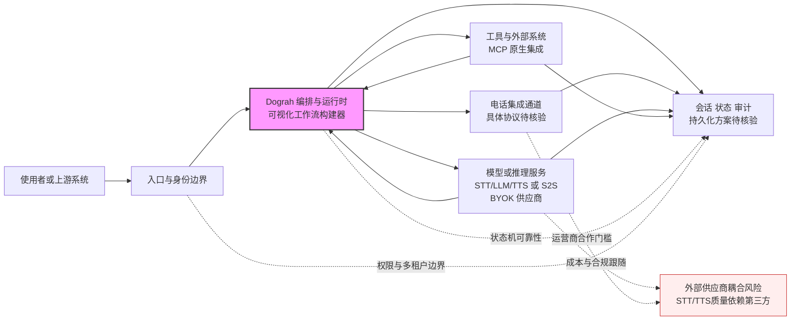

# Dograh — 开源语音 AI 平台

## 一句话定位

开源语音 AI 平台，Vapi/Retell 的自托管替代，支持 STT/TTS/LLM 工作流可视化构建器，MCP 原生，电话集成。

## 它解决的问题

语音 AI 部署目前依赖 Vapi/Retell 等闭源 SaaS，数据隐私、成本、定制能力都受限。企业需要自托管方案。

## 为什么值得关注

1. 定位精准：Vapi/Retell 的直接开源替代
2. 可视化工作流构建器降低使用门槛
3. MCP 原生 — 与 Agent 生态集成
4. 支持电话集成，企业场景刚需

## 热度来源判断

- 4.1K stars，周增量 +1.3K，增长健康
- 语音 AI 赛道热度 + 自托管需求
- BYOK（Bring Your Own Key）模式吸引企业用户

## 关键技术亮点亮点

1. **可视化工作流构建器**：拖拽式构建语音 AI 流程
2. **MCP 原生**：与 AI Agent 生态无缝集成
3. **多协议支持**：Speech-to-Speech 或 LLM/STT/TTS 组合
4. **电话集成**：真实业务场景（客服、外呼）
5. **BYOK**：自带模型 API Key，成本可控

## 架构师速览

| 决策问题 | 研究判断 | 证据边界 |
|---|---|---|
| 系统边界 | Dograh 是一个自托管的编排平台，在用户呼入、电话渠道、外部 LLM/STT/TTS 供应商与 MCP 工具/数据源之间做流程串联与状态管理 | 档案仅证实 voice-ai / self-hosted / speech-to-speech / telephony / mcp 标签及"工作流构建器 + 电话集成 + BYOK"表述；具体运行时、数据库、传输协议未披露 |
| 主路径 | 语音输入 → 入口/身份 → 可视化工作流编排 → STT/LLM/TTS 或 S2S 模型调用 → 可选 MCP 工具调用 → TTS 回放/电话通道 → 会话/审计日志 | 路径顺序来自档案"语音 AI 典型架构"与亮点描述；具体节点失败处理、重试与回退机制、状态持久化方案档案未说明 |
| 关键权衡 | 扩展性/易用性（拖拽工作流、MCP 生态） vs. 抽象泄漏（依赖第三方 STT/TTS、电话运营商、LLM 供应商，BYOK 意味着账号/成本/合规跟随供应商） | 权衡基于档案"语音质量依赖底层 STT/TTS""电话集成需要运营商合作""BYOK 模式"等定性表述；无性能、可用性或耦合度量化数据 |
| 最小 PoC | 单路电话/网页入口 + 1 个 LLM + 1 个 STT + 1 个 TTS + 1 个 MCP 工具，启用可审计日志与额度告警，验证延迟、成本、退出路径与电话通道稳定性 | PoC 选型来自档案"先在单一渠道、最小工具权限和可审计日志下验证"；具体通道 SIP/WebRTC、模型清单、监控指标档案未给出，需源码核验 |

## 架构启发

语音 AI 平台的典型架构：
```
用户语音 → STT → LLM → TTS → 语音输出
              ↓
          工作流引擎
              ↓
          MCP Tools
```

Dograh 把这条链路产品化了，加上可视化编辑和电话集成。

## 架构图（MMD）

> 证据边界：此图只采用本档案已有可核验描述；“待核验”节点不应视为项目实现事实。



## 定位判断

**工具型 → 平台候选。** 如果能建立语音 AI 开源生态，有平台化潜力。

## 风险/局限/泡沫点

- Vapi/Retell 功能更成熟，Dograh 需要快速追赶
- 语音质量依赖底层 STT/TTS 模型
- 电话集成需要运营商合作，门槛不低
- 4K stars 规模还小，需要验证可持续性

## 与同类项目的关系

- 直接对标 Vapi/Retell（闭源 SaaS）
- 与 VoxCPM 互补：VoxCPM 提供模型，Dograh 提供平台
- 与 FunASR 不同层：FunASR 是 ASR 引擎，Dograh 是完整平台

## 是否值得持续跟踪

**是。** 企业语音 AI 部署的刚需，自托管趋势明确。

## 后续观察点

1. 工作流构建器的易用性和灵活性
2. 电话集成的稳定性和覆盖范围
3. 社区和企业用户增长
4. 与其他语音模型（VoxCPM、MOSS-TTS）的集成深度
