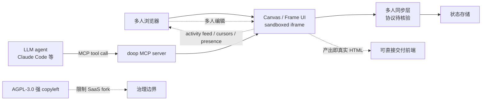

# kgoedecke/doop

## 一句话定位
[Paper.design](https://paper.design) 的开源替代品——一个**多人实时设计画布**，让"人类 + AI agent 在同一 Canvas 上协同设计"成为新常态：每个 Frame 是 sandboxed iframe 渲染的真实 HTML，agent 通过内置 MCP server 流式编辑，所有人都能实时看到光标 / presence / 帧编辑 / agent 状态 / activity feed。

## 它解决的问题
现有设计协作工具（Figma / Paper / FigJam）主要为人与人协作设计，"AI agent"被当作"另一种用户" 还要用户主动复制粘贴结果。doop 反过来:**agent 与人享有同一套 presence / activity feed**，实时在画布上呈现改动。这一设计哲学层面变化的意义：agent 不再是被召唤的工具，而是 canvas 上"一种持续存在的协同者"。同时，**每个 Frame 是真实 HTML**（不是设计稿的抽象表达）——这意味着"产出的设计可以直接 deliver 给前端"，而非仅作为参考。

## 为什么值得关注（2026-08-24）
- **2 天 148⭐**（GitHub API 可核验）：设计 / 协作工具赛道 2 天 148 星的增速突出
- **License: AGPL-3.0**：强 copyleft——保护开源，但对 SaaS fork 有传染性
- **完整工程化模板**：Dockerfile + `.env.example` 4.6KB + husky + commitlint + CLA.md + CODE_OF_CONDUCT.md + CONTRIBUTING.md + SECURITY.md——真正的开源项目治理模板
- **AG-UI / MCP 双协议兼容**：topics 含 mcp、mcp-server、ag-ui、design-tool——是"agent × 协作工具"的双协议示范
- **README 给出清晰的"Paper.design 替代品"定位**：用户群明确

## 热度来源判断
doop 的热度来自**协作设计 + agent 普及的同期拐点 + 开源空白**的组合：(1) Paper.design / tldraw 等设计工具在 2026 年继续被关注，但开源替代品极少；(2) AI agent 进入工作流是产业级共识，但"agent-aware 协作工具"尚属空白；(3) MCP 协议在 8-23 / 8-24 被多个垂直项目采纳，doop 是其中唯一聚焦"协作 UI"的。三点叠加在短期内迅速聚集关注。需注意：设计工具的市场进入门槛极高，AGPL-3.0 限制 SaaS 商业 fork，但**作为企业内部私有部署是可行路径**。

## 关键技术亮点
1. **每 Frame 是 sandboxed iframe 渲染真实 HTML**："设计即产出"——agent 生成的设计可直接 deploy
2. **内置 MCP server**：任何 MCP 兼容 agent（Claude Code / Cursor 等）连接后即可在 Canvas 上编辑
3. **多人 + agent 共享一套 presence / activity feed**：是人 / 人在同一个实时交互层
4. **完整开源治理模板**：CLA.md / CODE_OF_CONDUCT.md / CONTRIBUTING.md / SECURITY.md 是模板级规范
5. **Docker + .env.example 一键启动**：开发者 onboarding 摩擦低
6. **AGPL-3.0 强 copyleft**：保护派生作品开源——这是软件自由层面的强姿态

## 架构师速览

| 决策问题 | 研究判断 | 证据边界 |
|---|---|---|
| 系统边界 | 自托管的多人协作设计服务；前端画布 + 后端多人同步；通过 MCP 暴露 agent 编辑接口 | 边界由 README "Multiplayer design canvas"、"MCP built in" 描述确认；具体后端实现（WebSocket / CRDT / Yjs 等）未在档案中明示 |
| 主路径 | 用户在浏览器打开 Canvas → 创建 Frame（HTML iframe）→ 编辑 / 多人同步状态 → agent 通过 MCP 工具调用流式编辑 Frame HTML → 其他用户实时看到改动 + 活动 feed | 主路径由 README "designs in sandboxed iframes"、"agents edit through the built-in MCP server"、"streaming their designs in live" 描述确认；同步 CRDT 库、活动 feed 数据结构是推断 / 待核验 |
| 关键权衡 | 设计工具实时协作 vs 性能（Cursors 多时同步成本）；AGPL-3.0 vs SaaS 商业 fork 限制；agent 内置 vs 第三方插件（更通用但易碎片化） | 权衡取舍由 README "live cursors, presence, per-frame edits" 与 AGPL-3.0 描述确认；具体一致性与性能基准未在档案中给出 |
| 最小 PoC | clone + docker compose up → 浏览器打开 Canvas → 创建 Frame 编辑 HTML → 用 mcp-cli 或 Claude Code 连接到 doop MCP → 让 agent 修改 Frame 内容并实时在画布看到改动 | PoC 流程由 README 一键启动描述推导；具体 mcp-cli 配置、Frame 创建流程未在档案中明示 |
| 证据边界 | 仓库公开 metadata + README + Dockerfile + .env.example；后端多人同步协议、性能基准、安全审计策略均为推断 / 待核验 | 仅核验已核验事实，其他来自语义推断 |

## 架构图（MMD）

> 证据边界：此图只采用本档案已有可核验描述；"待核验"节点不应视为项目实现事实。

## 架构启发
doop 的核心启发是 **"agent 是 canvas 上的另一种用户，而不是被召唤的工具"**。这种产品哲学层面决策的影响极深：一旦 agent 被看作"持续存在的协同者"，整套产品 UX（presence / activity feed / cursors）都要重新设计。doop 把这个理念直接做进了产品——agent 改 Canvas 时**所有人都能看到 activity feed 提示"AI 正在编辑"**。更深层的启发：**"设计工具 + AI"的真正机会不是"AI 自动设计"，而是"人类 + AI 共同设计"**——这与 doop 的开源 + 强 copyleft 哲学是一致的：越多人 fork，越多"人类 + AI 共同设计"成为行业共识。

## 定位判断
**开源 AI-native 设计画布候选。** 在 "AI agent × 协作设计" 这条赛道，doop 是当前开源侧关注度最高的项目（148⭐/2 天，topics 含 ag-ui、mcp、design-tool、multiplayer）。它与 Paper.design / tldraw 是同类定位，但**agent-aware 是其差异化**；与商业产品（Figma AI、Framer AI、Magnific 等）的差异是"agent 是 canvas 的一等用户"——商业产品把 AI 当作"用户的工具"，doop 把 AI 当作"用户的同事"。**对企业 IT**：是观察"AI native 设计工具"是否形成开源主导的事实标准的关键样本。

## 风险 / 局限 / 泡沫点
- **AGPL-3.0 的传染性**：任何 fork / 派生若作为 SaaS 提供，必须同样 AGPL-3.0 开源——这对希望二次商业化的开发者是限制；但**对企业内部自托管是友好**
- **多人协作技术的成熟度门槛**：自托管多人协作（WebSocket / CRDT / Yjs 等）的稳定运营门槛远超单人工具，doop 短期内能否在生产规模被验证是关键
- **设计工具市场进入门槛极高**：Figma / Sketch / Adobe 已有强用户黏性，"1 个开源版本"很难直接撬动
- **agent 设计质量评判标准未公开**："agent 自审"具体阈值、截图对比、接受 / 拒绝循环等细节均待核验
- **跨 Frame 一致性挑战**：每个 Frame 是独立 iframe，但设计系统一致性（颜色、字体、间距）的"智能校正"能力未在档案中明示
- **早期阶段风险**：README 给出"beta-level positioning"，功能集与稳定性需进一步迭代

## 与同类项目的关系
- **vs Paper.design / tldraw / Figma**：同类定位，doop 差异化在"agent-native + 开源"
- **vs Figma AI / Framer AI / Magnific**：商业产品的"AI 设计助手" 路线，doop 是开源替代
- **vs scroll-craft（8-24 同期）**：scroll-craft 是"Claude Code skill + 自截图验证" 单点 skill；doop 是"协作画布 + MCP" 多用户工具——互补
- **vs NorthCinder / x64dbg-mcp-server（8-24 同期）**：三者都走 MCP 协议，但垂直领域不同
- **vs wshobson/agents**：wshobson 是聚合 skill 市场；doop 是单一垂直应用——不冲突

## 是否值得持续跟踪
**值得中高频跟踪（AI-native 协作工具样板）。** 对设计团队 / 创业公司：值得尝试在内部团队做小规模试点——尤其当团队已经在用 Claude Code / Cursor 时；对企业 IT 决策者：**是观察"开源设计工具 + agent"组合能否撕开市场的关键样本**，且 AGPL-3.0 让内部私有部署无法律风险；对产品经理：doop 与 tldraw / Figma 等对照，是"agent-native 协作" 的开源形态学示范。

## 后续观察点
- 多用户实时同步的稳定性与性能基准
- "agent 自审"质量保证机制的具体实现
- Frame 一致性（设计系统）的智能校正能力
- 是否有商业版 / SaaS 计划（受 AGPL-3.0 限制）
- 与设计系统库（如 Tokens Studio）的集成

---
> 数据来源: GitHub API (2026-08-24) | Stars: 148 | Forks: 12 | License: AGPL-3.0 | 语言: TypeScript | 创建: 2026-08-22
