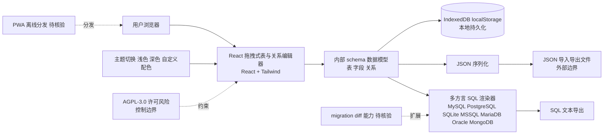

# drawdb

## 一句话定位
免费的浏览器端数据库 ER 图编辑器与 SQL 生成器——拖拽建表，零依赖、IndexedDB 本地存储，导出 MySQL / PostgreSQL / SQLite / MSSQL / MariaDB / Oracle / MongoDB SQL。

## 它解决的问题
传统 ER 图工具（draw.io、DbSchema、MySQL Workbench）要么安装包巨大，要么绑定账号，要么导出有水印，要么离线能力差。drawdb 在浏览器中提供：
- 全部本地存储，无需后端（IndexedDB / localStorage）
- 拖拽式建表 + 关系连线
- 一键生成多方言 SQL
- 即时导入/导出 JSON / SQL

## 为什么值得关注（2026-08-15）
被 daily/2026-08-15.md 选为今日可视化工具重点。在 SQL-first / ORM-first 工具（如 Prisma、Drizzle Studio）流行的同时，drawdb 转向"轻量前端 ER 工具"补位——比 Prisma Studio 更通用，比 DBeaver 轻量。

## 热度来源判断
热度来源是 **"Web 化工具栈刚需 × 永久免费零账号定位"**。39,187 stars 在约 2 年（2023-07 创建）的周期下成立，属于快速增长的工具型项目。AGPL-3.0 + 完全本地存储明确去 SaaS 化立场，与 SaaS 类 DB 工具形成差异。

## 关键技术亮点
1. **100% 浏览器:** 无服务端，IndexedDB 存储，所有操作离线可用
2. **SQL 多方言导出:** MySQL / PostgreSQL / SQLite / MSSQL / MariaDB / Oracle / MongoDB
3. **拖拽关系编辑器:** 一对一、一对多、多对多自动处理外键
4. **主题切换:** 浅色 / 深色 + 自定义配色
5. **JSON 导入导出:** 支持 schema 序列化与恢复

## 架构师速览

| 决策问题 | 研究判断 | 证据边界 |
|---|---|---|
| 系统边界 | 浏览器端单层 JS 应用，无服务端；数据仅落 IndexedDB / localStorage，外部边界只有用户浏览器与可选的 JSON/SQL 导入导出文件 | 档案明列"100% 浏览器、IndexedDB 存储、无后端"，未披露 PWA Service Worker、网络协议或同步机制 |
| 主路径 | 用户拖拽 → React 表/关系编辑器 → 内部 schema 模型 → 多方言 SQL 渲染器 → 导出（SQL/JSON）或 IndexedDB 落盘 | 主路径四段在档案中均有字面支撑；关系自动外键生成、主题切换、JSON 序列化属于确认点，迁移/diff 路径档案未证实 |
| 关键权衡 | (1) AGPL-3.0 copyleft vs 企业内嵌；(2) IndexedDB 容量上限 vs 大型 schema；(3) 离线零成本 vs 缺协作/版本控制；(4) 跨方言广度 vs 单方言深度 | 前两条档案明列；后两条由"无后端 + 零账号 + 跨方言"定位可推断，但同步/协作机制档案未证实 |
| 最小 PoC | 离线打开 drawdb.app，拖拽建 3~5 张表 + 1 对多关系，导出 PostgreSQL 与 SQLite 双方言 SQL 并在各自 CLI 中执行；再用 JSON 导入恢复，验证 IndexedDB 与序列化闭环 | PoC 步骤均在档案"SQL 多方言导出""JSON 导入导出""IndexedDB 本地存储"覆盖范围内；协作、migration、SQL 兼容性深度未验证 |

## 架构启发
"无后端 + IndexedDB + Web 即应用"的取向展示了一个反 SaaS 路线——把工具完全交给浏览器，通过 PWA 完成分发，未来不依赖任何服务器即可永久运行。

## 架构图（MMD）

> 证据边界：此图只采用本档案已有可核验描述；“待核验”节点不应视为项目实现事实。

## 定位判断
**工具型 / 可视化建表工具标杆（Web 端）。** 39k stars 反映开发者社区对"轻量前端 ER 工具"的真实需求。它不太可能挑战 Prisma Studio / DBeaver 等专业工具，但会稳定占据"快速画图"场景。

## 风险 / 局限 / 泡沫点
- **AGPL-3.0 严格 copyleft:** 自托管 fork 后对外服务也需开源
- **深度有限:** 数据库迁移、复杂关系/索引管理仍需专业工具
- **同质化压力:** 与 draw.io / Excalidraw 等通用画图工具功能重叠
- **IndexedDB 容量:** 大型 schema（100+ 表）可能超 IndexedDB 配额

## 与同类项目的关系
- **vs draw.io:** draw.io 通用画图；drawdb 专做数据库 ER，自动生成 SQL 更高效
- **vs Prisma Studio:** Prisma Studio 绑定 Prisma；drawdb 跨方言跨 ORM
- **vs DBeaver:** DBeaver 是桌面端重型工具；drawdb 浏览器轻量
- **vs dbdiagram.io:** dbdiagram 是 DSL 文本式；drawdb 拖拽更直观

## 是否值得持续跟踪
**值得日常使用（轻量 Web ER 工具），跟踪价值中等。** 推荐给前后端开发者用于快速建表。其增长曲线稳定，不太可能成为下一波热点，但也不会衰退——典型"长青"型工具。

## 后续观察点
- 是否增加 migration / diff 能力（覆盖更深的 schema 工作流）
- PWA 离线模式是否被更多用户采纳
- 与 Drizzle Studio、Prisma Studio 等的差异化（避免同质化）
- AGPL 协议在企业用户中的接受度

---
> 数据来源: GitHub API (2026-08-21) | Stars: 39,187 | Forks: 3,193 | License: AGPL-3.0 | 语言: JavaScript | 创建: 2023-07-16
