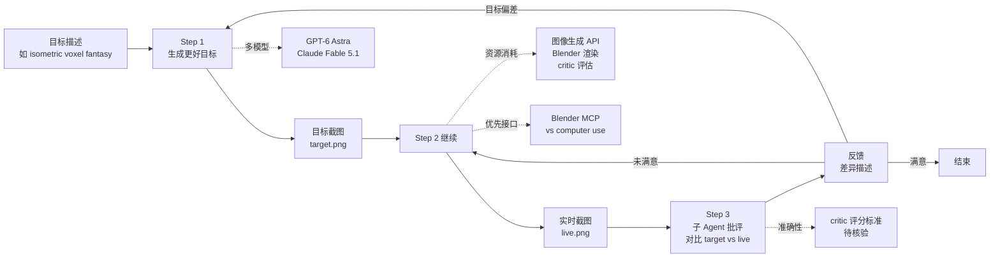

# achimala/dream-loop

## 一句话定位
Agent Skill for impressive 3D visuals——闭循环：图像生成"梦想"目标 → 建模 → **子 Agent 批评对比** → 循环改进 → 可选回到目标生成；1 天 121⭐，fork 19（fork/star **15.7%**），Markdown。

## 它解决的问题
2026 年 AI 3D 内容生成（Holocard / Three.js / Blender）的痛点是：(a) **单 Agent 生成质量不稳**——同一 prompt 不同时间生成质量差异大；(b) **无自我批评**——失败时 Agent 不会自我察觉；(c) **目标与现实脱节**——用户描述的目标与实际渲染的差异无法量化对比。`dream-loop` 直击这三点：(a) **闭循环改进**——图像生成目标 → 建模 → 批评 → 循环；(b) **子 Agent 批评**——单独的 critic Agent 对比目标截图与实时截图，提供反馈；(c) **目标动态演化**——可选回到 step 1 生成"更好的目标"。

## 为什么值得关注
- **Stars:** 121（截至 2026-09-08），1 天净增，单日均速 ~121⭐/day
- **Forks:** 19（fork/star **15.7%**，远高于 magnitude 7.2% / fastpotify 4.4%）
- **语言:** Markdown 主导（Skill 内容是结构化文档）
- **项目年龄:** 1 天（创建 2026-09-07）
- **核心差异:** 闭循环 + 子 Agent 批评 + 目标动态演化

## 热度来源判断
`dream-loop` 的热度来自三个因素：(1) **AI 3D 内容质量需求**——3D 视觉（游戏 / 应用 / 场景）是 2026 年热门赛道；(2) **子 Agent 批评模式创新**——把"批评者"作为独立 Agent 是 Agent 协作的新模式；(3) **闭循环自纠**——传统 AI 生成是"一次性"，dream-loop 是"循环改进"。

1 天 121⭐ / fork 19（fork/star 15.7%）的组合反映 **"AI 3D 内容质量 + 子 Agent 批评 + 闭循环"** 三者叠加。

## 关键技术亮点
1. **闭循环改进:** 5 步循环——(1) AI 梦想目标 → (2) AI 建模 → (3) 子 Agent 批评 → (4) 循环回到 step 2 → (5) 可选回到 step 1 生成更好的目标
2. **子 Agent 批评:** 单独的 critic Agent 对比目标截图与实时截图，提供反馈——把"批评"作为独立 Agent
3. **目标动态演化:** "Optionally, AI loops back to step 1 and dreams up an even better target based on the current state"——目标随实际进展调整
4. **多模型支持:** README 注明"At the moment this is only tested with GPT-6 Astra in Codex. Other strong models like Claude Fable 5.1 can likely work too"——支持 GPT-6 Astra / Claude Fable 5.1
5. **图像生成 + 视觉输入:** "AI with vision input"——支持图像生成（Imagen / DALL-E）+ 视觉输入（截图对比）
6. **Blender MCP 优先:** "Install Blender if you want custom 3D modeling. The Blender MCP or scripting interface is preferred to computer use"——Blender MCP 是优先接口

## 架构师速览

| 决策问题 | 研究判断 | 证据边界 |
|---|---|---|
| 系统边界 | Agent Skill 层 + 闭循环架构（图像生成 + 建模 + 子 Agent 批评）；关键是"循环改进"vs"一次性生成" | 边界由 README 明示；具体子 Agent 批评的实现（视觉对比 / 评分机制）需 README 核验 |
| 主路径 | 图像生成"梦想"目标 → Blender MCP 建模 → 子 Agent critic 对比 → 反馈 → 循环改进 | 主路径为 README 语义抽象；具体 critic 的评分标准（视觉相似度 / 主题契合度）需 README 核验 |
| 关键权衡 | 闭循环的资源成本（vs 一次性生成）vs 质量提升；子 Agent 批评的准确性（vs 噪声反馈）；目标动态演化的稳定性（vs 漂移） | README 列出 5 步循环；具体资源消耗（API 调用次数 / Blender 渲染时间）需 benchmark |
| 最小 PoC | Codex 安装 Skill → 输入"Build a graphics demo: isometric camera, voxel-ish art style, fantasy setting, Three.js >60fps" → 观察闭循环 → 子 Agent 批评反馈 → 循环直到 critic 满意 | PoC 范围由 README "Example" 推导；具体循环次数与质量提升关系需 benchmark |

## 架构启发
`dream-loop` 的核心启发是 **"AI 3D 内容生成的闭循环 + 子 Agent 批评"**。传统 AI 3D 内容（Holocard / Runway / Sora）是"一次性生成"——质量靠 prompt 工程；dream-loop 把生成变成 **"循环改进"**——每轮都有 critic 反馈，质量随循环次数提升。

更深层的启发是 **"批评者作为独立 Agent"**——把"批评"作为独立 Agent（而非主 Agent 的内置模块）是 Agent 协作的新模式：批评者可以独立训练 / 独立升级 / 独立评估。

风险提示：**闭循环的资源成本**——每轮都需要图像生成 + Blender 渲染 + critic 评估，API 成本不可忽视；**critic 的准确性**——critic 是否真的能区分"好的 3D 内容"vs"坏的 3D 内容"需要 benchmark；**目标漂移**——动态演化目标可能导致循环不稳定。

## 架构图（MMD）

> 证据边界：此图只采用本档案已有可核验描述；"待核验"节点不应视为项目实现事实。

## 定位判断
**工具型项目（AI 3D 内容闭循环生成 Skill），向"AI 自我批评 / 自我改进"演进。** `dream-loop` 不仅是一个 3D 生成 Skill，更是 Agent 协作"批评者作为独立 Agent"模式的样本。1 天 121⭐ / fork/star 15.7% 已显示初步采用。当前定位是"AI 3D 内容闭循环生成头部样本"，向"AI 自我批评 / 自我改进"演进是合理路径。

## 风险/局限/泡沫点
- **闭循环的资源成本:** 每轮都需要图像生成 + Blender 渲染 + critic 评估，API 成本不可忽视；1 小时时间限制的 demo 质量受循环次数限制
- **critic 的准确性:** critic 是否真的能区分"好的 3D 内容"vs"坏的 3D 内容"需要 benchmark；视觉相似度评分未必与人类审美一致
- **目标漂移:** 动态演化目标可能导致循环不稳定——目标在调整时可能偏离用户原始意图
- **模型兼容性:** 仅测试 GPT-6 Astra + Claude Fable 5.1，其他模型（GPT-5 / Claude Opus / Gemini）兼容性需要测试
- **1 天新项目风险:** achimala 是新 GitHub 账号，项目可持续性未验证
- **"impressive 3D visuals" 的主观性:** "impressive" 是主观概念，dream-loop 的 critic 标准是否对齐用户期望需要 benchmark

## 与同类项目的关系
- **vs EverettFish/holo-card-studio (9-08, 779⭐):** holo-card-studio 是固定 4 层流水线（一次性生成）；dream-loop 是闭循环（多次改进）——一次性 vs 循环
- **vs Tejashmakwana/astra-chatgpt-hyperframes (9-08, 130⭐):** hyperframes 是参考保留 + JS 替换；dream-loop 是从零生成 + 循环改进——参考保留 vs 零生成
- **vs OpenAI Sora / Runway / Pika:** 商业化 AI 视频生成（一次性）；dream-loop 是开源闭循环——商业 vs 开源
- **vs Anthropic Computer Use:** Computer Use 是 GUI 自动化；dream-loop 是 3D 内容生成——领域不同
- **vs 子 Agent 协作模式（wshobson/agents 等）:** wshobson/agents 是 multi-agent 框架；dream-loop 是 critic 作为子 Agent——框架 vs 单一 Skill

## 是否值得持续跟踪
**值得跟踪（AI 3D 内容闭循环生成头部样本）。** `dream-loop` 代表了 AI 3D 内容生成从"一次性"升级到"循环改进"的方向，与子 Agent 批评 + 目标动态演化 + 1 天 121⭐ 共同构成新方向。建议关注：(a) 闭循环的资源成本 vs 质量提升；(b) critic 准确性的 benchmark；(c) "批评者作为独立 Agent"模式是否扩展到其他领域；(d) 与 holo-card-studio / hyperframes 的竞争。对 AI 3D 内容创作者，dream-loop 是循环改进的开源方案。

## 后续观察点
- 闭循环的资源成本 vs 质量提升关系
- critic 准确性的 benchmark（视觉相似度 vs 人类审美）
- "批评者作为独立 Agent"模式的扩展（其他领域应用）
- 模型兼容性扩展（GPT-5 / Claude Opus / Gemini）
- 与 holo-card-studio / hyperframes 的功能差异化
- "AI 自我批评 / 自我改进"模式是否成为新范式

---
> 数据来源: GitHub API (2026-09-08) | Stars: 121 | Forks: 19 | License: 待核验 | 语言: Markdown | 创建: 2026-09-07
