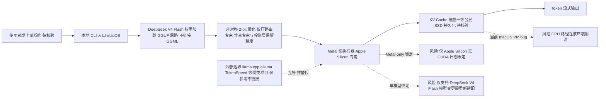

# ds4.c

## 一句话定位
antirez（Redis 作者）开发的 DeepSeek V4 Flash Metal 专用本地推理引擎，用 2-bit 量化让 284B 模型在 128GB MacBook 上可运行，KV Cache 持久化到磁盘。

## 它解决的问题
大模型本地推理的"不可能三角"：模型质量 vs 内存需求 vs 推理速度。
- 284B MoE 模型通常需要多卡 GPU
- 现有量化方案（4-bit/8-bit）对 MoE 模型压缩比不够
- 本地推理的 KV Cache 内存占用随上下文长度爆炸

ds4.c 的解法：极致特化（只跑一个模型）+ 极致量化（MoE 专家 2-bit）+ KV Cache 磁盘持久化。

## 为什么值得关注（2026-05-08）
antirez 出品，品质保证。更重要的是它代表了本地推理的一个极端方向：**不做通用框架，只做单一模型的极致优化**。2-bit 量化在 MoE 模型上的工程实践（只量化路由专家，保留共享专家和投影层）是值得学习的技术。

KV Cache 磁盘持久化是一个被忽视但极具价值的创新：MoE 模型的 KV Cache 极度压缩，可以作为"磁盘一等公民"而非仅存在于 RAM。

## 热度来源判断
- antirez 个人品牌效应（Redis 作者）
- "128GB MacBook 跑 284B 模型"的标题效应
- GPT 5.5 辅助开发的透明声明引发讨论
- 2.3K stars 在 3 天内，增速超出预期，说明本地推理需求强烈

## 关键技术亮点亮点
1. **非对称 2-bit 量化**：只量化 MoE 路由专家（up/gate 用 IQ2_XXS，down 用 Q2_K），共享专家和投影层保持原始精度
2. **KV Cache 磁盘持久化**：利用 DeepSeek V4 的压缩 KV Cache + 现代 MacBook SSD 速度，KV Cache 作为磁盘一等公民
3. **Metal 专用实现**：不做通用 GGUF 加载器，Metal 图执行器专门为 DeepSeek V4 Flash 优化
4. **性能数据**：MacBook Pro M3 Max 128GB 短 prompt 26.68 t/s，Mac Studio M3 Ultra 512GB 36.86 t/s

## 架构师速览

| 决策问题 | 研究判断 | 证据边界 |
|---|---|---|
| 系统边界 | ds4.c 是一个针对 DeepSeek V4 Flash 的 Apple Silicon（Metal）专用本地推理 C 程序，边界由“单模型 + Metal-only + macOS”三重硬约束共同划定，不替代 llama.cpp 等通用加载器。 | 仅基于档案描述的运行平台（macOS / Metal）与单模型声明；未给出支持的 macOS 版本范围、Metal API 版本或最低 OS 版本。 |
| 主路径 | 单模型权重读取（GGUF 思路但不链接 GGML）→ 非对称 2-bit 量化解码 → Metal 图执行器前向 → KV Cache 优先落到磁盘 SSD → token 流式输出；KV Cache 持久化被视为“磁盘一等公民”。 | “Metal 专用图执行器”与“KV Cache 磁盘一等公民”来自档案定性表述，具体读写协议、序列化格式、SSD 写入路径未在档案中给出。 |
| 关键权衡 | 以“极致特化”换取质量：只压路由专家（up/gate IQ2_XXS、down Q2_K）而保留共享专家与投影层原始精度；用 Metal-only、单一模型绑定换取在 128GB MacBook 上 26.68 t/s 的短 prompt 速度（Mac Studio M3 Ultra 512GB 达 36.86 t/s）。 | 量化层组合与吞吐数字由档案给出；不同 prompt 长度、batch 大小、上下文长度下的质量/速度曲线未提供；GPU 显存占用、内存峰值与 swap 行为未给出。 |
| 最小 PoC | 在 MacBook Pro M3 Max 128GB 上加载 DeepSeek V4 Flash 权重，跑短 prompt（≤档案提及场景），验证 token/s 是否落在 26.68 t/s 量级、KV Cache 是否按档案所述落到磁盘而非常驻 RAM；并显式验收三项档案风险：CPU 路径在当前 macOS 上的崩溃问题、Metal-only 锁定、以及 antirez 个人项目可持续性。 | 26.68 / 36.86 t/s 为档案单点数据，未给出上下文长度、batch、量化组合的完整测试矩阵；“coding agent 可靠调用工具”仅为 antirez 主张，无独立基准。 |

## 架构启发
ds4.c 的核心哲学是"极致特化"：
- 不是框架，不是通用加载器，是一个模型的极致实现
- 量化策略经过精心设计：哪些层可以激进压缩，哪些不能
- "KV Cache 是磁盘一等公民"的观点可能改变本地推理的内存模型设计

启发：**在端侧推理场景，通用框架可能不如针对特定模型的极致优化**。

## 架构图（MMD）

> 证据边界：此图只采用本档案已有可核验描述；“待核验”节点不应视为项目实现事实。

## 定位判断
个人项目 / 极客工具。不是企业级基础设施，但代表了端侧推理的一个有价值方向。

## 风险 / 屋限 / 泡沫点
1. **Metal-only**：仅支持 Apple Silicon，不支持 CUDA。antirez 说"也许将来"，但不确定
2. **单模型绑定**：只跑 DeepSeek V4 Flash，如果模型更新需要重新适配
3. **CPU 路径有 macOS 内核 bug**：当前 macOS 虚拟内存实现有 bug，运行 CPU 路径会崩溃
4. **个人项目可持续性**：antirez 的兴趣可能转移

## 与同类项目的关系
- **llama.cpp**：ds4.c 明确声明基于 llama.cpp/GGML 的知识基础，但不链接 GGML
- **ollama**：通用本地推理方案，支持多模型但不如 ds4.c 对单一模型极致优化
- **TokenSpeed**：企业级推理引擎，面向 GPU 服务器；ds4.c 面向 Mac 本地——互补

## 是否值得持续跟踪
**有限跟踪。** 技术创新值得关注（2-bit 量化、KV Cache 磁盘持久化），但个人项目定位限制了企业落地价值。关注 antirez 是否继续投入。

## 后续观察点
1. DeepSeek V4 Flash 更新后是否及时跟进
2. CUDA 支持是否实现
3. 2-bit 量化在实际 Agent 场景下的质量表现（antirez 声称"coding agent 可靠调用工具"）
4. 是否出现其他模型（如 Qwen）的类似"极致特化引擎"

---
*首次记录：2026-05-08*

## 最近动态

### 2026-05-13（实测）
- **Stars 实测 8,042** — 断网推演偏差仅 3.6%
- 5 天从 0 到 8K，日增 ~277，Metal + CUDA 双轨推进
- 本地推理赛道分化为三个方向（Metal/CUDA原生 / 轻量终端 / Zig全栈）
- 维持基础设施候选定位

### 2026-05-12
- 连续第三天无外部数据，Star 推演为最后有效轮次

## 最近动态 (2026-05-15)

- **2026-05-15:** 网络受限日，趋势延续分析。基于 05-14 实测数据推算，持续跟踪中。
- Stars 数据为推算值，网络恢复后验证。

---
