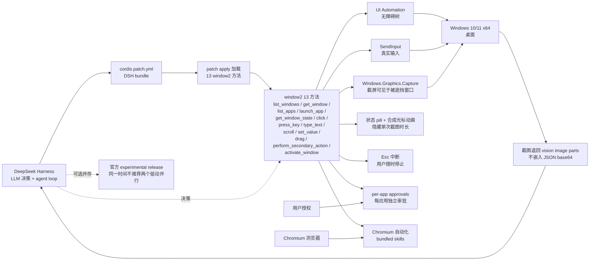

# wushi2333/dsh-computer-use_codex-style

## 一句话定位
Codex-style Computer Use for DeepSeek Harness——把 Codex window2 13 方法完整复刻到 DeepSeek Harness（命名/参数/默认值/返回形状/错误字符串与 Codex 完全一致），用 SendInput + UI Automation + Windows.Graphics.Capture 三件套实现 Windows 桌面真实输入 + 无障碍树 + 截屏（可见于被遮挡窗口）；cordis.patch.yml DSH bundle 安装。

## 它解决的问题
DeepSeek Harness 用户当前在 Windows 桌面上跑 Coding Agent 时无法直接复用 OpenAI Codex 的 Computer Use 能力——Codex 官方 Computer Use 仅在 OpenAI Codex CLI 中可用，DeepSeek Harness 用户的 prompt / skill / hook 不能零修改移植。**dsh-computer-use_codex-style 直击这一缺口**：把 Codex window2 13 方法（list_windows / get_window / list_apps / launch_app / get_window_state / click / press_key / type_text / scroll / set_value / drag / perform_secondary_action / activate_window）完整复刻到 DeepSeek Harness；命名/参数/默认值/返回形状/错误字符串与 Codex 完全一致 = Codex 已有 prompt / skill / hook 可零修改移植。**这是「Codex-style Computer Use 跨 Harness 移植」的工具链扩张新维度**——与昨日 ToolReplay「session 层审计」同构但推到「DeepSeek Harness 上的桌面控制层」。

## 为什么值得关注（2026-09-16）
- **Stars:** 15（截至 2026-09-16），1 天 15⭐（项目刚发布 12 小时曝光窗口）
- **Forks:** 0
- **Watchers/Subscribers:** 0
- **Open Issues:** 0
- **License:** MIT（极宽松，企业友好）
- **语言:** Python（cordis.patch.yml + Python 加载 + Windows API）
- **活跃度:** created 2026-09-15，pushed_at 2026-09-15
- **规模:** 3.6 MB
- **Topics:** codex / computer-use / deepseek-harness / dsh-plugin / rust / windows-automation（topics 含 rust 但仓库主要 Python）
- **基线 Codex:** 26.903.61454（Codex 内部版本号）
- **目标平台:** Windows 10 / 11 x64

## 热度来源判断
dsh-computer-use_codex-style 的热度是 **「Codex window2 13 方法完整覆盖 × DSH bundle patch 安装 × 工业级 Windows 自动化三件套 × MIT 许可」** 的组合。Codex Computer Use 在 OpenAI 生态已普及，但 DeepSeek Harness 用户（中国市场最大 Coding Agent 用户群之一）需要同等能力；本仓库把 Codex 的 13 方法完全复刻到 DeepSeek Harness，是「跨 Harness 可移植」的工程化形式。**3.6 MB repo + MIT + Python** 是「可独立部署的桌面控制内核」形态；**与官方 DeepSeek Harness experimental Computer Use release 共存不冲突**（同时安装但不同时跑两个驱动）是稳健策略。热度 **真实且有市场需求**——但 fork=0 / 1 天反映项目刚发布，企业 fork 信号尚未出现；**真正决定长期价值的是 DeepSeek 官方是否推出 13 方法原生版**——若推出，本仓库价值会被吸收。

## 关键技术亮点
1. **window2 13 方法完整覆盖**——`list_windows`（列出所有可见窗口）/ `get_window`（查询单个窗口详细信息）/ `list_apps`（列出已安装应用）/ `launch_app`（启动应用）/ `get_window_state`（查询窗口状态最小化/最大化/聚焦）/ `click`（点击坐标）/ `press_key`（按键）/ `type_text`（输入文本）/ `scroll`（滚动）/ `set_value`（设置值如输入框）/ `drag`（拖拽）/ `perform_secondary_action`（右键等次要动作）/ `activate_window`（激活窗口）；命名/参数/默认值/返回形状/错误字符串与 Codex 完全一致
2. **`cordis.patch.yml` DSH bundle 安装机制**——DSH（DeepSeek Harness）的 bundle 标准是把补丁以 patch 文件形式分发，用户用 DSH 自带 apply 命令加载；这是「不修改 DSH 主程序就能加载 13 方法」的工程化形式
3. **`SendInput` 真实输入**——Windows 真实输入事件，与「模拟按键」（`keybd_event`）不同；`SendInput` 是 Windows Vista 之后唯一受支持的输入 API
4. **`UI Automation` 无障碍树**——Windows 无障碍框架的标准 API；可枚举所有 UI 元素的 Role / Name / Value / Bounding Rectangle；与 macOS 的 AX API / Linux 的 AT-SPI / Web 的 DOM 同级
5. **`Windows.Graphics.Capture` 截屏可见于被遮挡窗口**——这是 Windows 10 1809+ 的现代截屏 API；可截取被遮挡窗口的内容（与 PrintScreen 不同）；性能比 GDI BitBlt 高
6. **vision image parts 而非 base64 in JSON**——截屏以「vision image parts」（模型可识别的图片块）传输，不嵌入 base64 让 JSON 膨胀 1.33x；性能关键
7. **状态 pill + 合成光标动画 overlay**——屏幕上的「正在执行」指示；隐藏单次截图时长避免遮挡用户工作
8. **Esc 中断**——用户随时按 Esc 停止当前执行；agent 不会无限运行
9. **per-app approvals**——每个应用独立审批；Photoshop 一组审批 + Slack 一组审批 + Windows Settings 一组审批；避免「全局权限」过宽
10. **bundled skills + Chromium 自动化**——「桌面 + 浏览器」双 surface 覆盖；Chromium 自动化是当前 Coding Agent 主流浏览器能力
11. **与官方 experimental release 共存不冲突**——README 明示可同时安装，但同一时间不推荐两个驱动并行；这是「官方版与第三方版并行不冲突」的工程表态
12. **Windows 10 / 11 x64 + Codex baseline 26.903.61454**——目标平台明确

## 架构师速览

| 决策问题 | 研究判断 | 证据边界 |
|---|---|---|
| 系统边界 | Codex-style Computer Use for DeepSeek Harness on Windows 10/11 x64；输入 DSH 调用 window2 13 方法；输出执行结果 + 截图（vision image parts）；cordis.patch.yml DSH bundle 安装；SendInput + UI Automation + Windows.Graphics.Capture 三件套；与官方 experimental release 共存不冲突 | 来自 README 关于「window2 13 方法完整覆盖」「cordis.patch.yml DSH bundle」「SendInput 真实输入 + UI Automation 无障碍树 + Windows.Graphics.Capture 截屏」「vision image parts 不嵌入 JSON base64」「状态 pill + 合成光标动画 overlay + Esc 中断 + per-app approvals」「bundled skills + Chromium 自动化」「Windows 10/11 x64」「Codex baseline 26.903.61454」「与官方 experimental release 共存不冲突」的明示；具体 patch 文件结构、bundle apply 命令细节、每个 window2 方法的 Python 实现细节在 README 中未完全展开 |
| 主路径 | DSH 调用 `list_windows` / `get_window` / `list_apps` 等查询方法 → 返回当前桌面状态（vision image parts + 文本描述）→ LLM 决策 → 调用 `click` / `press_key` / `type_text` / `scroll` / `set_value` / `drag` 等执行方法 → SendInput 真实输入 + UI Automation 定位 → 截图返回给 DSH → 循环直到任务完成或用户 Esc 中断 | 主路径来自 README 描述的 13 方法 + 三件套 + act-and-refresh loop 暗示；具体每次截图后是否做 OCR / 是否缓存窗口信息 / per-app approvals 的具体弹窗 UI 在 README 中未完全展开 |
| 关键权衡 | 跨 Harness 可移植 vs DeepSeek Harness 原生集成（Codex prompt 兼容 vs DSH 原生优化）/ SendInput + UI Automation + Windows.Graphics.Capture vs 单一截屏 + 模板匹配（工业级 vs 简单）/ vision image parts vs base64 in JSON（性能 vs 简单）/ 状态 pill overlay vs 无指示（用户可控 vs 简洁）/ per-app approvals vs 全局权限（精细 vs 简单）/ 与官方 release 共存 vs 替代（稳健 vs 激进）/ Windows only vs 跨平台（聚焦 vs 通用） | 权衡七因素均从 README + repo 元数据推导；具体 per-app approvals 的 UI 流程、Chromium 自动化的实现细节（puppeteer / playwright / 自研）、DSH bundle patch 的回滚机制待核验 |
| 最小 PoC | Windows 10/11 x64 + DeepSeek Harness 已安装 + DSH bundle apply + `cordis.patch.yml` 加载 13 方法；DSH 调用 `list_windows` 验证返回当前桌面所有可见窗口；再调用 `launch_app notepad.exe` 启动记事本 + `click` 点击菜单 + `type_text` 输入文本；观察截图（vision image parts）+ 状态 pill overlay + Esc 中断；最后尝试 per-app approvals 弹窗验证权限控制 | PoC 由「window2 13 方法 + 三件套 + 状态 pill + per-app approvals + Chromium 自动化」路径推导；具体 DSH bundle apply 命令、cordis.patch.yml 内容、13 方法的 Python 实现在本档案未读源码 |

## 架构启发
dsh-computer-use_codex-style 的核心启发是 **「跨 Harness 可移植的工程化形式」**。当前 Coding Agent 生态在 Claude Code / Codex / Pi / OpenCode / Gemini CLI 等多个 Harness 上分裂，每个 Harness 都有自己的 Computer Use 实现，但 **prompt / skill / hook 互不兼容**。本仓库的工程化形式是 **「命名/参数/默认值/返回形状/错误字符串与 Codex 完全一致」**——意味着 Codex 已有的 prompt 库可零修改移植到 DeepSeek Harness。这是 **「跨 Harness 可移植」** 的标准：**接口契约完全一致 + 实现可替换**。更深层的启发是 **「Windows 桌面自动化的工业三件套」**——SendInput（输入）+ UI Automation（结构）+ Windows.Graphics.Capture（视觉）三个 API 各司其职：SendInput 负责「输入真实事件」、UI Automation 负责「理解 UI 结构」、Windows.Graphics.Capture 负责「获取视觉证据」；LLM 用这三个 API 组合做「act-and-refresh loop」是当前 Windows Coding Agent 桌面控制的标准范式。

## 架构图（MMD）

> 证据边界：此图只采用本档案已有可核验描述；"待核验"节点不应视为项目实现事实。

## 定位判断
**工具型项目（跨 Harness 可移植的桌面控制内核）。** dsh-computer-use_codex-style 不是又一个 PyAutoGUI 类桌面自动化工具，而是 **「Codex-style Computer Use for DeepSeek Harness 的官方兼容层」**——命名/参数/默认值/返回形状/错误字符串与 Codex 完全一致，是 Codex prompt 库可移植到 DeepSeek Harness 的工程化形式。**MIT + 3.6 MB + DSH bundle patch** 是「可独立部署的桌面控制内核」形态；**与官方 release 共存不冲突**是稳健策略——官方版与第三方版并行不冲突，企业可两边都用。**目前定位是「DeepSeek Harness 用户在 Windows 桌面跑 Coding Agent 的最简 Codex-style 路径」**——向上是 Anthropic 官方 Computer Use 在 OpenAI Codex 上的成熟实现，向下是 Windows 桌面自动化的工业三件套；本仓库在中间扮演「跨 Harness 可移植兼容层」。

## 风险/局限/泡沫点
- **与 DeepSeek 官方 Computer Use experimental release 兼容策略是双刃剑** ——「coexistence-safe」是合理技术表态，但 DeepSeek 官方若推出 13 方法原生版，本仓库价值会被吸收
- **Cordis patch 加载机制的具体兼容性未在 README 完全展开** ——DSH bundle apply 命令细节、patch 回滚机制、跨 DSH 版本的兼容性需用户实测
- **15⭐ / fork 0 / 1 天**反映早期信号，企业 fork 信号尚未出现
- **per-app approvals 的具体 UI 流程、Chromium 自动化实现细节（puppeteer / playwright / 自研）待核验**
- **Windows only + x64** 是企业 macOS / Linux 用户的局限
- **Topics 含 rust 但仓库主要 Python** 是 metadata 异常信号，可能误导用户
- **act-and-refresh loop 的具体细节（是否做 OCR / 是否缓存窗口信息）待核验**

## 与同类项目的关系
- **vs OpenAI Codex 官方 Computer Use**：本仓库是「DeepSeek Harness 上的 Codex 兼容层」；Codex 官方 Computer Use 仅在 OpenAI Codex CLI 中可用，DeepSeek Harness 用户无法直接复用
- **vs PyAutoGUI / AutoIt / WinAppDriver**：这些是「Windows 桌面自动化底层库」；本仓库是「Coding Agent 用的桌面控制层」——比 PyAutoGUI 高一层（带 LLM 决策 + 13 方法命名一致性）
- **vs Anthropic Computer Use**：Anthropic Computer Use 是 Claude 平台原生能力；本仓库是「DeepSeek Harness 上的 Codex 风格」——不与 Anthropic Computer Use 直接竞争，但提供「跨平台 Coding Agent 都有 Computer Use」的远景
- **vs DSH 官方 experimental Computer Use release**：本仓库与之共存不冲突；DSH 官方 release 是平台原生，本仓库是 Codex 兼容层

## 是否值得持续跟踪
**值得跟踪（跨 Harness 可移植的桌面控制层）。** dsh-computer-use_codex-style 代表了 Coding Agent 生态的 **「跨 Harness 可移植」** 方向——无论 DeepSeek 官方 Computer Use 是否成熟，本仓库的「Codex prompt 兼容层」定位有清晰价值。建议关注：**(a) DeepSeek 官方是否推出 13 方法原生版**（决定本仓库「兼容层」价值是否被吸收）；**(b) DSH bundle patch 的稳定性**（决定能否长期运行）；**(c) per-app approvals + Esc 中断的用户体验**（决定安全层是否足够）。**对 DeepSeek Harness 用户**：本仓库是「在 Windows 桌面跑 Codex-style Computer Use」的最简路径；**对企业**：可作为 DSH 桌面控制层的兼容方案；**对 Coding Agent 生态观察者**：这是「跨 Harness 可移植」赛道的清晰样本。

## 后续观察点
- 是否演化为独立桌面控制平台（从 DSH bundle 升级为独立 service）
- 跨 DSH 版本的兼容性策略（是否跟随官方 release 节奏）
- per-app approvals 的 UI 流程是否被简化（避免「每次都弹审批」类体验问题）
- DeepSeek 官方是否推出 13 方法原生版（决定「兼容层」价值是否被吸收）
- 企业采用（团队是否将此作为 DSH 桌面控制标准方案）

---
> 数据来源: GitHub API (2026-09-16) | Stars: 15 | Forks: 0 | License: MIT | 语言: Python | 创建: 2026-09-15 | Topics: codex / computer-use / deepseek-harness / dsh-plugin / rust / windows-automation