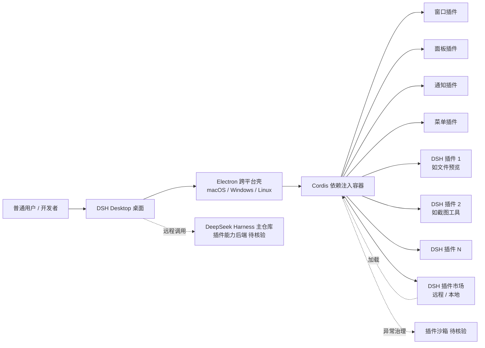

# anywhere-labs/dsh-desktop

## 一句话定位
DeepSeek Harness (DSH) 插件生态的官方桌面端——万物皆「插件」，桌面本身也是「插件」，18 天从 0 到 22k+⭐，让 DSH 插件从服务端 / 终端走向桌面应用层。

## 它解决的问题
DSH（DeepSeek Harness）插件生态在 8-18 deepseek-harness 主仓库上架后已成形，但缺乏原生桌面载体——所有 DSH 插件此前只能跑在服务端 / CLI / IDE 流程中，普通用户无法像使用桌面应用那样直接调用。dsh-desktop 解决的问题：(1) **桌面环境本身作为 Cordis 插件**——所有桌面元素（窗口 / 面板 / 通知 / 菜单）都是可插拔模块；(2) **DSH 插件生态原生集成**——任何 DSH 插件可在桌面直接加载运行；(3) **跨平台桌面能力一致**——macOS / Windows / Linux 三端统一的桌面体验。这是 DSH 插件生态从"服务端能力集"升级为"端到端 OS-like 平台"的关键拼图。

## 为什么值得关注（2026-08-31）
- **Stars:** 22,077（截至 2026-08-31），**18 天起步**，处于"爆发性增长"阶段
- **Forks:** 1,082，社区二次使用率极高
- **Watchers/Subscribers:** 52，开发者关注
- **License:** MIT
- **语言:** TypeScript（Electron 大型项目）
- **活跃度:** created 2026-08-13，pushed 2026-08-30，18 天持续高活跃
- **规模:** 138 MB（含大量渲染 / 桌面框架资源）
- **Open Issues:** 293（早期产品高速迭代特征）
- **Discussions:** 已开启
- **Topics 完整覆盖:** `cordis` / `cordis-plugin` / `deepseek` / `deepseek-harness` / `desktop` / `dsh` / `dsh-plugin` / `dsh-plugin-desktop` 八个明确接入面
- **官方主页:** https://dshdesktop.cn

## 热度来源判断
dsh-desktop 的热度是 **"DSH 插件生态刚需 × 万物皆插件哲学 × 跨平台桌面能力 × 18 天爆发曲线"** 的强组合。22,077⭐ / 1,082 forks / 18 天说明：(1) 真实需求——DSH 生态用户已形成规模，需要原生桌面；(2) 哲学吸引力——"桌面本身也是插件"的范式极具传播力；(3) 品牌借力——deepseek-harness 主仓库 200k+⭐ 的引流效应；(4) 跨平台一次性——macOS/Windows/Linux 三端统一体验对个人开发者和企业均有吸引力。热度**真实且具平台潜力**——但需警惕：Cordis 学习曲线（依赖注入框架对前端开发者较新）、138 MB 体积（Electron 应用安装门槛）、293 open issues（早期产品高速迭代但治理压力大）。

## 关键技术亮点
1. **万物皆插件**：桌面环境本身基于 Cordis 依赖注入框架，所有 UI 元素（窗口 / 面板 / 通知 / 菜单）都是可插拔模块
2. **DSH 生态原生集成**：所有 DSH 插件可直接在桌面加载运行，无需额外打包 / 转换
3. **跨平台一致**：macOS / Windows / Linux 三端统一的桌面体验（基于 Electron）
4. **Cordis 框架作为底层**：Topics 明示 `cordis` / `cordis-plugin`——继承 deepseek-harness 主仓库的依赖注入范式
5. **官方主页 dshdesktop.cn**：独立品牌站点已上线，提示产品化路径已启动
6. **MIT 许可 + TypeScript**：降低社区贡献门槛；与 deepseek-harness 主仓库技术栈一致

## 架构师速览

| 决策问题 | 研究判断 | 证据边界 |
|---|---|---|
| 系统边界 | Cordis 运行时（依赖注入容器）+ 桌面环境（窗口 / 面板 / 插件宿主）+ DSH 插件市场加载层 + Electron 跨平台壳 | 桌面插件化 + DSH 生态集成 + Electron 是 Topics 与 description 明示；具体窗口管理、Cordis 实例化方式、插件签名机制需源码核验 |
| 主路径 | 桌面启动 → Cordis 容器初始化 → 加载 DSH 插件列表（来自远程仓库 / 本地文件）→ 渲染桌面 UI → 插件响应用户操作 | 桌面即插件是 description 明示；具体 UI 框架（React/Vue/Svelte）、Cordis 实例生命周期、远程插件签名验证策略未公开 |
| 关键权衡 | 万物皆插件的灵活度 vs 启动性能 vs 插件安全治理 vs 跨平台桌面能力一致 vs Cordis 学习曲线 vs Electron 体积开销 | 138 MB 来自 API；293 open issues 反映治理压力；Cordis 学习曲线对前端开发者是真实门槛 |
| 最小 PoC | 安装 dsh-desktop → 加载任意 1 个 DSH 插件（如文件预览 / 截图工具）→ 验证插件可独立卸载 / 热更新 → 验证 Cordis 容器在插件异常时不崩溃 → 跨平台一致体验 | 插件市场入口 / 安装命令需 README 独立核验；138 MB 安装体积对终端用户是真实摩擦 |

## 架构启发
dsh-desktop 的核心启发是 **"Agent 插件生态必须有自己的桌面载体才能服务普通用户"**。8-18 deepseek-harness 上架后，DSH 插件主要跑在服务端 / CLI / IDE——这是开发者友好场景，但不是普通用户场景。dsh-desktop 把 DSH 插件生态的边界从"开发者"扩展到"普通用户"，这是 Agent 平台走向 C 端用户的关键基础设施。**更深层的启发是"平台层 + 垂直插件"飞轮的启动信号**——8-31 当天 dsh-desktop + awesome-dsh-plugin + dsh-routing-suite + dsh-web + dsh-anchored-standard + dsh-plugin-upgrade-skill 6 款 DSH 插件同时上榜，说明 DSH 生态已具备自组织能力，平台层 vs 垂直插件层的飞轮正式转动。**对比：** 类似 Visual Studio Code + 扩展生态——VS Code 本身是大平台，扩展是其能力扩展；dsh-desktop 走的路径是"DSH 插件生态 + 桌面端"形成同构关系。

## 架构图（MMD）

> 证据边界：此图只采用本档案已有可核验描述；"待核验"节点不应视为项目实现事实。

## 定位判断
**平台候选型项目（DSH 插件生态的桌面端 OS）。** dsh-desktop 不仅是 DSH 插件的桌面宿主，更试图成为"插件时代的桌面 OS"——类比 Electron 是 Web 桌面化的尝试，dsh-desktop 是 Agent 插件时代桌面化的尝试。22k⭐/18 天 + 1,082 forks 已显示 DSH 生态用户对原生桌面的强烈需求。但"平台化"取决于几个关键问题：(1) Cordis 学习曲线能否被社区吸收；(2) 138 MB 安装体积能否被普通用户接受；(3) 293 open issues 能否在产品化过程中解决；(4) 跨平台桌面体验一致性是否真达 macOS 原生水平。目前定位是"DSH 插件生态的官方桌面端"，向平台候选演进是合理路径。

## 风险/局限/泡沫点
- **Cordis 学习曲线**：Cordis 是依赖注入框架，对前端开发者较新，社区吸收需时间
- **138 MB 安装体积**：Electron 应用固有缺陷，对终端用户是真实摩擦
- **293 open issues**：早期产品高速迭代特征，治理压力大；若不能及时收敛可能影响口碑
- **跨平台桌面体验一致性**：Electron 在三端一致但 macOS 原生感弱，对 Apple Silicon 用户体验可能折扣
- **DSH 生态单点依赖**：若 deepseek-harness 主仓库调整（License / 商业模式 / API），dsh-desktop 受连带影响
- **插件安全治理缺失**：DSH 插件可任意加载，若无强签名 / 沙箱机制，存在恶意插件风险
- **品牌地缘风险**：deepseek-harness 是 DeepSeek（中国）官方出品，地缘政治不确定性是潜在风险

## 与同类项目的关系
- **vs deepseek-harness 主仓库：** 主仓库是 DSH 插件的运行时 / 框架；dsh-desktop 是其桌面端宿主
- **vs VS Code + 扩展生态：** 同样是"大平台 + 扩展"模型；dsh-desktop 走的是"桌面本身就是扩展"的更激进路径
- **vs yc-software/qm（今日）：** qm 是团队级 agent harness（Slack + Web 双入口）；dsh-desktop 是桌面端单用户场景
- **vs Electron / Tauri：** Electron / Tauri 是 Web 桌面化框架；dsh-desktop 在其上构建 Agent 插件生态
- **vs Figma / Sketch：** 设计工具的桌面化标杆；dsh-desktop 走"插件化桌面 OS"路径，更底层

## 是否值得持续跟踪
**值得跟踪（DSH 插件生态的桌面端 / 插件时代桌面 OS 候选）。** dsh-desktop 代表"Agent 插件时代桌面 OS"的尝试，无论其本身成败，这一方向是行业趋势。建议关注：Cordis 学习曲线在社区的吸收速度、138 MB 体积优化进展、293 open issues 收敛速度、是否有官方 / 社区驱动的插件签名 / 沙箱治理机制、跨平台桌面体验一致性（特别是 macOS 原生感）。对 DSH 插件开发者，dsh-desktop 是当前把插件跑在桌面端最直接的方式。对 Agent 生态观察者，它是"插件时代桌面 OS"赛道的标杆样本。

## 后续观察点
- Cordis 依赖注入框架在桌面场景的稳定性与社区学习曲线
- 138 MB 安装体积优化进展（Tauri / 原生壳迁移可能性）
- 293 open issues 收敛速度与产品化治理
- DSH 插件签名 / 沙箱机制是否落地（安全治理）
- 跨平台桌面体验一致性（特别是 macOS 原生感）
- 官方主页 dshdesktop.cn 是否有进一步产品化动作（付费版 / 企业版）
- 与 deepseek-harness 主仓库的版本同步策略

---
> 数据来源: GitHub API (2026-08-31) | Stars: 22,077 | Forks: 1,082 | License: MIT | 语言: TypeScript | 创建: 2026-08-13 | Pushed: 2026-08-30