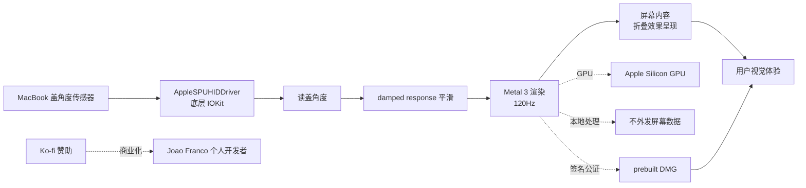

# JoaoFranco03/DuoHinge

## 一句话定位
DuoHinge——iPhone Duo 折叠动效移植 macOS 菜单栏 App；Swift 6.4 + Metal 3；AppleSPUHIDDriver 盖角度读数 + damped response 平滑到渲染节奏；120Hz 渲染；prebuilt DMG Apple Silicon only；Ko-fi 赞助。

## 它解决的问题
iPhone Duo（iOS 26 折叠动效）是 2025-2026 年 Apple 生态最炫酷的视觉特性之一，但 macOS 端没有对应实现。开发者社区（2026-09-12 起）出现 7+ 个 Duo 二创项目（sumimakito/Mac-Duo / DhananjayBhosale/MacDuo / jh3y/lid-plane / IuCC123/BendMac / elijah-semyonov/DuoLikeAnimation 等）。**DuoHinge 是该集群第二天的新增成员，差异点是金属渲染管线 + 盖角度传感器精度**——AppleSPUHIDDriver 是底层 IOKit 接口，比一般 hidapi 读取更稳定。

## 为什么值得关注（2026-09-13）
- 1 天 40⭐ / fork 1 / fork/star 2.5%
- AppleSPUHIDDriver 底层盖角度读数——比 hidapi 稳定
- Metal 3 + 120Hz 渲染——视觉效果极致
- 09-12 Duo 二创集群延伸——单点灵感 → 多 repo 并发事件持续
- Ko-fi 赞助——个人开发者路径（与 sumimakito/Mac-Duo 的「Moeru AI 赞助 Apple Developer Program」同构）
- prebuilt DMG 已签名 + 公证——Apple Silicon only

## 热度来源判断
DuoHinge 的热度是 **「iPhone Duo 二创集群延续 + AppleSPUHIDDriver 盖角度精度 + Metal 3 120Hz 渲染」三因素叠加**。iPhone Duo 动画作为 iOS 26 卖点之一（2025-09 Apple 发布），被 Mac 圈开发者广泛二创。DuoHinge 的差异点是底层 IOKit 接口（AppleSPUHIDDriver）读盖角度——比 hidapi 更稳定、延迟更低。**热度真实但属于氛围 App 范畴**——满足用户视觉愉悦而非生产效率；iPhone Duo 热度过后活跃度可能骤降。

## 关键技术亮点
1. **Swift 6.4 + Metal 3**——Apple 当前最前沿原生开发栈
2. **AppleSPUHIDDriver 盖角度读数**——底层 IOKit 接口，比 hidapi 稳定
3. **damped response 平滑到渲染节奏**——盖角度变化平滑，避免抖动
4. **120Hz 渲染**——README 明示「up to 120 Hz on supported displays」
5. **桌面处理 on-device**——不外发任何屏幕数据
6. **prebuilt DMG**——Apple Silicon only + 签名 + 公证
7. **Ko-fi 赞助**——个人开发者商业化路径
8. **macOS 14+**——当前最新公开版本
9. **44 MB 仓库**——含 demo.gif + assets 截图

## 架构师速览

| 决策问题 | 研究判断 | 证据边界 |
|---|---|---|
| 系统边界 | macOS 端菜单栏 App；本地桌面处理；预签名 + 公证 DMG；仅 Apple Silicon | 来自 README 关于 prebuilt DMG、Ko-fi 赞助、macOS 14+ 的明示；具体 IOKit 接口调用细节、Metal shader 实现待核验 |
| 主路径 | AppleSPUHIDDriver 读盖角度 → damped response 平滑 → Metal 3 渲染（120Hz）→ 屏幕内容呈现折叠效果 | 主路径来自 README「Display-Paced Sensor Motion」描述；damped response 的具体算法（线性 / 指数 / 卡尔曼）待核验 |
| 关键权衡 | Apple Silicon only（性能强 vs Intel 用户被排除）vs Metal 3 120Hz（视觉极致 vs GPU 负载）vs 签名 + 公证（安全 vs 维护成本）vs Ko-fi 赞助（个人开发 vs 商业化不确定） | 四权衡来自 README 特性对照；Intel Mac 支持计划、商业化收入未公开 |
| 最小 PoC | 在 Apple Silicon Mac 上下载 prebuilt DMG → 安装 → 打开菜单栏 → 缓慢开合 MacBook 盖子 → 观察折叠效果与渲染流畅度 | PoC 由「Apple Silicon only + Metal 3 120Hz + AppleSPUHIDDriver」推导；具体渲染延迟 / GPU 占用基准待核验 |

## 架构图（MMD）

> 证据边界：此图只采用本档案已有可核验描述；"待核验"节点不应视为项目实现事实。

## 架构启发
DuoHinge 的核心启发是 **「底层 IOKit 接口（AppleSPUHIDDriver）的精度优势」**——比 hidapi 更稳定、延迟更低，是 Mac 开发者常被忽视的高质量数据源。更深层的启发是 **「damped response 平滑到渲染节奏」**——盖角度变化不直接渲染，而是平滑后再渲染，避免抖动；这是传感器 + 渲染协同设计的工程细节。**最值得借鉴的是「prebuilt DMG 签名 + 公证」**——macOS 端个人开发者的标准商业化路径，避免 Xcode 编译门槛。

## 定位判断
**工具型项目（macOS 氛围 App）。** DuoHinge 不是工具，是 **「iPhone Duo 折叠动效 macOS 移植」**——满足用户的视觉愉悦而非生产效率。能否进入「基础设施」取决于：(a) Apple 官方是否在 macOS 下个版本内置类似 API；(b) iPhone Duo 热度消退后用户活跃度。当前定位是「iPhone Duo 二创集群中盖角度精度最高的 macOS 端实现」。

## 风险 / 局限 / 泡沫点
- **仅 Apple Silicon**——Intel Mac 用户被排除
- **macOS 14+ 限制**——老设备不支持
- **氛围 App 难以持续维护**——iPhone Duo 热度过后活跃度可能骤降
- **44 MB 仓库 size**——demo.gif + assets 截图占大头
- **fork=1 反映早期采用**——商业化前景未明
- **Apple 官方未来可能内置类似 API**——第三方二创价值被压缩

## 与同类项目的关系
- **vs `sumimakito/Mac-Duo`：** Mac-Duo 是 09-12 Duo 集群引爆点（512⭐ / 1 天）；DuoHinge 是 09-13 新增成员；差异点是底层 IOKit 接口 + Metal 3 120Hz
- **vs `DhananjayBhosale/MacDuo`：** 同样是 09-12 集群成员；差异点是 Swift + Metal 桌面跟随盖角
- **vs `jh3y/lid-plane`：** lid-plane 是 09-12 集群成员（131⭐）；差异点是盖角度驱动 progressive blur
- **vs `IuCC123/BendMac`：** BendMac 是 09-12 集群成员（88⭐）；差异点是桌面弯曲效果
- **vs Apple 官方 macOS：** Apple 尚未官方内置 iPhone Duo 折叠效果；DuoHinge 等二创填补空白

## 是否值得持续跟踪
**值得跟踪（iPhone Duo 二创集群中盖角度精度最高的 macOS 端实现）。** DuoHinge 在 09-12 Duo 集群中以「底层 IOKit 接口 + Metal 3 120Hz」为差异化点。建议关注：(a) iPhone Duo 热度消退后的用户活跃度；(b) Apple 官方是否在 macOS 下个版本内置类似 API；(c) 个人开发者商业化（Ko-fi 赞助）能否持续。对 macOS 氛围 App 用户，这是直接可用的折叠效果实现。对 macOS 开发者，它是「AppleSPUHIDDriver + Metal 3 + damped response」的工程化样本。

## 后续观察点
- iPhone Duo 热度消退后的用户活跃度
- Apple 官方是否在 macOS 下个版本内置类似 API
- 个人开发者商业化（Ko-fi 赞助）能否持续
- 是否出现 Intel Mac 支持
- 是否出现 v2.0 / 稳定版本（决定长期可持续）
- 09-12 Duo 二创集群是否进一步扩展（决定生态规模）

---
> 数据来源: GitHub API (2026-09-13) + README 公开摘录 | Stars: 40 | Forks: 1 | License: MIT | 语言: Swift | 创建: 2026-09-12 | 仓库 size: 44.4 MB
