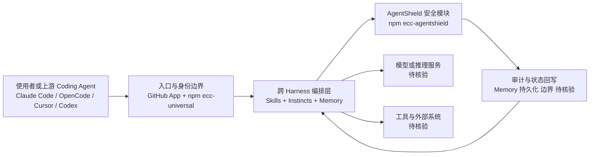

# ECC

## 一句话定位

Agent Harness 性能优化系统（官方自称 "agent harness operating system"），为 Claude Code、Codex、OpenCode、Cursor 等 Coding Agent 提供 Skills、Instincts、Memory、Security 和 Research-First Development。

## 它解决的问题

Coding Agent 缺乏统一的性能优化框架 — 从技能管理到记忆持久化到安全约束，开发者需要为不同 Agent 各自拼装配置。ECC 提供了一套跨 Harness 的配置/技能/记忆层，支持 Claude Code、Codex、OpenCode、Cursor 等主流 Coding Agent，并发布为 npm 包（`ecc-universal`、`ecc-agentshield`）和 GitHub App。

## 为什么值得关注

- **238,427 stars / 36,207 forks**，长期稳居 GitHub Star Top 5，是 Agent Harness 赛道头部项目
- 自称 "Agent Harness Operating System"，定位为 Agent 外围配置与优化的统一层
- 提供商业版本（ECC Pro，私有仓库 $19/seat/mo）+ GitHub App，已商业化
- 支持 11 种语言（含简繁中文、日韩、俄越泰德西），社区全球化程度高

## 热度来源判断

- **真实需求驱动为主。** Agent Harness 配置/优化是 2026 年 Coding Agent 赛道刚需
- 238K stars 中有明显的社区传播效应（多语言 README、Discord 社区），但核心需求真实
- npm 包有实际下载量（README 展示 npm 下载数 badge），说明存在真实安装使用

## 关键技术亮点亮点

1. **跨 Harness 抽象**：单一配置/技能层覆盖多个 Coding Agent（Claude Code/Codex/OpenCode/Cursor）
2. **Skills + Instincts + Memory 三层架构**：技能库 + 行为本能 + 持久化记忆
3. **AgentShield 安全模块**：npm 包 `ecc-agentshield`，Agent 安全约束层
4. **Research-First Development**：将研究优先作为 Agent 工作流的内置范式
5. 以 GitHub App + npm 包分发，支持私有仓库

## 架构师速览

| 决策问题 | 研究判断 | 证据边界 |
|---|---|---|
| 系统边界 | ECC 是面向 Claude Code / Codex / OpenCode / Cursor 等 Coding Agent 的统一 Harness 编排层，负责 Skills、Instincts、Memory、Security 与 Research-First 工作流配置，通过 npm 包（`ecc-universal`、`ecc-agentshield`）和 GitHub App 分发，不替代底层 Agent 运行时与模型供应商。 | 基于档案"跨 Harness 抽象"与标签（Agent、Harness、Claude Code、Skills、Memory、Security）推断；具体组件边界与协议未在档案中给出。 |
| 主路径 | 入口渠道（GitHub App / npm 安装）→ 跨 Harness 配置加载 → Skills/Instincts/Memory 调度 → Agent 运行时调用模型与工具 → AgentShield 安全约束与 Memory 持久化回写。 | 主路径由档案描述的"跨 Harness 抽象 + Skills/Instincts/Memory 三层 + AgentShield"重构；状态/审计落点和传输协议未提供。 |
| 关键权衡 | 跨 Harness 兼容性 vs 单一 Agent 深度优化：覆盖 Claude Code/Codex/OpenCode/Cursor 摊薄了边际投入，但 238K stars 与仅 118 open issues 的反差，加上依赖模型厂商 Skills 标准变化（agentskills.io），构成扩展性与供应商耦合的核心权衡。 | 来自档案"风险/局限"段；具体耦合点与缓解措施未在档案中说明。 |
| 最小 PoC | 单一 Coding Agent（建议 Claude Code）+ 最小工具权限 + 单一 Skills 包 + 启用 `ecc-agentshield` + 可审计日志，验证 Skills 注入、Memory 持久化与安全拦截路径，再扩展至多 Harness 与 ECC Pro（$19/seat/mo）。 | PoC 形态由档案"采用建议"模板化推得；ECC Pro 实际功能边界与免费版差异未提供。 |

## 架构启发

ECC 代表了 "Agent Harness 作为独立软件层" 的产品化思路 — 模型层（Claude/GPT）+ Harness 层（ECC）+ Agent 运行时（Claude Code 等）的三段式抽象。Harness 层负责技能调度、记忆管理、安全约束，类似操作系统的内核服务。

## 架构图（MMD）

> 证据边界：此图只采用本档案已有可核验描述；“待核验”节点不应视为项目实现事实。

## 定位判断

**平台候选。** 已商业化（ECC Pro + GitHub App），238K stars 说明生态位稳固。代表 Agent Harness 赛道头部实践。

## 风险 / 局限 / 泡沫点

1. **Star 数 vs 实际深度使用比例**：238K stars 但 open issues 仅 118，需验证真实生产采用率
2. **多语言 README 的传播放大效应**：11 种语言 README 会显著放大 star 增速，需区分传播效应与真实价值
3. **依赖模型厂商策略**：Claude Code / Codex 的 Skills 标准变化会影响 ECC 的兼容层价值
4. 商业版 $19/seat/mo 的定价在 Agent 工具赛道偏高，留存待验证

## 与同类项目的关系

- **OpenCode / Hermes Agent**：同为 Agent Harness 赛道，ECC 以跨 Harness 兼容性为差异化
- **anthropics/skills**（166K stars）：官方 Skills 仓库，ECC 是第三方 Skills/配置生态
- **wshobson/agents**：多 Harness 插件市场，与 ECC 的 Skills 层有功能重叠

## 是否值得持续跟踪

**是。** Agent Harness 赛道头部项目，已商业化，代表该方向的最佳实践。

## 后续观察点

1. ECC Pro 付费用户留存率和 ARR 增长
2. Skills 标准化（agentskills.io）对 ECC 兼容层的影响
3. 模型厂商（Anthropic/OpenAI）是否会吞并 Harness 层功能
4. npm 包下载量趋势和 GitHub App 安装数
