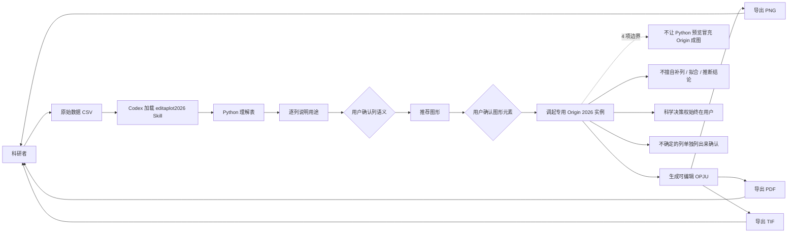

# liushunqi8-hash/editaplot2026

## 一句话定位
Codex 可编辑科研绘图 Skill (EditaPlot · 艾迪图) —— Windows 10/11 x64 only，把 Codex 对话里给 LLM 原始数据 + LLM 逐列说明用途 + 推荐图形 + 用户确认 + 调起专用 Origin 2026 (10.30) 实例 + 生成可编辑 OPJU + PNG/PDF/TIF 三格式导出，4 项明确边界「不让 Python 预览冒充 Origin 成图 + 不擅自补列 / 拟合 / 推断结论 + 科学含义和最终选择始终由你决定 + 不确定的列单独列出来请你确认」。

## 它解决的问题
AI 辅助科学绘图场景的痛点是 **「科研用户给 LLM 原始数据 → LLM 生成 Python matplotlib 静态 PNG（不可编辑）→ LLM 擅自补列 / 拟合 / 推断结论 → LLM 拿 Python 预览冒充 Origin 成图 → 用户发现 OPJU 不能编辑 + 数据处理被 LLM 默默做掉」**。editaplot2026 用「Codex Skill 形态 + 调起专用 Origin 实例 + 逐列说明用途让用户确认 + 推荐图形让用户确认 + 调用 Origin 实例生成可编辑 OPJU + PNG/PDF/TIF 三格式导出 + 不擅自补列 / 拟合 / 推断 + 不让 Python 预览冒充 Origin 成图」是「科研 + Codex Skill + Origin 集成 + 用户最终 gate + 不替用户决定」的具体路径。

## 为什么值得关注（2026-09-20）
- **Stars:** 81（截至 2026-09-20），1 天 81⭐，fork 3
- **License:** Apache-2.0（明确许可）
- **语言:** Python
- **活跃度:** created 2026-09-19，pushed_at 2026-09-19
- **规模:** 5.7 MB（含 Origin 集成资源）
- **平台:** Windows 10/11 x64 only（Origin 是 Windows 专属软件）
- **Origin 兼容:** Origin 2026 (10.30) verified（最新 Origin 版本兼容验证）
- **多语言:** 简中 + 繁中 + 英文 三语 README
- **4 项明确边界:**
  1. 「不让 Python 预览冒充 Origin 成图」 —— 避免 matplotlib 预览 ≠ 真实图欺骗
  2. 「不擅自补列 / 拟合 / 推断结论」 —— 科学决策权始终在用户
  3. 「科学含义和最终选择始终由你决定」 —— 严肃边界声明
  4. 「不确定的列单独列出来请你确认」 —— 避免 AI 默默做决定

## 热度来源判断
editaplot2026 的热度是 **「科研绘图 + Codex Skill + Origin 集成 + 用户最终 gate + 4 项明确边界 × 中文开发者 + Windows 专属 + 双语 README」** 的组合。当前中文科研者的痛点是「在 Codex 对话里让 LLM 完成数据理解 + 图形推荐 + Origin 调用 + 可编辑输出 + 不替用户做决定」。一个 5.7 MB Python Skill 直击痛点 + Codex Skill 形态 + 专用 Origin 实例 + 用户最终 gate + 4 项明确边界 + 双语 README，自然爆火。**fork/star 3.7%** 与昨日 pengchujin/MacTV 3.3% 接近，反映「中文开发者 + 平台专属工具」特征——Windows + Origin 专属环境的科研 fork。热度**真实且具科研绘图价值**——但需警惕：Codex Skill 在不同 Origin 版本的兼容性 + 逐列说明的智能化程度 + 推荐图形的合理性 + 用户确认流程的丝滑度 + 可编辑 OPJU 的可用度 + 三格式导出的质量 + Windows 多版本兼容性。

## 关键技术亮点
1. **Codex Skill 形态** ——可被 Codex 直接加载使用，无需独立启动；这是「与 Codex 生态集成」的工程化形式
2. **调起专用 Origin 实例** ——每个任务独立 Origin 进程，避免污染用户工作环境；这是「隔离任务」的工程化形式
3. **逐列说明用途让用户确认** ——「理解表 → 逐列说明 → 用户确认」；这是「不擅自决定列语义」的工程化形式
4. **推荐图形让用户确认** ——「AI 提议 + 用户最终 gate」；这是「科学决策权始终在用户」的工程化形式——与昨日 indada/repopilot「verification-driven iteration + 维护者最终 merge gate」同构
5. **生成可编辑 OPJU** ——可编辑 Origin 项目文件 + 用户可在 Origin 进一步修改；这是「可编辑性」的具体路径
6. **PNG/PDF/TIF 三格式导出** ——论文 / 报告 / 出版常用格式；这是「多格式输出」的工程化形式
7. **不擅自补列 / 拟合 / 推断结论** ——「科学决策权始终在用户」的具体路径；这是「严肃边界声明」的工程化形式
8. **不让 Python 预览冒充 Origin 成图** ——「最终输出必须是 Origin 成图」的工程化形式；这是「避免 AI 欺骗」的工程化形式
9. **不确定的列单独列出来请你确认** ——「避免 AI 默默做决定」的工程化形式
10. **Windows 10/11 x64 only + Origin 2026 (10.30) verified** ——明确平台 + 版本兼容性
11. **三语 README** ——简中 + 繁中 + 英文
12. **Apache-2.0 License** ——明确许可

## 架构师速览

| 决策问题 | 研究判断 | 证据边界 |
|---|---|---|
| 系统边界 | Codex Skill 形态 + 调起专用 Origin 实例的科研绘图工作流；Codex 加载 SKILL.md + Python 驱动 Origin 实例 + 输出可编辑 OPJU + 三格式导出 | 仅基于档案描述的 Codex Skill、Origin 集成、逐列说明、推荐图形、用户确认、4 项明确边界；具体 SKILL.md 目录结构、Origin 调用协议、用户确认 UX 均待核验 |
| 主路径 | 科研者给数据 → Codex 加载 editaplot2026 Skill → Python 理解表 → 逐列说明用途让用户确认 → 推荐图形让用户确认 → 调起专用 Origin 实例 → 生成可编辑 OPJU → 导出 PNG/PDF/TIF 三格式 | 主路径为档案语义抽象；具体表理解算法、Origin 调用协议、用户确认 UI、OPJU 生成实现均待核验 |
| 关键权衡 | AI 自动化程度 vs 用户最终 gate vs 可编辑性 vs Python 预览冒充 vs 数据处理透明度 vs 平台专属（Windows + Origin）vs 多语言支持 | 档案明示 Codex Skill、调起专用 Origin、逐列说明、推荐图形、可编辑 OPJU、三格式导出、4 项明确边界、Windows 专属、Origin 2026 verified、双语 10 项权衡；具体性能基准、多 Origin 版本兼容均待核验 |
| 最小 PoC | 在 Windows 11 + Origin 2026 + Codex 环境下给一份实验数据 CSV，逐列确认 + 推荐图形确认 + Origin 调用，验证可编辑 OPJU + 三格式导出 + 4 项边界（不让 Python 冒充、不擅自补列、不擅自拟合、不擅自推断），再扩展到第二份数据 | PoC 范围、退出路径由档案「逐列 + 图形 + 用户确认 + OPJU + 三格式 + 4 项边界」建议推导；具体数据格式、OPJU 兼容性、SLO 指标待核验 |

## 架构启发
editaplot2026 的核心启发是 **「AI 辅助科研绘图应该在 Codex Skill 形态下让用户保持科学决策权 + 可编辑输出 + 不替用户做决定 + 不让 Python 预览冒充 Origin 成图」**。当前 AI 辅助科学绘图的常见问题是「AI 生成 matplotlib 静态 PNG（不可编辑）+ AI 擅自补列 / 拟合 / 推断 + AI 用 Python 预览冒充 Origin 成图」。editaplot2026 用「Codex Skill + 专用 Origin 实例 + 逐列说明 + 推荐图形 + 用户确认 + 可编辑 OPJU + 三格式导出 + 4 项明确边界」是「AI 辅助严肃科研绘图」的参考实现。更深层的启发是：**「科学决策权始终在用户」是 AI 辅助科研工具的严肃性标志**——避免「AI 替科研者做决定」是企业 / 学术场景真正能采用的前提。能否持续，取决于 Codex Skill 在不同 Origin 版本的兼容性 + 逐列说明的智能化程度 + 推荐图形的合理性 + 用户确认流程的丝滑度 + 可编辑 OPJU 的可用度 + 三格式导出的质量 + Windows 多版本兼容性。

## 架构图（MMD）

> 证据边界：此图只采用本档案已有可核验描述；"待核验"节点不应视为项目实现事实。

## 定位判断
**工具型项目（Codex 可编辑科研绘图 Skill）。** editaplot2026 不仅是绘图工具，更试图成为「AI 辅助严肃科研绘图 + 用户保持科学决策权 + 可编辑输出」的具体路径——类似 GitHub Copilot 之于编程但严格保留「人类决策权」。若成功，它会成为中文科研者 + Windows + Origin 用户的「默认 AI 辅助绘图工具」，具有生态级价值。81⭐ + fork 3 + fork/star 3.7% 已显示「中文 Windows Origin 用户」早期信号。但「生态化」取决于一个关键问题：Codex Skill 在不同 Origin 版本的兼容性 + 逐列说明的智能化程度 + 推荐图形的合理性 + 用户确认流程的丝滑度 + 可编辑 OPJU 的可用度 + 三格式导出的质量。目前定位是「AI 辅助科研绘图 + Windows + Origin 集成 + 用户最终 gate + 不替用户决定」的严肃工具。

## 风险/局限/泡沫点
- **平台专属** ——Windows 10/11 x64 only；macOS / Linux 用户无法使用
- **Origin 专属** ——依赖 Origin 2026 (10.30)；Origin 是商业软件需用户已有授权
- **Codex 依赖** ——Codex Skill 形态，需在 Codex 环境使用；其他 Coding Agent 用户无法使用
- **逐列说明智能化程度** ——LLM 对「数据列语义」的理解准确率依赖 LLM 能力
- **推荐图形合理性** ——LLM 对「数据 → 推荐图形」的合理性依赖训练数据
- **用户确认流程 UX** ——「逐列确认 + 推荐图形确认」的丝滑度决定实际使用体验
- **可编辑 OPJU 可用度** ——生成 OPJU 在 Origin 中能否正确打开 + 编辑
- **三格式导出质量** ——PNG / PDF / TIF 在论文 / 报告 / 出版的兼容性
- **个人维护** ——liushunqi8-hash 个人维护，长期可持续性存疑
- **5.7 MB 体积** ——包含 Origin 集成资源，体积偏大

## 与同类项目的关系
- **vs indada/repopilot:** 昨日 95⭐，「verification-driven AI 软件迭代引擎 + 维护者最终 merge gate」；editaplot2026 是「AI 提议 + 用户最终确认图形元素」——同构「AI 提议 + 人类 gate」但推到「科学绘图」领域
- **vs pengchujin/MacTV:** 前日 61⭐，「macOS 电视遥控菜单栏 App + Apple Silicon + 硬件桥接」；editaplot2026 是「Windows + Codex Skill + Origin 集成」——同构「中文开发者 + 平台专属 + 硬件/软件集成」但推到「Windows + Origin」领域
- **vs skill-lab/feishu-chat-archive:** 昨日 11⭐，「飞书群聊归档 Codex Skill」；editaplot2026 是「科研绘图 Codex Skill」——同构「中文场景 Codex Skill + 反 SaaS」但推到「中文科研」领域
- **vs LingxiangXu/traceclause:** 昨日 58⭐，「本地优先需求文档证据审查」；editaplot2026 是「本地 Origin + AI 辅助 + 不替用户决定」——同构「本地优先 + 不外发 + 用户 gate」但推到「科研绘图」领域
- **vs matplotlib / plotly:** matplotlib / plotly 是「Python 绘图库（不可编辑）」；editaplot2026 是「Codex Skill + Origin 可编辑 OPJU」——互补（AI 辅助 vs 直接编程）
- **vs Origin 官方:** Origin 官方是「手动绘图软件」；editaplot2026 是「AI 辅助 + 用户确认 + 可编辑输出」——增强而非替代

## 是否值得持续跟踪
**值得跟踪（AI 辅助科研绘图 + 用户最终 gate）。** editaplot2026 代表了「AI 辅助科研绘图 + 用户保持科学决策权 + 可编辑输出 + Windows + Origin 集成」的诉求，无论其本身成败，这一方向是行业趋势。建议关注：Codex Skill 在不同 Origin 版本的兼容性（决定实际可用性）+ 逐列说明的智能化程度（决定数据理解质量）+ 推荐图形的合理性（决定 AI 提议质量）+ 用户确认流程的丝滑度（决定实际使用体验）+ 可编辑 OPJU 的可用度（决定 Origin 兼容性）。对中文科研者 + Windows + Origin 用户 + Codex 用户，这个项目是「AI 辅助严肃科研绘图 + 用户最终 gate」的具体路径，值得直接试用。对 AI 辅助科研工具观察者，它是「AI 提议 + 人类 gate + 不替用户决定」的样本。

## 后续观察点
- Codex Skill 在不同 Origin 版本的兼容性（Origin 2025 / 2026 / 2027 等）
- 逐列说明的智能化程度（LLM 对数据列语义的理解准确率）
- 推荐图形的合理性（LLM 对数据 → 推荐图形的合理性）
- 用户确认流程的丝滑度（逐列确认 + 推荐图形确认的 UX）
- 可编辑 OPJU 在 Origin 中的可用度（能否正确打开 + 编辑）
- 三格式导出质量（PNG / PDF / TIF 在论文 / 报告 / 出版的兼容性）
- Windows 多版本兼容性（Windows 10 vs Windows 11 / x64 vs ARM64）
- macOS / Linux 用户的迁移路径（是否考虑 Origin 之外的科学绘图工具）
- 个人维护的可持续性（liushunqi8-hash 长期维护承诺）

---
> 数据来源: GitHub API (2026-09-20) | Stars: 81 | Forks: 3 | License: Apache-2.0 | 语言: Python | 创建: 2026-09-19