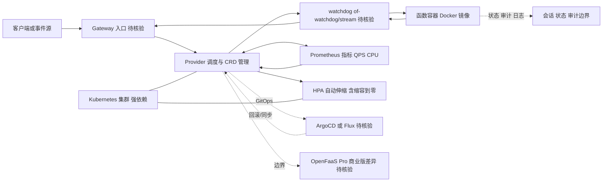

# openfaas/faas

## 一句话定位
基于 Docker 和 Kubernetes 的开源 Serverless 函数平台（Functions-as-a-Service），让任何容器化的代码片段都可以像 AWS Lambda 一样按需运行，但完全自主部署。

## 它解决的问题
AWS Lambda 等 Serverless 平台虽然便利，但存在严重的供应商锁定：函数只能在 AWS 运行、冷启动慢、调试困难、无法本地开发。OpenFaaS 让企业在自己的 Kubernetes 集群上运行 Serverless 函数，同时保留"按需伸缩、按调用计费、无需管理服务器"的核心 Serverless 体验。它将"函数"包装为标准 Docker 容器，因此任何语言、任何库都能无缝部署。

## 为什么值得关注
- **Stars:** 26,214（截至 2026-08-07），开源 Serverless 领域头部项目
- **Forks:** 1,970，社区贡献活跃
- **Watchers:** 454，企业关注度较高
- **License:** NOASSERTION（自定义许可，需注意商业使用条款）
- **活跃度:** pushed_at 2026-07-02，持续维护
- **Topics 命中:** docker / kubernetes / serverless / gitops / prometheus

## 热度来源判断
OpenFaaS 的热度是**真实的云原生需求 + CNCF 生态背书**驱动。它是 CNCF（Cloud Native Computing Foundation）SANDBOX 项目，由 Alex Ellis 创立并商业化运营（OpenFaaS Ltd）。热度来源包括：企业私有云 Serverless 需求、边缘计算场景（IoT、5G）、以及 GitOps 流水线整合。当前增速放缓，进入成熟期。

## 关键技术亮点亮点
1. **函数即容器:** 每个函数构建为标准 Docker 镜像，语言无关，依赖完整
2. **Kubernetes 原生:** 通过 CRD（Custom Resource Definition）管理函数生命周期
3. **watchdog 模式:** 经典模式（of-watchdog）和流模式，适配不同性能需求
4. **自动伸缩:** 基于 Prometheus 指标（QPS、CPU）自动 HPA 伸缩，支持缩容到零
5. **GitOps 集成:** 与 ArgoCD/Flux 整合，函数部署通过 Git 仓库驱动
6. **CLI 友好:** `faas-cli` 提供完整的 build/push/deploy/invoke 工作流

## 架构师速览

| 决策问题 | 研究判断 | 证据边界 |
|---|---|---|
| 系统边界 | OpenFaaS = 自托管 FaaS 平台，边界由 Kubernetes 集群与 Docker 镜像仓库共同界定；函数即容器，CRD 管理生命周期，watchdog 进程托管函数执行 | 组件名来自档案"关键技术亮点"与"架构师速览"，但具体 CRD 字段、watchdog 协议版本未在档案中给出 |
| 主路径 | HTTP/事件入口 → Gateway/Provider → watchdog → 函数容器 → Prometheus 指标反馈 HPA → 扩缩容（可缩容到零） | 主路径基于档案第 1–5 条亮点推断；具体 Gateway 实现、事件源组件名（如 NATS/Kafka 是否默认接入）未核实 |
| 关键权衡 | 自托管可控性 vs K8s 运维负担；容器通用性 vs 冷启动延迟（数百毫秒–数秒，逊于 Firecracker）；社区版 vs OpenFaaS Pro 的商业分裂风险 | 权衡均出自档案"风险/局限"段；冷启动量级与 Pro/社区版功能差异未量化 |
| 最小 PoC | 在单节点 K8s 上用 faas-cli build/push/deploy 一个 HTTP 函数，启用 HPA 到零，验证 Prometheus 自动伸缩与 GitOps（ArgoCD/Flux）回滚路径 | PoC 工具链（faas-cli、ArgoCD/Flux）来自档案，但具体版本、GitOps 模板是否开箱即用未在档案中确认 |

## 架构启发
OpenFaaS 的核心架构启发是 **"Serverless 不等于公有云"**。它证明了 Serverless 的核心价值（按需伸缩、运维零负担）可以在私有基础设施上实现。函数即容器的抽象，让 Serverless 从"特殊运行时"回归为"普通微服务的极简形态"。这与后来的 Knative（Google）、Firecracker（AWS）等思路一致——Serverless 是一种部署模式，而非特定平台。

## 架构图（MMD）

> 证据边界：此图只采用本档案已有可核验描述；“待核验”节点不应视为项目实现事实。

## 定位判断
**成熟基础设施型项目。** OpenFaaS 已渡过爆发期，进入稳定的企业采用阶段。它是私有 Serverless 场景的可靠选择，但不再是"创新前沿"。适合已投资 Kubernetes 的中大型企业作为内部函数平台。

## 风险/局限/泡沫点
- **Kubernetes 依赖:** 必须有 K8s 集群，对小型团队门槛高
- **冷启动:** 容器启动延迟（数百毫秒到数秒）影响实时场景，不如 Firecracker 微 VM 快
- **商业化模式:** OpenFaaS Pro（付费版）与社区版功能差异，可能影响社区信任
- **竞争激烈:** Knative（Google/CNCF）、OpenWhisk（Apache）、AWS Lambda（公有云）分流
- **Serverless 降温:** 微服务回归 + AI 推理工作负载兴起，纯 FaaS 关注度下降

## 与同类项目的关系
- **vs Knative:** Knative 是 Google 主导的 CNCF 标准，更底层（Build + Serving + Eventing）；OpenFaaS 更上层、更易用
- **vs AWS Lambda:** Lambda 是公有云 SaaS，OpenFaaS 是自部署；前者零运维但锁定，后者灵活但需管理
- **vs Apache OpenWhisk:** OpenWhisk 是 IBM 捐赠的开源 FaaS，架构更重；OpenFaaS 更轻量
- **vs Dapr:** Dapr 不是 FaaS，而是分布式应用运行时，定位不同但部分场景重叠

## 是否值得持续跟踪
**中等优先级跟踪。** OpenFaaS 已成熟，技术突破性降低。建议关注其在边缘计算（K3s）、AI 推理函数（GPU 函数）方向的拓展，以及 GitOps 工作流的深度集成。

## 后续观察点
- 是否原生支持 WASM 函数（轻量、冷启动快）
- AI/LLM 推理函数模板的推出（LLM-as-a-Function）
- 企业版（OpenFaaS Pro）的商业增长
- 与 Knative 的竞合走向（是否可能出现统一标准）

---
> 数据来源: GitHub API (2026-08-07) | Stars: 26,214 | Forks: 1,970 | License: 自定义
