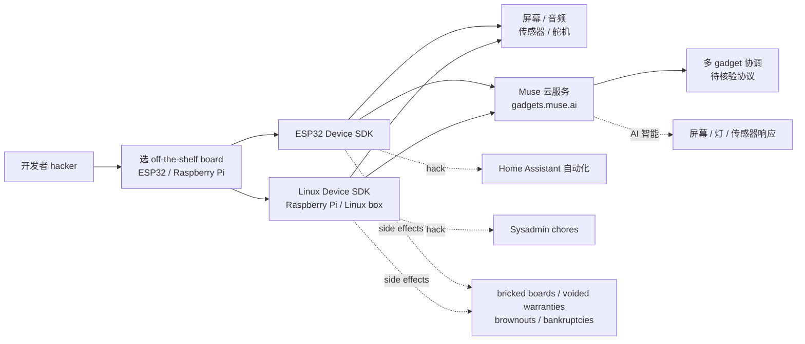

# facebookincubator/muse-gadget-sdk

## 一句话定位
Meta 子公司孵化器（facebookincubator）官方组织背书的 Muse AI 项目开源设备 SDK 集——把「设备 SDK」从「闭源客户端 + 云 SaaS」推到「ESP32 Device SDK + Linux/Raspberry Pi Device SDK + 屏幕/音频/传感器/舵机全配 + Apache-2.0 + Built by hackers, for hackers」严肃工程化形态。

## 它解决的问题
2025-2026 年硬件 AI 项目爆发（智能音箱、家庭助理、桌面 AI gadget、机器人、传感器阵列），但每个 AI 项目都把「设备 SDK」当作「闭源客户端 + 云 SaaS」的脆弱封装——开发者想接入自有硬件（ESP32 / Raspberry Pi / 自制 gadget / 自定义传感器）只能等官方适配，闭源客户端更新慢、不开放、不能 hack。facebookincubator/muse-gadget-sdk 直击这一痛点：它把 Muse AI 项目的「设备 SDK」全部开源——ESP32 Device SDK + Linux/Raspberry Pi Device SDK + 屏幕/音频/传感器/舵机全配 + Apache-2.0 商用清晰 + gadgets.muse.ai + off-the-shelf boards + Built by hackers, for hackers + Proceed at your own risk。解决的是 **「硬件 AI 项目设备 SDK 闭源、不能 hack、不能商用清晰、不能多硬件兼容」** 的生态割裂问题，是硬件 AI 项目的「开源设备 SDK 通用适配层」尝试。

## 为什么值得关注（2026-10-03）
- **Stars:** 819（截至 2026-10-03），1 天破 800，增速极快
- **Forks:** 127，社区贡献极其活跃（设备 SDK 天然适合贡献）
- **License:** Apache-2.0，商用清晰
- **组织:** facebookincubator（Meta 子公司孵化器）官方背书
- **语言:** C（ESP32 Device SDK），Linux Device SDK 多种语言
- **规模:** 2482 KB，包含 ESP32 设备 SDK + Linux 设备 SDK + 固件
- **活跃度:** created 2026-10-02，pushed_at 2026-10-03，持续高活跃
- **Topics:** 0 个（README 未明示），但覆盖 Waveshare AMOLED / M5Stack StickS3 / Muse Home Link / Raspberry Pi / Seeed reTerminal e-ink 等多 board
- **官方主页:** gadgets.muse.ai

## 热度来源判断
facebookincubator/muse-gadget-sdk 的热度是 **「Meta 官方背书 × 硬件 AI SDK 开源 × Apache-2.0 商用清晰 × hackers 自己玩 × Proceed at your own risk」** 的强劲组合。硬件 AI 是 2026 年最热赛道，但每个项目都把「设备 SDK」当作「闭源客户端 + 云 SaaS」的脆弱封装——开发者苦于「不能接入自有硬件、不能 hack、不能商用集成」。facebookincubator 官方组织背书 + ESP32 + Linux 双 SDK + Apache-2.0 + Built by hackers 直击痛点。127 个 forks 反映社区高度参与——这正是「设备 SDK」类项目的网络效应（贡献者越多、SDK 兼容性越广、吸引更多用户）。热度**真实且具网络效应潜力**——但需警惕：硬件兼容性的维护成本极高（每种 board 都要单独适配），长期维护是巨大挑战，且 README 明示「side effects may include bricked boards/voided warranties/brownouts/bankruptcies」。

## 关键技术亮点
1. **双 SDK 并行:** ESP32 Device SDK + Linux Device SDK，覆盖微控制器 + 单板机两大硬件族群
2. **off-the-shelf boards:** 明确支持 Waveshare 圆 AMOLED、M5Stack StickS3、Muse Home Link、Raspberry Pi、Seeed reTerminal e-ink 等多 board
3. **屏幕/音频/传感器/舵机全配:** 屏幕（AMOLED / e-ink / StickS3）+ 音频 in/out + 各种传感器 + 舵机全配
4. **Hack 友好:** Built by hackers, for hackers + 自定义命令 + Home Assistant 自动化 + sysadmin chores
5. **Apache-2.0 商用清晰:** license 商用清晰，可商用集成
6. **Muse 云服务:** gadgets.muse.ai 在线 demo + Muse 协调多 gadget

## 架构师速览

| 决策问题 | 研究判断 | 证据边界 |
|---|---|---|
| 系统边界 | Muse AI 项目的开源设备 SDK 集（ESP32 Device SDK + Linux Device SDK）；SDK 是连接 gadget 与 Muse 云服务的适配层 | 仅基于 README 描述的 ESP32/Linux Device SDK、屏幕/音频/传感器/舵机、off-the-shelf boards、gadgets.muse.ai；具体 Muse 云 API 接口、SDK ↔ 云 ↔ gadget 的协议未在档案中给出 |
| 主路径 | 开发者 → 选 off-the-shelf ESP32 / Raspberry Pi → 装 SDK → 屏幕/音频/传感器/舵机接入 → 连接 Muse → Muse 协调多 gadget | 主路径为档案语义抽象；Muse 云的 API 形态、SDK ↔ gadget 通信协议（MQTT/HTTP/gRPC）未在档案中明示 |
| 关键权衡 | 开源 SDK + Apache-2.0 商用清晰 vs Meta 云服务依赖 + 官方 vs hacker 自定义 + AI 智能 vs 硬件兼容性 | 档案明示「Built by hackers, for hackers」+「side effects may include bricked boards/voided warranties/brownouts/bankruptcies」；Muse 云 API 与本地推理的边界、自定义命令 ↔ Muse 智能的分工未在档案中讨论 |
| 最小 PoC | 在一台 Waveshare 圆 AMOLED + M5Stack StickS3 + Raspberry Pi 上分别跑 SDK demo；在 Muse Home Link 上验证一盏灯/一个屏幕/一个传感器；再以 home assistant 自动化场景验证多 gadget 协同 | PoC 范围由档案「off-the-shelf boards + 屏幕/音频/传感器/舵机 + Home Assistant」建议推导；具体 SDK API、Muse Home Link 部署流程未在档案中讨论 |

## 架构启发
facebookincubator/muse-gadget-sdk 的核心启发是 **「硬件 AI 项目应该把设备 SDK 开源，正如云 SDK 跨平台可移植」**。当前每个硬件 AI 项目都在建自己的封闭 SDK 生态（类比早期移动应用的 iOS/Android 割裂），但这违背开发者利益——没人想为每个项目写一遍 gadget 接入。facebookincubator/muse-gadget-sdk 尝试做「硬件 AI 设备 SDK 的开源标准层」，类似 Android Open Source Project 之于移动开发。更深层的启发是：**开源设备 SDK 类项目的价值在于网络效应（贡献者 × 用户 × board 兼容性）而非技术复杂度**。1 天 819⭐ + 127 forks 的结构，说明它已初步形成飞轮。能否持续，取决于能否在多 board / 多 sensor / 多 actuator 持续兼容。

## 架构图（MMD）

> 证据边界：此图只采用本档案已有可核验描述；"待核验"节点不应视为项目实现事实。

## 定位判断
**平台候选型项目（硬件 AI 开源设备 SDK 集）。** facebookincubator/muse-gadget-sdk 不仅是 Muse AI 项目的设备 SDK，更试图成为硬件 AI 项目的「开源设备 SDK 通用适配层」——类似 Arduino / PlatformIO 之于嵌入式开发。若成功，它会成为硬件 AI 项目获取设备能力的默认入口，具有平台级价值。1 天 819⭐ + 127 forks 已显示网络效应雏形。但"平台化"取决于一个关键问题：多 board / 多 sensor / 多 actuator 兼容性能否持续——若硬件类型持续分化，维护成本可能压垮项目。目前定位是「最有影响力的硬件 AI 开源设备 SDK 集」，向平台演进是合理路径。

## 风险/局限/泡沫点
- **多硬件维护成本:** ESP32 + Linux + 多 board + 多 sensor + 多 actuator 持续兼容是巨大工程负担
- **Muse 云服务依赖:** 设备 SDK 需要 Muse 云服务，Muse 云 API 变化可能影响所有 gadget
- **严肃工程化承诺边界:** README 明示「side effects may include bricked boards/voided warranties/brownouts/bankruptcies」，用户需自行承担硬件损失
- **Meta 云服务策略风险:** Meta 可能调整 Muse 项目策略，影响 SDK 长期维护
- **topics 0 个覆盖（README 未明示）:** SEO/可发现性弱于同赛道项目

## 与同类项目的关系
- **vs Arduino / PlatformIO:** 那些是通用嵌入式开发平台；muse-gadget-sdk 是 Muse AI 专用设备 SDK
- **vs Espressif ESP-IDF:** ESP-IDF 是 ESP32 官方 SDK；muse-gadget-sdk 是 Muse AI 在 ESP-IDF 之上的应用 SDK
- **vs Home Assistant:** Home Assistant 是开源家庭自动化平台；muse-gadget-sdk 与 Home Assistant 集成但定位不同
- **vs 各硬件 AI 公司 SDK:** 那些 SDK 闭源；muse-gadget-sdk 是 Apache-2.0 开源
- **vs Raspberry Pi GPIO libraries:** 那些是 Raspberry Pi 通用库；muse-gadget-sdk 是 Muse AI 专用

## 是否值得持续跟踪
**值得跟踪（硬件 AI 开源设备 SDK 集）。** facebookincubator/muse-gadget-sdk 代表了硬件 AI 项目「设备 SDK 开源」的诉求，无论其本身成败，这一方向是行业趋势。建议关注：是否演化为独立平台/网站（从 GitHub 仓库升级为设备 SDK 门户）、多 board / 多 sensor / 多 actuator 兼容的维护策略、Apache-2.0 商用集成的成熟度、Meta 是否继续投入 Muse 项目。对硬件 AI 开发者，这个仓库是获取 Muse AI 设备 SDK 的官方来源，值得直接采用。对硬件 AI 生态观察者，它是「设备 SDK 开源」赛道的头部样本。

## 后续观察点
- 是否演化为独立平台/网站（从 GitHub 仓库升级为设备 SDK 门户）
- 多 board / 多 sensor / 多 actuator 兼容性的维护策略
- Muse 云服务 API 的稳定性与版本管理
- Home Assistant 自动化场景的成熟度
- 商用集成（团队是否将此作为 Muse AI gadget 设备 SDK 的统一来源）
- Meta 是否继续投入 Muse 项目（决定 SDK 长期维护）

---
> 数据来源: GitHub API (2026-10-03) | Stars: 819 | Forks: 127 | License: Apache-2.0 | 语言: C | 创建: 2026-10-02
