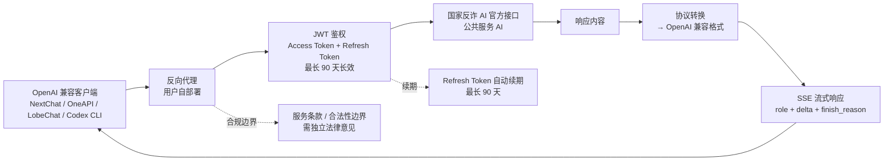

# lfzk550/fanzha-ai-proxy

## 一句话定位
"国家反诈 AI" 转 OpenAI 兼容 `/v1/chat/completions` 反向代理——SSE 流式 + NextChat / OneAPI / LobeChat / Codex CLI 适配 + Access/Refresh Token 90 天长效会话 + 多模态 messages 解析；2 天 285⭐，**fork/star 96.5% 极异常**。

## 它解决的问题
"国家反诈 AI" 是中国公安部主导的全民反诈宣传 AI 助手，**原本只能在官方渠道使用**。`fanzha-ai-proxy` 直击"想用 OpenAI 兼容工具（NextChat / OneAPI / LobeChat / Codex CLI）但只能访问国家反诈 AI"的需求：把国家反诈 AI 转换为 OpenAI 兼容 `/v1/chat/completions` 反向代理 + SSE 流式响应，让任意 OpenAI 客户端都能无缝接入。

**关键能力**：
1. **标准 OpenAI API**——完全兼容 `/v1/chat/completions` 与 `/v1/models`
2. **SSE 流式响应**——修复首包 `role` 下发 + 增量 delta + `finish_reason: stop` 结束
3. **灵活鉴权**——支持请求头 `Authorization: Bearer ***` 动态传参 + 环境变量全局配置
4. **自动续期**——Access Token + Refresh Token 机制，最长约 90 天免重新登录
5. **多模态兼容**——自动解析复杂 `messages` 结构 + 多层数组 content

## 为什么值得关注（2026-09-09）
- **Stars:** 285（截至 2026-09-09），2 天净增，单日均速 ~142⭐/day
- **Forks:** **275**（fork/star **96.5% 极异常**——**几乎每个 star 用户都 fork**，需要独立核验是否反映真实使用密度极高 / 自动化 fork 刷量 / 服务依赖）
- **Watchers/Subscribers:** 待观察
- **Open Issues:** 待观察
- **License:** None（仓库无 license 文件）
- **语言:** 仓库 Language 字段为 None（README + 配置为主，可能是 Node.js / Python / Go 等需要核验）
- **项目年龄:** 2 天（创建 2026-09-07），是 2026-09-09 trending 新项目前列
- **核心差异:** 公共服务 AI 接口 OpenAI 兼容化 + 90 天长效会话 + 多客户端适配

## 热度来源判断
热度来自 **三个层面的叠加**：(1) **公共服务 AI 的 OpenAI 兼容化刚需**——大量用户已经在用 NextChat / OneAPI / LobeChat / Codex CLI，公共服务 AI 接入后立即可用；(2) **Access Token + Refresh Token 90 天长效**——降低维护成本，用户体验好；(3) **多模态 messages 解析**——扩展了可用场景。

**fork/star 96.5% 极异常**值得深入分析：
- **假设 1：真实使用密度极高**——每个 star 用户都 fork（OpenAI 兼容客户端部署都需要 fork + 自部署）
- **假设 2：自动化 fork 刷量**——可能反映项目方推广策略
- **假设 3：服务依赖 fork**——公共服务 AI 接口若限流或政策变化，fork 自部署成为刚需

**关键风险**：
1. **公共服务 AI 接口的服务条款边界**——把公共服务 AI 接口反向代理到 OpenAI 兼容格式是否违反服务条款？需要独立法律意见
2. **合法性边界**——`fanzha-ai-proxy` 本质上是"绕过官方渠道"，在不同地区 / 不同场景下合法性需要独立法律意见
3. **fork/star 96.5% 极异常**——需要独立核验是否反映真实使用密度 / 自动化 fork / 服务依赖

## 关键技术亮点
1. **OpenAI API 完全兼容：** `/v1/chat/completions` + `/v1/models`——可直接对接 NextChat / OneAPI / LobeChat / Codex CLI 等主流 AI 客户端
2. **SSE 流式响应：** 修复首包 `role` 下发 + 增量 delta + `finish_reason: stop` 结束标识——流式体验与 OpenAI 一致
3. **Access/Refresh Token 自动续期：** 内置 JWT 鉴权 + Refresh Token 自动刷新机制，最长约 90 天免重新登录——用户体验显著提升
4. **多模态 messages 解析：** 自动处理复杂 `messages` 结构 + 多层数组 content（多模态消息）
5. **请求头动态鉴权：** 支持 `Authorization: Bearer ***` 动态传参 + 环境变量全局配置——灵活部署
6. **国家反诈 AI 后端：** JWT 鉴权 + 长效会话机制——公共服务 AI 接入的工程化实现

## 架构师速览

| 决策问题 | 研究判断 | 证据边界 |
|---|---|---|
| 系统边界 | 反向代理层——前端 OpenAI 兼容 API（用户部署）+ 后端国家反诈 AI 官方接口；仓库只包含反向代理，实际 AI 能力来自公共服务 | 边界由 README 明示；具体后端实现语言（Node.js / Python / Go）需核验；JWT 鉴权机制细节需代码审阅 |
| 主路径 | OpenAI 客户端请求 → 反向代理（用户部署）→ 转换协议为公共服务 AI 接口 → 公共服务 AI 后端 → 返回 → 反向代理 → OpenAI 兼容 SSE 流式响应 | 主路径为 README 语义抽象；具体协议转换、JWT 管理、Refresh Token 续期逻辑需代码审阅 |
| 关键权衡 | 公共服务 AI 接口 OpenAI 兼容化（用户友好）vs 官方渠道（合规）；Access Token 短期 vs Refresh Token 90 天长效（用户体验 vs 安全）；自部署（隐私）vs 公共服务（合规） | README 明示 Refresh Token 90 天长效；JWT 签名算法、加密存储未在 README 可见 |
| 最小 PoC | clone 仓库 → 配置 Access Token + Refresh Token → 启动反向代理 → 配置 NextChat / OneAPI / LobeChat 接入反向代理地址 → 测试 `/v1/chat/completions` 请求 → 验证 SSE 流式响应 | PoC 范围由 README 明示；具体 Access Token 获取方式需独立核验 |

## 架构图（MMD）

> 证据边界：此图只采用本档案已有可核验描述；"待核验"节点不应视为项目实现事实。

## 架构启发
`lfzk550/fanzha-ai-proxy` 的核心启发是 **"公共服务 AI 接口的 OpenAI 兼容化"**——把不直接兼容主流 AI 客户端的公共服务接口，通过反向代理转换为 OpenAI 标准。这与 9-08 `biusberline/cloudflare-turnstile-solver` 的"Turnstile Peak API 客户端"模式类似——**开源客户端 + 公共服务 / SaaS 后端** 的新型工具架构。

更深层的启发是 **"中文场景适配层"成为独立品类**——`fanzha-ai-proxy` 把国家反诈 AI 接入 OpenAI 生态；昨日 `jtydhr88/screenwriting-skills` 把中文编剧知识蒸馏为 Claude Code Skill；今日 `eternity4719/HowToLiveBetter` 提供中文循证生活指南——**中文场景适配层正在批量出现**。

风险提示：**公共服务 AI 接口的服务条款边界 / 合法性边界需要独立法律意见**；**fork/star 96.5% 极异常需要独立核验**；**Access/Refresh Token 管理**（JWT 签名算法、加密存储、轮换机制）需要安全审计。

## 定位判断
**工具型项目（公共服务 AI OpenAI 兼容反向代理）。** `fanzha-ai-proxy` 在 2026-09-09 中文垂直领域 Skill / Prompt 适配层趋势中切入，把国家反诈 AI 接入 OpenAI 生态。差异化定位是 **"公共服务 AI 接口的 OpenAI 兼容化 + 长效会话 + 多客户端适配"**——比直接访问官方渠道更灵活，比自建 AI 更省成本。当前定位是 **"中文公共服务 AI 接入 OpenAI 生态的工程化样板"**，向"中文场景适配层 Marketplace"扩展是合理路径。

## 风险/局限/泡沫点
- **公共服务 AI 接口的服务条款边界：** 把公共服务 AI 接口反向代理到 OpenAI 兼容格式是否违反服务条款需要独立法律意见
- **合法性边界：** 在不同地区 / 不同场景下"绕过官方渠道"的合法性需要独立法律意见
- **fork/star 96.5% 极异常：** 需要独立核验真实使用密度 / 自动化 fork / 服务依赖
- **License 缺失：** 仓库无 license 文件，使用 / 二次开发 / 商用的法律边界不清晰
- **JWT 安全管理：** Access Token / Refresh Token 的存储、轮换、撤销机制需要安全审计
- **公共服务 AI 政策变化风险：** 国家反诈 AI 接口调整 / 限流 / 下线直接影响项目可用性
- **lfzk550 是新账号：** 2 天 285⭐ / 项目年龄 2 天，项目可持续性 / 治理结构 / 安全漏洞响应都未验证
- **滥用风险：** 反向代理可能绕过官方渠道的内容审核 / 使用限制——是否会出现滥用场景需要观察

## 与同类项目的关系
- **vs biusberline/cloudflare-turnstile-solver (9-08, 258⭐):** 同属"开源客户端 + 公共服务 / SaaS 后端"模式——Turnstile Peak API vs 国家反诈 AI
- **vs jtydhr88/screenwriting-skills (9-08, 301⭐):** 同属中文场景适配层趋势——公共服务 AI OpenAI 兼容化 vs 编剧知识 Skill 蒸馏
- **vs eternity4719/HowToLiveBetter (2 天 122⭐):** 同属中文垂直领域——反诈 AI 接入 vs 循证生活指南
- **vs OpenAI 官方 API 兼容服务（OneAPI / New API 等）:** OneAPI / New API 是多模型聚合（OpenAI / Claude / Gemini 等）；fanzha-ai-proxy 是公共服务 AI 单点接入——**聚合 vs 单点**
- **vs 官方渠道（直接访问国家反诈 AI）:** 官方渠道合规但用户体验受限；fanzha-ai-proxy 用户体验好但合规边界不清晰——**合规 vs 用户体验**

## 是否值得持续跟踪
**值得跟踪（中文垂直领域适配层 + 公共服务 AI OpenAI 兼容化）。** `fanzha-ai-proxy` 代表 **"中文场景适配层"** 的新方向——把公共服务 / 中文知识 / 中文工具接入 OpenAI 生态。建议关注：(a) **公共服务 AI 接口的服务条款边界 / 合法性边界**（决定整个赛道存亡）；(b) fork/star 96.5% 异常的真实原因；(c) 是否出现其他公共服务 AI 接入（公安 / 政务 / 教育 / 医疗）；(d) 中文场景适配层是否形成 Marketplace。对中文 AI 用户，是合法的工具接入样板；对公共服务 AI 政策制定者，是"绕过官方渠道"工程的代表样本。

## 后续观察点
- 公共服务 AI 接口的服务条款边界 / 合法性边界的发展——决定整个赛道存亡
- fork/star 96.5% 异常的真实原因——独立核验
- 是否出现其他公共服务 AI 接入（公安 / 政务 / 教育 / 医疗）
- 中文场景适配层是否形成 Marketplace
- lfzk550 是否持续维护 / 治理结构演化
- License 缺失是否补全——影响二次开发 / 商用

---
> 数据来源: GitHub API (2026-09-09) | Stars: 285 | Forks: 275 | License: None | 语言: None | 创建: 2026-09-07
