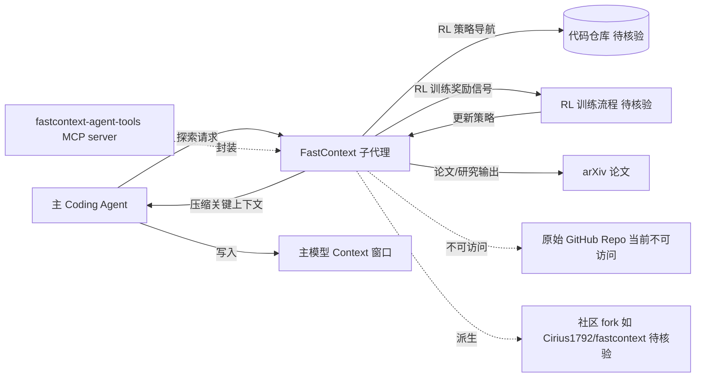

# microsoft/fastcontext

## 一句话定位
微软研究院的仓库探索专用小模型——用强化学习训练的专用模型做代码仓库探索，让主模型节省 context 窗口，附带 arXiv 论文。

## 它解决的问题
现代 coding agent（如 Claude Code、Cursor）在处理大型代码仓库时，需要将大量代码放入 context 窗口，导致 token 消耗巨大且容易超出窗口限制。FastContext 提出用一个小型专用模型做"仓库探索"——定位相关代码片段、理解项目结构，只将最关键的信息返回给主模型，大幅减少主模型的 context 消耗。

## 为什么值得关注
- **微软研究院出品**：有学术深度和工程能力
- **论文+代码配套**：arXiv 论文支撑，方法论经同行审视
- **RL 训练方法**：用强化学习训练仓库探索策略，技术路线新颖
- **context engineering 前沿**：直接解决 coding agent 的核心瓶颈
- 多个社区项目引用（如 fastcontext-agent-tools MCP server），说明有实际影响力

## 热度来源判断
- **Coding agent 浪潮（极高）**：所有 AI 编码工具都面临 context 限制
- **Context engineering 新概念（高）**：如何高效使用 context 窗口是前沿话题
- **微软研究院背书（高）**：学术可信度
- **小模型专用化趋势（中高）**：用小模型做特定任务降低成本

## 关键技术亮点亮点
1. **专用探索模型**：小模型专做仓库导航/搜索，不生成代码
2. **RL 训练策略**：用强化学习训练探索行为，奖励有效信息获取
3. **Subagent 架构**：作为主 agent 的"子 agent"，探索结果反馈给主模型
4. **Context 压缩**：将海量代码压缩为关键上下文片段
5. **论文驱动开发**：方法论有学术验证

## 架构师速览

| 决策问题 | 研究判断 | 证据边界 |
|---|---|---|
| 系统边界 | FastContext 处于"主 coding agent 与代码仓库"之间，是微软研究院提出的"专用小模型 + RL 探索"子代理层，职责是把仓库探索结果压缩回写到主模型 context；输入是大型仓库，输出是关键代码片段 | 档案未给出 API 形态、协议、模型规模、训练数据细节；具体边界以原 repo/论文为准 |
| 主路径 | 主 agent 发起请求 → FastContext 子模型用 RL 策略导航/搜索仓库 → 压缩/筛选关键上下文 → 反馈给主模型用于后续生成 | 档案只描述"专用探索模型 + RL 训练 + subagent 架构 + context 压缩"职责链，未给出推理协议、缓存、索引构建方式 |
| 关键权衡 | 用"小模型 + RL 探索"换取主模型 context 预算与 token 成本，但代价是额外的推理调用、模型分发门槛、泛化性未知，且原 repo 不可访问 | 档案明确指出"repo 不可访问""学术 vs 生产""模型获取门槛""泛化性"四项风险，未提供任何具体性能或 ROI 数字 |
| 最小 PoC | 优先以论文 + 社区 fork（如 Cirius1792/fastcontext、fastcontext-agent-tools MCP server）做最小复现：单仓库、固定任务集、对比"无探索 / 启发式 repo-map / FastContext"在主模型 context 占用与答案质量上的差异 | 档案未提供具体基准、模型权重、许可证与部署形态；"是否可生产"判定必须以源码/模型卡核验 |

## 架构启发
- **模型分工而非全能**：主模型做推理，小模型做探索，各司其职
- **RL for tool use**：强化学习不只用于对齐，也可训练工具使用策略
- **Context 是稀缺资源**：需要像管理内存一样管理 context 窗口

## 架构图（MMD）

> 证据边界：此图只采用本档案已有可核验描述；“待核验”节点不应视为项目实现事实。

## 定位判断
**前沿研究型项目**。属于 context engineering 领域的学术探索，不是生产级工具但有方向指引价值。注意：repo 当前可能已转为私有或迁移，以下社区衍生项目仍在活跃（如 Cirius1792/fastcontext fork）。

## 风险/局限/泡沫点
- **Repo 不可访问**：原始仓库当前通过 GitHub API 无法获取，可能已私有化/迁移/归档
- **学术 vs 生产**：研究代码通常不适合直接生产使用
- **模型获取**：需要下载专用模型，部署有门槛
- **RL 训练成本**：复现训练需要算力和数据
- **泛化性**：针对特定仓库类型训练的探索策略可能不通用

## 与同类项目的关系
- **vs Claude Code 的探索功能**：Claude Code 内置类似机制，FastContext 是研究验证
- **vs Aider/Repo-map**：Aider 的 repo-map 做类似事情，用启发式而非 RL
- **vs Cursor 的 indexing**：Cursor 做代码索引，FastContext 做 RL 驱动探索
- **vs CAMV1234/fastcontext**：社区复现版，基于论文

## 是否值得持续跟踪
**推荐跟踪（研究方向）。** Context engineering 是 coding agent 的核心课题。即使原 repo 不可访问，论文和社区衍生仍在推进。关注论文引用和后续工作。

## 后续观察点
- 是否有论文后续版本（v2/v3）
- 社区复现项目（Cirius1792/fastcontext 等）的成熟度
- 是否被 Cursor/Claude Code/Copilot 等产品吸收
- Context engineering 领域的新论文引用 FastContext 的频率
- 是否有微软产品线（如 Copilot）采用此技术

---
> 数据来源: 历史 GitHub 数据 (2026-06-19) + 社区搜索验证 (2026-08-07) | 原始 Stars: ~587
