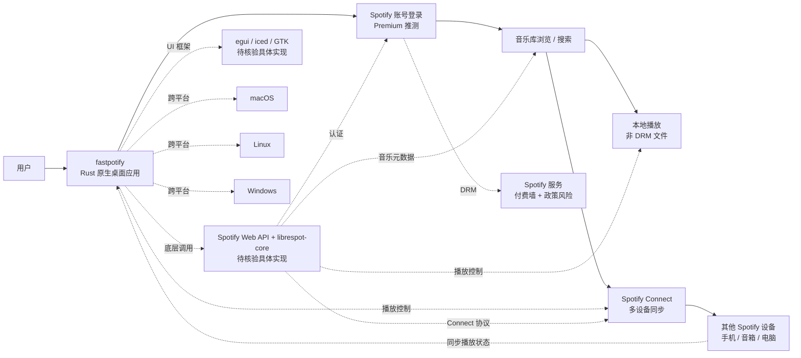

# crmne/fastpotify

## 一句话定位
Spotify Connect 原生 Rust 客户端——Spotify, native and fast. One lightweight Rust app for your whole library, local playback, and Spotify Connect on Linux, macOS, and Windows.，Rust，是 spotifyd / librespot 等老牌 Rust 项目的现代化升级，验证 Rust 在桌面客户端的持续吸引力。

## 它解决的问题
2026 年 Spotify 用户对"原生 / 轻量 / 跨平台"客户端的需求持续——官方 Spotify 客户端臃肿（Electron / 资源密集），spotifyd / librespot 等老牌开源项目停止更新或功能有限。crmne/fastpotify 直击这一痛点：(a) **native and fast**——Rust 原生实现，无 Electron；(b) **lightweight**——单文件应用，低资源占用；(c) **Spotify Connect**——多设备同步播放控制（区别于单纯本地播放）；(d) **Linux / macOS / Windows** 三平台覆盖。这是 Rust 在桌面客户端持续吸引开发者的样本。

## 为什么值得关注
- **Stars:** 3,357（截至 2026-09-07），11 天净增，单日均速 ~305⭐/day
- **Forks:** 146（fork/star **4.4%**，**显著低于**多数 trending 项目——可能反映"围观但不动手"或"fork 涉及 Spotify 账号 / DRM 配置门槛"）
- **语言:** Rust 主导（与 tobi/walgit 2443⭐ 共同显示 Rust 在桌面 / 工具栈持续吸引开发者）
- **跨平台:** Linux / macOS / Windows 三平台
- **Spotify Connect:** 多设备同步播放控制是差异化卖点
- **轻量级:** 单文件应用，低资源占用

## 热度来源判断
fastpotify 的热度来自三个趋势的交汇：(1) **Spotify 替代客户端刚需**——官方客户端臃肿，老牌开源项目（spotifyd / librespot）功能有限；(2) **Rust 桌面复兴**——Rust 在桌面客户端持续吸引开发者（与 tobi/walgit / MetaMask-AI/metamask-desktop 共同）；(3) **Spotify Connect 差异化**——多设备同步播放控制是 desktop 客户端的高级功能。

11 天 3,357⭐ / fork/star 4.4% 与"早期传播期 + DRM 门槛"特征一致。**提示：** Spotify 是付费服务，fastpotify 必须遵守 Spotify Terms of Service 与 libspotify-sdk / librespot-core 等开源库的协议边界；与 spotifyd / librespot 等老牌项目的关系需要核验（是新项目还是 fork）。

## 关键技术亮点
1. **Rust 原生实现:** 无 Electron，单文件应用，低资源占用
2. **Spotify Connect:** 多设备同步播放控制（区别于单纯本地播放）
3. **本地播放:** 支持本地音乐库播放（不受 Spotify DRM 限制的本地文件）
4. **跨平台:** Linux / macOS / Windows 三平台
5. **Spotify 账号集成:** 推测需要 Spotify Premium 账号（DRM 限制）
6. **轻量级 UI:** 推测采用 egui / iced 等 Rust 原生 UI 框架

## 架构师速览

| 决策问题 | 研究判断 | 证据边界 |
|---|---|---|
| 系统边界 | Spotify Connect 原生 Rust 客户端——跨 Linux / macOS / Windows 三平台，支持本地播放 + Spotify Connect | 边界由 trending 描述明示；具体 UI 框架（egui / iced / GTK）需 README 核验 |
| 主路径 | 用户打开 fastpotify → 登录 Spotify 账号（推测 Premium）→ 浏览 / 搜索音乐 → 本地播放或 Spotify Connect → 同步到其他设备 | 主路径为描述语义抽象；Spotify API 调用方式（librespot-core / Web API）未在 trending 中可见 |
| 关键权衡 | Rust 原生（轻量 / 快）vs UI 开发复杂度（Rust GUI 生态相对不成熟）vs Spotify Premium 门槛（部分功能需要付费）；Spotify Connect 协议兼容性 vs Spotify 官方政策变化风险 | 三平台覆盖由 trending 描述明示；具体 UI 框架与 Spotify API 调用方式需 README 核验 |
| 最小 PoC | 在 macOS 上下载 fastpotify → 登录 Spotify Premium 账号 → 播放一首歌曲 → 在手机上打开 Spotify → 切换到 fastpotify 作为播放设备 → 测试 Spotify Connect | 安装命令需 README 独立核验；Spotify Premium 门槛是真实采用障碍 |

## 架构启发
fastpotify 的核心启发是 **"Spotify 客户端应该原生 / 轻量 / 跨平台"**。当前 Spotify 官方客户端臃肿（Electron / 资源密集），spotifyd / librespot 等老牌开源项目停止更新或功能有限。fastpotify 用 Rust 重写 Spotify 客户端，提供原生性能 + 跨平台 + Spotify Connect 三大特性。更深层的启发是：**Rust 在桌面客户端的复兴**——2024-2026 年 Rust GUI 生态（egui / iced / Tauri / Dioxus）逐步成熟，Rust 在桌面客户端的吸引力提升，与 tobi/walgit / MetaMask-AI/metamask-desktop 共同验证这一趋势。

风险提示：**Spotify 官方政策是真实风险**——API 限流 / 客户端限制 / DRM 协议变化可能直接影响 fastpotify 可用性；Spotify Connect 的官方授权路径需要核验；spotifyd / librespot 等已有 Rust 项目的关系需要核验（是新项目还是 fork / 是否重复造轮子）。

## 架构图（MMD）

> 证据边界：此图只采用本档案已有可核验描述；"待核验"节点不应视为项目实现事实。

## 定位判断
**应用型项目（Spotify 原生客户端）。** crmne/fastpotify 是 Rust 在 Spotify 客户端的现代化尝试，11 天 3,357⭐ / fork/star 4.4% 显示该细分需求有真实用户。但作为独立产品的天花板：(a) Spotify 官方政策风险（API 限流 / DRM 限制）；(b) 与 spotifyd / librespot 等老牌项目的关系需要核验；(c) Spotify Premium 门槛限制用户群体；(d) 移动端竞争（Spotify 官方手机端体验已较好）。当前定位是"Rust Spotify 客户端头部样本"，向 Spotify Connect 深度或与 Home Assistant 等智能家居集成是两条路径。

## 风险/局限/泡沫点
- **Spotify 官方政策风险:** API 限流 / 客户端限制 / DRM 协议变化可能直接影响可用性
- **Spotify Premium 门槛:** 部分功能（特别是 Spotify Connect）需要付费账号，限制用户群体
- **与老牌项目关系:** spotifyd / librespot 等已有 Rust 项目的关系需要核验（是新项目还是 fork / 是否重复造轮子）
- **fork/star 4.4% 偏低:** 显著低于多数 trending 项目——可能反映"围观但不动手"或"fork 涉及 Spotify 账号 / DRM 配置门槛"
- **crmne 个人项目:** 长期可持续性 / Spotify 政策变化响应速度未验证
- **移动端竞争:** Spotify 官方手机端体验已较好，fastpotify 主要服务桌面用户

## 与同类项目的关系
- **vs Spotify 官方客户端:** 官方臃肿（Electron），fastpotify 轻量（Rust 原生）
- **vs spotifyd:** spotifyd 是 Spotify Connect daemon（无 UI）；fastpotify 是带 UI 的桌面客户端
- **vs librespot:** librespot 是 Rust 编写的 Spotify 库；fastpotify 可能基于 librespot-core
- **vs ncspot:** ncspot 是终端 Spotify 客户端（Rust）；fastpotify 是 GUI 客户端
- **vs tobi/walgit:** walgit 是 Rust 工具；共同验证 Rust 在桌面 / 工具栈持续吸引开发者

## 是否值得持续跟踪
**值得跟踪（Rust Spotify 原生客户端）。** fastpotify 代表了 Spotify 用户对"原生 / 轻量 / 跨平台"客户端的需求，与 Rust 桌面复兴趋势共同推动。建议关注：(a) Spotify 官方政策变化（API 限流 / DRM 限制）；(b) 与 spotifyd / librespot 的关系（是新项目还是 fork）；(c) Spotify Connect 的协议兼容性；(d) Rust GUI 生态成熟度。对 Spotify Premium 用户，fastpotify 是值得尝试的原生客户端。

## 后续观察点
- Spotify 官方政策变化（API 限流 / DRM 限制）
- 与 spotifyd / librespot 的关系（是新项目还是 fork）
- Spotify Connect 的协议兼容性 / 多设备同步质量
- Rust GUI 框架选择（egui / iced / GTK）
- 移动端 / Web 端扩展可能性
- crmne 个人项目的可持续性 / Spotify 政策变化响应速度

---
> 数据来源: GitHub API (2026-09-07) | Stars: 3,357 | Forks: 146 | License: 待核验 | 语言: Rust | 创建: 2026-08-27
