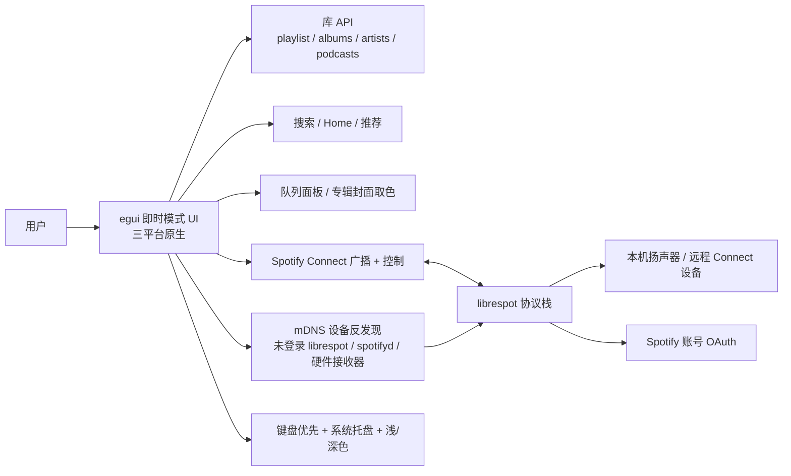

# crmne/fastpotify

## 一句话定位
Rust + egui + librespot 跨平台原生 Spotify 客户端替代——启动 <1s、无浏览器引擎、本地 Spotify Connect 接收 + mDNS 设备反发现完整库浏览 + 键盘优先。

## 它解决的问题
主流 Spotify 桌面客户端要么是 Electron 套壳（资源占用大 + 启动慢），要么依赖官方桌面二进制（闭源 + 平台限制）。fastpotify 直击这些痛点：(1) 用 Rust + egui 即时模式 UI 实现启动 <1s + 无浏览器引擎；(2) 用 librespot 开源 Spotify Connect 协议栈避开官方依赖；(3) 完整库浏览 / 搜索 / Home 推荐 / 艺术家页 / 队列面板 + mDNS 反发现未登录账户的 librespot/spotifyd/硬件接收器。

## 为什么值得关注（2026-08-29）
- **Stars:** 388（截至 2026-08-29），2 天起步，处于"早期爆发"阶段
- **Forks:** 待核验（API 检索未单独返回）
- **License:** MIT
- **语言:** Rust
- **活跃度:** created 2026-08-27，pushed_at 2026-08-28
- **平台支持:** Linux + macOS + Windows（README 明示）三平台原生发布
- **文档站:** fastpotify.rocks（README 链接明示）

## 热度来源判断
fastpotify 的热度是 **"Spotify 用户对 Electron 客户端不满 × Rust + egui 性能优势 × MIT 许可证 × 跨平台原生"** 的组合。Spotify 官方桌面客户端长期被诟病资源占用大，spotify-tui / Omarchy Spotify 等同类项目已证明"原生 + 轻量"是真实需求。388⭐/2 天说明非 AI 赛道的爆款阈值远低于 AI Coding 赛道，但仍是真实采用信号。需警惕：librespot 与 Spotify 官方协议兼容性长期可持续性 / Spotify API 政策变化。

## 关键技术亮点
1. **Rust + egui 即时模式 UI**："starts in well under a second, and stays small while it runs"（README 自述）+ "no browser engine anywhere in the process"（README 明确）
2. **librespot 协议栈**："playing music through librespot"（README 自述）—— 避开 Spotify 官方桌面二进制依赖
3. **mDNS 设备反发现**（README 明示）："a librespot, spotifyd, or hardware receiver waiting on the LAN is invisible to Spotify's API until it has an account. Fastpotify discovers those over mDNS and connects them for you, after which they behave like any other Spotify Connect device"——这是"控制层反发现"的有趣扩展，让未被 Spotify 账号"激活"的 librespot/spotifyd/硬件接收器也可控
4. **Spotify Connect 完整双向**：自身作为 Connect 设备（手机选它即可播放） + 控制其他 Connect 设备（音箱、手机、电脑）—— gapless / 320 kbps / 可选音量归一化 / 磁盘音频缓存
5. **完整库 + 完整 Home**：playlist / Liked Songs / saved albums / followed artists / podcasts / saved episodes + Home Made for you + Recently played + top artists + recommendations
6. **专辑封面取色** + **浅/深色/跟随系统** + **键盘优先**（`Ctrl+/` 列出所有快捷键） + **关闭窗口音乐继续**（Linux status notifier）

## 架构师速览

| 决策问题 | 研究判断 | 证据边界 |
|---|---|---|
| 系统边界 | 桌面客户端（Linux/macOS/Windows）+ librespot 协议栈；不依赖 Spotify 官方二进制 / 不内嵌浏览器引擎 | 三平台发布 + "no browser engine anywhere in the process" 是 README 明确表述；librespot 与 Spotify 官方协议的兼容性边界需独立验证 |
| 主路径 | librespot 认证 → 库 API → 本地 UI（egui 即时模式）→ 播放（librespot 解码）→ Connect 广播 | 路径抽象自 README；librespot 在跨平台上的 AP 鉴权持久化策略（PKCE / token refresh）需源码核验 |
| 关键权衡 | Rust 性能 vs egui 即时模式 UI 表现力 vs 跨平台 UX 一致性 vs Spotify API 政策依赖 | 启动时间 / 内存占用在 README 自述；UX 一致性（如 Apple Silicon / Windows ARM 表现）未给量化数据 |
| 最小 PoC | macOS 或 Linux 上以 PKCE 登录 → 验证自身作为 Connect 设备的发现 + 播放 → 验证 mDNS 发现并控制一台 librespot 节点 | PKCE / Connect 流程是 README 隐含假设；具体登录指引需 fastpotify.rocks 文档 |

## 架构启发
fastpotify 的核心启发是 **"消费类桌面应用的去 Electron 化仍有大量机会"**。当前 Spotify / Slack / Notion / Linear 等日常 SaaS 都被 Electron / Tauri WebView 主导，资源占用 + 启动速度 + UX 流畅度都让 Rust + 原生 GUI（egui / iced / slint）有机会。fastpotify 用 388⭐/2 天 + MIT + 三平台原生发布 + 完整功能矩阵，证明 **"个人开发者也能交付跨平台原生应用"** 是低门槛范本——特别是 Rust 生态对 librespot 等开源协议栈的成熟封装。更深层的启发是 **"mDNS 设备反发现"的设计**——让未被账号激活的 librespot/spotifyd/硬件接收器也可控，是"控制层反发现"对"中心化 API 依赖"的优雅绕过。

## 架构图（MMD）

> 证据边界：此图只采用本档案已有可核验描述；"待核验"节点不应视为项目实现事实。

## 定位判断
**生产可用项目（原生 Spotify 客户端替代）**。fastpotify 不是 Spotify 官方替代，而是"原生 + 轻量 + 跨平台 + 开源"细分赛道的头部样本。MIT + 三平台原生 + 完整功能 + mDNS 创新，让它在 librespot 生态的位置类比 spotify-tui（CLI 版）。是否能进入 Spotify 主流用户视野，取决于：(1) librespot 与 Spotify 官方协议的长期兼容性；(2) Spotify 官方对第三方客户端的政策；(3) 用户对去 Electron 体验的接受度。

## 风险 / 局限 / 泡沫点
- **librespot 协议兼容性**：librespot 是逆向工程的 Spotify Connect 协议实现，长期可持续性取决于 Spotify 协议变更不破坏兼容
- **Spotify API 政策依赖**：库 API / 搜索 / Home 推荐均依赖 Spotify Web API，第三方客户端政策风险存在
- **macOS / Windows ARM 兼容性**：README 未明示 Apple Silicon / Windows ARM 特定优化
- **388⭐/2 天数据的曲线不确定性**：非 AI 赛道爆款阈值远低于 AI Coding 赛道（PRAXIST 1451⭐），需观察长期曲线
- **个人项目属性**：crmne 个人维护，长期可持续性 / 治理结构待观察

## 与同类项目的关系
- **vs Spotify 官方桌面客户端**：官方客户端闭源 + Electron 套壳 + 资源占用大；fastpotify 原生 + 开源 + 轻量
- **vs spotify-tui**：spotify-tui 是 Rust + TUI 命令行版；fastpotify 是 Rust + egui 图形版——目标用户互补
- **vs Omarchy Spotify**：Omarchy Spotify 是另一款 Spotify 客户端，fastpotify README 明确"follows in the footsteps of Omarchy Spotify"
- **vs librespot-org/librespot**：librespot 是协议栈，fastpotify 是客户端——上层应用与下层协议的关系
- **vs nuphus（8-26）+ forte（8-25）**：本地优先 + Rust 范式的同期合流，但消费类 vs agent runtime 应用场景不同

## 是否值得持续跟踪
**值得跟踪（消费类 Rust 原生应用代表）**。fastpotify 代表了"去 Electron 化 + Rust 原生 + 跨平台"的消费类桌面应用复兴，是软件工程去 SaaS 化与本地优先赛道的具体落地。建议关注：librespot 协议兼容性、Spotify 官方政策、Apple Silicon / Windows ARM 优化、键盘优先与系统托盘体验。对 Spotify 用户，这是值得一试的开源替代；对消费类应用开发者，这是 Rust + egui 的低门槛范本。

## 后续观察点
- 30/60/90 天 stars / forks 曲线
- librespot 与 Spotify 官方协议的兼容性变更
- Spotify 官方对第三方客户端的政策变化
- Apple Silicon / Windows ARM 平台特定优化
- mDNS 反发现功能的稳定性（mDNS 在不同路由器 / 防火墙下的表现）
- egui 长期 UI 表现力（复杂界面的可维护性）

---
*首次记录：2026-08-29*
