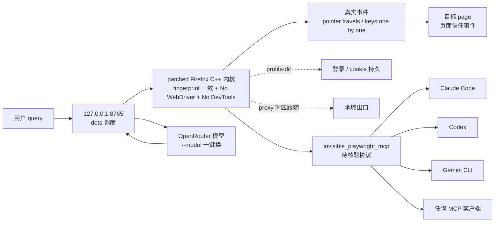

# feder-cr/dots

## 一句话定位
Open-source dots for the web：一个 AI agent 专属浏览器，patched Firefox C++ 内核（fingerprint 决定在引擎里），One identity per seed（屏幕 / 字体 / GPU / 时区语言一致），No WebDriver / DevTools / automation globals，A person's hands（pointer 真飞过去 + keys 逐个按下），`--model` 一键换 OpenRouter 任何模型，uvx 一行启动，`127.0.0.1:8765` 左对话右浏览器 live，`invisible_playwright_mcp` 把这个浏览器作为 server 给 Claude Code / Codex / Gemini CLI / 任何 MCP 客户端调用。

## 它解决的问题
AI agent 在网页上失败的根因 99% 不是模型差，是浏览器层之前就失败了——页面没加载、挑战出现、登录失效、点击没点上——这些都发生在模型思考之前。当前「playwright + stealth 插件 + JS 改 navigator」路线是脆弱的：fingerprint 由 JS 画上去，page 一检查就露；WebDriver flag、DevTools protocol、automation globals 在 page 里都能查到；pointer 是 dispatchEvent 而不是真实鼠标，keys 是 KeyboardEvent 而不是真实键盘。dots 直击这些痛点，把浏览器当作 AI agent 的真实基础设施：**fingerprint 决定在内核里**（patched Firefox C++）、One identity per seed（屏幕 / 字体 / GPU / 时区语言互相一致 + `--seed` 同 seed 每次都是同一个人）、No WebDriver / DevTools / automation globals in the page、A person's hands（pointer travels to what it clicks + keys pressed one at a time + 每一个事件都是 trusted event 页面收到）。解决的是 **「AI agent 在反爬 / 反 bot 网站上的真实可达性 + 任何模型可换 + 一行启动 + 任何 Agent Harness 可用」** 的浏览器层基础设施问题。

## 为什么值得关注（2026-10-01）
- **Stars:** 1931（截至 2026-10-01），2 天 1931⭐，fork 320，fork/star 16.6%
- **Forks:** 320（典型高 fork 严肃工程化持续关注信号）
- **License:** MIT（明确许可，商用清晰）
- **语言:** Python
- **活跃度:** created 2026-09-29，pushed_at 2026-10-01，持续高活跃
- **规模:** 10 KB（仅 README + Python 极小 repo，patched Firefox C++ 在子模块或外部 repo）
- **Topics:** 20 个覆盖 ai-agent / ai-agents / ai-browser / anti-detect-browser / browser-agent / browser-automation / chatgpt / dotfiles / dots / firefox / llm-agent / mcp / open-source-alternative / openai-dots / openrouter / playwright / stealth-browser / web-agent / web-automation

## 热度来源判断
feder-cr/dots 的热度是 **「AI agent 浏览器层失败是真实痛点 × patched Firefox C++ 内核是反检测严肃工程化 × 任何模型可换 × 任何 Agent Harness 可用 × 10 KB 极小 repo × MIT」** 的强劲组合。AI agent 是 2026 年最热赛道，但「agent 在反爬 / 反 bot 网站失败」是真实痛点——GitHub Copilot Coding Agent / Devin / Claude Computer Use / Operator 在 LinkedIn / Cloudflare 保护页 / Steam / 银行网站上 90% 失败根因是浏览器层之前。当前「playwright + stealth 插件」路线是脆弱封装，dots 把浏览器当作真实基础设施：fingerprint 决定在内核里、屏幕字体 GPU 时区语言互相一致、No WebDriver/DevTools/automation globals、pointer 真的飞过去 / keys 真的逐个按下、`--proxy` 让时区语言跟随出口、`--profile-dir` 让登录跨次持久、自次 `--model` 一键换 OpenRouter 上任何模型、`invisible_playwright_mcp` 把这个浏览器作为 server 给 Claude Code / Codex / Gemini CLI / 任何 MCP 客户端调用。热度 **真实且具严肃工程化深度**——10 KB 极小 repo + MIT + 全部 patches 在 C++ 内核 + 任何 Agent Harness 可用 + Not affiliated with OpenAI。

## 关键技术亮点
1. **patched Firefox C++ 内核:** fingerprint 决定在引擎里，不是 JS 画上去、page 一检查就露——这是反检测严肃工程化的关键
2. **One identity per seed:** 屏幕 / 字体 / GPU / 时区语言互相一致 + `--seed` 同 seed 每次都是同一个人——反检测 fingerprint 一致性
3. **No WebDriver / DevTools / automation globals:** page 里查不到 WebDriver flag、DevTools protocol、automation globals——是 stealth 严肃工程化的关键
5. **A person's hands:** pointer travels to what it clicks + keys pressed one at a time + 每一个事件都是 trusted event 页面收到——是反 bot 严肃工程化的关键
6. **`--profile-dir` 持久登录跨次:** 让登录跨次持久——是反 bot 严肃工程化的关键
7. **`--proxy` 时区语言跟随出口:** "Where it connects from is who it is" + 时区语言跟随 proxy 出口——是反 bot 严肃工程化的关键
8. **任何模型 on OpenRouter + `--model` 一键换:** OpenRouter 任何模型 + `--model` 一键换——是模型无关严肃工程化的关键
9. **uvx 一行启动 + 127.0.0.1:8765 左对话右浏览器:** uvx `--from git+...dots` + `--openrouter-key` 一行启动 + 127.0.0.1:8765 左对话右浏览器 live——是 UX 严肃工程化的关键
10. **`invisible_playwright_mcp` 给任何 MCP 客户端:** `invisible_playwright_mcp` 把这个浏览器作为 server 给 Claude Code / Codex / Gemini CLI / 任何 MCP 客户端调用——是 Agent Harness 无关严肃工程化的关键

## 架构师速览

| 决策问题 | 研究判断 | 证据边界 |
|---|---|---|
| 系统边界 | AI agent 专属浏览器；patched Firefox C++ 内核（fingerprint 决定在引擎里，page 看不到）+ 任何模型 on OpenRouter（`--model` 一键换）+ 任何 MCP 客户端（`invisible_playwright_mcp`） | 仅基于 README 描述的 patched Firefox C++ 内核、One identity per seed、No WebDriver/DevTools/automation globals、A person's hands（pointer travels + keys one by one）、`--profile-dir` 持久登录、`--proxy` 时区跟随出口、OpenRouter `--model` 一键换、uvx 一行启动、127.0.0.1:8765 左对话右浏览器 live、`invisible_playwright_mcp` 给 Claude Code/Codex/Gemini CLI/任何 MCP；具体 C++ patch 范围、`invisible_playwright_mcp` 协议未在档案中明示 |
| 主路径 | 用户 query → 127.0.0.1:8765 dots 调度 → patched Firefox C++ 内核（fingerprint 一致 + No WebDriver + No DevTools）→ 真实事件（pointer travels / keys one by one）→ 目标 page 信任事件 → OpenRouter 模型（`--model` 一键换）思考 → 浏览器执行 | 主路径为档案语义抽象；浏览器 ↔ 模型间的协议（是否为 MCP-style）未在档案中明示 |
| 关键权衡 | 反检测强度（fingerprint 一致 + 真实事件）vs 多 OS 兼容性 + 任何模型可换 vs OpenRouter 单一 provider + 任何 Agent Harness 可用 vs `invisible_playwright_mcp` 协议开放性 | 档案明示 patched C++ 内核、OpenRouter `--model`、uvx 一行启动、127.0.0.1:8765、`invisible_playwright_mcp` 给 Claude Code/Codex/Gemini CLI/任何 MCP、Not affiliated with OpenAI、MIT；多 OS 兼容性、C++ patch 维护成本、合规边界未在档案中讨论 |
| 最小 PoC | 在一台 Linux + uvx + `--seed 42` 启动 dots；用无头脚本访问 1 个高反爬网站验证「Same identity every run + trusted events」；再以 `--proxy` 切换出口验证 timezone 跟随 | PoC 范围、退出路径由档案「先单 fingerprint、最小 PoC、Seed 可复现」建议推导；具体 `invisible_playwright_mcp` 接口未公开 |
## 架构启发
feder-cr/dots 的核心启发是 **「AI agent 的浏览器层是关键基础设施，不是 SaaS wrapper」**。当前 AI agent 生态普遍把「playwright + stealth 插件 + JS 改 navigator」当作反检测的全部，但这是脆弱封装——fingerprint 由 JS 画上去、page 一检查就露；WebDriver flag、DevTools protocol、automation globals 在 page 里都能查到；pointer 是 dispatchEvent 而不是真实鼠标。dots 把浏览器当作 AI agent 的真实基础设施：fingerprint 决定在内核里、屏幕字体 GPU 时区语言互相一致、No WebDriver/DevTools/automation globals、pointer 真的飞过去 / keys 真的逐个按下、`--proxy` 让时区语言跟随出口、`--profile-dir` 让登录跨次持久、自次 `--model` 一键换 OpenRouter 上任何模型、`invisible_playwright_mcp` 把这个浏览器作为 server 给 Claude Code / Codex / Gemini CLI / 任何 MCP 客户端调用。更深层的启发是：**反检测的关键不是 stealth 插件，而是 fingerprint 一致性 + 真实事件 + Agent Harness 无关**——`--seed` 让同 seed 每次都是同一个人，`--proxy` 让时区语言跟随出口，`--profile-dir` 让登录跨次持久，`--model` 一键换 OpenRouter 任何模型，`invisible_playwright_mcp` 把这个浏览器作为 server 给任何 MCP 客户端调用。能否持续，取决于能否在多 OS（Windows / macOS / Linux）+ 多 Agent Harness（Claude Code / Codex / Gemini CLI / Cursor / Copilot / Goose）+ 多反爬机制（Cloudflare / DataDome / PerimeterX / 自研指纹检测）下保持 patched C++ 内核的稳定性。

## 架构图（MMD）

> 证据边界：此图只采用本档案已有可核验描述；"待核验"节点不应视为项目实现事实。

## 定位判断
**基础设施候选型项目（AI agent 浏览器层）。** feder-cr/dots 不再把浏览器当作「playwright + stealth 插件」的脆弱封装，而是把浏览器当作 AI agent 的真实基础设施：fingerprint 决定在内核里、屏幕字体 GPU 时区语言互相一致、No WebDriver/DevTools/automation globals、pointer 真的飞过去 / keys 真的逐个按下、`--proxy` 让时区语言跟随出口、`--profile-dir` 让登录跨次持久、自次 `--model` 一键换 OpenRouter 上任何模型、`invisible_playwright_mcp` 把这个浏览器作为 server 给 Claude Code / Codex / Gemini CLI / 任何 MCP 客户端调用。这是对 AI agent 失败的根因（浏览器层之前就失败了）的严肃工程化回应。1931⭐ + 320 fork + MIT + 10 KB + 20 个 topics 已显示严肃工程化深度。但「基础设施化」取决于一个关键问题：能否在多 OS（Windows / macOS / Linux）+ 多 Agent Harness（Claude Code / Codex / Gemini CLI / Cursor / Copilot）+ 多反爬机制（Cloudflare / DataDome / PerimeterX）下保持 C++ 内核严肃工程化的稳定性。目前定位是「最有影响力的反检测 AI agent 浏览器层基础设施」。

## 风险 / 局限 / 泡沫点
- **合规边界:** 反检测 AI 浏览器可能被用于「绕过网站反爬机制 + 服务条款违反 + 自动化批量操作 + 账号注册滥用」灰色场景，需要严肃评估合规边界（README 未明示合法使用边界）
- **多 OS 兼容性:** patched Firefox C++ 内核在 Windows / macOS / Linux 三端的兼容性未在档案中明示
- **反爬机制覆盖广度:** patched Firefox C++ 内核在多反爬机制（Cloudflare / DataDome / PerimeterX / 自研指纹检测）的鲁棒性未在档案中给出
- **服务商检测:** OpenAI / Anthropic / Google 等服务商的检测机制对反检测的响应未在档案中讨论
- **`--proxy` 出口稳定性:** proxy 服务商的多地域稳定性 + 文案合规性未在档案中给出
- **个人项目属性:** feder-cr 个人维护，2 天 1931⭐ + fork 320 但核心治理仍集中，可持续性存疑

## 与同类项目的关系
- **vs playwright + stealth:** playwright + stealth 是 JS 改 navigator 路线；feder-cr/dots 是 patched Firefox C++ 内核路线，fingerprint 决定在引擎里
- **vs OpenAI Operator / Anthropic Computer Use:** OpenAI Operator / Anthropic Computer Use 是 SaaS + 闭源 + 不能改 fingerprint；feder-cr/dots 是 MIT + 自管 + 可换 fingerprint + 可换模型
- **vs Camoufox / undetected-playwright:** Camoufox / undetected-playwright 是 stealth 包装；feder-cr/dots 是 patched Firefox C++ 内核（更深度）
- **vs 各浏览器厂商反 bot:** 各浏览器厂商反 bot 是 SaaS + 闭源 + 不能改；feder-cr/dots 是 MIT + 自管 + 可换 fingerprint
- **vs 各 Agent Harness:** 各 Agent Harness 内置 browser-use 是闭源；feder-cr/dots 是 MIT + `invisible_playwright_mcp` 任何 MCP 客户端

## 是否值得持续跟踪
**值得跟踪（AI agent 浏览器层基础设施）。** feder-cr/dots 代表了 AI agent「真实基础设施」诉求——fingerprint 一致性 + 真实事件 + 任何模型可换 + 任何 Agent Harness 可用 + 严肃工程化 + MIT，无论其本身成败，这一方向是行业趋势。建议关注：是否在多 OS（Windows / macOS / Linux）+ 多 Agent Harness（Claude Code / Codex / Gemini CLI / Cursor / Copilot）+ 多反爬机制（Cloudflare / DataDoma / PerimeterX）下保持 C++ 内核严肃工程化的稳定性、是否提供合规使用边界、是否提供商用授权路径。对 AI agent 用户，feder-cr/dots 是「真实可达性 + 任何模型可换 + 任何 Agent Harness 可用」严肃工程化方案，值得直接采用。

## 后续观察点
- 是否在多 OS（Windows / macOS / Linux）+ 多 Agent Harness（Claude Code / Codex / Gemini CLI / Cursor / Copilot）+ 多反爬机制（Cloudflare / DataDome / PerimeterX / 自研指纹检测）下保持 C++ 内核严肃工程化的稳定性
- 是否提供合规使用边界 + 商用授权路径
- `invisible_playwright_mcp` 协议是否公开 + 与 OpenAI Operator / Anthropic Computer Use 的兼容性
- 是否被 Anthropic / OpenAI / Cursor 等厂商集成进自家 Agent Harness 作为反检测底层
- 是否进入企业采用（金融 / 电商 / 票务等反爬严肃场景）

---
> 数据来源: GitHub API (2026-10-01) | Stars: 1931 | Forks: 320 | License: MIT | 语言: Python | 创建: 2026-09-29