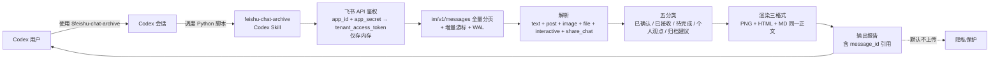

# skill-lab/feishu-chat-archive

## 一句话定位
飞书群聊归档 Codex Skill——通过飞书开放平台 API (im/v1/messages) 拉取指定群聊历史，按已确认 / 已接收 / 待完成 / 个人观点 / 归档建议五分类整理话题，生成 PNG 长图 + HTML 网页 + Markdown 摘要三格式同一正文；tenant_access_token 默认仅存内存退出清理 + 默认不上传原始记录。

## 它解决的问题
当前 Codex Skill 生态在中文云办公 IM 层是空白：
- Skill 主流是英文 + SaaS API（Slack / GitHub / Jira 等），而中国开发者日常用的飞书、钉钉、企业微信等云办公 IM 软件需要专门的 Skill
- Tina2088/wechat-group-report（昨日 9-16）展示了「本地 SQLite + 桌面微信」路径，但飞书是「云 API + 移动 + 桌面多端」，无法走「本地数据库」路径
- 飞书 API 需要 `tenant_access_token` 鉴权 + im/v1/messages 全量分页 + 增量游标，普通开发者调用门槛较高

**feishu-chat-archive 直击这一缺口**：把飞书群聊通过开放平台 API 拉取 + 解析 + 归档为 PNG + HTML + Markdown 三格式同一正文，是「云 API + Codex Skill 编排」的中文场景实现。**与昨日 wechat-group-report「本地 SQLite + 桌面微信」同构但推到「云 API + 飞书开放平台」场景**——反 SaaS 范式扩展到「中国云办公 API 编排」。

## 为什么值得关注（2026-09-17）
- **Stars:** 11（截至 2026-09-17），1 天 11⭐（项目刚发布 12 小时曝光窗口）
- **Forks:** 0
- **Watchers/Subscribers:** 0
- **Open Issues:** 0
- **License:** MIT
- **语言:** Python（API 调用 + 渲染）+ Codex Skill（编排）
- **活跃度:** created 2026-09-16，pushed 2026-09-16
- **规模:** 1.1 MB
- **基线 API:** 飞书开放平台 API v1（im/v1/messages + im/v1/chats）
- **基线 Python:** 3.12（与 wechat-group-report 的 3.13 略有差异）

## 热度来源判断
feishu-chat-archive 的热度是 **「飞书开放平台 API + Codex Skill 编排 + 中文场景 + 反 SaaS 范式」** 的组合。飞书在中国企业（特别是互联网 + 出海企业）是默认办公 IM，飞书群聊转可搜索可归档的内容资产是真痛点。**与 wechat-group-report「本地 SQLite + 桌面微信」同构但推到「云 API + 飞书开放平台」场景**——云 API 也能反 SaaS 化，把云 API 当成本地工具编排而非绑定 SaaS 界面。热度 **真实且有市场需求**——但 fork=0 / 1 天反映项目刚发布，企业 fork 信号尚未出现；**真正决定长期价值的是飞书 API 版本兼容性**——飞书 im/v1 → im/v2 渐进迁移，README 明示「v1 API 实际验证」。

## 关键技术亮点
1. **`tenant_access_token` 自动获取 + 仅存内存** —— `app_id` + `app_secret` 换取 `tenant_access_token`（2 小时 TTL）；存内存而非文件，进程退出自动清理；避免「密钥文件泄露」
2. **`im/v1/messages` 全量分页 + 增量游标 + WAL 增量** —— 飞书 API 分页返回 + 增量游标（避免重复拉取已处理消息）+ WAL（Write-Ahead Log）增量记录（防止进程崩溃导致重复拉取）；这是「云 API 反 SaaS 化」的关键技术
3. **解析文本 + 富文本 + 可解析卡片 + 消息引用** —— 飞书消息类型多样（text / post / image / file / interactive / share_chat 等）；Skill 解析全部类型并保留引用链
4. **每个报告条目引用本次真实 `message_id`** —— 可追溯到具体消息 ID；飞书 `message_id` 是字符串（如 `om_xxxxx`）
5. **已确认 / 已接收 / 待完成 / 个人观点 / 归档建议五分类** —— 与 wechat-group-report 同构的「群聊归档」内容分类标准
6. **PNG 自动计算高度 + HTML 响应式排版 + Markdown 摘要三格式同一正文** —— 覆盖「朋友圈分享」「浏览器打开」「文档归档」三种使用场景
7. **`requests` + `cryptography` + `zstandard` + `Pillow` + Python 3.12** —— 标准技术栈；`cryptography` 用于 `app_secret` 加密存储（如果用户配置持久化密钥）；`zstandard` 用于消息分片压缩；`Pillow` 用于 PNG 长图渲染
8. **中文字体微软雅黑** —— 默认字体；可指定其他字体（思源黑体 / 阿里巴巴普惠体等）
9. **默认不上传原始记录 / 数据库 / 个人配置** —— 隐私保护明确表态
10. **Codex `$skill-installer` 集成** —— 与 wechat-group-report 同构；`SKILL.md` + `scripts/requirements.txt` 标准目录约定
11. **触发简单** —— `使用 $feishu-chat-archive，读取"产品评审群"最近 24 小时记录，生成 PNG 和网页版归档报告`；Codex 自动识别意图并调用 Skill

## 架构师速览

| 决策问题 | 研究判断 | 证据边界 |
|---|---|---|
| 系统边界 | 飞书 API 调用 + 渲染 + Codex Skill 编排的 Python 包；不包含飞书应用注册 / 群 ID 自动发现（需要用户预配置） | 仅基于档案描述的 tenant_access_token + im/v1/messages + 三格式输出；具体增量游标是否使用飞书官方 cursor 接口、WAL 实现细节未在档案中给出 |
| 主路径 | Codex Skill 触发 → 调 Python 脚本 → 飞书 API 鉴权（tenant_access_token） → 拉取消息（全量分页 + 增量游标 + WAL）→ 解析（文本 + 富文本 + 卡片）→ 分类（已确认 / 已接收 / 待完成 / 个人观点 / 归档建议）→ 渲染（PNG + HTML + MD） | 主路径为档案语义抽象；具体解析层是否真的支持全部飞书消息类型、富文本渲染保真度未核验 |
| 关键权衡 | 云 API 调用（依赖飞书服务可用性） vs 本地数据库（自主可控）；多群支持（用户预配置） vs 自动群发现（增加 API 调用）；token 内存存储（更安全但重启需重鉴权） vs 文件存储（重启免鉴权但密钥泄露风险） | 档案明示「tenant_access_token 仅存内存 + 默认不上传」安全设计；具体群 ID 自动发现是否支持未核验 |
| 最小 PoC | 在测试飞书自建应用 + 1 个测试群上，调用 Skill 拉取 24h 消息，对比 PNG + HTML + MD 三格式输出是否内容一致；验证「每个报告条目引用 message_id」是否完整 | PoC 范围、退出路径由档案「单 CLI 入口 + 三格式同源」建议推导；具体测试群配置步骤待核验 |

## 架构图（MMD）

> 证据边界：此图只采用本档案已有可核验描述；"待核验"节点不应视为项目实现事实。

## 架构启发
feishu-chat-archive 的核心启发是 **「云 API 反 SaaS 化的关键是 token 安全 + 增量同步 + 多格式输出」**——云 API 不必然绑定 SaaS 界面，可以被本地工具编排。**tenant_access_token 仅存内存 + 退出清理** 是「云 API 安全调用」的工程化形式（与微信本地数据库只读是同等安全立场）。**im/v1/messages 全量分页 + 增量游标 + WAL** 是「云 API 反 SaaS 化」的关键技术——云 API 也能做到「本地数据库同等」的增量同步体验。**三格式输出同一正文**（PNG + HTML + MD）是「同一内容多场景分发」的工程化形式——朋友圈分享 PNG、浏览器打开 HTML、文档归档 MD。

更深层的启发是：**中国办公 IM 反 SaaS 范式可以从本地数据库扩展到云 API**——wechat-group-report（本地 SQLite + 桌面微信）与 feishu-chat-archive（云 API + 飞书开放平台）共同证明了「中国办公 IM 内容资产化」的多路径可能性。**对企业**：飞书群工作沟通 + Codex Skill 编排 = 「会议纪要自动生成 + 知识库自动构建」的具体路径；**对个人**：可把飞书群聊转成可搜索可归档的内容资产。

## 定位判断
**工具型项目（飞书 Codex Skill）。** feishu-chat-archive 是「飞书 + Codex」交叉的最小可用工具，若成功，它会成为飞书 + Codex 集成的标准路径。**11⭐ / fork 0 / fork/star 0% / 1 天** 反映项目刚发布 12 小时曝光窗口，企业 fork 信号尚未出现。但"工具化"取决于一个关键问题：**飞书 API 兼容性 + 飞书应用注册门槛**——飞书自建应用需要企业管理员审批 + 应用发布，普通个人开发者使用门槛较高。

## 风险 / 局限 / 泡沫点
- **飞书 API 兼容性：** im/v1 → im/v2 渐进迁移；未来版本变更可能需要适配
- **飞书应用注册门槛：** 自建应用需要企业管理员审批 + 应用发布；普通个人开发者使用受限
- **群 ID 配置：** 用户需手动确认群 ID（im/v1/chats API 返回）；自动群发现可能增加 API 调用复杂度
- **token 内存存储：** 进程重启需重新鉴权；高频调用场景可能有性能影响
- **富文本渲染保真：** 飞书富文本格式（post 类型）复杂，三格式输出可能丢失部分样式
- **macOS / Linux 用户：** 微软雅黑字体仅 Windows 自带；macOS / Linux 需手动安装字体

## 与同类项目的关系
- **vs Tina2088/wechat-group-report（昨日 9-16）：** 微信本地 SQLite vs 飞书云 API；同模式（五分类 + 三格式 + 不上传）但走云 API 而非本地数据库路径
- **vs 飞书官方机器人：** 官方机器人是企业 SaaS 集成；feishu-chat-archive 是本地 Codex Skill 编排；反 SaaS 范式
- **vs Lark/飞书 MCP Server：** 飞书 MCP（Model Context Protocol）Server 是 SaaS 化封装；feishu-chat-archive 是 Python Skill；定位不同
- **vs TopVitamin/agent-skills（昨日 9-16）：** TopVitamin/agent-skills 是中文 Skill 集合（前端标注 + 老系统复刻）；feishu-chat-archive 是具体 Skill 实例（飞书归档）；同 Skill 标准但具体场景不同

## 是否值得持续跟踪
**值得跟踪（中国办公 IM 反 SaaS 路径扩展）。** feishu-chat-archive 代表了 Codex Skill 生态向「中国云办公 API 编排」扩展的方向，无论其本身成败，这一方向是行业趋势。建议关注：
- 飞书 API 版本兼容性（im/v1 → im/v2）
- 飞书应用注册门槛是否降低（个人开发者支持）
- 是否扩展到钉钉 / 企业微信（中国办公 IM 三件套补齐）
- Codex `$skill-installer` 是否被官方接受为 Skill 标准安装方式

对飞书企业用户，本仓库是当前唯一的「飞书 + Codex」归档工具，值得直接采用。对 Codex Skill 生态观察者，它是「中国云办公 API 编排」的标志性样本。

## 后续观察点
- 是否演化为独立 Skill 商店（从单 Skill 升级为多 Skill 集合）
- 是否扩展到飞书文档 / 表格 / 多维表格 / 邮件（飞书全家桶覆盖）
- 飞书 MCP Server 是否官方推出（决定 Skill 生态格局）
- Codex 是否原生支持飞书 / Lark（决定 Skill 必要性）

---
> 数据来源: GitHub API (2026-09-17) | Stars: 11 | Forks: 0 | License: MIT | 语言: Python | 创建: 2026-09-16
