# mrsarac/ff-tracking

## 一句话定位
用 Rust + fframes 1.2 + Skia Metal GPU + 一个 SkSL shader 把「6 秒 12 镜头 + 全部像素和声音从代码合成」的程序化终端短视频做到严肃工程化形态——一个 demo 视频仓库，展示 fframes（dmtrKovalenko/fframes）严肃工程化承诺可落地。

## 它解决的问题
传统终端截图/短视频工具要么是纯 ASCII 录制（无视觉冲击），要么是 ffmpeg + stock 视频 + stock 配乐（不易复制）。ff-tracking 直击中间地带：用程序化方法把「agent 思考过程（chain of thought）」画成动画——虚拟摄像机跟随每个字符、tracker 锁定、14 个 box 塌缩成 Done pill、全部像素和声音从代码合成。解决的是 **「用代码合成 AI agent 思考视频的可复现方法」** 的 niche 问题，本质上是 fframes 1.2 严肃工程化承诺的展示 demo。

## 为什么值得关注
- **Stars:** 480（截至 2026-10-10），1 天 480⭐ ⑂27 fork/star 5.6%
- **Forks:** 27，社区参与度中等
- **Size:** 4906 KB（release v1.0.0 tracking.mp4 1080p with sound 是大文件主导）
- **License:** MIT
- **语言:** Rust 2024 edition
- **活跃度:** created 2026-10-09，pushed_at 2026-10-09，**1 天 480⭐ ⑂27 fork/star 5.6% 反映快速积累**
- **依赖:** fframes 1.2 + Skia Metal + 一个 SkSL shader
- **发布:** release v1.0.0 含 tracking.mp4 1080p with sound
- **社交:** x.com/0xsarac/status/2108515856544317489

## 热度来源判断
ff-tracking 的热度是 **「fframes 1.2 严肃工程化承诺展示 × Skia Metal GPU × 6 秒 12 镜头 × Real coordinates × Focus that follows the tracker × Chain of thought drawn × 14 box 塌缩 Done pill」** 的组合。本质上是一个 demo 视频仓库，借助 release v1.0.0 含 1080p tracking.mp4 的可视化效果快速吸星。1 day 480⭐ ⑂27 fork/star 5.6% 反映「好玩的 demo」驱动 fork/community 参与；但项目本身是 single-artist（mrsarac 1 人），是否扩展为完整工具链需观察。

## 关键技术亮点
1. **Rust 2024 + fframes 1.2:** 一个 SkSL shader 多次复用的 fframes 框架
2. **Skia Metal GPU:** GPU 渲染管线，metal 后端
3. **Real coordinates:** x: 1403 y: 559 是真实像素位置（不是 random），便于追踪/调试
4. **Focus that follows the tracker:** 虚拟摄像机 + 深度场跟随追踪 box
5. **Chain of thought drawn:** box → 边 → 点 把 agent 思考顺序画出来
6. **Six shots twelve looks:** 6 种调色板（paper/thermal/phosphor/amber/navy/neon）每 0.5s 切换

## 架构师速览

| 决策问题 | 研究判断 | 证据边界 |
|---|---|---|
| 系统边界 | Rust 2024 + fframes 1.2 + Skia Metal GPU + 一个 SkSL shader 程序化生成 6 秒短视频；仓库是单一 demo 项目 | 基于 README + release v1.0.0 + mrsarac 个人维护；后续是否会扩展为完整工具链、是否覆盖更多终端场景未在档案中给出 |
| 主路径 | terminal state → fframes 1.2 passes → SkSL shader → Skia Metal → 1080p mp4 + synthesized audio | 主路径为 README 语义抽象；具体 frame 时序、shader 编译路径、audio 合成算法待核验 |
| 关键权衡 | 单一 demo 视频项目 vs 完整工具链 vs 单一艺术家 (mrsarac 1 人) 治理可持续性 vs release v1.0.0 MP4 文件主导仓库 size | 档案明示 1 day 480⭐ ⑂27 fork/star 5.6% 反映快速积累；长期是否扩展、其他平台支持待核验 |
| 最小 PoC | clone 仓库 → cargo build --release → 跑 demo 验证 1.0.0 release 跟踪输出在终端能重现 chain-of-thought 视觉 | PoC 范围、退出路径由档案"先单 demo、最小依赖、可复现"建议推导；具体测试场景、benchmark、SLO 指标待核验 |

## 架构启发
ff-tracking 的核心启发是 **「程序化视频生成可用 Rust + fframes + Skia Metal 严肃工程化承诺，且所有像素和声音都从代码合成 — 不依赖 stock 视频/音频」**。这一思路把「短视频 = 取景+剪辑+配乐」的旧工流程压缩为「代码即视频」，对 agent thought 可视化、启动短片、tech demo 视频等 niche 有启发意义。更深层的启发是：**程序化内容的可复现性是其在 AI 时代严肃工程化承诺的护城河**——同一份代码生成同一视频，比 stock 视频稳定。ffframes 1.2 + SkSL shader 是严肃工程化承诺的载体，类似 shadertoy 的严肃工程化。

## 架构图（MMD）

> 证据边界：此图只采用本档案已有可核验描述；"待核验"节点不应视为项目实现事实。

```mermaid
flowchart LR
  Terminal[Agent terminal state<br/>thinking/reading/tool_call] --> Frames[fframes 1.2<br/>2 passes]
  Frames --> Shader[一个 SkSL shader<br/>共享 GPU passes]
  Shader --> Skia[Skia Metal GPU]
  Skia --> Render[6 秒 12 镜头<br/>paper/thermal/phosphor/amber/navy/neon]
  Render --> Tracker[Tracker box + Real coordinates<br/>Chain of thought 节点→边→点]
  Tracker --> Camera[虚拟摄像机<br/>Focus follows tracker<br/>Depth of field racking]
  Camera --> Audio[Procedural audio<br/>beep panned to box]
  Camera --> Compose[Compose + 14 box 塌缩成 Done pill + 红锁 2 帧 + 扫描线]
  Audio --> Compose
  Compose --> MP4[release v1.0.0<br/>tracking.mp4 1080p with sound]
  MP4 --> Output[下载/播放/分享]
  Output -.边界.-> Risk[Single demo project<br/>mrsarac 1 人治理<br/>是否扩展为完整工具链待核验]
```

## 定位判断
**演示型 niche 项目（ffframes 严肃工程化承诺的 demo 视频）。** ff-tracking 不是产品工具而是展示 demo，借 release 1.0.0 含 1080p tracking.mp4 的可视化效果快速吸星。其价值在于 **「证明 fframes 1.2 + Rust 2024 + Skia Metal + 一个 SkSL shader 可以严肃工程化合成 6 秒程序化视频」**。决定其后续价值的是 mrsarac 是否会扩展为完整工具链（多终端场景、多调色板、多语言、API 化）。

## 风险 / 局限 / 泡沫点
- **single demo project:** 仓库本质是 1 个 mp4 + 代码，扩展方向不明
- **个人项目:** mrsarac 1 人维护，长期治理可持续性存疑
- **fframes 上游依赖:** dmtrKovalenko/fframes 上游变化会冲击 ff-tracking
- **macOS / Metal 绑定:** Skia Metal 后端，目前只在 Apple GPU 实测
- **热度依赖可视化效果:** 1 day 480⭐ ⑂27 fork/star 5.6% 反映 demo 视频驱动，非工具刚需
- **与 stock 视频生态并行:** 不能直接替代 ffmpeg + stock 视频工具链

## 与同类项目的关系
- **vs ffmpeg + stock 视频:** 那些是工具体系；ff-tracking 是程序化合成 demo
- **vs dmtrKovalenko/fframes:** 父项目，更通用；ff-tracking 是其 fframes 1.2 严肃工程化展示
- **vs Skia/Metal 严肃工程化项目:** 类似 shadertoy/shader compiling 思路但绑终端
- **vs agent thought 可视化（如 openai/llm-chain）：** 那种是文本工具；ff-tracking 是视频化
- **vs manim / matplotlib animation:** 那些是数学可视化；ff-tracking 是终端可视化

## 是否值得持续跟踪
**值得适度跟踪（程序化视频严肃工程化承诺 niche）。** ff-tracking 代表了「代码即视频」的严肃工程化承诺 + agent thought 可视化 niche；无论其本身成败，「程序化合成视频」方向是合理 evolution。建议关注：mrsarac 是否扩展为完整工具链、fframes 1.2 上游演进、是否出 API/可嵌入 SDK。对终端可视化爱好者 / agent thought 可视化研究员，这是一个 cool demo。

## 后续观察点
- 是否演化出 SDK / API 化（让其他项目可嵌入 fframes 1.2 + Skia Metal 渲染）
- 其他调色板 / 终端场景 / 语言支持是否扩展
- release v1.x 之后的可持续性（v2.0 计划、roadmap）
- mrsarac 个人是否演化为团队维护
- fframes 1.2 上游演进对 ff-tracking 的影响
- 是否有企业采用（如 AI agent 启动短片、tech conference demo 视频自动化）

---
> 数据来源: GitHub API (2026-10-10) | Stars: 480 | Forks: 27 | License: MIT | 语言: Rust | 创建: 2026-10-09 | release: v1.0.0 含 tracking.mp4
