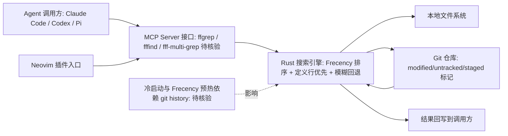

# fff

## 一句话定位
AI Agent 专用高速文件搜索工具包——Rust 实现，Frecency 排序 + 定义行优先 + 智能模糊回退，支持 MCP/Nvim/Pi，Agent 不再浪费 Token 做 grep。

## 它解决的问题
AI Agent 在代码库中搜索文件和内容时，传统工具（ripgrep/fzf）返回大量未排序结果，消耗大量 Token 且经常找不到关键文件。fff 通过 Frecency 排序和定义行优先，让 Agent 更快、更准、更省 Token 地定位代码。

## 为什么值得关注（2026-06-03）
- **Agent 工具链分工细化**：文件搜索成为独立专业服务，通过 MCP 提供给 Agent
- **Frecency 排序**：使用频率 + 最近使用，比纯文本匹配更符合开发直觉
- **定义行优先**：Rust 侧直接分类代码定义行，Agent 不需要额外解析
- **MCP 原生**：Claude Code / Codex / Pi 等直接接入
- **+424 stars/day**，增长健康

## 热度来源判断
- 起源于 Neovim 插件（用户基础大），自然扩展到 Agent 场景
- Agent Token 优化是刚需，fff 直接解决痛点
- Rust 性能保障 + MCP 标准支持

## 关键技术亮点亮点
1. **Frecency 排序**：文件访问频率 + 最近使用时间加权，自动从 git history 预热
2. **智能大小写 + 模糊回退**：精确匹配零结果时自动切换模糊搜索
3. **定义行分类**：Rust 侧识别函数/类定义行，优先展示
4. **Git 感知**：标记 modified/untracked/staged 文件
5. **MCP Server**：提供 ffgrep/fffind/fff-multi-grep 三个工具

## 架构师速览

| 决策问题 | 研究判断 | 证据边界 |
|---|---|---|
| 系统边界 | fff 是 Rust 实现的本地文件搜索 CLI/MCP Server，入口面向 Agent（Claude Code/Codex/Pi）与 Neovim；外接本地文件系统与 git 仓库，不连远程模型/服务 | 未证实在远端部署形态；MCP 三个工具名（ffgrep/fffind/ff-multi-grep）来自档案未源码核验 |
| 主路径 | 调用方→MCP/CLI 接口→Rust 索引与排序引擎（Frecency + 定义行优先 + 模糊回退 + git 感知）→本地文件/git 数据源→结果回写 | 内部模块拆分、索引是否常驻、缓存层细节档案未给出 |
| 关键权衡 | 排序精度与冷启动代价：Frecency 需 git history 预热，新仓库首次体验差；模糊回退换来召回但可能引入噪音 | 未给出与 ripgrep/fzf 的基准对比数据；Token 节省为定性主张 |
| 最小 PoC | 单一 Agent 渠道（如 Claude Code）接入 MCP Server，给最小文件权限与可审计日志，在中小型仓库验证 Frecency 排序与定义行优先的实际收益，再扩展多 Agent | 大型代码库性能（100K files）为观察项未实测 |

## 架构启发
- Agent 工具调用从「自己 grep」到「调用专业搜索服务」，是 MCP 生态分工的典型案例
- Frecency 排序思路可迁移到其他 Agent 工具（如 API 文档搜索、配置查找等）

## 架构图（MMD）

> 证据边界：此图只采用本档案已有可核验描述；“待核验”节点不应视为项目实现事实。

## 定位判断
**工具型，有潜力成为 Agent 工具链标准组件。** 文件搜索是 Agent 高频操作，专业工具的效率提升立竿见影。

## 风险/局限/泡沫点
1. 与 ripgrep/fzf 等成熟工具竞争，需持续证明 Agent 场景的差异化价值
2. Frecency 数据需要预热，新项目首次体验可能不突出
3. 贡献者相对集中，社区可持续性需观察

## 与同类项目的关系
- **ripgrep/fzf**：通用搜索工具，fff 在 Agent 场景做差异化
- **codegraph/Understand-Anything**：代码图谱层，fff 做文件级搜索，互补关系
- **headroom**：Token 压缩层，fff 减少搜索 Token 消耗，互补

## 是否值得持续跟踪
**是。** Agent 文件搜索是高频刚需，MCP 生态的分工细化趋势明确。

## 后续观察点
1. MCP 集成的 Agent 覆盖范围
2. 大型代码库（如 Linux Kernel 100K files）的性能表现
3. 社区贡献的扩展和集成

---

*档案创建于 2026-06-03 · 数据截止 2026-06-03 06:00 CST*
