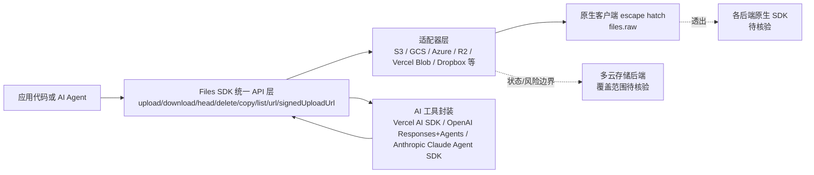

# Files SDK

## 一句话定位
统一存储 SDK，一套 API 覆盖 S3、GCS、Azure、R2、Vercel Blob、Dropbox 等后端，附带 AI Agent 工具封装。

## 它解决的问题
每个云存储后端都有自己的 SDK 和 API 风格，开发者需要为每个后端写不同的代码。Files SDK 提供统一接口，换后端只改一行 import。

## 为什么值得关注（2026-05-14）
- **AI 工具封装是关键差异点**：内置 Vercel AI SDK、OpenAI Responses/Agents、Anthropic Claude Agent SDK 的工具封装
- 这说明 Agent 需要操作存储的能力正在成为基础设施标配
- Web 标准 I/O（Blob / File / ReadableStream）

## 热度来源判断
热度适中。642 stars 在 6 天内不算爆发，但方向正确。统一存储 API 本身不新鲜（aws-sdk 本身就统一了 S3 兼容接口），但 AI Agent 工具封装增加了新价值。

## 关键技术亮点亮点
1. **统一 API**：upload / download / head / delete / copy / list / url / signedUploadUrl，所有后端一致
2. **AI SDK 封装**：一行代码让 Agent 读写你的存储桶
3. **Tree-shakeable**：每个 adapter 独立入口点，不引入无用代码
4. **Escape hatch**：`files.raw` 暴露原生客户端，不限制高级功能

## 架构师速览

| 决策问题 | 研究判断 | 证据边界 |
|---|---|---|
| 系统边界 | Files SDK 是 TypeScript 编写的客户端 SDK 库，位于应用代码与多后端存储（S3、GCS、Azure、R2、Vercel Blob、Dropbox）之间，并通过 AI 工具封装桥接 Vercel AI SDK、OpenAI Responses/Agents、Anthropic Claude Agent SDK | 边界基于一句话定位与标签（storage、s3、sdk、ai-tools、unified-api、cloud-storage）推断；具体后端覆盖清单与 AI SDK 支持范围以源码/README 为准 |
| 主路径 | 应用调用统一 API（upload/download/head/delete/copy/list/url/signedUploadUrl）→ 经由对应 adapter 路由到原生后端客户端或经由 `files.raw` 透出原生客户端；Agent 经 AI SDK 封装调用同一接口进行读写 | 主路径依据"统一 API + Escape hatch + AI 工具封装"三条亮点描述；各 adapter 的协议层与流式处理细节待核验 |
| 关键权衡 | 统一接口带来的切换便利 vs. 通过 escape hatch `files.raw` 暴露的原生客户端深度；tree-shakeable 多 adapter 设计减小包体 vs. 维护多条后端适配路径的成本 | 权衡来自"统一 API + Escape hatch 模式"亮点与"个人/小团队项目长期维护不确定性"风险段；性能、协议层、各后端覆盖率未在档案中量化 |
| 最小 PoC | 单一后端（如 R2 或 S3 兼容）单文件上传/下载走统一 API，加一个 AI SDK（Vercel AI SDK 或 OpenAI Agents）让 Agent 触发一次读写，最后通过 `files.raw` 验证一条 escape hatch 路径并核对 tree-shaking 效果 | PoC 取自项目现有能力描述；可用后端、AI SDK 版本、鉴权方式与退出路径尚未在档案中给出 |

## 架构启发
- 存储 SDK 的"AI 工具化"是新趋势 — Agent 需要操作文件，SDK 需要提供 Agent 友好的接口
- 统一 API + Escape hatch 模式是好的 API 设计哲学：默认简单，需要时深入

## 架构图（MMD）

> 证据边界：此图只采用本档案已有可核验描述；“待核验”节点不应视为项目实现事实。

## 定位判断
工具型。面向开发者的 SDK，不是平台或基础设施。但反映了"Agent 工具链"的基础设施化趋势。

## 风险 / 屧限 / 泡沫点
1. **市场规模**：统一存储 SDK 的市场已经被 aws-sdk 等占据，差异化不够大
2. **AI 工具封装较浅**：目前只是简单的文件操作封装，Agent 场景可能需要更复杂的权限和审计
3. **个人/小团队项目**：长期维护和生态建设存在不确定性

## 与同类项目的关系
- **aws-sdk / @aws-sdk/client-s3**：AWS 官方 SDK，只覆盖 S3
- **flystorage**：另一个统一存储抽象
- **tus**：文件上传协议，不同层面的解决方案

## 是否值得持续跟踪
**短期观察**。AI Agent 工具封装的方向值得跟踪，但项目本身需要更多时间验证。

## 后续观察点
1. AI Agent 工具封装是否被主流 AI SDK 原生支持
2. 社区和贡献者增长情况
3. 是否有企业用户采用

---
*首次记录：2026-05-14*
