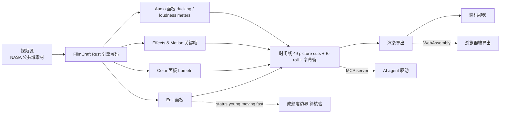

# storytold/filmcraft

## 一句话定位
Adobe Premiere Pro 视频剪辑 / 调色 / 音效工作流的 clean-room Rust 重实现，跨 macOS/Windows/Linux + 浏览器 WebAssembly，由 ArtCraft 团队 + MIT OR Apache-2.0 推出。

## 它解决的问题
Adobe Premiere Pro 是视频剪辑行业事实标准，但闭源 + 订阅制 + 平台限制（macOS/Windows，无 Linux）+ 与其他 Adobe 产品强绑定。filmcraft 是其"开源清洁替代"：100% Rust + clean-room + 跨 4 平台 + WebAssembly + MCP server（agent-ready）+ MIT OR Apache-2.0 商用清晰。目标用户是视频剪辑师（想要 Premiere Pro 等价工作流但不愿付费）、Linux 平台用户（Premiere Pro 不支持）、AI agent 开发者（通过 MCP server 驱动视频剪辑）。

## 为什么值得关注
- **Stars:** 3,143（截至 2026-10-08），8 天突破 3100
- **Forks:** 985，社区高度活跃
- **License:** MIT OR Apache-2.0
- **语言:** Rust
- **覆盖:** Edit / Color / Effects & Motion / Audio / Titles & Captions / Formats & Codecs / Export / Interchange / Agents（MCP）九大工作流
- **演示:** NASA Apollo 11 公共域素材剪成三分钟纪录片（含 49 picture cuts + B-roll + 字幕轨 + 音频 ducking + named markers + 渲染）
- **ArtCraft 全家桶:** photocraft + filmcraft + lightcraft + pdfcraft + vectorcraft + effectcraft 6 件套
- **跨平台:** macOS / Windows / Linux 原生 + 浏览器 WebAssembly

## 热度来源判断
filmcraft 的热度是 **"Adobe Premiere Pro 替代刚需 × clean-room Rust 重实现 × 4 平台覆盖 × MCP agent-ready × ArtCraft 全家桶"** 的强劲组合。Adobe 闭源订阅是长期痛点，但开源替代品（Kdenlive、Olive、OpenShot 等）功能深度不足或稳定度欠佳。filmcraft 通过 Rust + 4 平台 + WebAssembly + MCP 提供差异化能力，且作为 ArtCraft 全家桶成员享有"Adobe 创意套件完整替代"的网络效应。985 个 forks 反映视频剪辑社区的高度期待。热度**真实且具 Adobe 替代品潜力**——但需警惕：（1）"young and moving fast" 与稳定生产工具的差距；（2）video codec 覆盖广度未明示；（3）Lumetri 调色严谨度未与 DaVinci Resolve 等专业工具量化对比。

## 关键技术亮点
1. **clean-room Rust 重实现：** 100% Rust + 不参考 Adobe 闭源代码
2. **4 平台覆盖：** macOS / Windows / Linux 原生 + WebAssembly 浏览器端
3. **9 大工作流：** Edit / Color / Effects & Motion / Audio / Titles & Captions / Formats & Codecs / Export / Interchange / Agents
4. **Lumetri 调色：** Premiere Pro 同款调色面板
5. **字幕轨：** NASA 任务字幕示例
6. **音频 ducking + loudness meters：** 专业音频工作流
7. **named markers：** 时间线命名标记
8. **MCP server（agent-ready）：** AI agent 可驱动视频剪辑
9. **ArtCraft 全家桶协同：** 与 photocraft / lightcraft / pdfcraft / vectorcraft / effectcraft 互补
10. **MIT OR Apache-2.0 商用清晰：** 双 license

## 架构师速览

| 决策问题 | 研究判断 | 证据边界 |
|---|---|---|
| 系统边界 | Adobe Premiere Pro 工作流的 clean-room Rust 重实现：视频剪辑 + 调色 + 音效 + Lumetri 关键帧 + 字幕轨 + 音频 ducking + loudness meters + named markers + 跨 macOS/Windows/Linux + Web WebAssembly + ArtCraft 团队 + Discord + getartcraft.com + MIT OR Apache-2.0 | 仅基于 README 描述的 FilmCraft 工作流；具体 video codec 支持广度 / Lumetri 算法细节 / 多 GPU 同步未在档案中明示 |
| 主路径 | 视频源（NASA 等公共域素材）→ FilmCraft 引擎解码/合成/调色 → Edit/Color/Effects/Audio 等面板 → 渲染导出 | 主路径为档案语义抽象；具体 video pipeline 实现、GPU compositor、WebAssembly 边界未在档案中讨论 |
| 关键权衡 | clean-room Rust 重实现 vs Adobe Premiere Pro 闭源 + 跨 macOS/Windows/Linux/Web vs 单平台 + 100% Rust vs 部分原生 + Lumetri 调色 vs 第三方 LUT + agent-ready（MCP）vs 单 GUI + MIT OR Apache-2.0 vs Adobe 商业授权 + young moving fast vs 稳定 | 档案明示 100% Rust + clean-room + 跨 4 平台 + Web WebAssembly + MCP + MIT OR Apache-2.0 + ArtCraft 团队；具体 video codec 支持广度 / Lumetri 算法严谨度 / WebAssembly 性能边界未在档案中讨论 |
| 最小 PoC | git clone storytold/filmcraft → 在 macOS/Windows/Linux 上 cargo build/run → 加载 NASA 公共域素材 → 验证 Edit/Color/Audio 三面板 → 加字幕 → 渲染一段输出 → 验证 MCP 接口 → 跟踪 step1–step8 | PoC 范围由档案「Lumetri 关键帧/字幕轨/音频 ducking/loudness meters/named markers + 跨 4 平台 + Web WebAssembly + MCP」建议推导；具体 video codec / Lumetri 算法严谨度 / MCP tool 完整度未在档案中讨论 |

## 架构启发
filmcraft 的核心启发是 **"Adobe 创意套件 clean-room 重实现需要 Rust + 跨平台 + agent-ready 三件套"**。当前 Adobe 替代品（Kdenlive、Olive 等）多停留在 C++/Python，单平台，agent 集成弱。filmcraft 通过 Rust + WebAssembly + MCP server 三件套组合，提供"原生 + 浏览器 + agent 驱动"三位一体能力。这种架构特别适合 AI 时代——MCP server 让 agent 能直接驱动视频剪辑，WebAssembly 让浏览器端剪辑成为可能。更深层的启发是：**ArtCraft 全家桶（6 件套）形成 Adobe 创意套件完整开源替代的网络效应**。单个 photocraft / filmcraft 难以撬动 Adobe，但 6 件套联合可提供"用户离开 Adobe 的完整路径"。决定其能否成为"视频剪辑杀手"的是 video codec 覆盖广度 + Lumetri 严谨度 + MCP tool 完整度。

## 架构图（MMD）

> 证据边界：此图只采用本档案已有可核验描述；"待核验"节点不应视为项目实现事实。

## 定位判断
**工具型项目（Adobe Premiere Pro 杀手）。** filmcraft 是 storytold ArtCraft 全家桶中负责视频剪辑的产品，与 photocraft（Photoshop）、pdfcraft（Acrobat）、lightcraft（Lightroom）、vectorcraft（Illustrator）、effectcraft（After Effects）形成"Adobe 创意套件"全替代组合。8 天 3143⭐ ⑂985 fork/star 31.4% 说明市场对该方向的强需求。Rust 重实现 + WebAssembly + MCP 三件套是其差异化优势（任何 Adobe 替代品都没有这三件套组合）。决定其长期价值的是 video codec 覆盖广度 + Lumetri 调色严谨度 + MCP tool 完整度 + WebAssembly 性能边界。

## 风险/局限/泡沫点
- **codec 覆盖未明示：** 具体 H.264/H.265/ProRes 等支持矩阵未列出
- **Lumetri 严谨度待核验：** 与 DaVinci Resolve 等专业调色工具的差距未量化
- **WebAssembly 性能边界：** 浏览器端大视频编辑的可行性未充分测试
- **agent-ready 覆盖广度：** MCP server 的 tool 集合完整度未公开
- **status young moving fast：** 与稳定生产工具（DaVinci、Resolve）差距
- **商业化路径不明：** ArtCraft 团队是否计划商业版本
- **Adobe 法律风险：** clean-room 重实现虽合法，但 Adobe 可能推出对抗措施
- **依赖上游 codec 库：** Rust 生态的 codec 库（ffmpeg-rs 等）成熟度影响
- **GPU 加速覆盖：** 跨平台 GPU 加速（CUDA/Metal/Vulkan/WebGPU）的完整性
- **协作功能：** 团队协作 / 项目共享功能未明示

## 与同类项目的关系
- **vs Kdenlive / Olive：** 跨平台但 C++，filmcraft Rust 优势
- **vs DaVinci Resolve：** 专业级闭源，filmcraft 开源但功能深度不足
- **vs OpenShot / Shotcut：** Python/Qt，filmcraft Rust + MCP 差异化
- **vs Adobe Premiere Pro：** 商业闭源，filmcraft 清洁替代
- **vs storytold 全家桶：** filmcraft 是 ArtCraft 6 件套之一，跨产品协作潜力

## 是否值得持续跟踪
**值得跟踪（视频剪辑杀手）。** filmcraft 与 DaVinci Resolve / Kdenlive 等相比仍年轻，但 Rust + MCP + WebAssembly 三件套组合是显著差异化。8 天 3143⭐ ⑂985 fork/star 31.4% 说明社区对其"Adobe 替代品"定位的认可。建议关注：（1）video codec 覆盖广度推进；（2）Lumetri 调色严谨度；（3）MCP server tool 集合完整度；（4）WebAssembly 性能边界实际测试；（5）ArtCraft 团队治理与多产品路线图。

## 后续观察点
- video codec 覆盖广度（H.264/H.265/ProRes/AV1 等）
- Lumetri 调色与 DaVinci Resolve 差距量化
- MCP server tool 集合完整度与公开度
- WebAssembly 大视频编辑的可行性测试
- ArtCraft 全家桶协作（filmcraft + photocraft + lightcraft 等）
- 商业化路径（ArtCraft 团队是否计划商业版本）

---
> 数据来源: GitHub API (2026-10-08) | Stars: 3,143 | Forks: 985 | License: MIT OR Apache-2.0 | 语言: Rust | 创建: 2026-09-30