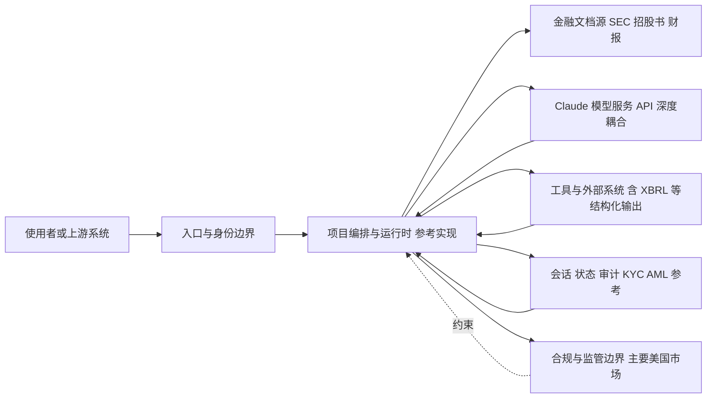

# anthropics/financial-services

## 一句话定位
Anthropic 官方发布的金融服务行业 AI 应用参考方案，展示如何利用 Claude 构建合规的金融分析、文档处理和客户服务工作流。

## 它解决的问题
金融机构在采用 AI 时面临三大障碍：合规要求严格、数据隐私敏感、业务流程复杂。现有通用 AI 框架缺少金融行业的最佳实践参考。Anthropic 的 financial-services 仓库面向银行、保险、证券等机构的 AI 团队，提供了端到端的参考实现——从文档解析、合规审查到风险评估的全流程，且针对 Claude 的能力特性做了深度优化。

## 为什么值得关注
- **Stars:** 34,078 stars，官方行业方案库中热度极高
- **Anthropic 官方背书:** 作为 Claude 的创造者，Anthropic 提供的方案代表了 Claude 能力的最佳实践
- **行业参考价值:** 金融是 AI 落地最有价值也最困难的垂直行业，此仓库的架构设计对其他行业方案有借鉴意义
- **Apache-2.0 开放:** 允许企业自由采用和修改

## 热度来源判断
热度来自「Anthropic 官方出品」的品牌效应和金融 AI 落地的迫切需求。34K stars 对一个行业参考方案来说是显著偏高的——通常这类仓库的 stars 在数千级别。这说明金融行业从业者对「如何用 Claude 做金融」有强烈需求，热度具有真实需求支撑。但也包含一定的跟风成分——部分 stars 可能来自 AI 社区的普遍关注而非金融从业者。

## 关键技术亮点亮点
1. **金融文档智能处理:** 展示如何利用 Claude 的长上下文窗口处理 SEC 文件、招股书、财报等长文档
2. **合规工作流编排:** 内置金融行业常见的合规检查逻辑，包括 KYC/AML 场景的参考实现
3. **结构化输出:** 使用 Claude 的工具调用能力，生成符合金融数据标准（如 XBRL）的结构化结果
4. **Prompt 工程最佳实践:** 针对金融场景的 prompt 模板，包括准确性校验、引用溯源等防幻觉机制
5. **Python 参考实现:** 提供可运行的 Python 代码，企业可以在此基础上快速适配到自己的系统

## 架构师速览

| 决策问题 | 研究判断 | 证据边界 |
|---|---|---|
| 系统边界 | 该项目是 Anthropic 官方金融行业参考方案库，定位为 Claude 之上、入口渠道/合规/文档处理工具/数据源之间的编排与示例层（Apache-2.0，Python）。 | 具体入口组件、KYC/AML 实现位置、XBRL 工具的代码结构未在档案中给出；需源码核实。 |
| 主路径 | 文档解析 → Claude 模型调用（含工具调用与引用溯源）→ 结构化输出（如 XBRL）→ 合规/审计回写。 | 长上下文处理 SEC/招股书的窗口规模、工具调用协议、prompt 模板细节未披露。 |
| 关键权衡 | Claude API 深度耦合 vs. 跨模型可迁移性；参考方案快捷性 vs. 生产级安全/性能加固；美国市场合规范式 vs. 多区域适配成本。 | 风险条目来自档案描述，具体耦合点与适配工作量需阅读参考实现核验。 |
| 最小 PoC | 选取单一入口（如财报解析），启用最小工具权限与可审计日志，跑通"文档→Claude→结构化输出→人工复核"闭环，验收项含安全、成本、SLO、退出路径。 | Claude 模型版本、调用成本、上下文长度等关键参数档案未提供，须以官方文档为准（待核验）。 |

## 架构启发
该仓库的架构思路体现了「AI 作为增强而非替代」的理念——不是试图让 AI 完全取代分析师，而是将 AI 嵌入到现有的金融工作流中，处理文档摘要、初步筛选、数据提取等重复性任务，由人类完成最终判断。这种「人机协作」的架构模式在合规要求严格的行业是务实的路径。

## 架构图（MMD）

> 证据边界：此图只采用本档案已有可核验描述；“待核验”节点不应视为项目实现事实。

## 定位判断
属于 AI 行业应用生态的「参考方案」层。不是独立产品，而是降低企业 AI 采用门槛的加速器。在 Anthropic 的生态战略中，此类行业方案库是推动 Claude 企业采用的重要手段，与 OpenAI 的 cookbook 仓库形成对标。

## 风险 / 局限 / 泡沫点
1. **依赖 Claude API:** 所有方案深度绑定 Anthropic 的 API，迁移到其他 LLM 需要大量适配工作
2. **参考方案非生产代码:** 仓库定位是教学和参考，不能直接用于生产环境，安全加固和性能优化需要企业自行完成
3. **合规场景覆盖有限:** 金融监管在全球各区域差异巨大，此仓库主要针对美国市场，其他区域需要额外适配
4. **维护频率不确定:** 仓库创建于 2026 年 2 月，长期更新节奏取决于 Anthropic 的战略投入

## 与同类项目的关系
- **OpenAI Cookbook:** 通用 AI 应用参考库，覆盖面更广但缺少金融垂直深度
- **virattt/dexter:** 开源金融 AI Agent，偏工具实现而非参考方案
- **LangChain 金融模板:** 框架级的金融应用模板，但缺少 Claude 特有的能力优化

## 是否值得持续跟踪
**值得跟踪。** 作为 Anthropic 官方金融方案库，它代表了 Claude 在金融领域的最佳实践风向。即使不使用 Claude，其架构设计和工作流编排思路也具有跨模型参考价值。

## 后续观察点
- 关注 Anthropic 是否扩展到保险、证券、财富管理等更多金融子行业
- 观察是否有金融机构公开分享基于此仓库的实际部署案例
- 跟踪 Anthropic 是否将 Claude 的新能力（如计算机使用、多模态）集成到金融方案中

---
> 数据来源: GitHub API (gh cli) | 更新: 2026-08-07 | Stars: 34,078 | Language: Python | License: Apache-2.0 | Forks: 5,054
