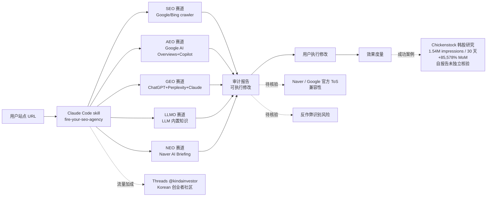

# leopard627/fire-your-seo-agency

## 一句话定位
**取代 SEO/GEO 代运营的 Claude Code skill**——把 SEO/AEO/GEO/LLMO/NEO（韩国 Naver）五条赛道拆开，按各 AI 检索通道（Google/Bing crawler / Google AI Overviews+Copilot / ChatGPT+Perplexity+Claude / LLM 内置知识 / Naver AI Briefing）的规则自动审计与优化站点。

## 它解决的问题
2026 年下半年"AI 检索时代 SEO"是新一代创业者最大成本痛点之一：**(1) 代运营费用高昂**——SEO/GEO 代运营月费 $400-2500，对中小创业者极不友好；**(2) "AI 检索优化"概念模糊**——SEO（Google crawler）/ AEO（Google AI Overviews+Copilot）/ GEO（ChatGPT+Perplexity+Claude）/ LLMO（LLM 内置知识）/ NEO（Naver AI Briefing）五条赛道规则各异，缺乏统一指导；**(3) 代运营工作内容重复**——多数 SEO/GEO 工作是"公开标准 + 可复用 checklist"，AI agent 可自动完成。fire-your-seo-agency 直击这三点：**Claude Code skill + 五赛道拆解 + 自带 Chickenstock 真实数据案例**。

## 为什么值得关注（2026-08-28）
- **2 天 213⭐ + 61 forks**：Korean/SEO 社区的早期冷启动（0.29 fork/star 比例异常高，反映大量用户进入 fork 模式）
- **README 自述月费节省**："Paying $400–$2,500/month for an SEO or 'AI visibility' agency? Fire them. Your AI agent can do the work"
- **五赛道拆解**：SEO/AEO/GEO/LLMO/NEO 对应五个不同的 AI 检索通道
- **Chickenstock 真实数据**：README 自述 **"1.54M search impressions in 30 days (+85,578% MoM), 7.4K clicks, Pages cited paragraph-by-paragraph by Naver's AI Briefing"**——可量化收益
- **双语 README**：[README.ko.md](./README.ko.md)（韩语）+ 英文
- **MIT 许可**：商用友好

## 热度来源判断
热度来自 **"代运营成本痛点 × AI 检索时代 SEO × 五赛道拆解 × Korean/SEO 社区"** 的组合：(1) 中小创业者对 SEO/GEO 代运营月费 $400-2500 的强烈不满；(2) "AI 检索优化"概念模糊，五赛道拆解填补知识空白；(3) Korean 创业者社区 + Threads @kindainvestor 的流量加成。**主要风险：** 1.54M impressions 是项目方自报告数据（来自 Chickenstock 站点后台 + 个人 Threads 账户），**未独立核验**；五赛道的"检查项"是否会被 Google / Naver / OpenAI 反作弊系统识别；与 Google Search Console / Naver Webmaster Tools 等官方工具的差异化定位。

## 关键技术亮点
1. **五赛道拆解**：SEO（Google/Bing crawler）/ AEO（Google AI Overviews+Copilot）/ GEO（ChatGPT+Perplexity+Claude）/ LLMO（LLM 内置知识）/ NEO（Naver AI Briefing）——每个对应一个 AI 检索通道的引用规则
2. **真实数据案例**：Chickenstock 韩股研究服务的 1.54M impressions / +85,578% MoM / Naver AI Briefing 逐段引用
3. **Claude Code skill 形态**：直接装上即可用，无需额外工具链
4. **双语 README**：Korean + English 双语，适配 Korean 创业者社区 + 国际社区
5. **MIT 许可**：商用友好

## 架构师速览

| 决策问题 | 研究判断 | 证据边界 |
|---|---|---|
| 系统边界 | 一个 Claude Code skill（Markdown 为主 + HTML + 配置文件），本质是五赛道 SEO/AEO/GEO/LLMO/NEO 检查清单 + 自动化脚本 | 仅基于 README 的 "five lanes" + Chickenstock 案例；具体每赛道的检查项、自动化脚本（提交 sitemap？生成 schema？）、是否接入 Naver / Google Search Console 等官方 API 未在档案中量化 |
| 主路径 | 用户在 Claude Code 中加载 skill → 用户输入站点 URL → skill 按 SEO/AEO/GEO/LLMO/NEO 五赛道审计 → 输出具体修改建议 → 用户执行修改 | 主路径来自 README 的 "audits your site, fixes what's broken, and measures the results"；具体每赛道的审计指标、与 Naver AI Briefing 的兼容性、是否被 Google 反作弊识别均待核验 |
| 关键权衡 | 五赛道覆盖广度 vs 单赛道深度 vs 真实数据可信度 vs 个人品牌依赖 vs 反作弊风险 | 档案明示五赛道 + Chickenstock 案例 + Threads 流量；具体 1.54M impressions 数据真实性、与 Naver 官方 ToS 兼容性、SEO/AEO/GEO/LLMO/NEO 实施成本均待核验 |
| 最小 PoC | 在 Claude Code 中加载 skill → 提交一个站点 → 验证五赛道审计的完整度与可执行性 → 对比 Google Search Console / Naver Webmaster Tools 的官方诊断 | PoC 范围由"先单站点、可对照"原则推导；具体审计质量、可执行建议的颗粒度、与官方工具的差异化待核验 |

## 架构启发
fire-your-seo-agency 的核心启发是 **"代运营方法论 → Claude Code skill"的商品化路径**——延续 8-26..8-27 的"agent-skills / 单点工作流 × 真实数据"判断，但今日具体到"代运营方法论"。**这意味着任何"重复性高 + 标准化强 + 客户付费意愿强"的代运营服务都有"被 AI skill 替代"的潜力**——包括 SEO / GEO（本文）/ 营销（Mailchimp / HubSpot 替代品）/ 销售（Outreach 自动化）/ 客服（Zendesk 替代品）等。**更深层的启发是：** "真实数据案例 + 双语 README + 个人 Threads 流量" 是 Korean / 国际创业社区 skill 推广的有效模板。**对独立开发者：** "代运营方法论 + 真实数据案例 + 双语 README" 是国际 skill 推广的有效路径。

## 架构图（MMD）

> 证据边界：此图只采用本档案已有可核验描述；"待核验"节点不应视为项目实现事实。

## 定位判断
**工具型项目（AI search optimization skill）。** fire-your-seo-agency 不做 SEO 工具，不做 AI 检索，只做"AI 检索时代 SEO/AEO/GEO/LLMO/NEO 五赛道审计 + 优化 skill"——这是工具型定位。**核心竞争壁垒：** 五赛道拆解 + Chickenstock 真实数据案例 + 双语 README + Korean/SEO 社区流量。**主要风险：** 自报告 1.54M impressions 未独立核验；与 Google Search Console / Naver Webmaster Tools 等官方工具的差异化定位；反作弊识别风险；Korean 社区流量加成明显。

## 风险 / 局限 / 泡沫点
- **自报告数据未独立核验**：1.54M impressions / +85,578% MoM 来自 Chickenstock 站点后台 + 个人 Threads 账户，**未独立核验**
- **Korean 社区流量加成**：leopard627 个人 Threads @kindainvestor 的流量加成明显，独立评估 skill 的"独立价值"与"流量加成"需拆开看
- **反作弊识别风险**：SEO/AEO/GEO/LLMO/NEO 的"检查项"是否会被 Google / Naver / OpenAI 反作弊系统识别为 spam，未在 README 中明示
- **与官方工具的差异化**：与 Google Search Console / Naver Webmaster Tools 等官方工具的差异化定位未明示
- **五赛道深度**：五赛道覆盖广度优先，但单赛道深度（如 GEO 的 Perplexity citation 机制）可能不如专项工具
- **跨地区适用性**：NEO 赛道专为 Naver 设计，对非韩语 / 非韩国的站点适用性有限

## 与同类项目的关系
- **vs Google Search Console / Naver Webmaster Tools**：官方 SEO 工具，本项目是 AI 检索时代扩展
- **vs Ahrefs / SEMrush / Moz**：商业 SEO 工具，本项目是开源 + AI agent 化
- **vs llms.txt 生态**：llms.txt 是 LLM 友好的网站说明文件标准，本项目是 AI 检索优化综合方法论
- **vs 8-26 HanyuanWang/LiveStream-Agent-Studio**：同样是"垂直场景 × 中文生态 × agent skill 化"，但本项目是 SEO 场景 + 韩语
- **vs 8-27 Ayueh0102/Ronnier-skill**：同样是"垂直专业知识 × Claude Code skill"，但本项目是 SEO/GEO 专业知识

## 是否值得持续跟踪
**值得跟踪（AI 检索时代 SEO 商品化的代表样本）。** fire-your-seo-agency 2 天 213⭐ + 61 forks（fork/star 比 0.29）体现 Korean / SEO 社区的早期冷启动，**五赛道拆解 + Chickenstock 真实数据 + 双语 README 是显著加分项**。**对独立开发者：** 12 月内"代运营方法论 + 真实数据案例 + 双语 README"是国际 skill 推广的有效路径。**对 Korean 创业者：** 这是直接可用的 SEO/GEO 优化 skill，可替代部分代运营成本。建议关注：(1) Chickenstock 数据是否被独立核验；(2) 五赛道是否被 Google / Naver 反作弊系统识别；(3) Korean 社区流量加成的可持续性。

## 后续观察点
- Chickenstock 数据是否被独立核验（决定真实数据卖点可信度）
- 五赛道是否被 Google / Naver 反作弊系统识别为 spam
- Korean / 国际创业社区的持续采用
- 与 Google Search Console / Naver Webmaster Tools 等官方工具的差异化
- 是否会有英语 / 中文翻译版本

---
> 数据来源: GitHub API (2026-08-28) | Stars: 213 | Forks: 61 | License: MIT | 语言: - (HTML+MD) | 创建: 2026-08-26 | 数据截至 2026-08-28 06:00 UTC