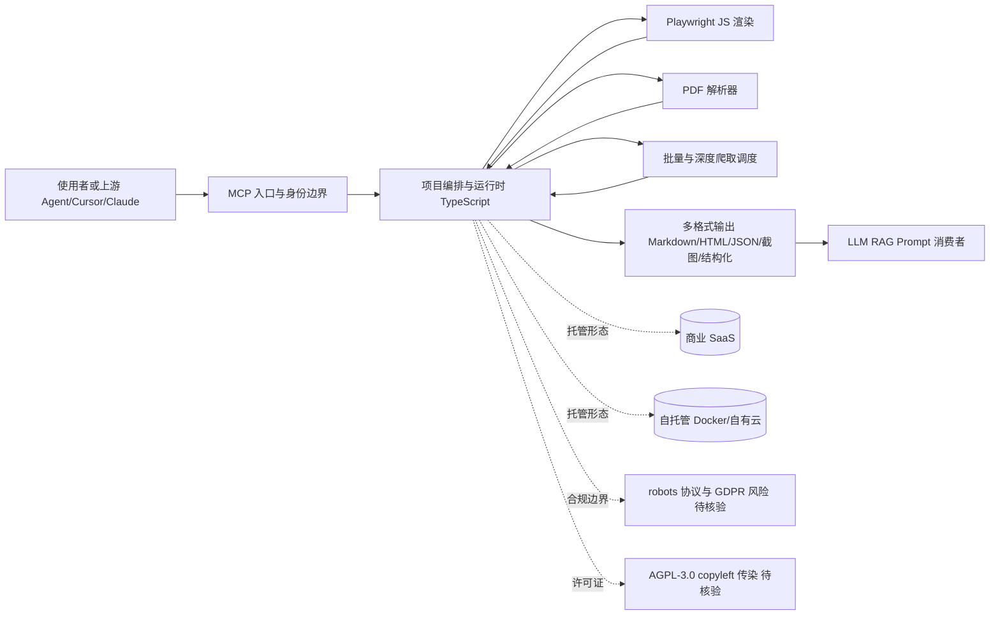

# firecrawl

## 一句话定位
为 LLM/Agent 设计的网页爬取 + 索引 API——把任意 URL 转成干净 Markdown / 结构化 JSON，支持 JS 渲染、PDF 解析、深度爬取、批量任务；MCP-first 接口被 OpenAI / Cursor / Claude 等 Agent 内置。

## 它解决的问题
传统爬虫（Scrapy / Puppeteer）需要：
- 自行处理 JS 渲染、反爬、验证码
- 自行清洗 HTML 转 Markdown
- 自行调度大批量爬取
- 不直接对接 LLM / Agent

Firecrawl 把"网页 → LLM-友好内容"做成一行 API：传 URL，返回干净 Markdown，可直接进入 RAG / Prompt。AGPL-3.0 + 自托管 + 商业 SaaS 双模式。

## 为什么值得关注（2026-08-19）
被 daily/2026-08-19.md 选为今日 AI 工具链重点。170,151 stars 2 年增速是 2024-2026 AI Infra 现象级数据。其与 AI Coding Agent（Claude Code / Cursor / Cline）的内置集成让 Firecrawl 成为 Agent 时代"标配爬虫"。

## 热度来源判断
热度来源是 **"LLM/Agent 上下文刚需 × 一行 API 简单性 × MCP 主流生态绑定"**。在 2024-2026 的 AI Coding 浪潮中，"如何给 LLM 喂网页" 是高频痛点。Firecrawl 用简单 API + 干净输出 + 大规模爬取 三点打透，是工具型 SaaS 案例教科书。

## 关键技术亮点
1. **JS 渲染 / PDF 解析:** Playwright + PDF parser，覆盖主流网页与文档
2. **批处理 + 深度爬取:** 支持 millions 级别 / 月的批量配额
3. **MCP 原生集成:** 官方支持 Model Context Protocol，被 Claude/Cursor 等 Agent 内置
4. **多输出格式:** Markdown / HTML / JSON / 截图 / 结构化 (LLM extraction)
5. **自托管:** Docker / 自有云部署，企业可私有部署

## 架构师速览

| 决策问题 | 研究判断 | 证据边界 |
|---|---|---|
| 系统边界 | Firecrawl 是"网页→LLM 友好内容"的 API 中介层，外部边界至少含三类：被 Agent/Cursor/Claude 通过 MCP 调用的上游、Playwright/PDF parser 封装的浏览器自动化原语、商业 SaaS 与自托管（Docker/自有云）两种交付形态 | "MCP 原生集成"、"Playwright + PDF parser"、"Docker / 自有云部署"均来自档案；上游具体协议、部署拓扑未在档案中描述 |
| 主路径 | URL 进入 → 内部编排层（含 JS 渲染/PDF 解析）→ 输出 Markdown/HTML/JSON/截图/结构化 → LLM/Agent 消费；批量与深度爬取通过批处理配额（百万级/月）支撑 | "批处理 + 深度爬取: millions 级别 / 月"、"多输出格式"来自档案；内部队列、调度、持久化实现细节未述 |
| 关键权衡 | 三组张力：① API 简洁性 vs 内部封装复杂度（反爬/验证码/JS 渲染）② 商业 SaaS 高定价 vs 自托管可获得性（受 AGPL-3.0 copyleft 限制）③ LLM 工具链核心地位 vs 被 OpenAI/Google 官方内置网页工具稀释 | "AGPL-3.0 严格 copyleft"、"收费 vs 公平使用"、"被官方吞并风险"均来自档案；具体许可证传染范围、价格表未列 |
| 最小 PoC | 用自托管 Docker 部署单实例，限定单一渠道（如 MCP 接入 Cursor）调用，配置最小工具权限与可审计日志；验收项必须含：合规（robots/GDPR）、成本（按调用计费）、SLO（成功率/延迟）、AGPL 退出路径 | "自托管"、"MCP 集成"、"反爬合规"来自档案；具体镜像、计费模型、SLO 指标未在档案中给出，标为待核验 |

## 架构启发
"以 LLM 为消费者反向设计 API" 是 Firecrawl 的核心思维。它不解决"如何爬网页"的技术问题，而是解决"如何让 LLM 用最少代码拿到结构化网页"的产品问题。这是一种**面向消费者（LLM）反向设计**的产品哲学。

## 架构图（MMD）

> 证据边界：此图只采用本档案已有可核验描述；“待核验”节点不应视为项目实现事实。

## 定位判断
**平台候选型 / Agent 时代标配爬虫。** 与 Crawl4AI、Spider.Cloud、Apify 等同处 AI 爬虫赛道，但 Firecrawl 凭借品牌 + 集成度 + 自托管能力领先。在所有主流 LLM 工作流（Cursor Rules、Claude Code、Mastra）中已是默认爬虫层。

## 风险 / 局限 / 泡沫点
- **AGPL-3.0 严格 copyleft:** 自托管对外提供服务会被传染
- **收费 vs 公平使用:** 商业 SaaS 价格高，可能反向推动自托管版
- **被官方吞并风险:** 大模型公司（OpenAI、Google）内置网页工具可能稀释 Firecrawl 角色
- **反爬合规:** 大规模爬取在 GDPR / robots 协议上有合规风险
- **同质化竞争:** Crawl4AI 等开源方案在快速追赶

## 与同类项目的关系
- **vs Crawl4AI:** Crawl4AI 是 OSS LLM-friendly 爬虫；Firecrawl 是 SaaS + 自托管混合
- **vs Apify:** Apify 是通用爬虫平台；Firecrawl 更 LLM-优化
- **vs Bright Data:** Bright Data 是企业级代理网络；Firecrawl 是面向 AI 的爬取 API
- **vs Playwright / Puppeteer:** 浏览器自动化原语；Firecrawl 已在内部封装它们

## 是否值得持续跟踪
**强烈推荐持续跟踪（AI 工具链基础设施）。** 对需要"喂 LLM 真实网页数据"的团队，Firecrawl 已是默认选项；其发展轨迹反映 Agent Infra 演进。

## 后续观察点
- 与 OpenAI / Anthropic 官方爬虫能力的关系（合作 vs 替代）
- 价格体系演化（按调用次数 / 域名 / 月度）
- 自托管版的复杂度下降（让小企业也能用）
- 在 MCP 标准演化中的地位变化
- 新格式支持（PDF、Excel、邮件附件）的覆盖深度

---
> 数据来源: GitHub API (2026-08-21) | Stars: 170,151 | Forks: 9,473 | License: AGPL-3.0 | 语言: TypeScript | 创建: 2024-04-15
