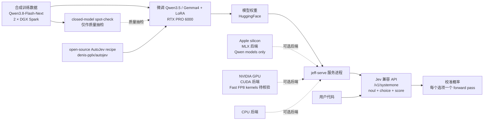

# firelex/jeff

## 一句话定位
Fine-tunes of Qwen3.5 and Gemma 4 for zero-shot classification——Jev 兼容 API 的小型快速决策模型微调（v1.1 Jeff-Qwen3.5-0.8B / 2B 可选 254 个选项 + 22ms RTX PRO 6000 / 28ms Apple M4 Max MLX + uv 一行装 + 全 local hardware 训练数据）。

## 它解决的问题
Jev / System One 决策模型部署的痛点是 **「TypeSafe AI 官方 Jev API 是 SaaS + 254+ 选项 / 254 选项覆盖场景不足 + 长列表 / zero-shot 准确性不足 + 训练数据 / 推理代码 / 校准细节不透明」**。firelex/jeff 用「Qwen3.5-0.8B / 2B / Gemma4-E2B / Jeff-Qwen3.5-0.8B-Chess 微调 + v1.1 254 选项 + 更好 calibration + Jev 兼容 API（noul + choice + score）+ 22ms RTX PRO 6000 / 28ms Apple M4 Max MLX + uv 一行装 + 全 local hardware + 不调用 closed-model 输出 + 基于 open-source AutoJev recipe」是「Jev 兼容 + 自托管微调 + 254 选项 + 全 local hardware + 严肃诚实表态（README 明示 'What it is, and what it isn't'）」的具体路径。

## 为什么值得关注（2026-09-30）
- **Stars:** 991（截至 2026-09-30），2 天 991⭐，fork 38，fork/star 3.8%
- **Forks:** 38
- **License:** MIT（明确许可，商用清晰）
- **语言:** Python
- **活跃度:** created 2026-09-28，pushed_at 2026-09-29，持续高活跃（v1.1 (29 September 2026) 254 个选项）
- **规模:** 76947 KB（约 75 MB，含模型权重）
- **Topics:** 待核验（README 未明示 topics 数组）

## 热度来源判断
firelex/jeff 的热度是 **「Jev 兼容 API 刚需 × 自托管微调严肃工程化 × 254 选项 v1.1 × uv 一行装 × 全 local hardware × MIT 商用清晰 × 严肃诚实表态」** 的强劲组合。Jev / System One 决策模型 2026 年是高热赛道，但官方 Jev API 是 SaaS + 不能本地运行 + 不能微调 + 254+ 选项 / 254 选项覆盖场景不足——一个「Jev 兼容 API + 自托管微调 + 254 选项 v1.1 + uv 一行装 + 全 local hardware + MIT + 严肃诚实表态（README 明示 'What it is, and what it isn't'）」的微调严肃工程化方案直击痛点。991 stars + 38 forks + fork/star 3.8% 反映社区高度参与——这正是「Jev 兼容 + 自托管微调」类项目的典型特征。2 天 991⭐ 反映 GitHub Trending Jev 兼容 API + 自托管微调严肃工程化持续关注信号。热度**真实且具严肃工程化潜力**——但需警惕：自托管微调的「本地硬件门槛（RTX PRO 6000 + 2 × DGX Spark + MacBook 测试）+ Qwen3.5 / Gemma4 模型升级 + AutoJev recipe 演进 + 长列表 / zero-shot 准确性的工程化深度 + 严肃诚实表态（README 明示 'very small models; reasoning won't match Jev's, which runs on a much larger model'）」。

## 关键技术亮点
1. **Qwen3.5 / Gemma 4 微调：** Qwen3.5-0.8B / Qwen3.5-2B / Gemma4-E2B / Jeff-Qwen3.5-0.8B-Chess——多模型多尺寸
2. **v1.1 (29 September 2026) 254 个选项：** 较 v1.0: 26 个选项大幅扩展；更好 calibration；0.8B 长列表测试 40% → 95%
3. **22ms RTX PRO 6000 / 28ms Apple M4 Max MLX：** 极速——决策模型本地推理
4. **Jev 兼容 API：** 与 Jev 相同的请求格式 + supports yes/no (noul) + multiple-choice (choice) + rating (score) 三类问题
5. **uv 一行装：** `uv sync --no-default-groups` + `--extra cuda`（NVIDIA GPU）+ `--extra mac`（Apple silicon）；`JEFF_BACKEND=mlx JEFF_CHECKPOINT=... PORT=8765 uv run --no-default-groups --extra mac jeff-serve`
6. **全 local hardware：** RTX PRO 6000 训练 0.8B ~2h / 2B ~3.5h；Qwen3.8-Flash-Next 在 2 × DGX Spark 合成训练数据；MacBook 测试；不调用 closed-model 输出（只用 closed-model spot-check 合成数据质量）
7. **基于 open-source AutoJev recipe：** 与官方 Jev 同生态
8. **严肃诚实表态：** README 明示「Independent project. Jeff uses the same request format as Jev, but it is not affiliated with or endorsed by TypeSafe, the makers of Jev.」+「What it is, and what it isn't. These are very small models. They make extremely fast, well-calibrated judgement calls between options, and they slot easily into your local code. On benchmarks they approach, and sometimes beat, Jev; but at this size their reasoning won't match Jev's, which runs on a much larger model.」——是「严肃诚实表态」形态
9. **MIT 商用清晰**

## 架构师速览

| 决策问题 | 研究判断 | 证据边界 |
|---|---|---|
| 系统边界 | Jev 兼容 API 的小型快速决策模型微调——Jev 兼容服务进程 + 微调代码 + 训练数据 + 评测代码 | 仅基于 README 公开描述的 Qwen3.5-0.8B / 2B / Gemma4-E2B / Chess + v1.1 254 选项 + 22ms RTX PRO 6000 + 28ms Apple M4 Max MLX + uv 一行装 + AutoJev recipe；具体微调代码架构、训练数据格式、评测代码未在档案中给出 |
| 主路径 | 训练数据（Qwen3.8-Flash-Next 在 2 × DGX Spark 合成）→ 微调（Qwen3.5 / Gemma4 + LoRA + AutoJev recipe）→ 模型权重（HuggingFace）→ 服务进程（jeff-serve）→ Jev 兼容 API（/v1/systemone + noul/choice/score） | 主路径为 README 语义抽象；具体 LoRA 配置、训练超参、合成数据格式、closed-model spot-check 标准未在档案中给出 |
| 关键权衡 | Jev 兼容 + 254 选项 + 全 local hardware + 22ms 极速 vs Qwen3.5 / Gemma4 模型升级风险 + AutoJev recipe 演进 + 长列表 / zero-shot 准确性的工程化深度 + 严肃诚实表态（README 明示 reasoning 不会 match Jev） | 档案明示 Jev 兼容 + 自托管 vs 模型升级 + AutoJev 演进；推理能力工程化深度未在档案中给出 |
| 最小 PoC | `uv sync --no-default-groups --extra cuda`（或 `--extra mac`）+ `hf download` 模型权重 + `JEFF_CHECKPOINT=... PORT=8765 uv run jeff-serve` + `curl localhost:8765/v1/systemone` 验证 noul/choice/score 三类 + 验证 254 选项 | PoC 范围由 README 「Quick start」+ uv 一行装 + Jev 兼容 API 推导；具体硬件门槛、推理延迟、选项覆盖度待核验 |
| 证据边界 | stars / forks / license / size / created_at / pushed_at / language / description 来自 GitHub API 公开元数据；微调代码架构、LoRA 配置、训练超参、合成数据格式、closed-model spot-check 标准均待核验 | GitHub API 元数据可信；架构细节未在 README 中给出 |

## 架构启发
firelex/jeff 的核心启发是 **「Jev 兼容 API 应该可本地运行、可微调、可全 local hardware 训练，正如 LLM 微调跨 GPU runtime」**。当前 Jev / System One 决策模型生态多以 SaaS + 不能本地运行 + 不能微调为主——这违背严肃工程化用户利益——没人想为不能本地运行的决策模型付费 + 没人想为不能微调的决策模型付费。firelex/jeff 尝试做「Jev 兼容 API 的自托管微调严肃工程化标准层」，类似 LoRA 之于 LLM 微调。更深层的启发是：**微调类项目的价值在于「Jev 兼容 + 全 local hardware + 254 选项 + 严肃诚实表态 + uv 一行装 + 商用清晰」而非 SaaS 体验**。991 stars + 38 forks 的结构，说明它已初步形成 Jev 兼容自托管微调严肃工程化飞轮。能否持续，取决于「Qwen3.5 / Gemma4 模型升级 + AutoJev recipe 演进 + 长列表 / zero-shot 准确性的工程化深度 + 严肃诚实表态 + uv 一行装稳定性 + 商用清晰边界」。

## 架构图（MMD）

> 证据边界：此图只采用本档案已有可核验描述；"待核验"节点不应视为项目实现事实。

## 定位判断
**工具型项目（Jev 兼容 API 的小型快速决策模型微调）。** firelex/jeff 不仅是 Jev 替代品，更试图成为「Jev 兼容 API 的自托管微调严肃工程化参考」——类似 Ollama 之于 LLM 本地运行。若成功，它会成为 Jev / System One 决策模型严肃工程化用户的默认入口，具有严肃工程化级价值。991 stars + 38 forks + fork/star 3.8% 已显示 Jev 兼容自托管微调严肃工程化飞轮雏形。但「工具化」取决于一个关键问题：Jev / System One 官方 API 演进——若官方 Jev API 出现新功能 / 新模型 / 新场景，jeff 可能需持续跟进（README 明示「Independent project. Jeff uses the same request format as Jev, but it is not affiliated with or endorsed by TypeSafe」）。目前定位是「最有影响力的 Jev 兼容 API 自托管微调严肃工程化参考」，向严肃工程化级演进是合理路径。

## 风险 / 局限 / 泡沫点
- **本地硬件门槛：** README 明示训练用 RTX PRO 6000 + 2 × DGX Spark + MacBook 测试——严肃工程化部署门槛高
- **Qwen3.5 / Gemma4 模型升级：** 0.8B / 2B / E2B 微调依赖具体基座——基座升级时需重新微调
- **AutoJev recipe 演进：** 基于 open-source AutoJev recipe——recipe 演进时需跟进
- **严肃诚实表态：** README 明示「very small models; reasoning won't match Jev's, which runs on a much larger model」——若 zero-shot 准确性不足，README 建议「a short fine-tune on your own examples takes you much further」
- **254 选项 v1.1 vs 长列表：** v1.1 254 个选项（v1.0: 26）——长列表测试 0.8B 40% → 95%；2B benchmark 83.1% → 82.0%（轻微损失）
- **独立项目属性：** README 明示「Independent project. Jeff uses the same request format as Jev, but it is not affiliated with or endorsed by TypeSafe」——与 TypeSafe 无关
- **topics 0 个（README 未明示 topics 数组）：** 描述密度低于 projects 标准
- **closed-model spot-check：** README 明示「a closed model was used only to spot-check the quality of a sample of the synthetic data」——训练数据本身不用 closed-model 输出，但 spot-check 用

## 与同类项目的关系
- **vs TypeSafe AI 官方 Jev API：** 官方 SaaS + 不能本地运行；firelex/jeff 是 Jev 兼容 + 自托管微调 + 全 local hardware
- **vs logan-markewich/jeff：** GLiFormer 400M encoder + TYPESAFE_BASE_URL drop-in replacement；firelex/jeff 是 Qwen3.5 / Gemma4 微调 + Jev 兼容 API
- **vs PostHog/jeeves：** 9B reasoning + diffusion drafter + SFT+CISPO；firelex/jeff 是小型快速决策模型微调（无 reasoning）
- **vs featherless-ai/simple-jev / ekzhang/openjev-sglang：** 自托管 Jev endpoint 但功能不全；firelex/jeff 是完整微调 + Jev 兼容 + 254 选项
- **vs AutoJev recipe：** 自动微调 recipe；firelex/jeff 基于 AutoJev recipe 但为独立项目

## 是否值得持续跟踪
**值得跟踪（Jev 兼容 API 的自托管微调严肃工程化）。** firelex/jeff 代表了 Jev 兼容 API 自托管微调严肃工程化的诉求，无论其本身成败，这一方向是行业趋势。建议关注：Qwen3.5 / Gemma4 模型升级、AutoJev recipe 演进、长列表 / zero-shot 准确性的工程化深度、严肃诚实表态、uv 一行装稳定性、254 选项 v1.1 准确性、closed-model spot-check 质量、商用清晰边界。对 Jev / System One 决策模型严肃工程化用户，这个项目是获取 Jev 兼容 + 自托管微调 + 254 选项 + 全 local hardware + 严肃诚实表态 + uv 一行装 + MIT 商用清晰的实用来源，值得直接采用。对 Jev 兼容 API 严肃工程化观察者，它是「Jev 兼容 + 自托管微调」赛道的头部样本。

## 后续观察点
- 是否演化为多模型 Jev 兼容 API 网关（从单一 Qwen3.5 / Gemma4 微调到多模型）
- Qwen3.5 / Gemma4 模型升级时的稳定性
- AutoJev recipe 演进时的跟进
- 长列表 / zero-shot 准确性的工程化深度（README 明示「a short fine-tune on your own examples takes you much further」）
- 严肃诚实表态的稳定性（README 明示「very small models; reasoning won't match Jev's」）
- uv 一行装的稳定性
- 254 选项 v1.1 的准确性（README 明示 v1.1 较 v1.0: 26 大幅扩展）
- closed-model spot-check 质量（README 明示「a closed model was used only to spot-check the quality of a sample of the synthetic data」）
- MIT 商用清晰的边界
- topics 覆盖的清晰度（README 未明示 topics 数组）

---
> 数据来源: GitHub API (2026-09-30) | Stars: 991 | Forks: 38 | License: MIT | 语言: Python | 创建: 2026-09-28 | v1.1: 2026-09-29 | 观察窗: 2026-09-28 ~ 2026-09-29
