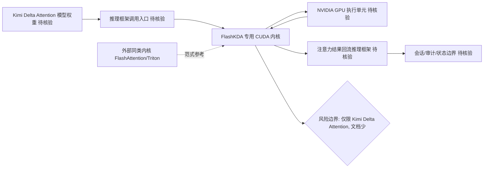

# FlashKDA

## 一句话定位
Moonshot AI 出品的 Kimi Delta Attention 高性能推理内核。

## 它解决的问题
Delta Attention 是 Kimi 模型中使用的新型注意力机制，需要专用 GPU 内核才能高效推理。FlashKDA 提供了这种专用优化。

## 为什么值得关注
1. Moonshot AI (Kimi) 的核心推理工程开源
2. Delta Attention 可能代表注意力机制的新方向
3. 与 FlashAttention 同范式的国产实现

## 热度来源判断
- Moonshot AI 品牌效应
- 技术前沿性：Delta Attention 是较新的注意力变体
- Star 数尚低但关注者为推理系统工程师

## 关键技术亮点亮点
- 针对Delta Attention 的专用 Flash 内核
- 高性能 CUDA 实现
- Moonshot Kimi 模型推理的核心组件

## 架构师速览

| 决策问题 | 研究判断 | 证据边界 |
|---|---|---|
| 系统边界 | 边界位于推理栈底层：FlashKDA 是 Moonshot Kimi 模型上 Delta Attention 机制的专用 CUDA 内核实现，向上对接推理调用方，向下绑定 Kimi/Delta-Attention 模型权重与 NVIDIA GPU。 | 仅有"针对 Delta Attention 的专用 Flash 内核 / 高性能 CUDA 实现 / Kimi 推理核心组件"等高层描述，未公开算子列表、支持 GPU 型号、依赖的 CUDA / cuDNN 版本。 |
| 主路径 | Kimi 模型推理请求 → 调用 Delta Attention 计算路径 → 触发 FlashKDA CUDA 内核 → 输出注意力结果回流推理框架。 | 路径中推理框架、KV 缓存管理、调度层均未在档案中描述；"待核验"。 |
| 关键权衡 | 在"专用内核带来的 Kimi/Delta-Attention 高性能"与"仅适用单一注意力变体、生态窄"之间取舍；专用化换通用性。 | Star 383、文档和示例较少、通用性"待验证"为档案明确表述；性能对比数据未给出。 |
| 最小 PoC | 在 Kimi Delta Attention 模型上以单 GPU 跑通一次推理链路，跑通前向 + 一次 Delta-Attention 调用即可。 | 缺乏对硬件要求、构建步骤、依赖矩阵的描述，需查源码/官方文档补齐。 |

## 架构启发
与 TileKernels 类似，反映了"模型架构创新→专用内核跟进"的链路。注意力机制仍在持续演进，每种新机制都需要配套的 GPU 内核优化。

## 架构图（MMD）

> 证据边界：此图只采用本档案已有可核验描述；“待核验”节点不应视为项目实现事实。

## 定位判断
**基础设施候选。** 推理内核是 LLM 栈最底层。

## 风险/局限/泡沫点
- Star 数低（383），仍在极早期
- 仅针对 Kimi Delta Attention，通用性待验证
- 文档和示例较少

## 与同类项目的关系
- TileKernels (DeepSeek)：同日出现，另一家国产 AI 公司的内核库
- FlashAttention：注意力优化的先驱范式
- Triton (OpenAI)：通用 GPU 编程抽象

## 是否值得持续跟踪
**是。** 作为 Moonshot AI 的推理工程输出，反映其技术方向。

## 后续观察点
1. Delta Attention 机制是否被其他模型采用
2. FlashKDA 是否扩展到更多算子
3. 性能数据对比

## 评分

| 维度 | 分数 | 理由 |
|------|------|------|
| 热度质量 | 4 | Star 数低但来源优质 |
| 技术创新度 | 7 | Delta Attention 是新方向 |
| 工程成熟度 | 5 | 早期，文档不足 |
| 架构启发价值 | 7 | 注意力机制持续演进信号 |
| 企业落地潜力 | 5 | 仅限 Kimi 模型用户 |
| 中期趋势概率 | 7 | 推理优化确定性趋势 |
| 平台化潜力 | 5 | 专用性强 |
| 基础设施潜力 | 7 | 推理内核基础层 |

**总分：47/80**
**归类：基础设施候选（早期）**
**建议持续跟踪：是**
