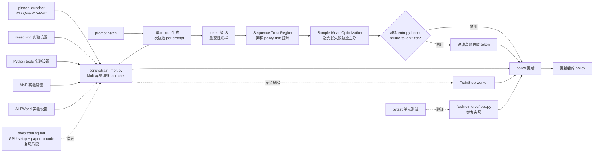

# yifanzhang-pro/FlashREINFORCE

## 一句话定位
NVIDIA 2026-09 论文《FlashREINFORCE: Critic-Free, Single-Rollout, Asynchronous RL for Agentic Language Models》的开源参考实现 + 训练 launcher；与官方 NVIDIA-NeMo/labs-molt 主仓形成「论文参考 + 生产训练栈」分工。

## 它解决的问题
Agentic LLM（能调用工具 / 多轮决策 / 长程任务的 LLM）的 RL 训练主流范式是 **「critic model + 多 rollout per prompt + 同步训练」**——但 critic 训练开销大、多 rollout 算力贵、同步训练吞吐受限。FlashREINFORCE 的主张是 **「critic-free + 单 rollout + 异步 + trust region」** 四件套能在不引入 critic 模型的前提下控制 policy drift 与失败样本主导，把训练吞吐从同步瓶颈中解放——这是对 agentic RL 训练范式的实质性简化。**「单 rollout per prompt」是最大胆的设计选择**——传统 REINFORCE 类算法依赖多 rollout 估计基线，FlashREINFORCE 用 sequence trust region + sample mean + token IS 三件套替代 critic 的统计功能，把 critic 训练开销完全省掉。

## 为什么值得关注（2026-09-15）
- **Stars:** 39（截至 2026-09-15），1 天 39⭐，NVIDIA 论文级发布早期信号
- **Forks:** 3，社区贡献开始
- **Watchers/Subscribers:** 0
- **Open Issues:** 0
- **License:** Apache-2.0（工业级友好）
- **语言:** Python + PyTorch
- **活跃度:** created 2026-09-14，pushed_at 2026-09-14，持续高活跃
- **规模:** 701 KB，论文参考实现 + 训练 launcher 形态
- **Topics:** （GitHub API 未列出 topics）
- **作者团队:** Jian Hu, Yifan Zhang, Hao Zhang, Binfeng Xu, Shaokun Zhang, Hongqing Peng, Zhiding Yu, Pavlo Molchanov, Jan Kautz, Yi Dong（NVIDIA）
- **关联仓:** NVIDIA-NeMo/labs-molt（官方生产训练栈）

## 热度来源判断
FlashREINFORCE 的热度是 **「NVIDIA 工业级研究背书 × agentic LLM RL 训练刚需 × REINFORCE 类方法回归 × Apache-2.0 许可」** 的组合。NVIDIA 在 2026 Q3 发布 agentic LLM RL 训练范式的「critic-free + 异步」替代方案是工业级信号——意味着 NVIDIA-NeMo 团队认为 critic-based 多 rollout 同步训练存在规模化瓶颈。**Apache-2.0 + 论文代码可独立运行**让学术研究者与工业团队都能直接采用。39⭐ / 1 天相对低调反映学术参考实现的早期信号（论文读者群 vs 工程师读者群）。热度 **真实且具工业影响力**——但需关注 NVIDIA-NeMo/labs-molt 主仓的维护节奏以判断其长期可持续性。

## 关键技术亮点
1. **三个核心机制**——「单 rollout per prompt」（避免多 rollout 算力开销）+ token importance sampling（修正陈旧行为）+ Sequence Trust Region（控制累积 policy drift）
2. **Sample-Mean Optimization**——防止长失败轨迹主导优化（用 sample mean 而非 sum 避免长失败序列拉低均值）
3. **可选 entropy-based failure-token filter**——基于熵的失败 token 过滤
4. **`flashreinforce/loss.py` 是核心**——`batch centering`（批中心化降低方差）+ `token IS`（重要性采样修正分布漂移）+ `sequence trust`（序列级 trust region 控制累积更新幅度）+ `sample mean`（样本均值而非 sum）+ 可选 `entropy-based failure-token filter`
5. **`scripts/train_molt.py --dry-run` 是工程化亮点**——上线前预览所有训练 flags 避免「跑起来才发现参数不对」
6. **pinned Molt launchers**——R1 与 Qwen2.5-Math 模型 launcher，固定版本避免「今天跑得通明天跑不通」
7. **`examples/` 四类实验设置**——reasoning（数学推理）+ Python tools（代码工具调用）+ MoE（混合专家）+ ALFWorld（具身家务）
8. **`docs/training.md` 明示复现局限**——「CPU example 不复现论文基准」「Tool/ALFWorld 设置需兼容 agent 与环境」——作者主动标注
9. **`pip install -e '.[test]' + python -m pytest -q`**——可测试的工程化形式
10. **Apache-2.0 + NVIDIA 团队 + 701 KB repo**——工业级严肃度的论文参考实现

## 架构师速览

| 决策问题 | 研究判断 | 证据边界 |
|---|---|---|
| 系统边界 | 论文参考实现 + Molt 异步训练 launcher；输入 prompt + 工具调用环境；输出 policy 更新；与官方 NVIDIA-NeMo/labs-molt 主仓形成「论文参考实现 + 生产训练栈」分工 | 来自 README 关于「standalone PyTorch reference loss + CPU update example + pinned Molt launchers + R1/Qwen2.5-Math + reasoning/Python tools/MoE/ALFWorld 实验设置」「docs/training.md 含 GPU setup + paper-to-code 映射 + 复现局限」的明示；具体 token IS 数学公式、sequence trust region 边界值、entropy filter 阈值在 loss.py 中可能给出，本档案未读源码 |
| 主路径 | 输入 prompt → 单 rollout（生成一次轨迹）→ token IS 修正（重要性采样）→ sequence trust region（序列级 trust region 控制累积 policy drift）→ sample mean 优化（用样本均值避免长失败轨迹主导）→ 可选 entropy-based failure-token filter（基于熵过滤失败 token）→ policy 更新 | 主路径来自 README 描述的三个核心机制 + loss.py 五个组件；每个组件的具体公式（trust region 阈值、sample mean 实现、entropy filter 计算方式）待核验 |
| 关键权衡 | critic-free（少一份算力 + 少一个失败点 vs 单 rollout 估计方差大）/ 单 rollout（算力省 vs 多 rollout 估计基线更稳）/ 异步（Molt 解耦吞吐 vs 同步训练更易调试）/ trust region（控制 drift vs 限制更新速度）/ sample mean（避免失败主导 vs 对长成功轨迹不公平） | 权衡五因素均从 README 推导；具体 trust region 数学形式、IS 重要性采样分布定义、sample mean vs weighted sum 的实际差距在论文中给出，本档案未读论文 |
| 最小 PoC | Python 3.11+ + PyTorch + Molt（NVIDIA-NeMo/labs-molt）→ `pip install -e '.[test]'` → `python examples/toy_update.py`（CPU 验证优化器更新 step）+ `python -m pytest -q`（单元测试）；再 GPU 跑 `python scripts/train_molt.py --dry-run` 预览 flags；最后用 R1 或 Qwen2.5-Math launcher 跑 reasoning 实验 | PoC 由「pip install + CPU example + pytest + Molt launcher + 4 实验设置」路径推导；具体 GPU 显存需求、CUDA 版本、Molt 集成细节待核验 |

## 架构启发
FlashREINFORCE 的核心启发是 **「REINFORCE 类方法在 agentic LLM 上的回归」**。现代 RL 训练主流是 PPO / GRPO 等使用 critic 或 advantage baseline 的方法，但 critic 训练本身是额外算力开销 + 额外失败点。FlashREINFORCE 的论文级主张是 **「token importance sampling + sequence trust region + sample mean + 可选 entropy filter」** 四件套可以替代 critic 的统计功能——这是对 critic-based 范式的实质性简化。对工程团队的直接影响：**减少一个训练组件 = 减少一份算力预算 + 减少一个潜在失败点**。更深层的启发是 **「学术参考实现与生产训练栈的清晰分工」**——本仓库（论文参考实现 + launcher）与官方 NVIDIA-NeMo/labs-molt（生产训练栈）形成两层架构：研究者读本仓库改公式，生产者用主仓跑训练。这是 NVIDIA 在 agentic LLM RL 训练领域的工业级布局。**「critic-free + 单 rollout」是否在大规模训练中被工业界接受**是论文价值的最终判断点。

## 架构图（MMD）

> 证据边界：此图只采用本档案已有可核验描述；"待核验"节点不应视为项目实现事实。

## 定位判断
**生产可用（论文参考实现 + 训练 launcher）。** FlashREINFORCE 不是又一个 RL 算法库（那是 Hugging Face TRL / Stable Baselines3），而是 **「论文作者团队直接把论文公式写成可读 PyTorch 代码 + 整合 Molt 异步训练栈 + 提供四类实验设置 + 主动标注复现局限」** 的工程化形式。它与官方 NVIDIA-NeMo/labs-molt 形成清晰分工：本仓库是「论文参考 + launcher」，主仓是「生产训练栈」。对学术研究者，本仓库是「可读可改的公式实现」；对工业团队，本仓库是「评估 critic-free 是否值得迁移」的 PoC 起点。**「critic-free + 单 rollout」在大规模训练中的实际表现**是论文价值的最终判断点。

## 风险/局限/泡沫点
- **「critic-free + 单 rollout」是否在大规模训练中被工业界接受是论文价值的关键**——目前是 NVIDIA 团队论文级主张，第三方 benchmark 复现尚需时间
- **Molt 异步训练栈的可持续性依赖 NVIDIA-NeMo 团队更新节奏**——本仓库与主仓同步演进是关键
- **701 KB repo + README 明示「CPU example 不复现论文基准」意味着真实复现需 GPU + 兼容 agent + ALFWorld 环境**——硬件门槛 + 环境门槛较高
- **复现局限需用户承担**——「CPU example 不复现」「Tool/ALFWorld 需兼容 agent 与环境」由 README 明示，但企业生产部署需补齐这些差距
- **依赖 NVIDIA-NeMo/labs-molt 主仓的稳定性**——若主仓 API 变化本仓库需跟随更新
- **39⭐ / fork 3 / 1 天反映学术参考实现的早期信号**——与 ToolReplay 171⭐ / 18 forks 的「企业 fork 信号」形成对比

## 与同类项目的关系
- **vs Hugging Face TRL**：TRL 是综合 RL 训练库（PPO / GRPO / DPO 等）；FlashREINFORCE 是论文级 critic-free 范式专门参考实现
- **vs Stable Baselines3**：SB3 是经典 RL 算法库（PPO / SAC / TD3 等）；FlashREINFORCE 是 agentic LLM 专用 RL 参考实现
- **vs OpenRLHF**：OpenRLHF 是 LLM RLHF 训练框架；FlashREINFORCE 是 critic-free 替代范式
- **vs NVIDIA-NeMo/labs-molt**：主仓是生产训练栈；本仓是论文参考实现 + launcher——**分工**
- **vs verl（Volcengine RL）**：verl 是字节开源 RL 训练框架；FlashREINFORCE 是 NVIDIA 团队 critic-free 范式

## 是否值得持续跟踪
**值得跟踪（NVIDIA agentic LLM RL 训练范式）。** FlashREINFORCE 代表了 NVIDIA 在 2026 Q3 给出的「critic-free + 异步」工业级 RL 训练替代方案，无论其本身成败，这一方向是行业趋势。建议关注：**(a) 「critic-free + 单 rollout」在大规模训练中的实际表现**（决定论文价值）、**(b) NVIDIA-NeMo/labs-molt 主仓的维护节奏**（决定本仓可持续性）、**(c) 第三方 benchmark 复现结果**（决定论文可推广性）。对学术研究者，这是 REINFORCE 类方法在 agentic LLM 上的回归案例，值得深入研究；对工业 RL 团队，这是评估 critic-based 范式是否值得迁移的关键参考。

## 后续观察点
- 「critic-free + 单 rollout」在大规模训练中的实际吞吐与质量对比
- NVIDIA-NeMo/labs-molt 主仓的更新节奏与 API 稳定性
- 第三方团队（Meta / Anthropic / DeepSeek 等）的复现与对比
- 是否进入 NVIDIA NeMo 官方框架的标准组件
- 四类实验设置（reasoning / Python tools / MoE / ALFWorld）的 benchmark 数字
- 论文是否被主流 ML 会议（ICML / NeurIPS / ICLR 等）接收
- `flashreinforce/loss.py` 完整源码（trust region 阈值 / IS 重要性采样分布定义等）

---
> 数据来源: GitHub API (2026-09-15) + README API readme 字段 base64 解码 | Stars: 39 | Forks: 3 | License: Apache-2.0 | 语言: Python | 创建: 2026-09-14
