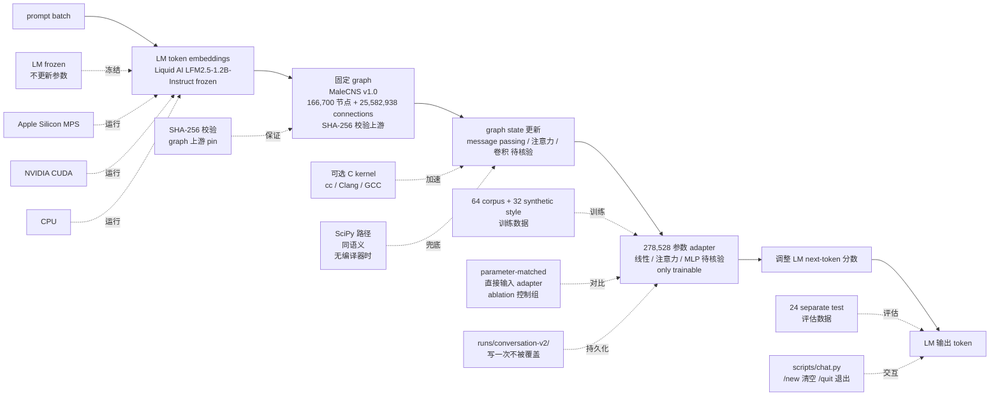

# FLModel/flm

## 一句话定位
Frozen LM × MaleCNS v1.0 苍蝇脑连接组适配——把 166,700 保留节点 + 25,582,938 directed connections 的成年雄性果蝇全脑连接组接到 Liquid AI LFM2.5-1.2B-Instruct 冻结小模型上，只训练 278,528 参数 adapter 调整 next-token 分数；token embeddings 驱动固定 graph；Apple Silicon MPS + NVIDIA CUDA + CPU 三路径；上游文件 SHA-256 校验；可选 C kernel 加速特征提取 + SciPy 路径同语义；64 corpus + 32 synthetic style 训练 + 24 separate test 评估 + parameter-matched 直接输入 adapter 控制组。

## 它解决的问题
当前 neuroAI（神经科学 × 人工智能）研究主流方向之一是 **「把生物神经连接组接到 LLM 上，看 LLM 能否用连接组结构辅助生成」**——FLModel/flm 是 **「Frozen LM × MaleCNS v1.0 苍蝇脑连接组」** 的具体实现：**MaleCNS v1.0** 是 2024 年发表的成年雄性果蝇全脑连接组（166,700 保留节点 + 25,582,938 directed connections，覆盖苍蝇全脑大部分神经元的突触连接）；**Liquid AI LFM2.5-1.2B-Instruct** 是 Liquid AI 2025 年发布的 1.2B 参数小模型（专门为本地部署 + 多模态优化）；**278,528 参数 adapter** 是极小可训练组件（仅 LM 总参数 ~0.02%）。**「只训练 adapter + LM 冻结 + graph 固定」** 是 **「参数高效 + 数据需求低 + 可本地复现」** 的标准组合——可在普通笔记本（CPU / Apple Silicon / RTX 3090）上跑。

## 为什么值得关注（2026-09-16）
- **Stars:** 68（截至 2026-09-16），1 天 68⭐（项目刚发布曝光）
- **Forks:** 13（fork/star 19.1%，学术 + 研究信号区间）
- **Watchers/Subscribers:** 2
- **Open Issues:** 0
- **License:** OTHER（非标准 license，企业商用合规需审查）
- **语言:** Python 3.12
- **活跃度:** created 2026-09-15，pushed_at 2026-09-11（注：pushed_at 早于 created_at 可能是元数据异常或 fork 后重新推送）
- **规模:** 119 KB（极小）
- **训练数据:** 64 corpus + 32 original synthetic style examples
- **评估数据:** 24 separate test conversations
- **Adapter 参数:** 278,528（极小可训练组件）
- **依赖:** Liquid AI LFM2.5-1.2B-Instruct（多 GB 下载）+ MaleCNS v1.0 connectome

## 热度来源判断
FLModel/flm 的热度是 **「Frozen LM × 生物神经连接组 × 可本地训练 + 可复现」** 的组合。neuroAI 在 2026 Q3 是研究热点——多个项目尝试把生物神经连接组（苍蝇脑 / 线虫脑 / 斑马鱼脑）接到 LLM 上，但 **「可本地训练 + 可复现」** 是稀缺特性。**关键工程点是「上游文件 SHA-256 校验」+「三路径（CPU / MPS / CUDA）」+「可选 C kernel + SciPy 同语义」+「parameter-matched 控制组」+「24 separate test 评估」** —— 这是学术可复现的硬要求，与昨日 FlashREINFORCE「NVIDIA 论文级严肃度」同构但推到「神经科学 + LLM 融合」研究领域。**fork/star 19.1% 处于「学术 + 研究」信号区间** —— 与昨日 FlashREINFORCE fork/star 7.7% 同类学术信号但更高，反映学术圈复制实验的活跃度。**68⭐ / 1 天**相对较高反映 neuroAI 研究的关注热度。热度 **真实且具学术刚需** —— 但 OTHER license 是企业商用合规风险；**真正决定长期价值的是 adapter 在 benchmark 上的效果** —— README 诚实表态「This does not mean a biological fly understands language」是好事但限制了「neuroAI AGI」类过度营销。

## 关键技术亮点
1. **MaleCNS v1.0 苍蝇全脑连接组**——2024 年发表的成年雄性果蝇全脑连接组；166,700 保留节点 + 25,582,938 directed connections；覆盖苍蝇全脑大部分神经元的突触连接
2. **Liquid AI LFM2.5-1.2B-Instruct**——Liquid AI 2025 年发布的 1.2B 参数小模型；专门为本地部署 + 多模态优化；可在 CPU / Apple Silicon / NVIDIA GPU 上跑
3. **278,528 参数 adapter**——极小可训练组件（仅 LM 总参数 ~0.02%）；这是「adapter-based fine-tuning」的标准尺度
4. **frozen LM + trainable adapter + fixed graph readout**——三件套组合；LM 不更新参数（frozen） + adapter 训练更新 + graph 固定不更新
5. **token embeddings 驱动固定 graph**——LM 的 token 表示作为 graph 的输入信号；这是「LM 输出 → graph 输入」的方向
6. **adapter 读 graph state 调整 next-token 分数**——graph 不是 LLM 的「知识」而是「token 预测时的额外约束」；adapter 把 graph 状态转成 next-token 分数的调整量
7. **三路径训练**——Apple Silicon MPS + NVIDIA CUDA + CPU；可在普通笔记本 / 工作站 / 服务器上跑
8. **上游 SHA-256 校验**——graph files pinned to upstream revisions；同一份数据 + 同一份代码 + 同一份图，应该跑出同一份结果；可复现性硬要求
9. **可选 C kernel + SciPy 同语义**——可选 C kernel 加速特征提取不丢节点 / 边；无编译器时 SciPy 路径同语义；硬件门槛最低
10. **parameter-matched 直接输入 adapter 控制组**——绕过 graph 直接输入控制组；作为 ablation 看 graph 到底贡献多少
11. **64 corpus + 32 synthetic style + 24 separate test**——训练数据小（64+32）+ 评估数据独立（24 个 test conversations）；避免「训练数据泄漏到评估」
12. **runs/conversation-v2/ 不覆盖已完成 run**——「写一次不被覆盖」的工程化形式；多次实验可保留历史
13. **/new 清空 /quit 退出交互聊天**——交互命令简洁；用户可连续测试多个 prompt
14. **诚实表态**——README 明示「This does not mean a biological fly understands language」；避免过度营销

## 架构师速览

| 决策问题 | 研究判断 | 证据边界 |
|---|---|---|
| 系统边界 | Frozen LM × MaleCNS v1.0 苍蝇脑连接组适配；输入 prompt；输出 next-token（用 adapter 调整）；Python 3.12 + macOS/Linux + Apple Silicon MPS / NVIDIA CUDA / CPU 三路径；上游文件 SHA-256 校验；可选 C kernel 加速 + SciPy 同语义；64 corpus + 32 synthetic style 训练 + 24 separate test 评估；parameter-matched 控制组 | 来自 README 关于「MaleCNS v1.0 166,700 节点 + 25,582,938 connections」「Liquid AI LFM2.5-1.2B-Instruct 冻结」「278,528 参数 adapter 训练」「token embeddings 驱动固定 graph」「adapter 读 graph state 调整 next-token 分数」「Apple Silicon MPS / NVIDIA CUDA / CPU 三路径」「上游文件 SHA-256 校验」「可选 C kernel 加速 + SciPy 同语义」「64 corpus + 32 synthetic style 训练 + 24 separate test 评估」「parameter-matched 直接输入 adapter 控制组」的明示；具体 adapter 数学形式（线性层 / 注意力 / MLP）、graph 状态向量维度、token 与 graph 的对应关系在 README 中未完全展开 |
| 主路径 | 输入 prompt → LM token embeddings 提取 → 固定 graph 接收 token embeddings 作为输入信号 → graph 状态更新（基于 166,700 节点 + 25,582,938 connections 的递归传播）→ 278,528 参数 adapter 读 graph 状态 → 调整 LM next-token 分数 → 输出 token；训练时只更新 adapter 参数 | 主路径来自 README 描述的「token embeddings 驱动固定 graph」+「adapter 读 graph state 调整 next-token 分数」+「only adapter is trained」；具体 graph 状态更新规则（message passing / 注意力 / 卷积）、adapter 的具体数学形式（线性变换 / 注意力 / MLP）、控制组的 baseline 实现细节待核验 |
| 关键权衡 | frozen LM（保留语言能力 vs 不能微调 LM 内部知识）/ adapter-based（参数高效 vs 不能深度改造 LM 行为）/ fixed graph（可解释 vs 不能学习图结构）/ 苍蝇脑（数据丰富 vs 与人脑距离远）/ 1.2B 小模型（本地可跑 vs 能力受限）/ SHA-256 校验（可复现 vs 上游变化需更新）/ parameter-matched 控制组（ablation 严谨 vs 增加实验成本）/ CPU 可跑（硬件门槛低 vs 训练慢） | 权衡八因素均从 README + repo 元数据推导；具体 graph 状态向量的物理意义（神经科学 vs 工程化抽象）、adapter 在 benchmark 上的具体效果提升幅度、训练时长与超参数设置待核验 |
| 最小 PoC | Python 3.12 + macOS 或 Linux（Apple Silicon / NVIDIA GPU / CPU）+ `git clone https://github.com/nftechie/flm.git` + `python3.12 -m venv .venv` + `pip install -r requirements.txt` + `python scripts/download.py`（SHA-256 校验）+ `python scripts/prepare_graph.py` + 跳过可选 C kernel + `python scripts/train_conversation.py --output runs/test --device cpu`；再 `python scripts/chat.py --prompt "Invent a tiny museum exhibit." --seed 42`；最后 `python scripts/train_conversation.py --output runs/direct-input --device cpu` 跑控制组对比 | PoC 由「上游 SHA-256 + 三路径 + parameter-matched 控制组 + 24 separate test + 写一次不被覆盖」路径推导；具体 adapter 数学形式、graph 状态更新规则、训练时长待核验 |

## 架构启发
FLModel/flm 的核心启发是 **「Frozen LM + trainable adapter + fixed graph readout」** 是 neuroAI 研究的最小可行 adapter 工程范式。**「参数高效」**——278,528 参数 adapter 仅占 LM 总参数 ~0.02%，可在普通笔记本上训练；**「数据需求低」**——64 corpus + 32 synthetic style 训练数据小；**「可本地复现」**——SHA-256 校验上游 + 三路径 + parameter-matched 控制组 + 24 separate test 是学术可复现的硬要求。**「诚实表态」**——README 明示「This does not mean a biological fly understands language」是好事，避免「用 LFM2.5 + fly brain 实现了 AGI」类过度营销。**更深层的启发是「frozen + trainable + fixed 三件套」**——LM 冻结 + adapter 训练 + graph 固定三个不变量各司其职：LM 提供语言能力，adapter 提供 graph → LM 调整，graph 提供结构约束。这是 **「可解释 + 可复现 + 硬件门槛低」** 的工程化形式。

## 架构图（MMD）

> 证据边界：此图只采用本档案已有可核验描述；"待核验"节点不应视为项目实现事实。

## 定位判断
**观察型项目（neuroAI 可本地训练 + 可复现 adapter 工程）。** FLModel/flm 不是又一个 LLM 训练框架（那是 HuggingFace Transformers / PyTorch Lightning / Axolotl），而是 **「Frozen LM × 生物神经连接组」** 的最小可行 adapter 工程——MaleCNS v1.0 + LFM2.5-1.2B-Instruct + 278,528 参数 adapter 三件套。**「只训练 adapter + LM 冻结 + graph 固定」** 是 **「参数高效 + 数据需求低 + 可本地复现」** 的标准组合。**fork/star 19.1% 处于「学术 + 研究」信号区间**——学术圈复制实验活跃；OTHER license 是企业商用合规风险。**目前定位是「neuroAI 可本地训练 + 可复现 adapter 工程的最小可行样本」**——向上是 NVIDIA agentic LLM RL 训练范式，向下是生物神经连接组；本仓库在中间扮演「可解释 + 可复现 + 硬件门槛低」的工程化形式。

## 风险/局限/泡沫点
- **OTHER license（非标准 license）**——企业商用合规需仔细审查 license 内容
- **168,700 节点 + 25,582,938 connections 的大图训练对硬件门槛较高**——CPU 较慢，需要 MPS / CUDA 加速
- **「This does not mean a biological fly understands language」是诚实表态但限制了「neuroAI AGI」类过度营销**——投资人/媒体可能因「保守表态」降低关注
- **parameter-matched 直接输入 adapter 作为控制组的具体 baseline 效果待核验**——graph 到底贡献多少需要 ablation 实验验证
- **adapter 在 benchmark 上的具体效果提升幅度待核验**——README 未给具体数字
- **pushed_at 早于 created_at 是元数据异常**——可能影响 GitHub API 解析
- **苍蝇脑与人脑距离远**——MaleCNS v1.0 是果蝇全脑连接组，与人脑差距巨大；adapter 学到的「知识」对人脑启发有限
- **graph 状态向量的物理意义待核验**——adapter 学到的 graph 状态调整量是否真的反映「神经科学意义」还是「数学拟合」待核验

## 与同类项目的关系
- **vs yifanzhang-pro/FlashREINFORCE（昨日项目）**：两者都是 NVIDIA / 学术级严肃工程，但 FlashREINFORCE 推到「agentic LLM RL 训练」+ FLModel/flm 推到「神经科学 × LLM」；都遵守 SHA-256 校验 + parameter-matched 控制组 + 主动标注复现局限
- **vs HuggingFace Transformers / PyTorch Lightning**：这些是「通用 LLM 训练框架」；FLModel/flm 是「frozen + adapter + fixed graph 三件套的最小可行实现」
- **vs 线虫脑 / 斑马鱼脑连接组项目**：MaleCNS v1.0 是果蝇；其他项目可能用 C. elegans（线虫）/ zebrafish（斑马鱼）等——neuroAI 跨物种的研究方向
- **vs Liquid AI LFM2.5 系列项目**：LFM2.5 是 Liquid AI 2025 年小模型系列；FLModel/flm 是「LFM2.5 + fly brain」的最小可行 adapter
- **vs neuronale/-style adapter-based fine-tuning (LoRA / IA³)**：LoRA / IA³ 是「adapter-based fine-tuning」的工业标准；FLModel/flm 是「graph-aware adapter」的学术探索

## 是否值得持续跟踪
**值得跟踪（neuroAI 可本地训练 adapter 工程的最小可行样本）。** FLModel/flm 代表了 neuroAI 研究的 **「可本地训练 + 可复现 + 硬件门槛低」** 方向——无论 adapter 效果如何，本仓库的「frozen + adapter + fixed graph 三件套 + SHA-256 校验 + 三路径 + parameter-matched 控制组」是学术可复现的清晰范式。建议关注：**(a) adapter 在 benchmark 上的具体效果提升幅度**（决定是否能成为 neuroAI 标准范式）；**(b) OTHER license 是否会换成 Apache-2.0 / MIT**（决定企业采用度）；**(c) 是否扩展到其他物种连接组**（线虫 / 斑马鱼 / 小鼠）；**(d) 是否扩展到更大 LM**（LFM2.5-7B / 其他）。**对 neuroAI 研究者**：这是 2026 Q3 公开的「可本地训练 + 可复现 + SHA-256 校验」的最小可行 adapter 工程；**对 LLM fine-tuning 工程师**：278,528 参数 adapter + frozen LM + fixed graph 是「adapter-based fine-tuning」的另一种探索；**对 AI 研究观察者**：这是「神经科学 + LLM」赛道的清晰样本。

## 后续观察点
- 是否扩展到其他物种连接组（线虫 / 斑马鱼 / 小鼠）
- OTHER license 是否会换成 Apache-2.0 / MIT（提升企业采用度）
- adapter 在 benchmark 上的具体效果提升幅度
- 是否扩展到更大 LM（LFM2.5-7B / 其他）
- graph 状态向量是否被神经科学家认可（决定学术价值）

---
> 数据来源: GitHub API (2026-09-16) | Stars: 68 | Forks: 13 | License: OTHER | 语言: Python | 创建: 2026-09-15 | Adapter 参数: 278,528