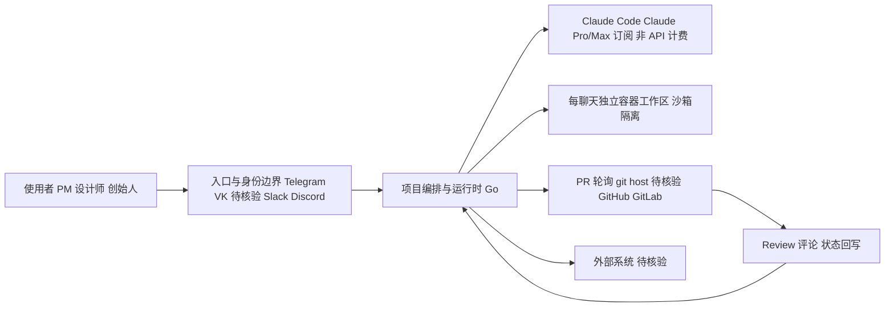

# Flock

## 一句话定位
Chat-driven AI 开发团队——在 Telegram/VK 中描述需求，Flock 自动规划、编码、测试、审查并开 PR，每个聊天独立隔离工作区。

## 它解决的问题
非工程师（PM、设计师、创始人）想让 AI 写代码，但不想学终端操作。Flock 让他们在熟悉的聊天软件中驱动一个完整的 AI 开发团队流水线。

## 为什么值得关注（2026-06-19）
- Go 实现，预构建 Docker 镜像，4 个环境变量即可启动
- 支持 Claude Pro/Max 订阅（非 API 计费），使用门槛极低
- 完整 dev-team 流水线：spec → build → test → review → PR
- 多 transport 架构（Telegram + VK，新平台是薄 adapter）

## 热度来源判断
真实使用场景驱动。Claude Pro/Max 订阅制消除了 API 成本焦虑，Telegram 入口极低。但 698 stars 说明仍在早期采用者阶段。

## 关键技术亮点亮点
1. **Conversation-as-Task** — 聊天即任务源，PR 即结果
2. **沙箱隔离** — 每个聊天独立容器工作区
3. **PR 轮询** — 不需要 inbound webhook，主动轮询 git host 获取 review 评论
4. **订阅友好** — Claude Pro/Max OAuth token，不按 token 计费

## 架构师速览

| 决策问题 | 研究判断 | 证据边界 |
|---|---|---|
| 系统边界 | Flock 是入口渠道（Telegram/VK）、Claude 订阅、git host 之间的编排层，聊天即任务源、PR 即结果 | 基于标签 telegram/vk/claude-code/docker 与档案中 Conversation-as-Task 描述；具体协议、容器实现、git host 列表未在档案中给出 |
| 主路径 | 用户在聊天发需求 → 编排层调度 Claude Code → 在每聊天独立容器工作区中编码/测试 → 轮询 git host 评论 → 回写会话状态并开 PR | 主流程来自 spec→build→test→review→PR 与 PR 轮询两点；运行时、轮询频率、PR 平台支持范围未核验 |
| 关键权衡 | 聊天入口降低使用门槛 vs 削弱代码控制粒度；Claude Pro/Max 订阅降低计费焦虑 vs 强绑 Anthropic 与地理可用性 | 取自"架构启发"段与"风险/局限"段中的 1、2、3 条；其他权衡（如多租户、可观测性）档案未提 |
| 最小 PoC | 单 Telegram bot、最小工具权限、可审计日志、Claude Pro/Max 订阅，跑一条"需求→PR"闭环，验收安全/成本/SLO/退出路径四项 | PoC 设计基于"采用建议"与"关键亮点 1–4"；具体环境变量、镜像名、SLO 指标档案未列，部署细节待核验 |

## 架构启发
Flock 证明了 **Chat-to-PR** 模式的可行性。关键 trade-off 是：降低使用门槛（聊天）vs 降低控制粒度（无法精细控制代码）。

## 架构图（MMD）

> 证据边界：此图只采用本档案已有可核验描述；“待核验”节点不应视为项目实现事实。

## 定位判断
工具型项目，场景明确但受限。适合个人开发者和小团队的简单需求，不适合复杂工程。

## 风险 / 局限 / 泡沫点
1. **场景受限** — 聊天不适合描述复杂需求
2. **Claude 依赖** — 强绑定 Anthropic 生态
3. **地理限制** — 需要 Anthropic 支持地区
4. **代码审查缺失** — 自动生成的 PR 需要 human review

## 与同类项目的关系
- **vs Claude Code** — Claude Code 是终端原生，Flock 是聊天原生
- **vs omnigent** — omnigent 编排多 agent，Flock 只用 Claude Code
- **vs GitHub Copilot** — Copilot 辅助人写代码，Flock 让 AI 独立写代码

## 是否值得持续跟踪
**观察型跟踪。** 概念有趣但场景受限。如果推出 Slack/Discord adapter 并支持多 agent，价值会提升。

## 后续观察点
1. 是否推出 Slack/Discord adapter
2. 用户增长和企业使用案例
3. PR 质量和合并率数据

---
*首次记录：2026-06-19*
