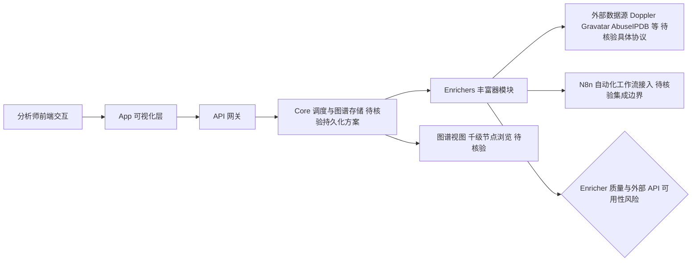

# Flowsint

## 一句话定位
开源 OSINT 图谱调查平台——可视化实体关系探索，支持域名/IP/社交/加密货币等多维度自动关联，Docker 一键部署。

## 它解决的问题
网络安全分析师和调查人员需要跨多个数据源（DNS/IP/WHOIS/社交/加密货币）进行关联分析。现有工具要么分散，要么昂贵。Flowsint 将所有数据源统一到可视化图谱中。

## 为什么值得关注（2026-06-03）
- **+190 stars/day**，GitHub Trending TypeScript 前列
- 图谱化 OSINT 调查是网络安全领域的刚需
- 模块化设计（Core/Types/Enrichers/API/App）架构清晰
- 完全本地部署，数据不出机器，隐私友好

## 热度来源判断
- 网络安全 + OSINT 垂直领域，用户群体明确
- Docker 一键部署降低使用门槛
- 4.5K stars 对安全工具来说已经很高

## 关键技术亮点亮点
1. **丰富器（Enricher）架构**：每种数据源一个 Enricher，模块化可扩展
2. **图谱可视化**：千级节点无卡顿
3. **多维度关联**：域名→IP→ASN→CIDR→组织 的自动链条
4. **N8n 集成**：可接入自动化工作流

## 架构师速览

| 决策问题 | 研究判断 | 证据边界 |
|---|---|---|
| 系统边界 | Flowsint 是本地化 OSINT 图谱平台，外部边界是 Doppler/Gravatar/AbuseIPDB 等第三方数据源（N8n 仅作为工作流接入点，待核验）；内部边界为 Core/Types/Enrichers/API/App 四层模块 | 数据源具体清单与协议未在档案中列出，仅能确认 N8n 集成与丰富器模式 |
| 主路径 | 分析师交互 → App 前端 → API → Core 调度 Enricher → 拉取外部数据源 → 返回实体写入图谱 → 千级节点无卡顿可视化 | "千级节点无卡顿"为档案单方面描述，未给出版本/硬件基准 |
| 关键权衡 | 隐私/数据驻留（本地部署）vs Enricher 对外部 API 的强依赖（含 API 失效/质量参差风险），以及模块扩展性 vs 早期测试覆盖不完整 | 未提供具体 Enricher 数量、测试覆盖率或外部 API SLA |
| 最小 PoC | 在隔离环境用 Docker 一键部署，对单一域名执行 Enricher 链路（域名→IP→ASN→CIDR→组织）验证图谱可视化与外部 API 抖动容忍度 | Docker Compose 内容、未声明的依赖与资源占用未给出，需以仓库核验 |

## 架构启发
- Enricher 模式可以推广到其他需要多源数据关联的场景（如供应链风险分析）
- 图谱 + 自动关联的交互模式比传统表格更适合探索性调查

## 架构图（MMD）

> 证据边界：此图只采用本档案已有可核验描述；“待核验”节点不应视为项目实现事实。

## 定位判断
**工具型。** 面向安全分析师的专业工具，非通用基础设施。

## 风险/局限/泡沫点
1. 早期开发阶段，测试覆盖不完整
2. 社区贡献者较少，可持续性待验证
3. Enricher 质量参差不齐（部分依赖外部 API）
4. 非架构师日常关注范畴，偏安全专业领域

## 与同类项目的关系
- **Maltego**：商业 OSINT 平台，Flowsint 是开源替代
- **Shrek/Sherlock**：单项工具，Flowsint 做平台化整合

## 是否值得持续跟踪
**观察。** 安全垂直领域工具，非核心关注方向，但 Enricher 架构模式值得借鉴。

## 后续观察点
1. Enricher 生态的丰富度和质量
2. 社区活跃度和贡献者增长
3. 是否有企业级使用案例

---

*档案创建于 2026-06-03 · 数据截止 2026-06-03 06:00 CST*
