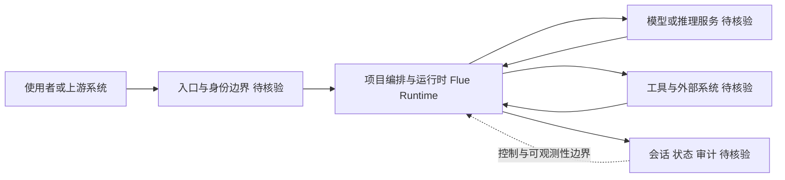

# withastro/flue

## 一句话定位
Astro 团队推出的沙箱 agent 框架——为 AI agent 提供安全隔离的执行环境和生命周期管理。

## 它解决的问题
AI agent 需要执行代码、访问文件系统、发起网络请求，但这些操作有安全风险。直接在主机上运行 agent 代码可能造成数据泄露或系统损坏。Flue 提供了一个沙箱化的 agent 运行时框架，让 agent 在隔离环境中执行，同时提供标准化的 agent 生命周期管理（创建、执行、监控、销毁）。

## 为什么值得关注
- **Stars:** 7,752 stars，增速快（Astro 品牌加持）
- **Astro 团队出品**：有成功开源项目运营经验
- **TypeScript 实现**：对 Web 开发者友好
- **沙箱+agent 双主题**：命中两个热点（AI 安全 + agent 基础设施）
- 持续活跃更新（2026-08-05）

## 热度来源判断
- **Astro 品牌背书（高）**：Astro 是最流行的现代 Web 框架之一
- **agent 安全焦虑（高）**：agent 代码执行安全是行业热点
- **沙箱技术需求（中高）**：随着 agent 普及，隔离执行成刚需
- **Web 开发者社区（中）**：Astro 社区本身就是高质量开发者群体

## 关键技术亮点亮点
1. **沙箱隔离执行**：agent 代码在隔离环境中运行，限制文件和网络访问
2. **生命周期管理**：标准化的 agent 创建→执行→监控→销毁流程
3. **TypeScript 原生**：类型安全，IDE 支持好
4. **与 Astro 生态协同**：可能深度集成 Web 应用开发流程
5. **模块化架构**：可按需组合沙箱、监控、工具等模块

## 架构师速览

| 决策问题 | 研究判断 | 证据边界 |
|---|---|---|
| 系统边界 | 沙箱 agent 运行时框架，处于 agent 编排/运行时层，与入口渠道、模型供应商、工具/数据源之间是编排关系；由 Astro 团队以 TypeScript 实现 | 边界判断仅基于分类标签（agent-framework、sandbox、agent-runtime）与定位描述，未见公开架构图与模块清单 |
| 主路径 | 入口→身份/权限边界→编排与运行时→模型推理与外部工具调用→会话/状态/审计回写 | 档案未披露具体协议、IPC 形式、持久化方案与部署形态 |
| 关键权衡 | 沙箱隔离强度 vs JS 层沙箱能力上限；Astro 生态耦合收益 vs 通用 agent 框架定位；扩展速度 vs 权限与可观测性 | 沙箱实现层级（OS 级 vs 进程级 vs JS 运行时级）在档案中未说明，第三方审计亦未发布 |
| 最小 PoC | 单入口、最小工具权限、TypeScript 工程内嵌入 Flue 运行时，跑通创建→执行→监控→销毁全周期，对接可审计日志 | 档案无 API、CLI 或 SDK 用法示例，PoC 需以源码/文档二次核验 |

## 架构启发
- **agent 运行时需要框架化**：类似 Web 框架之于 Web 应用，agent 也需要运行时框架
- **安全作为一等公民**：沙箱不是附加层而是核心架构决策
- **Web 框架团队做 agent 工具**：说明 agent 技术正在从 AI 圈向 Web 开发圈扩散

## 架构图（MMD）

> 证据边界：此图只采用本档案已有可核验描述；“待核验”节点不应视为项目实现事实。

## 定位判断
**基础设施候选项目**。定位于 agent 运行时基础设施层，目前处于成长期。有 Astro 品牌和社区加持，有成长为 agent 框架标准之一的潜力。

## 风险/局限/泡沫点
- **信息不透明**：描述仅"The sandbox agent framework"，文档和细节可能不足
- **竞争激烈**：LangGraph、AutoGen、CrewAI、Mastra 都在做 agent 框架
- **沙箱技术门槛高**：真正安全的沙箱需要 OS 级支持，JS 沙箱安全性有限
- **Astro 项目注意力分散**：团队同时维护多个项目可能力不从心
- **定位不够清晰**："sandbox agent framework"到底是偏 sandbox 还是偏 agent？

## 与同类项目的关系
- **vs Mastra**：Mastra 是 TypeScript agent 框架，更偏应用层
- **vs E2B / Daytona**：E2B 做代码执行沙箱（云服务），Flue 更偏框架
- **vs LangGraph**：LangGraph 偏 agent 编排逻辑，Flue 偏执行环境
- **vs Deno（沙箱能力）**：Deno 本身有权限模型，Flue 在其之上构建 agent 抽象

## 是否值得持续跟踪
**推荐关注。** Astro 团队的执行力值得信任，且 agent 运行时是真实需求。但需等待更多技术细节和使用案例披露后再做深度投入。

## 后续观察点
- 完整文档和架构设计文档的发布
- 与 Astro 框架的集成模式（是否有 Astro 插件）
- 生产环境使用案例
- 沙箱安全性的第三方审计报告
- 是否支持非 TypeScript agent（如 Python agent 的沙箱执行）

---
> 数据来源: GitHub API (2026-08-05) | Stars: 7,752 | Forks: 450 | 语言: TypeScript
