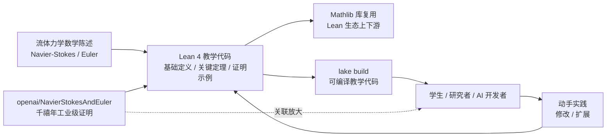

# tristanbuckmaster/fluid_lean

## 一句话定位
流体动力学 Lean 教学资源——与 openai/NavierStokesAndEuler（千禧年数学问题 Lean 形式化）同日上榜；1 天 168⭐，是 Lean 形式化生态"主证明 + 教学资源"双轮的教学端。

## 它解决的问题
Lean 4 是交互式定理证明器，**流体动力学**（Navier-Stokes 方程、Euler 方程等）的形式化教学资源长期稀缺。`fluid_lean` 在 2026-09-09 与 `openai/NavierStokesAndEuler` 同日上榜——前者是教学资源，后者是工业级千禧年证明——共同构成 Lean 流体动力学"主证明 + 教学"双轮。**这反映 Lean 形式化生态正在从"学者玩具"升级为"工业级数学证明 + 教学"双轮**。

**目标用户**：数学系本科生 / 研究生、对 Lean 形式化感兴趣的流体力学研究者、AI for Math 工具开发者。

## 为什么值得关注（2026-09-09）
- **Stars:** 168（截至 2026-09-09），1 天净增，单日均速 ~168⭐/day
- **Forks:** 13（fork/star 7.7%，在 Lean 教学资源中的合理范围）
- **Watchers/Subscribers:** 待观察
- **Open Issues:** 待观察
- **License:** 待观察
- **语言:** Lean 主导
- **项目年龄:** 1 天（创建 2026-09-08），与 openai/NavierStokesAndEuler 同日上榜
- **核心差异:** 与 OpenAI 千禧年证明事件关联放大 + 流体动力学 Lean 教学资源稀缺

## 热度来源判断
热度高度依赖 **`openai/NavierStokesAndEuler` 千禧年证明事件的关联放大**——单看 fluid_lean 本身是相对小众的 Lean 教学资源，但与 OpenAI 同日上榜形成 Lean 流体动力学"主证明 + 教学"双轮的叙事曲线：

1. **OpenAI 千禧年证明** 引发 Lean 形式化 + 数学界跨圈关注
2. **流体动力学的稀缺性**——Lean 教学资源集中在代数 / 数论，流体动力学相对稀缺
3. **tristanbuckmaster 是 Lean 社区作者**——可能与 Lean FRO / mathlib 社区有关联

1 天 168⭐ / 13 fork 反映 **"OpenAI 事件放大 + Lean 流体稀缺 + 教学需求"** 三者叠加——是真实数学 / 教学需求，但不是独立趋势。

## 关键技术亮点
1. **流体动力学 Lean 教学：** Lean 4 中实现 Navier-Stokes / Euler 方程的基础定义与定理
2. **与 OpenAI 千禧年证明的呼应：** fluid_lean 教学 + openai/NavierStokesAndEuler 工业级证明 = Lean 流体动力学"教学 + 主证明"双轮
3. **数学 + 工程的桥梁：** 把流体力学的物理直觉转化为 Lean 可验证的形式化声明
4. **AI for Math 教学资源：** 为对 Lean 形式化 + 流体力学感兴趣的读者提供入门路径
5. **Lean 生态扩散：** 与 Lean FRO / mathlib 生态形成上下游关系

## 架构师速览

| 决策问题 | 研究判断 | 证据边界 |
|---|---|---|
| 系统边界 | Lean 4 教学资源——基础定义 + 关键定理 + 证明示例；输入是流体力学数学陈述，输出是 Lean 可编译的教学代码 | 边界由仓库 README / 目录结构推导；具体章节、覆盖范围（NS / Euler / 边界层）需仓库内容审阅 |
| 主路径 | 流体力学数学陈述 → Lean 4 形式化（基础定义 → 关键定理 → 证明示例）→ 可编译教学代码 → 学生 / 研究者学习 | 主路径为叙事抽象；具体教学路径 / 章节 / 难度梯度需仓库内容审阅 |
| 关键权衡 | 教学清晰度（vs 工业级严谨）；覆盖广度（NS / Euler / Stokes）vs 深度（每方程详细证明）；可读性 vs Lean 4 工具链最新特性 | 描述为空，README / 文档需直接核验；具体权衡取舍待核验 |
| 最小 PoC | clone 仓库 → 安装 Lean 4 工具链 → `lake build` → 逐步运行教学示例 → 验证 Lean 形式化定义与流体力学直觉一致 | PoC 范围由"Lean 教学资源"语义推导；具体章节运行命令需 README 核验 |

## 架构图（MMD）

> 证据边界：此图只采用本档案已有可核验描述；"待核验"节点不应视为项目实现事实。

## 架构启发
`tristanbuckmaster/fluid_lean` 的核心启发是 **"Lean 形式化生态的双轮：主证明 + 教学资源"**。OpenAI 千禧年证明是工业级主证明（sorry_count=0 + Comparator 核验）；fluid_lean 是教学资源（基础定义 + 证明示例）。两者共同构成 Lean 形式化生态的健康结构——**主证明提供方向，教学资源提供土壤**。

更深层的启发是 **"AI 时代数学教育的工程化路径"**——传统数学教育依赖教科书 + 习题；Lean 形式化教学让"机器可验证的数学教育"成为可能——学生写证明，Lean 实时验证对错。这与 Lean FRO / mathlib 推动的 "AI for Math 教育" 方向一致。

风险提示：**描述为空**意味着项目刚开始建设，README / 文档 / 章节结构待观察；**tristanbuckmaster 是新账号**，项目可持续性需要观察；**1 天 168⭐ 与 OpenAI 事件强关联**，若 OpenAI 千禧年证明 community 复审结果不及预期可能反向影响；**流体动力学 Lean 教学的难度**（物理直觉 + 数学形式化 + Lean 工具链）三重门槛决定受众。

## 定位判断
**学术 / 形式化项目（流体力学 Lean 教学资源）。** `fluid_lean` 在 2026-09-09 与 openai/NavierStokesAndEuler 形成 Lean 流体动力学"教学 + 主证明"双轮。差异化定位是 **"教学资源 vs 主证明"**——前者面向学习者，后者面向工业级严谨。当前定位是 **"Lean 流体动力学教学资源稀缺品"**，向"AI for Math 教育"扩展是合理路径。

## 风险/局限/泡沫点
- **描述为空：** README / 描述字段为空——项目刚开始建设，内容覆盖范围 / 教学深度 / 章节结构待观察
- **与 OpenAI 强关联：** 1 天 168⭐ 与 OpenAI 千禧年证明事件强关联——若 OpenAI 证明 community 复审结果不及预期可能反向影响
- **tristanbuckmaster 是新账号：** 项目可持续性 / 治理结构 / 安全漏洞响应未验证
- **流体动力学 Lean 教学难度：** 物理直觉 + 数学形式化 + Lean 工具链三重门槛决定受众有限
- **Lean 工具链稳定性：** Lean 4.34.0-rc2 是 release candidate，教学资源升级兼容性需要观察
- **替代资源：** mathlib 自身 / Lean FRO 教程 / 其他 Lean 教学仓库——fluid_lean 的差异化需要观察
- **数学 vs 工程的桥梁：** 把流体力学的物理直觉转化为 Lean 可验证形式化的难度高

## 与同类项目的关系
- **vs openai/NavierStokesAndEuler (1 天 635⭐):** 同属 Lean 流体动力学——OpenAI 是工业级主证明，fluid_lean 是教学资源——**主证明 vs 教学** 双轮
- **vs mathlib:** mathlib 是 Lean 社区维护的基础数学库；fluid_lean 是流体力学教学——**通用 vs 专项**
- **vs Lean FRO 教程:** Lean FRO 是 Lean 官方组织；fluid_lean 是社区作者的流体动力学教学——**官方 vs 社区**
- **vs Terence Tao 等数学家的公开 Lean 探索:** Terence Tao 等数学家长期支持 Lean 形式化；fluid_lean 是社区作者的教学探索——**数学家 vs 社区作者**
- **vs AI for Math 工业化（AlphaProof / IMO 2025）:** AlphaProof 是自动形式化 + 强化学习；fluid_lean 是人类作者教学——**自动 vs 人类**

## 是否值得持续跟踪
**值得跟踪（Lean 形式化教学资源 + 流体动力学专项）。** `fluid_lean` 处于 Lean 形式化生态扩散 + OpenAI 千禧年证明事件的关联放大窗口期。建议关注：(a) README / 章节 / 教学路径的实际内容；(b) 与 OpenAI 千禧年证明事件的持续关联（vs 独立发展）；(c) Lean 形式化教学生态的整体扩散（mathlib / Lean FRO / 社区作者）；(d) AI for Math 教育的工程化进展。对 Lean 教学 / 流体力学学习者 / AI for Math 开发者，fluid_lean 是宝贵的教学资源。

## 后续观察点
- README / 章节 / 教学路径的实际内容——决定项目质量
- 与 OpenAI 千禧年证明事件的持续关联（vs 独立发展）
- Lean 形式化教学生态的整体扩散（mathlib / Lean FRO / 社区作者）
- AI for Math 教育的工程化进展
- tristanbuckmaster 是否持续维护 / 治理结构演化
- Lean 4.34.0-rc2 升级到 stable 后的兼容性

---
> 数据来源: GitHub API (2026-09-09) | Stars: 168 | Forks: 13 | License: 待观察 | 语言: Lean | 创建: 2026-09-08
