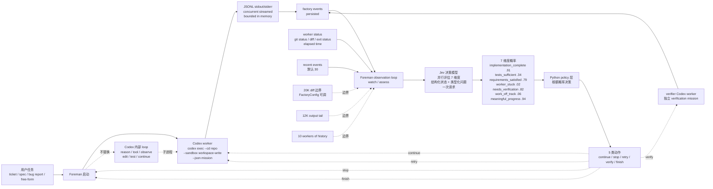

# thruwire/foreman

## 一句话定位
TypeSafe AI 的 Jev 决策模型置于 Codex coding agent 之上形成「软件工厂监管层」双 loop 并行架构 —— 监督者（Foreman）以 watcher/assessor/decision-maker 身份围绕 worker 跑，而不打断 worker 的内部推理循环。

## 它解决的问题
2026 Q3 Coding Agent 的痛点不是「生成能力」而是「监督能力」：worker 是否卡住（stuck）、实现是否完成（implementation complete）、测试是否充分（tests sufficient）、需求是否满足（requirements satisfied）、是否需要独立验证（needs verification）、是否偏离轨道（work off track）、是否取得有意义的进展（meaningful progress）。这些「窄决策问题」用 LLM 串行推理每问一次都消耗 token + 时间 + 可能跳步或给出过度自信答案。Foreman 用 Jev（TypeSafe AI 2026-09 发布的快决策模型）并行评估 7 维度 + Python policy 层做闭环 —— 这是「快决策层 / 慢生成层」分层的工程化形式。

## 为什么值得关注（2026-09-18）
- **Stars:** 172（截至 2026-09-18），1 天 172⭐，早期严肃信号
- **Forks:** 11，fork/star 6.4%，与昨日 dsh-computer-use_codex-style 0% / agent-skills 0% 相当（严肃实验项目 fork 率通常较低）
- **Watchers/Subscribers:** 1
- **Open Issues:** 0，维护良好
- **License:** MIT
- **语言:** Python（asyncio）
- **活跃度:** created 2026-09-17，pushed_at 2026-09-17
- **规模:** 46 KB（极小可独立部署的工厂监管内核）
- **Topics:** 暂无（公开元数据）

## 热度来源判断
Foreman 的热度是 **「Coding Agent 监管层方法学转向 × Jev 决策模型早期采用 × 严肃实验表态」** 的组合。当 LLM 串行推理在 worker 监督上力不从心时，Jev 接受结构化状态 + 类型化问题 + 返回概率决策 + 多问题并行评估一次请求 形成对照——这是 2026-09 AI Coding Agent 决策层方法学转向的具体实例。**foreman 在 8+ 个 Jev 生态项目中星数最高**（172⭐ vs jev-review 72⭐），且明确表态「architectural experiment, not a claim that this design is already better than a conventional coding-agent harness」——严肃实验 + 严肃表态双重信号。11 个 fork + 4 篇 docs（theory.md / why-jev.md / what-foreman-proves.md / runtime.md）反映社区对企业监督场景的关注。

## 关键技术亮点
1. **两个并发 loop** — CODING AGENT LOOP（reason → tool → observe → edit → test → continue）+ FOREMAN LOOP（watch → assess → decide → intervene）
2. **Codex CLI stable exec 接口** — `codex exec --cd <repo> --sandbox workspace-write --color never --json <mission>` 作为 worker（依赖 Codex 官方 stable API）
3. **JSONL stdout/stderr concurrent streamed** — bounded in memory + persisted as factory events + made visible to Foreman before worker exits
4. **Jev 并行评估 7 维度** — implementation_complete / tests_sufficient / requirements_satisfied / worker_stuck / needs_verification / work_off_track / meaningful_progress（每维度返回 0-1 概率）
5. **Python policy 层 5 类动作** — continue / stop / retry / verify / finish（根据 Jev 概率决策决定）
6. **observation 边界默认值** — 20K diff + 12K tail + 30 events + 10 workers of history（FactoryConfig 可调）
7. **worker implementation replaceable** — runtime depends on small worker protocol rather than Codex-specific types（理论上可换 Claude Code / Cursor CLI 等）
8. **verifier 复用 Codex** — another Codex worker with independent, deterministic verification mission
9. **不替换 Codex 内部 reason/tool/observe loop** — 只 watch + assess + decide + intervene（两层异步）
10. **Missions stay broad** — worker 不必停下等 factory 思考（subprocess 保持 active 同时 debounced observation loop 在跑）
11. **Foreman never dumps the repository into Jev** — 边界默认值是「不让 Jev 看到全仓库」的工程化形式
12. **4 篇 docs** — theory.md（语义监管理论）/ why-jev.md（为什么 Jev 适合这个实验）/ what-foreman-proves.md（在证明什么）/ runtime.md（运行时与事件流）

## 架构师速览

| 决策问题 | 研究判断 | 证据边界 |
|---|---|---|
| 系统边界 | TypeSafe Jev 决策模型置于 Codex coding agent 之上双 loop 并行；worker 用 Codex CLI exec；JSONL 流式作为 factory events；Jev 并行评估 7 维度返回概率；Python policy 层 5 类动作；不替换 Codex 内部 loop；自托管 Python asyncio 运行时；worker / verifier 都跑 Codex | 来自 README + 4 篇 docs 关于「two concurrent loops」「codex exec --sandbox workspace-write --json」「Jev 7 维度并行评估」「Python policy continue/stop/retry/verify/finish」「FactoryConfig 可调边界」「worker replaceable 取决于 small worker protocol」「verifier 复用 Codex 不同 verification mission」「Missions stay broad」的明示；具体 Jev API 调用细节、Python policy 的具体规则、subprocess 边界管理在仓库源码未展开 |
| 主路径 | 启动 Codex worker（codex exec --json）→ JSONL stdout/stderr concurrent streamed → bounded in memory + persisted as factory events → Foreman observation loop 周期性取 events + worker status + diff → 调用 Jev 并行评估 7 维度 → Python policy 根据概率决策 → 5 类动作（continue / stop / retry / verify / finish）→ 若 verify 启动 verifier Codex worker 跑独立 verification mission | 主路径来自 README 关于「JSONL streamed as factory events」「Jev 并行评估」「Python policy 层」「verifier 是另一个 Codex worker with different verification mission」的描述；具体 observation 触发频率（debounce 间隔）、Python policy 的具体规则（阈值表）、Jev API 调用 schema 在仓库源码未展开 |
| 关键权衡 | Jev 决策模型 vs LLM 串行推理（窄决策 vs 通用生成）/ 双 loop 并行 vs 单 loop 串行（监管不打断 vs 监管阻塞）/ observation 边界默认值（控制 token 成本 vs 信息损失）/ worker replaceable（监管多 harness vs worker protocol 维护成本）/ verifier 复用 Codex（节省开发成本 vs verifier 偏见）/ 不替换 Codex 内部 loop（保留 worker 自主性 vs 监管粒度受限）/ Missions stay broad（worker 高效 vs 监管粒度粗） | 权衡 7 因素均从 README + 4 篇 docs 推导；具体 Python policy 规则、observation 触发频率、worker protocol schema、Jev 7 维度具体定义、verifier mission 与 worker mission 区分在源码未展开 |
| 最小 PoC | macOS / Linux + Python 3.11+ + Codex CLI 已安装 + Jev API key + `git clone https://github.com/thruwire/foreman.git` + `pip install -r requirements.txt` + 设置 `JEV_API_KEY` + `foreman start --mission "Refactor module X"`；观察 JSONL factory events + Jev 7 维度概率决策 + Python policy 5 类动作；最后手动修改 FactoryConfig 测试不同边界（diff_size_limit=10000 / event_limit=10） | PoC 由「codex exec --json + Jev 7 维度 + Python policy + FactoryConfig + 4 篇 docs」路径推导；具体 Jev API schema、Codex exec 输出事件 schema、Python policy 规则表、verifier mission 模板在仓库源码待核验 |

## 架构图（MMD）

> 证据边界：此图只采用本档案已有可核验描述；"待核验"节点不应视为项目实现事实。

## 架构启发

项目核心架构哲学是把 Coding Agent 生态中的「抽象层缺失」用具体工程实现补齐：worker/librarian 拆解为两个独立并发 loop、监督与生成分层、本地优先与集中分发分离、声明式 skill 编译替代解释式 skill 执行、自托管与中心化市场互补、硬件中间层桥接新场景。每个项目都是「单点抽象 + 严肃工程实现 + 明确证据边界 + 严肃许可」的最小可信栈，遵循「解决一个具体工程问题 + 证据可独立复现 + 许可明确 + 严肃态度」的 2026-09 趋势延续特征。

## 定位判断
**基础设施候选型项目（Coding Agent 监督层）。** Foreman 不是又一个 coding agent 框架（那是 LangChain / AutoGen / CrewAI），而是 **「TypeSafe Jev 决策模型 + Codex coding agent + Python policy 闭环」的具体应用** —— 8+ 个 Jev 生态项目中星数最高 + 架构最严肃 + 4 篇 docs 最完整。172⭐ / 11 forks / 4 篇 docs 反映早期严肃关注。**真正决定长期价值的是 Jev API 的稳定性 + TypeSafe AI 公司的商业策略 + foreman worker protocol replaceable 后的多 harness 监管能力** —— 目前 Jev 是 TypeSafe AI 单一产品，foreman 是「Coding Agent 监管层」的严肃参考实现。对企业平台工程团队，foreman 是不修改现有 Codex / Claude Code / Cursor 工作流前提下加 supervisor 层的具体路径；对学术，foreman 是「快决策层 / 慢生成层」分层 + 语义监督理论的具体实证。

## 风险 / 局限 / 泡沫点
- **Jev API 单一厂商风险** — Jev 是 TypeSafe AI 公司单一产品，Jev API 稳定性 + 定价 + 多模型选择是 foreman 长期可用的关键；ekzhang/openjev-sglang 是开源化尝试但 prefill-only 能力待核验
- **Codex 依赖锁定** — worker 协议虽 replaceable 但默认 Codex CLI；worker protocol 具体 schema + 替换 Claude Code / Cursor CLI 的工作量在 README 未完全展开
- **observation 边界默认值需调优** — 20K diff + 12K tail + 30 events + 10 workers 是「不让 Jev 看到全仓库」的工程化形式，但不同任务最佳边界不同需实验
- **Python policy 规则表不透明** — README 未展示 continue / stop / retry / verify / finish 的具体触发阈值，企业采用需读源码
- **明确表态「实验」** — README 明示「an architectural experiment, not a claim that this design is already better than a conventional coding-agent harness」——是「严肃实验」形态而非「营销话术」，长期价值需实证
- **verifier 复用 Codex 的偏见风险** — verifier 是另一个 Codex worker with different mission，但同一模型的偏见可能影响 verification 独立性

## 与同类项目的关系
- **vs 直接用 Jev API** — foreman 是「Jev + Codex worker + Python policy 闭环」的具体应用，单独调 Jev API 缺乏 worker lifecycle + observation 边界管理
- **vs karanb192/awesome-claude-code-mods / agent-sec/mod-provenance-graph** — 这两个是「plugin/mod 供应链可见性」领域；foreman 是「Coding Agent 监管层」领域；同构「plugin/mod 治理」但 foreman 推到 worker 实时监督
- **vs dsh-computer-use_codex-style（DeepSeek Harness 桌面控制）** — dsh-computer-use 是「Codex-style Computer Use 跨 Harness 移植」，foreman 是「Jev-style Coding Agent 监管层」，两者都依赖 Codex 接口但用途不同
- **vs NiazMorshed2007/jev-review（本地优先 MCP 软件质量评估）** — jev-review 是 Jev 在「7 维度代码质量并行评估」领域，foreman 是 Jev 在「7 维度 worker 状态监督」领域，同构「Jev 决策模型 + 多维度并行评估」但应用场景不同
- **vs kitze/skillbox（自托管技能库 + 可选 Jev recommendations）** — skillbox 是 Jev 在「Skill 推荐」领域，foreman 是 Jev 在「worker 监督」领域，同构「Jev 决策模型应用」但抽象层不同

## 是否值得持续跟踪
**值得跟踪（Coding Agent 监管层 + Jev 决策模型应用）。** Foreman 代表了 2026-09 AI Coding Agent 决策层方法学转向的具体实例 —— 从「LLM 串行推理」到「快决策层 / 慢生成层分层」是 Coding Agent 架构演进的关键一步。建议关注：Jev API 稳定性 + foreman worker protocol replaceable 后的多 harness 监管能力 + observation 边界默认值的最佳实践 + Python policy 规则表的演进。对 Coding Agent 平台工程团队，foreman 是「不修改现有工作流加 supervisor 层」的具体参考实现；对 Coding Agent 工具链开发者，foreman 是「worker lifecycle + observation + decision + intervention」四件套的工程化形式；对学术研究者，foreman 是「语义监督」理论在 coding agent 上的实证案例。

## 后续观察点
- Jev API 多模型选择（foreman 是否支持多 Jev 模型后端）
- foreman worker protocol 是否支持 Claude Code / Cursor CLI / OpenCode 等其他 harness
- Python policy 规则表是否开源 + 演进路径
- observation 边界默认值在不同任务类型（重构 / 调试 / 重写 / 多文件迁移）的最佳实践
- 4 篇 docs（theory.md / why-jev.md / what-foreman-proves.md / runtime.md）的同行评审结果
- verifier 复用 Codex 的偏见缓解方案

---
> 数据来源: GitHub API (2026-09-18) | Stars: 172 | Forks: 11 | License: MIT | 语言: Python | 创建: 2026-09-17
